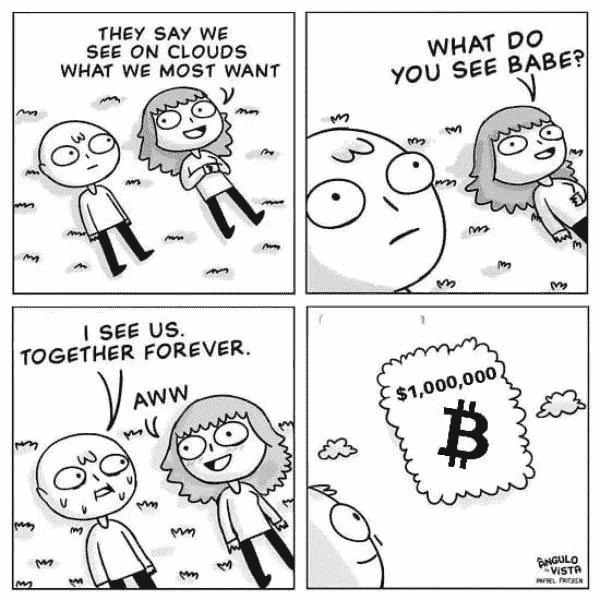
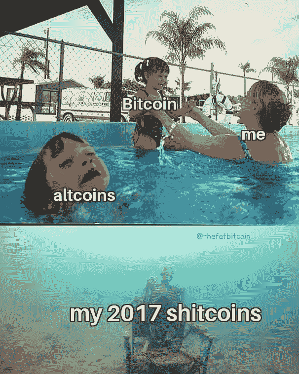
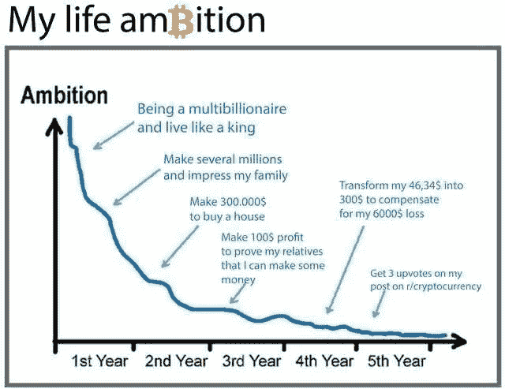
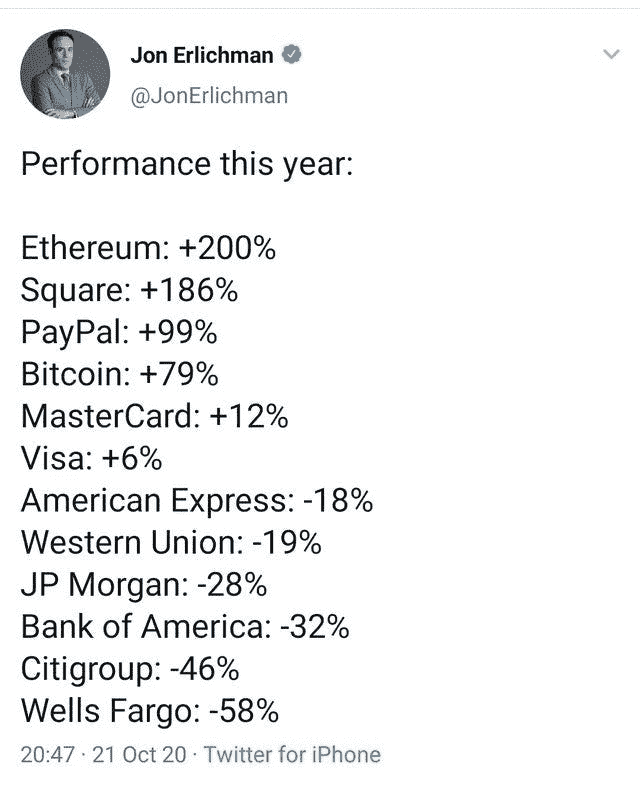

# Paypal 启用加密货币/ Eth2 准备推出/新加坡最大的银行推出加密交易所

> 原文：<https://medium.com/coinmonks/paypal-enables-cryptocurrency-eth2-ready-to-launch-singapores-biggest-bank-launching-a-crypto-cf208ab80d48?source=collection_archive---------5----------------------->

## Harvest Finance Exploit /在“赚到钱”法案破解加密之前阻止它

[Source](https://www.reddit.com/r/CryptoCurrency/comments/ji9iqa/our_true_desire/)

*   Paypal [推出](https://newsroom.paypal-corp.com/2020-10-21-PayPal-Launches-New-Service-Enabling-Users-to-Buy-Hold-and-Sell-Cryptocurrency)一项服务，客户可以直接从他们的 Paypal 账户购买、持有和出售加密货币。
*   DeFi protocol Harvest Finance 被[利用](https://www.theblockcrypto.com/post/82292/defi-protocol-harvest-finance-exploited)，攻击者从协议中提取了 3380 万美元，然后返还了 250 万美元。
*   摩根大通(J.P. Morgan)全球市场策略小组的一组[分析师](https://fortune.com/2020/10/26/jp-morgan-chase-bitcoin-predictions-analyst-jpm-cryptocurrency/)正在吹捧比特币在千禧一代中作为黄金替代品的出现，暗示如果当前趋势继续下去，这种加密货币的价格将“翻两番或三倍”。
*   [**Bitsgap**](https://bitsgap.com/?ref=2cb1231) 介绍即将推出的期货交易终端和期货交易机器人。

[**Coinrule 众筹活动**](https://www.seedrs.com/coinrule) **—投资最人性化的交易机器人**

[Coinrule](https://webapp.coinrule.io/coupon/coinmonks-7-25-3-e2bf6c60e795407381edf98d1a174ac2?fp_ref=coincodecap) 开发了一个创新的界面，只需几个步骤就可以构建自动化交易策略，而无需编码技能。总部位于英国的 Coinrule 推出了最用户友好的智能交易助手，并成为加密交易者的优秀选择，目前正在扩张，推出了 Seedrs 众筹活动，将进一步增强功能。这场运动已经有超过 300 名投资者提供了 140%的资金。在这里投资。

## [四元制](https://quadency.com/?r=ea20aa360c45d1f5ad47a19a)

试试 [Quadency](https://blog.coincodecap.com/go/quadency) ，这是一个为交易者打造的交易终端，可以让他们的加密交易自动化。阅读我们的[季度回顾](/coinmonks/quadency-review-a-crypto-trading-automation-platform-3068eaa374e1)。

## 最新消息📰

*   PayPal [推出新服务](https://newsroom.paypal-corp.com/2020-10-21-PayPal-Launches-New-Service-Enabling-Users-to-Buy-Hold-and-Sell-Cryptocurrency)，让用户能够购买、持有和出售加密货币。并期待[收购](https://www.theblockcrypto.com/linked/82096/report-paypal-is-looking-to-acquire-crypto-companies-bitgo-named-as-potential-target) BitGo。
*   新加坡[最大的银行星展银行](https://www.theblockcrypto.com/post/82411/singapore-biggest-bank-dbs-crypto-exchange)正在推出一个加密交易所
*   多年来，摩根大通对比特币持怀疑态度。现在，该银行的分析师说，它的价值可能会增加两倍，挑战黄金
*   DeFi 协议 [Harvest Finance 利用攻击者](https://www.theblockcrypto.com/post/82292/defi-protocol-harvest-finance-exploited)，抽走 3380 万美元，然后返还 250 万美元
*   Quantstamp 称以太坊 2.0 [准备发布](https://decrypt.co/46295/quantstamp-says-ethereum-2-0-ready-for-launch)
*   在[破解加密之前阻止](https://act.eff.org/action/stop-the-earn-it-bill-before-it-breaks-encryption-a7904e20-2083-4d5e-88ae-44ee5fef7a5d)赚到它
*   莱杰正在调查一个针对钱包用户的网络钓鱼骗局
*   无损[彩票池一起](https://www.coindesk.com/lossless-lottery-pooltogether-opens-up-to-more-coins-more-prizes)打开更多的硬币，更多的奖品
*   纳税人[不必披露](https://www.coindesk.com/tax-payers-must-disclose-airdropped-forked-cryptos-says-irs-draft-2020-guidance)仅仅持有 Crypto: IRS 草案 2020 指南
*   以太坊将于[成为第一个在一年内结算 1 万亿美元的](https://cointelegraph.com/news/ethereum-set-to-become-first-blockchain-to-settle-1-trillion-in-one-year)区块链
*   主流定义是“不可避免的”:美国货币监理署
*   以太坊 Vs Polkadot / [德国的区块链](/coinmonks/paypal-enters-digital-currency-markets-ethereum-vs-polkadot-germanys-blockchain-driven-energy-1f5ceb73cf73)驱动的能源经济

> *买个* [***硬件钱包***](/coinmonks/the-best-cryptocurrency-hardware-wallets-of-2020-e28b1c124069) *和* [*保护你的加密货币*](/coinmonks/how-to-prevent-cryptocurrency-hacking-and-theft-from-your-wallet-65c8ff767766) *。*

[Source](https://www.reddit.com/r/CryptoCurrency/comments/jhqk66/its_fine/)

## 好的读物📑

*   不投资[建议](/coinmonks/not-investment-advice-dda27251ab9f)
*   关于比特币能耗的[最后一句话](https://www.coindesk.com/the-last-word-on-bitcoins-energy-consumption)
*   保管人[的威胁](https://blog.keys.casa/the-custodian-menace/)
*   平衡器的 DeFi 协议是[使](https://near.org/blog/balancers-defi-protocol-is-bringing-programmable-liquidity-to-near/)可编程流动性接近
*   加密指数基金建设
*   证明以太坊 2.0 的健康
*   [衍生品](https://incuba-alpha.medium.com/derivatives-the-second-half-of-defi-ed3c20d4cf07)，下半年 DeFi
*   [所有权将吃掉](/@etm612/ownership-will-eat-the-software-thats-eaten-the-world-82030c8b6a14)已经吃掉世界的软件
*   [在 DeFi Cover 中节省](/armorfi/saving-200m-in-defi-cover-ffe492f9459b)2 亿美元
*   为什么[以太坊将继续](https://skymine.medium.com/why-ethereum-will-continue-to-remain-the-home-for-nfts-that-matter-842b72f6035b)作为非功能性学习者的家园(那件事)
*   13 [DeFi 通知](/ethereum-push-notification-service/13-defi-notifications-ethereum-needs-today-df4dcc98a797)以太坊今天需要
*   “我不是[超级看好 DeFi](https://thedefiant.substack.com/p/im-not-super-bullish-on-defi-were-caa) 。我们用这项技术来丰富一小群人:“詹姆斯·普雷斯维奇
*   [tBTC、stablecoins、0x 和 Curve 上的覆盖范围](https://ournetwork.substack.com/p/our-network-issue-44)
*   [律师的学习扎实度](https://lexdao.substack.com/p/learning-solidity-for-attorneys)
*   [比特币&锁定](/coinmonks/bitcoin-lockdowns-9a4f41a6a6ff)
*   [无常](/hakkafinance/impermanent-gain-the-antimatter-of-impermanent-loss-8d4d6c513d09)增益，无常损耗的反物质
*   有哪些[最好的学习](/coinmonks/what-are-the-best-books-to-learn-bitcoin-409aeb9aff4b)比特币的书籍？
*   [交易密码](/coinmonks/trading-cryptos-how-to-get-the-data-and-create-interactive-visualisations-with-python-and-plotly-f76424c29082):如何用 Python 和 Plotly 获取数据并创建交互式可视化

## 开发商

*   以太坊程序员相信的谎言
*   嘉实金融— [REKT](https://rekt.ghost.io/harvest-finance-rekt/)
*   Eth2 [Medalla](https://eth2data.github.io/) —数据驱动的深度探索
*   使用机器学习和 Slither-similar 的高效[审计](https://blog.trailofbits.com/2020/10/23/efficient-audits-with-machine-learning-and-slither-simil/)
*   布伊德勒[进化了](/nomic-labs-blog/buidler-has-evolved-introducing-hardhat-4bccd13bc931):引进了[安全帽](/nomic-labs-blog/buidler-has-evolved-introducing-hardhat-4bccd13bc931)
*   发现[灯塔](/empireventures/discovering-lighthouse-branding-the-eth2-0-client-d3a6bb503a6b):打造 Eth2.0 客户端品牌
*   一个 [statechain](https://tftc.io/martys-bent/issue-853/) 在野外实现
*   Unity [引擎+ MetaMask](/coinmonks/unity-engine-metamask-wallet-6797d4699e45) 钱包
*   企业[比特币](https://blog.river.com/enterprise-bitcoin-engineering/)工程
*   [以太坊](https://notes.ethereum.org/e8VFLDiUSPSn2v7VVM1CXw)状态可用性
*   VRF 现在在以太坊主网上直播
*   [使用 Mythril 检测](https://diligence.consensys.net/blog/2020/09/detecting-ownership-takeovers-using-mythril/)所有权接管
*   IDX:一个开放身份的开发包
*   [想象](/coinmonks/visualizing-whales-in-the-rough-seas-of-medalla-the-ethereum-2-testnet-f748592fc08a)鲸鱼在梅达拉汹涌的海面上，以太坊 2 号试验网
*   让我们用 GPU 构建一个[高性能](https://blog.trailofbits.com/2020/10/22/lets-build-a-high-performance-fuzzer-with-gpus/) fuzzer！

[**Source**](https://www.reddit.com/r/CryptoCurrency/comments/jfeo0r/satoshis_vision/) **— Paypal will not allow you to withdraw your crypto to any other 3rd party wallet**

## 多方面的

*   [以太坊 2.0 的 eWasm 虚拟机](https://www.youtube.com/watch?v=GC59uAHNir4&feature=youtu.be)和调试器
*   [TypedMemView](https://github.com/summa-tx/memview-sol)——用于与 Solidity 中的 EVM 线性存储器交互的库
*   一份[气体友好型](https://twitter.com/acuestacanada/status/1319581439831298048)we 合同
*   [Mamba](https://mamba.vyper.fun/)——一款 Web 3.0 的神秘游戏。
*   [ETH。建造](https://courses.blockgeeks.com/course/eth-build/) —奥斯汀·格里菲斯的免费球场
*   [贷款移位器](/defi-saver/introducing-loan-shifter-change-your-collateral-or-debt-asset-and-shift-between-protocols-using-cf03ec3c225f) —使用 DeFi Saver 更改您的抵押品或债务资产，并在协议之间转换
*   [用于谷歌表单的多工具栏](https://www.curvegrid.com/blog/2020-10-20-multibaas-for-google-sheets/)

## 播客和视频💽

*   当加密成为一种犯罪时:20 世纪 90 年代软件言论自由之战
*   [与 Amiti Uttarwar 一起成为比特币核心开发者](https://www.whatbitcoindid.com/podcast/becoming-a-bitcoin-core-developer-with-amiti-uttarwar)
*   Unhashed Podcast — [Square 向 Brainwallet 投入 5000 万美元](https://letstalkbitcoin.com/blog/post/unhashed-podcast-square-puts-50m-brainwallet)

## 黑客马拉松、活动和峰会

*   你好世界！由波尔卡多特
*   [2020 年流动性](https://liquidity2020.dystopialabs.com/)
*   种子俱乐部黑客马拉松
*   [投资](https://events.bizzabo.com/invest-ethereum-economy)以太坊
*   [Hackatom](https://hackatomv.devpost.com/)

## 加密交易和折扣🔖

*   当你加入 [***Mudrex***](https://mudrex.com/signup?referral_code=COIN3566) 的时候，获得 25 美元的信用点数可以用来支付费用
*   *在*[***Botsfolio***](/coinmonks/botsfolio.com/?coupon=gaure27)*使用此* [*链接*](/coinmonks/botsfolio.com/?coupon=gaure27) *。*
*   *试用*[***Altrady***](https://app.altrady.com/?a=COINMONKS)*并使用优惠券代码****coin monks***获得六折优惠(购买年度计划时)

## 产品评论和其他加密软件📙

*   [block fi vs Celsius](/coinmonks/blockfi-vs-celsius-vs-hodlnaut-8a1cc8c26630)vs Hodlnaut
*   你需要知道的 2020 年前 5 大[加密贷款平台](https://blog.coincodecap.com/top-5-crypto-lending-platforms)
*   [2020 年最佳密码交易机器人](/coinmonks/whats-the-best-crypto-trading-bot-in-2020-top-8-bitcoin-trading-bot-c16adeb13317)
*   [莱杰 vs 特雷佐](/coinmonks/ledger-nano-s-vs-x-battery-hardware-price-storage-59a6663fe3b0)
*   [莱杰纳米 S vs X](/coinmonks/ledger-nano-s-vs-x-battery-hardware-price-storage-59a6663fe3b0)
*   [2020 年最佳密码交易平台](/coinmonks/the-best-crypto-trading-platforms-in-2020-the-definitive-guide-updated-c72f8b874555)
*   最好的[加密税务软件](/coinmonks/best-crypto-tax-tool-for-my-money-72d4b430816b)
*   [最佳加密交易平台](/coinmonks/the-best-crypto-trading-platforms-in-2020-the-definitive-guide-updated-c72f8b874555)
*   Bitmex 上的[保证金交易的白痴指南](/coinmonks/the-idiots-guide-to-margin-trading-on-bitmex-dbbd7742c6fc?source=friends_link&sk=7bfa99d2a181142510c8442c8ddb0786)
*   [加密摇摆交易的权威指南](/coinmonks/the-definitive-guide-to-crypto-swing-trading-7e4af6496d4d?source=friends_link&sk=70448050bd9323b42f63bfc0bb1e60d1)
*   [Bitmex 高级保证金交易指南](/coinmonks/bitmex-advanced-margin-trading-guide-2270c195ce25?source=friends_link&sk=1d986cca731f5084b9a2db4a4bc4a7ad)
*   面向开发者的最佳加密 API

想让我们展示你的产品吗？在 [Twitter @coinmonks](https://twitter.com/coinmonks) 上联系我们

## 照片说明了一切📷

[Source](https://www.reddit.com/r/CryptoCurrency/comments/jfnwkk/goodbye_banks/)

## 乔布斯👷

*   [mStable](https://twitter.com/mstable_) 寻找有经验的[智能合约/协议开发](https://cryptocurrencyjobs.co/engineering/mstable-protocol-developer-defi/)
*   Bitquery 正在招聘 [Ruby 开发者](https://angel.co/company/bitquery/jobs)
*   Celer 雇佣可靠性和 Go devs。电子邮件:hiring@celer.network
*   [泽里昂](https://cryptocurrencyjobs.co/engineering/zerion-senior-frontend-engineer/) —高级前端工程师
*   [MyCrypto](https://cryptocurrencyjobs.co/engineering/mycrypto-senior-front-end-engineer/) —高级前端工程师
*   Celo 正在[招聘](https://jobs.lever.co/celo/bb6fc40f-4d3d-4abb-a6d3-a5b8ba152b6a)一名数据主管
*   a16z 正在[招聘](https://a16z.com/about/jobs/?gh_jid=4167628003)一名数据科学家
*   Livepeer 正在招聘[区块链社区营销+运营负责人](https://angel.co/company/livepeer/jobs/874811-blockchain-public-network-community-marketing-associate)
*   作为[营销总监](https://chainlinklabs.com/careers#job-492239)，与 Chainlink 令人难以置信的生态系统合作
*   小道消息招聘精英[区块链安全工程师](https://jobs.lever.co/trailofbits/4f459855-3299-462f-9e73-299a840d5baf) & [app 安全](https://jobs.lever.co/trailofbits/8b7f7fc1-efb0-4e89-b406-784c3a2d77e4)
*   DeFi devs！Yield 正在招聘可靠的前端人员—联系@yield.is
*   0x 正在招聘开发人员！[全堆栈、后端、前端或可靠性](https://0x.org/about/jobs)
*   Nexus Mutual: [经历了 Solidity dev](https://angel.co/company/nexus-mutual-1/jobs/967538-smart-contract-engineer)；首选欧洲时区
*   [Devops 或 SRE](https://authenticjobs.com/job/3006/textile-devops-or-sre/) :纺织品，遥控。
*   [分布式系统工程师](https://jobs.lever.co/3box):3 框
*   [前端开发者](https://twitter.com/ceramicnetwork/status/1305886402886995968):陶瓷
*   [远程高级软件工程师](https://jobs.lever.co/audius):奥迪斯，远程
*   [UI 工程师](https://textile.breezy.hr/p/2efb847aca79-ui-engineer):纺织，远程

## 在 Coinmonks 上发布

如果你喜欢在 crypto/区块链空间上写教育文章，并且想在 Coinmonks 出版物上发表。只需在***【gaurav@coincodecap.com】****或 DM 我**[***推特***](https://twitter.com/coinmonks)*

> **“如果你喜欢读***[*你也可以捐我们*](/coinmonks/monks-need-your-help-7440418d67ec) *。****

******