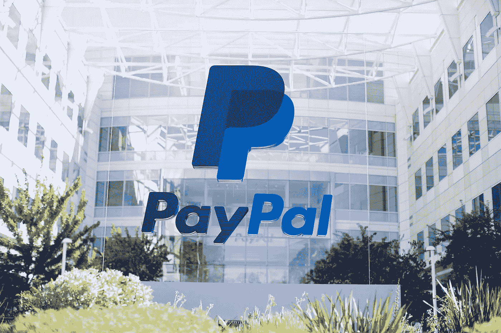

# PayPal 进入数字货币市场/以太坊 Vs Polkadot /德国区块链驱动的能源经济

> 原文：<https://medium.com/coinmonks/paypal-enters-digital-currency-markets-ethereum-vs-polkadot-germanys-blockchain-driven-energy-1f5ceb73cf73?source=collection_archive---------3----------------------->

[Source](https://images.app.goo.gl/FVAjKi1jwGWLMJLU8)

*2020 年 10 月 24 日*

*这是你的快速周六版，总结了过去一周在整个区块链发生的活动…享受吧！*

## 🏦[贝宝拥抱加密，点燃市场主流采用英寸接近](https://www.coindesk.com/paypal-new-york-conditional-bitlicense-paxos-cryptocurrency)

PayPal 官方证实[周三(10 月 21 日)](https://newsroom.paypal-corp.com/2020-10-21-PayPal-Launches-New-Service-Enabling-Users-to-Buy-Hold-and-Sell-Cryptocurrency)它正在进入加密货币市场。这家在全球拥有 3.46 亿活跃账户的支付巨头承诺，将加密货币作为“全球 2600 万商家的采购资金来源。”PayPal 表示，从 2021 年初开始，PayPal 客户将能够立即将他们选择的加密货币余额转换为法定货币，具有确定的价值，并且没有增量费用。它的商家将没有额外的整合或费用，因为所有交易都将按照当前的 PayPal 费率用法定货币结算……[阅读更多](https://www.coindesk.com/paypal-new-york-conditional-bitlicense-paxos-cryptocurrency)

*相关:*🏦[*尼日利亚抗议示威显示比特币普及还没到来:就在这里*](https://www.coindesk.com/nigeria-bitcoin-adoption)

## 🏦[大约 100 家意大利银行正式加入区块链](https://www.coindesk.com/italian-banking-association-100)

意大利银行协会(ABI)公布，在该国基于 R3 的 Corda 构建的区块链银行网络 Spunta 上运营的意大利银行数量已达到 100 家，最新增加了 42 家银行。自 3 月份以来，Spunta 的基础设施已经处理了 2.04 亿笔交易，预计到今年年底将超过 3.5 亿笔。区块链项目旨在提高银行间数据传输和结算速度……[阅读更多信息](https://www.coindesk.com/italian-banking-association-100)

*相关:* ⌚ [*奢侈制表商百年灵在区块链以太坊颁发数字证书*](https://techcrunch.com/2020/10/15/luxury-watch-maker-breitling-issues-digital-certificates-on-the-ethereum-blockchain/)

## 💸[普华永道报告称区块链能提振全球经济](https://www.coindesk.com/pwc-blockchain-report-economy)

普华永道概述说，区块链技术可以在未来十年推动全球经济增长 1.76 万亿美元，相当于全球 GDP 的 1.4%。与此同时，亚洲预计将获得最大的经济利益。该报告指出，中国可能获得 4400 亿美元的最高潜在净收益，美国紧随其后，为 4070 亿美元。与此同时，德国、日本、英国、印度和法国等其他国家预计将受益超过 500 亿美元。预计最受帮助的行业是公共管理、教育和医疗保健部门……[阅读更多](https://www.coindesk.com/pwc-blockchain-report-economy)

*相关:*🔋[*德国指望区块链帮助分散能源经济*](https://cointelegraph.com/news/germany-looks-to-blockchain-to-help-decentralize-their-energy-economy)

## *📖* [以太坊区块链黑仔以谦逊的名字 Polkadot](https://www.bloomberg.com/news/articles/2020-10-17/ethereum-blockchain-killer-goes-by-unassuming-name-of-polkadot)

名为 Polkadot 的平台很可能会盖过以太坊，因为它已经见证了所有重要加密协议的活跃开发者的最大飞跃。该报告概述了开发者对比特币和以太坊的兴趣已经下降，在截至 5 月份的 12 个月中，基于 Polkadot 的每月活跃开发者数量增加了 44%。另据报道，从所谓的 stablecoins 到社交网络，约有 253 个项目正在该系统上构建……[阅读更多信息](https://www.bloomberg.com/news/articles/2020-10-17/ethereum-blockchain-killer-goes-by-unassuming-name-of-polkadot)

*相关:📖* [*Quantstamp 将对 Polkadot*](https://cointelegraph.com/news/quantstamp-will-audit-the-entire-blockchain-of-a-new-defi-project-on-polkadot) 上的新 DeFi 项目进行整个区块链的审计

# 🚨 📝区块链行业状况:2020 年第三季度

Source: [Topio Networks](https://s3.amazonaws.com/spoke-profiles-prod-assets/uploads/9312f9408ba3ef581b818c797cc7137d829d8a04/original/Blockchain_26th_Aug.pdf)

我们正在向完全数字化的经济转型，2020 年区块链行业的活动比以往任何时候都更能证明这一点。现在，1，100 多家公司建立& **基金(300 多亿美元)！构成这种新经济的基础设施层。[的全面细分](https://s3.amazonaws.com/spoke-profiles-prod-assets/uploads/6b002da229bbc3453d3e903499d5671567703fb6/original/Q3_2020_Update_Blockchain_Landscape.pdf)现已发布，包括对前景的[深入概述](https://youtu.be/eE6XZ1RVblA)，新类别&商业模式，机会领域，新兴类别，用例，以及对 2020 年剩余时间到 2021 年的展望。**

# 本周的更多内容:

📖 [[ **报告**]1Q 2020 年加密状态:DCG 创始人调查](https://dcgco.medium.com/state-of-crypto-1q-2020-dcg-founders-survey-372d013825d2) — [数字货币集团](https://medium.com/u/a6be2334cd52?source=post_page-----1f5ceb73cf73--------------------------------)

🏦[摩根大通资深人士丹尼尔·马斯特斯解释区块链将如何终结商业银行](https://www.forbes.com/sites/michaeldelcastillo/2020/10/24/jp-morgan-veteran-daniel-masters-explains-how-blockchain-will-end-commercial-banks/)

🗳️ [首次使用区块链技术进行总统投票](https://www.foxnews.com/tech/first-presidential-vote-cast-using-blockchain-technology)

📖[为最终消费者设定基准](/@a.freundhaskel/baselining-the-end-consumer-9349a8e0ed7e) — [安德里亚斯·弗罗因德](https://medium.com/u/a4201e68bc4c?source=post_page-----1f5ceb73cf73--------------------------------)

🎧[耳机的历史预示着互联网的未来](https://www.coindesk.com/index.php?p=536772) — [约翰·沃伯特](https://medium.com/u/26a7c53cdfeb?source=post_page-----1f5ceb73cf73--------------------------------)

🚀随着备受瞩目的项目投入使用，区块链行业面临着一个关键时刻

💰[《我的世界》的教训:用不可替代代币(NFT)实现阿尔法](https://andrewsteinwold.substack.com/p/lessons-from-minecraft-achieving)——[安德鲁·斯坦沃德](https://medium.com/u/4b901dfcf67?source=post_page-----1f5ceb73cf73--------------------------------)

💰 [Unibright 宣布 UBT 新代币模式，升级支付系统](https://chainbulletin.com/unibright-announces-new-token-model-for-ubt-upgrades-payments-system/) — [Unibright.io](https://medium.com/u/9fe2494e51f4?source=post_page-----1f5ceb73cf73--------------------------------)

💰[我们仍然缺乏一个合理的方法来评估代币的价值](https://www.coindesk.com/lack-rational-way-value-tokens)

📖 [DLT 安全标准可能将传统产业转变为区块链创新者](https://cointelegraph.com/news/dlt-security-standards-may-turn-legacy-industries-into-blockchain-innovators)

🚢[九家智利货运公司获准开发联合区块链平台](https://cointelegraph.com/news/nine-chilean-cargo-shipping-companies-approved-to-develop-joint-blockchain-platform)

📖[阿尔格兰德亚洲加速器首批命名 10 家区块链创业公司](https://algorand.foundation/asia-accelerator) — [阿尔格兰德](https://medium.com/u/bb4a269b69c3?source=post_page-----1f5ceb73cf73--------------------------------)

💰[无损彩票池一起打开更多的硬币，更多的奖品](https://www.coindesk.com/lossless-lottery-pooltogether-opens-up-to-more-coins-more-prizes)

# 👀💸首都 Update️:

新区域警报！对于许多人来说，第四季度传统上是一个筹款冲刺期，我决定在这些帖子中创建一个小的子部分，以突出整个行业从投资到新基金到 M&A 的风险公告。准备好！

💸1.4 万亿美元的资产管理公司支持加密初创公司 Curv，使融资总额达到 3000 万美元

💸 [O(1)实验室为轻量级 Mina 协议再筹集 1090 万美元](https://www.coindesk.com/o1-labs-mina-protocol-funding-round-three-arrows) — [O(1)实验室](https://medium.com/u/b6d3ede7e247?source=post_page-----1f5ceb73cf73--------------------------------)

💸 [Polymarket 从 Polychain、Naval Ravikant 和其他知名投资者那里筹集了 400 万美元](https://www.forbes.com/sites/rorymurray/2020/10/19/polymarket-raises-massive-4-million-round-from-polychain-naval-ravikant-other-notable-investors/)

💸[以太坊的竞争对手 CasperLabs 通过出售代币筹集了 1400 万美元](https://decrypt.co/45617/ethereum-rival-casperlabs-raises-14-million-token-sale)——[Casper labs 官方](https://medium.com/u/3a6cf5535017?source=post_page-----1f5ceb73cf73--------------------------------)

💸[币安实验室为奥迪斯](https://www.binance.com/en/blog/421499824684901135/Binance-Labs-Leads-$125-Million-Extension-Round-for-Audius) — [奥迪斯](https://medium.com/u/d2a18b7d79ed?source=post_page-----1f5ceb73cf73--------------------------------)赢得 125 万美元的扩展融资

# DApps(分散式应用)手表:

## ⚙️ [以太坊的顶级时装越来越多地转向“卷装”:原因如下](https://www.coindesk.com/ethereum-dapps-rollups-heres-why)

前 20 名基于以太坊的去中心化应用(DApps)中的大多数已经或计划在未来几个月内切换到汇总解决方案。通过不同的方法，汇总是以太坊智能合约内交易的链外聚合，确保用户的交易不会被滥用。尽管对于以太坊或任何区块链来说，汇总不被认为是一个扩展解决方案，但它是一个“吞吐量解决方案”… [阅读更多信息](https://www.coindesk.com/ethereum-dapps-rollups-heres-why)

*相关:* ⚒️

## *👩‍💻[计算和连接遇到加密](/coinshares/the-financialization-of-compute-connectivity-66beaffe7501)*

*在过去的六个月里，我们见证了向数字化转变的急剧加速。我们的信息、内容和通信已经大部分是数字的，通过电线和设备传递，在光纤、无线电波和卫星链路上以 0 和 1 的形式流动。金融长期以来一直抵制这一趋势，但现在贸易、银行、支付和贷款的数字化全速前进，世界各国政府正在考虑如何以央行发行的数字货币(CBDCs)的形式将货币打印机本身数字化。所有的数字化都建立在一个高度集中且高度脆弱的系统之上——互联网……[阅读更多](/coinshares/the-financialization-of-compute-connectivity-66beaffe7501)——[melt em demir ors](https://medium.com/u/6cf31b9735f9?source=post_page-----1f5ceb73cf73--------------------------------)*

## *⚙️ [分散存储战争:Filecoin vs. Arweave](https://coinmarketcap.com/alexandria/article/the-decentralized-storage-war-filecoin-vs-arweave)*

*云存储是一个值得挑战的市场。在过去十年中，新的云模式已经取代了传统的本地服务器，诞生了新的技术巨头，如亚马逊网络服务(AWS)、阿里云、微软 Azure、谷歌云平台(GCP)等。如今，市场研究公司[估计](https://www.marketsandmarkets.com/PressReleases/cloud-storage.asp)到 2025 年全球云存储市场将达到 1373 亿美元，同时每年增长 22.3%。这个市场是巨大的。认识到这个机会，许多团队在 2016 年末和 2017 年初开始构建开源解决方案，包括 [Filecoin](https://coinmarketcap.com/currencies/filecoin/) 、 [Storj](https://coinmarketcap.com/currencies/storj/) 、 [Sia](https://coinmarketcap.com/currencies/siacoin/) 和 [SAFE](https://coinmarketcap.com/currencies/safe/) 。2018 年， [Arweave](https://coinmarketcap.com/currencies/arweave/) 围绕分散存储推出了基于类似理念的 mainnet……[阅读更多](https://coinmarketcap.com/alexandria/article/the-decentralized-storage-war-filecoin-vs-arweave)*

**相关:* ⚒️ [*ConsenSys 和 Protocol Labs 合作将 Filecoin 集成到以太坊的开发工具*](https://cointelegraph.com/news/consensys-and-protocol-labs-team-up-to-integrate-filecoin-into-ethereum-s-dev-tools)*

*📖[扼杀网络隐私和去中心化的三大趋势](https://www.coindesk.com/index.php?p=537136)*

*📖[引入 QT。从 20 多种协议连接到实时区块链数据](https://bisontrails.co/introducing-qt-connect-to-blockchain-data/)*

*📖[新的 WordPress 插件允许内容在以太坊上打上时间戳](https://www.theblockcrypto.com/linked/82200/new-wordpress-plugin-allows-content-to-be-timestamped-on-ethereum)*

*📖[该区块链只需要 22 KB 的数据进行验证](https://cointelegraph.com/news/this-blockchain-only-needs-22kb-of-data-to-be-verified)*

# *📺基线上的知识下降& #VCTV:*

*本周，我坐下来主持了另一集 [VCTV](https://youtu.be/FTHK_T8-0co) ，与全球投资者谈论整个金融科技和区块链行业的现状和最新趋势。这是下落:*

*Source: [YouTube](https://youtu.be/FTHK_T8-0co) & VCTV*

# *🎙️研究:2020 年区块链和 DApps 状况:*

**

*Source: [Topio Networks](https://www.topionetworks.com/markets/dapps-stack-landscape-5de8d07eb9abe453e04203f8)*

**现已上市，免费提供的是我最新研究的去中心化应用或*[***【DApp】【栈】景观图***](https://s3.amazonaws.com/spoke-profiles-prod-assets/uploads/a069e1e1e798c975d4eca968c72f4ac1352d62a4/original/DApps_Stack_Landscape_Q2_2020.pdf?utm_source=Social%20Media&utm_medium=LinkedIn&utm_campaign=Topio%20-%20Dapps%20Landscape%20update&utm_content=S3%20Link)**—Q2 2020 年版。这张地图提供了新兴 DApps 行业的全面概述和分类，突出显示了在构建下一代应用程序中发挥重要作用的 400 多家全球公司。作为奖励，我包括了一些生态系统玩家和团体，当你准备发布你的应用时，你需要熟悉它们。如果这是你看到的第一个版本，那就把它当作你进一步理解不仅仅是这个行业，而且是构建一个完全或部分去中心化的应用程序所需的所有核心技术的指导性路线图(DApp)。***

**📣*想要了解区块链、DApps、DeFi 和 FinTech 行业的所有头条新闻、投资、深入研究和最新动态吗？* [***订阅***](https://www.topionetworks.com/newsletters) *关注我的* [***推特***](https://twitter.com/kyleellicott) *每周更新还有更多！***

## **另外，阅读**

*   **最好的[密码交易机器人](/coinmonks/crypto-trading-bot-c2ffce8acb2a)**
*   **[密码本交易平台](/coinmonks/top-10-crypto-copy-trading-platforms-for-beginners-d0c37c7d698c)**
*   **最好的[加密税务软件](/coinmonks/best-crypto-tax-tool-for-my-money-72d4b430816b)**
*   **[最佳加密交易平台](/coinmonks/the-best-crypto-trading-platforms-in-2020-the-definitive-guide-updated-c72f8b874555)**
*   **最佳[加密借贷平台](/coinmonks/top-5-crypto-lending-platforms-in-2020-that-you-need-to-know-a1b675cec3fa)**
*   **[最佳区块链分析工具](https://bitquery.io/blog/best-blockchain-analysis-tools-and-software)**
*   **[加密套利](/coinmonks/crypto-arbitrage-guide-how-to-make-money-as-a-beginner-62bfe5c868f6)指南:新手如何赚钱**
*   **最佳[加密制图工具](/coinmonks/what-are-the-best-charting-platforms-for-cryptocurrency-trading-85aade584d80)**
*   **[莱杰 vs 特雷佐](/coinmonks/ledger-vs-trezor-best-hardware-wallet-to-secure-cryptocurrency-22c7a3fd391e)**
*   **了解比特币最好的[书籍有哪些？](/coinmonks/what-are-the-best-books-to-learn-bitcoin-409aeb9aff4b)**
*   **[3 商业评论](/coinmonks/3commas-review-an-excellent-crypto-trading-bot-2020-1313a58bec92)**
*   **[AAX 交易所评论](/coinmonks/aax-exchange-review-2021-67c5ea09330c) |推荐代码、交易费用、利弊**
*   **[德里比特评论](/coinmonks/deribit-review-options-fees-apis-and-testnet-2ca16c4bbdb2) |选项、费用、API 和测试网**
*   **[FTX 密码交易所评论](/coinmonks/ftx-crypto-exchange-review-53664ac1198f)**
*   **[n 零审核](/coinmonks/ngrave-zero-review-c465cf8307fc)**
*   **[Bybit 交换审查](/coinmonks/bybit-exchange-review-dbd570019b71)**
*   **[3Commas vs Cryptohopper](/coinmonks/cryptohopper-vs-3commas-vs-shrimpy-a2c16095b8fe)**
*   **最好的比特币[硬件钱包](/coinmonks/the-best-cryptocurrency-hardware-wallets-of-2020-e28b1c124069?source=friends_link&sk=324dd9ff8556ab578d71e7ad7658ad7c)**
*   **最佳 [monero 钱包](https://blog.coincodecap.com/best-monero-wallets)**
*   **[莱杰 nano s vs x](https://blog.coincodecap.com/ledger-nano-s-vs-x)**
*   **[bits gap vs 3 commas vs quad ency](https://blog.coincodecap.com/bitsgap-3commas-quadency)**
*   **[莱杰 Nano S vs 特雷佐 one vs 特雷佐 T vs 莱杰 Nano X](https://blog.coincodecap.com/ledger-nano-s-vs-trezor-one-ledger-nano-x-trezor-t)**
*   **[block fi vs Celsius](/coinmonks/blockfi-vs-celsius-vs-hodlnaut-8a1cc8c26630)vs Hodlnaut**
*   **[bits gap review](/coinmonks/bitsgap-review-a-crypto-trading-bot-that-makes-easy-money-a5d88a336df2)——一个轻松赚钱的加密交易机器人**
*   **为专业人士设计的加密交易机器人**
*   **[PrimeXBT 审查](/coinmonks/primexbt-review-88e0815be858) |杠杆交易、费用和交易**
*   **[埃利帕尔泰坦评论](/coinmonks/ellipal-titan-review-85e9071dd029)**
*   **[赛克斯石评论](https://blog.coincodecap.com/secux-stone-hardware-wallet-review)**
*   **[BlockFi 评论](/coinmonks/blockfi-review-53096053c097) |从您的密码中赚取高达 8.6%的利息**