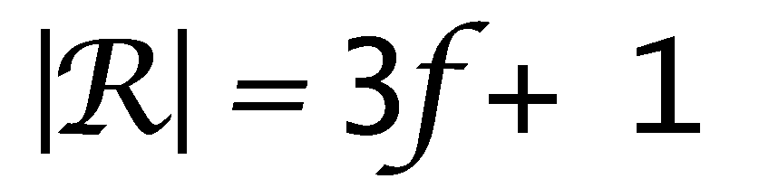
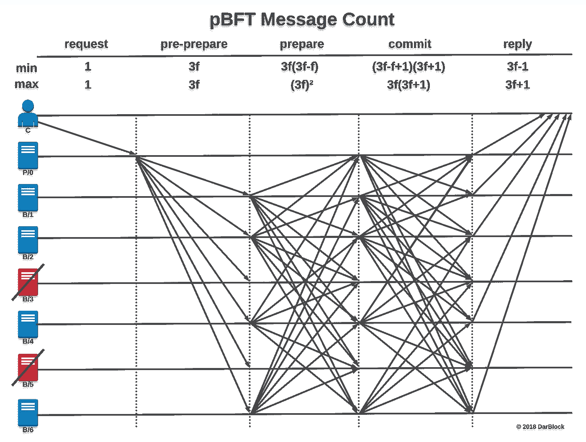

# pBFT—了解共识算法

> 原文：<https://medium.com/coinmonks/pbft-understanding-the-algorithm-b7a7869650ae?source=collection_archive---------0----------------------->

# 为什么使用 pBFT？

**pBFT** (实用拜占庭容错)对于成员**部分信任**的企业联合体来说是一个优秀的共识算法。

# 缺点

pBFT 的唯一缺点是随着节点(技术上说是副本)被添加到集合中，消息数量会呈指数级增长。

> 交易新手？尝试[加密交易机器人](/coinmonks/crypto-trading-bot-c2ffce8acb2a)或[复制交易](/coinmonks/top-10-crypto-copy-trading-platforms-for-beginners-d0c37c7d698c)

# 为什么这么多信息？

消息繁重算法是由于**三阶段协议**的每个阶段所需的多播消息数乘以我们集合中的每个副本。

# 为什么有这么多复制品？

我们需要最少的`**3f + 1**`个副本，其中`**f**` 是错误副本的最大数量。这个最小值确保了我们有足够的无缺陷副本来发现有缺陷的副本(崩溃和拜占庭)。因此，具有可能出错的最大副本数量的副本集`|**R|**`被表示为:

# 示例副本集

如果我们希望我们的副本集容忍多达 **2 个错误副本**，我们将需要 **7 个副本**，其中一个是主副本。通过将 **2 个错误的**副本应用于我们的公式`**3**(**2** faulty replicas) **+ 1 = 7** replicas`，我们得到了 **7 个副本**

我已经计算了每个阶段的**最小**和**最大**消息数，并将其放在我创建的下图的顶部。为了清楚起见，包括了**客户端请求**和**回复**，尽管它们在 pBFT 算法中实际上不被认为是 ***阶段*** 。

# 每个客户端请求的消息总数

该副本集的总**最小**消息数为:
`**1 + 3f + 3f(3f-f) + (3f-f+1)(3f+1) + 3f-1**`

在我们的例子中，最多有 2 个错误副本的**，这将是:
- **请求**消息:`**1**`-
-**预准备**消息:`**3f = 6**` - **准备**消息:`**3f(3f-f) = 24**` - **提交**消息:`**(3f-f+1)(3f+1)= 35**` - **回复**消息:`**3f-1 = 5**`**

这就给出了使用 **7 个副本**时 **1 个请求**的 **71** (1+6+24+35+5) **总消息**的**最小值**！如果我们想要有更多的 **1** 个可能出错的副本，那么对于使用 **10 个副本的 1 个请求**142 个消息**来说，这个数字增加到最小**个**。**

想要**最多 4 个**节点有故障？只需使用 **13 个副本**、**、**但**最小消息**将攀升至 **237** 以获得**单个请求。**

这就是为什么 **pBFT** 不**不缩放**以及其他[共识算法](/coinmonks/quorum-blockchain-consensus-algorithms-ab38790091)的原因。

与 EC2 实例的负载平衡不同，由于添加了消息，您不应该添加超过绝对需要的副本。

# pBFT 的优化

我们无法使用 pBFT 减少消息的数量，因此我们只能减少消息所需的加密证明。**MAC**的 CPU 密集度比 **RSA** 数字签名低几个数量级

因此，RSA 数字签名仅用于**视图更改**和**新视图**消息，这些消息仅用于将备份副本提升为主副本。**视图变化**仅在主设备出现故障或 **k** 请求被处理后发生。所有其他消息都使用 MAC 进行认证，如 **SHA256** 。

Miguel Castro 和 Barbara Lisk 是 1999 年 pBFT 论文[的作者，论文](http://pmg.csail.mit.edu/papers/osdi99.pdf)来自[麻省理工学院](http://www.mit.edu/)，他们发现 MAC 的计算速度比数字签名快三个数量级。*不过，他们是在比较 MD5 和 1024 位 RSA 签名，而我们现在通常使用 SHA256 和 2048 位 RSA。*

# 结论

**pBFT** 通常被认为是一种不可扩展的算法。这种感觉通常是由`**node == server**`的概念引起的，当 pBFT 部署在企业生产环境中时不应该是这种情况。

**pBFT** 应该与企业组织的联合体一起使用，其中每个组织代表网络`**node == organization**`上的一个节点。然后，这些组织节点中的每一个都应该在节点的端点后面拥有实例集群和负载平衡器，以扩展计算能力并确保快速响应时间。

你觉得这篇文章怎么样？如果你喜欢它或者学到了什么，请留下你的掌声！ [DarkBlock.io](https://darkblock.io/) 是一家区块链企业发展公司，我们一直在接纳新客户。通过 [sheffield@darkblock.io](mailto:sheffield@darkblock.io) 联系我或访问我们的网站 [DarkBlock.io](https://darkblock.io/) ！

> 加入 Coinmonks [电报频道](https://t.me/coincodecap)和 [Youtube 频道](https://www.youtube.com/c/coinmonks/videos)获取每日[加密新闻](http://coincodecap.com/)

## 另外，阅读

*   [复制交易](/coinmonks/top-10-crypto-copy-trading-platforms-for-beginners-d0c37c7d698c) | [加密税务软件](/coinmonks/crypto-tax-software-ed4b4810e338)
*   [网格交易](https://coincodecap.com/grid-trading) | [加密硬件钱包](/coinmonks/the-best-cryptocurrency-hardware-wallets-of-2020-e28b1c124069)
*   [密码电报信号](http://Top 4 Telegram Channels for Crypto Traders) | [密码交易机器人](/coinmonks/crypto-trading-bot-c2ffce8acb2a)
*   [如何在 Bitbns 上购买柴犬(SHIB)币？](https://coincodecap.com/buy-shiba-bitbns) | [买弗洛基](https://coincodecap.com/buy-floki-inu-token)
*   [CoinFLEX 评论](https://coincodecap.com/coinflex-review) | [AEX 交易所评论](https://coincodecap.com/aex-exchange-review) | [UPbit 评论](https://coincodecap.com/upbit-review)
*   [十大最佳加密货币博客](https://coincodecap.com/best-cryptocurrency-blogs) | [YouHodler 评论](https://coincodecap.com/youhodler-review)
*   [AscendEx 保证金交易](https://coincodecap.com/ascendex-margin-trading) | [Bitfinex 赌注](https://coincodecap.com/bitfinex-staking)
*   [最佳加密交易所](/coinmonks/crypto-exchange-dd2f9d6f3769) | [印度最佳加密交易所](/coinmonks/bitcoin-exchange-in-india-7f1fe79715c9)
*   开发人员的最佳加密 API
*   最佳[密码借贷平台](/coinmonks/top-5-crypto-lending-platforms-in-2020-that-you-need-to-know-a1b675cec3fa)
*   杠杆代币的终极指南