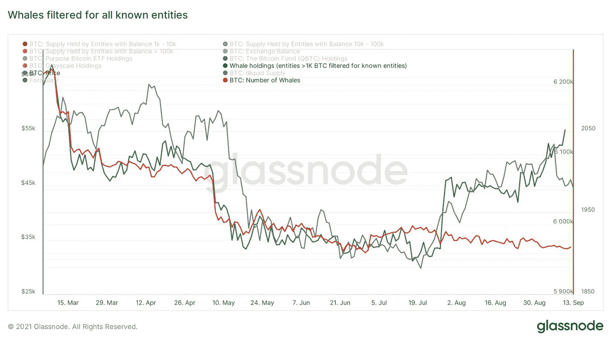
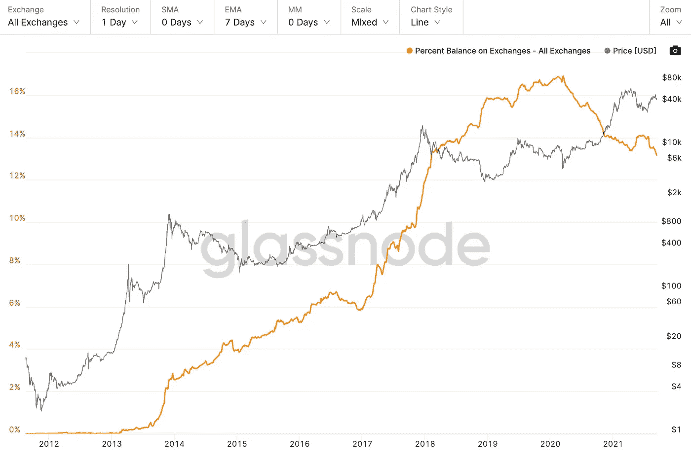

# 同行评议:“比特币将经历一场恶性而痛苦的死亡”

> 原文：<https://medium.com/coinmonks/peer-review-bitcoin-is-going-to-suffer-a-vicious-painful-death-8ec493226f41?source=collection_archive---------0----------------------->

[source](/ginsbergonomics/bitcoin-is-going-to-suffer-a-vicious-painful-death-56d98592c0b7)

因此，我在浏览 medium 时，发现了一篇色彩鲜艳的文章，标题为“比特币将遭受恶性和痛苦的死亡:指向比特币长期消亡的 4 个痛苦而明显的迹象”(我只想指出，没有什么事情像经济学中看起来那样明显)，我喜欢让自己尽可能多地接触看跌比特币的分析，所以我读了一遍，尽管有时充满激情， 一篇很好的文章，但是，我对看跌分析的内容有一些问题，我想在这里讨论一下。

# 第一部分:前提。

文章开篇写道:“……如果我们缩小技术图表，评估影响比特币的现实世界、宏观经济因素，我们可以看到，比特币最终将跌至新低，最有可能在未来 6-9 个月内。”并继续展示一些(有问题的)技术图表，我将试图澄清这些图表。

好的，这是他的前提。我们正处于短期牛市，但全球宏观趋势表明，我们正在走向“新低”……首先，由于比特币价格历史的性质，我们不能有新低，如果价格下跌 50%，它将回到 10 个月前被认为是高的价格，但我们不要太在意语义。

金斯堡继续说:

[source](/ginsbergonomics/bitcoin-is-going-to-suffer-a-vicious-painful-death-56d98592c0b7)

我同意，总的来说，自由资本和高债务与 GDP 比率是一个主要的宏观经济问题，但这正是推动比特币作为美国财政部储备资产的兴趣所在。自新冠肺炎疫情开始以来，M1 货币供应过度扩张(部分原因可能是 M2 类别转移到 M1)，储蓄账户平均利率保持在 0.06%，美联储预测美国食品、房租和医疗费用的复合通胀率为 5%(来源:[https://www.newyorkfed.org/microeconomics/sce#/](https://www.newyorkfed.org/microeconomics/sce#/))引发了关于法定现金储蓄需求的严重问题，并提出了另一个问题；如果不是菲亚特，那是哪里？

[source](https://fred.stlouisfed.org/series/M1SL)

接下来，他表示“他们(比特币创造者)被灌输了如此之深的比特币神话神学，以至于他们再也无法提供任何关于该资产的准确信息”，因此我将尽最大努力提供准确的信息，因为我对他认为是“准确信息”的证据给出了我的观点。

# 第二部分:证据

[source](/ginsbergonomics/bitcoin-is-going-to-suffer-a-vicious-painful-death-56d98592c0b7)

好吧，所以，他的第一点是，鲸鱼正在出售他们的比特币，确切地说，是 400 个鲸鱼钱包，如果波动超出正常范围，这将是对比特币牛市的一个很好的批评，但事实并非如此。在 2016/2017 年期间，如果纯粹基于这一指标进行交易，你将在 1000 美元以下出售你的比特币。

[source](http://www.glassnode.com)

事实上，在这个分辨率下，我们可以看到这一指标和价格行为之间自然发生的某种程度的反向相关性，由于价格最近一直在上涨，余额下降超过 1K 是双重的:没有理由担心，并且是可以预期的。

除此之外，他的“准确信息”是不完整的，因此也是不准确的，只衡量拥有 1000 多 BTC 的实体数量是不全面的，还需要考虑他们持有的 BTC 的数量，这样就可以衡量整个群体的信念地址，而同一群体的实体持有的 BTC 一直在上升(显示为绿色)；

[source](http://www.glassnode.com)

他链接的文章中引用的另一个证据是 Will Clemente 关于非流动性供应比率短期下降的推文；

[source](https://www.fxstreet.com/cryptocurrencies/news/bitcoin-whales-trim-their-holdings-as-fear-of-mass-sell-off-looms-202108250914)

短期看跌指标作为支持长期看跌论点的依据是本文的主题。用同样的逻辑，同一位分析师最近关于同一指标的推文会让你长期看涨；

随着鲸鱼地址的下降是牛市后半段/熊市前半段的自然现象，它不是唯一用于衡量市场情绪的指标，例如，外汇余额百分比；

[source](http://www.glassnode.com)

这个指标告诉我们，交易所持有的 BTC 数量占 BTC 供应量的百分比。这一指标显示，自 2020 年初以来，我们正处于一个强劲的积累阶段。

有许多衡量市场情绪的良好指标，大多数人描绘了看涨的画面，似乎金斯堡选择了一个他认为是显示普通和看跌数据的指标，然而，当你考虑鲸鱼持股时，你可以清楚地看到，这一群体(以及整个市场)正在积累。

金斯堡对这一论点的最后一点说明；持有超过 1K BTC 的账户的减少是最近对他在文章中提出的图表中更大的上升趋势的下跌，这本来是为了证明比特币的长期消亡，但当打开包装时，这第一点“准确的数据”实际上证明了长期看涨 BTC 的情况，我只是觉得有点奇怪，他使用链上指标的短期波动来支持 BTC“恶性和痛苦的死亡”的情况。

[source](/ginsbergonomics/bitcoin-is-going-to-suffer-a-vicious-painful-death-56d98592c0b7)

在他的第二个论点中，他对围绕系绳计划 USDT 作为稳定硬币的资格和长期可行性的严肃问题提出了一些非常好的观点。这为他的论点提供了实质内容，即它们是“假美元”，但仍然没有提供证据证明 BTC 的价格因此而膨胀。

然而，这个论点的唯一问题是，它与比特币无关。由于这些原因，暗示比特币价格受到 USDT 的某种“支撑”,就好像受到它的支持一样，是不真实和不准确的；

1.  USDT 是用比特币买的，要买 USDT，你(一般来说)必须已经拥有比特币，人们不会为了买比特币而买 USDT，那将是不必要的，他们购买比特币，并在他们高兴的时候用它交易 USDT(或其他稳定的货币)。因此，提到 96%的 USDT 没有美元支持，只能说明 BTC 是受欢迎的，因为 USDT 市值是衡量 BTC 兴趣的代表(所以他的第二次熊市也意外地是牛市)。
2.  BTC 没有被束缚。USDT 引发的潜在流动性危机是导致价格下跌“高达 80%”的担忧的原因，这是一个合理的说法，但比特币每 4 年就会下跌一次，平均而言，它仍比去年同期上涨 200%，所以，这更像是 BTC 价格可能短期崩盘的说法，而不是基础资产价格缓慢而痛苦的长期消亡，或者他说的任何东西。

[source](/ginsbergonomics/bitcoin-is-going-to-suffer-a-vicious-painful-death-56d98592c0b7)

如果你通过 GBTC 溢价来衡量的话，机构购买比我们在 Q1 和 Q2 牛市时有所下降，但这又是一个指标的短期变化，引自一篇为长期熊市提供理由的文章。

[source](/ginsbergonomics/bitcoin-is-going-to-suffer-a-vicious-painful-death-56d98592c0b7)

比特币“仍然”不是一种货币，在它存在了… 10 年之后？你一定是疯了才会对此感到惊讶…但我会咬；

有一种想法在很多人的脑海中浮动，认为比特币需要被确立并被视为一种货币，才能在价格方面取得成功……这是错误的。

比特币不需要成为一种货币来作为价值储存手段，因此，如果它从未发生，即使萨尔瓦多从未将其作为货币，那么这也不会让我看跌，因为采用比特币并不意味着你可以用它买一杯咖啡，采用比特币意味着它的市值足够高，足以稳定其作为价值储存手段的价格，以对抗未能做到这一点的各种世界货币。

金斯伯格继续解释了在萨尔瓦多使比特币成为法定货币的潜在问题和复杂性，这些都是潜在的有效观点，与比特币的空头案件无关，只是反对在萨尔瓦多使 BTC 成为法定货币的案件，我不是这方面的专家，所以我不予置评。

无论如何，我还有很多话要说，但这篇文章已经很长了，所以我将在这里结束，我欣赏金斯堡的悲观分析，如果你正在阅读这篇文章，我希望我没有太“…深深灌输在比特币的神话神学中，他们再也不能提供任何关于资产的准确信息”，但嘿，一些随机的 19 岁的互联网上知道什么；)

请务必查看我们在 www.permissionlessltd.com 的网站，如果你觉得有用，请在 medium 上关注我。感谢您的阅读。

> 加入 Coinmonks [电报频道](https://t.me/coincodecap)和 [Youtube 频道](https://www.youtube.com/channel/UCbyDhTbOiKh2iUMKBi4-4Zg)了解加密交易和投资

## 另外，阅读

*   [什么是保证金交易](https://blog.coincodecap.com/margin-trading) | [美元成本平均法](https://blog.coincodecap.com/dca)
*   [BigONE 交易所评论](/coinmonks/bigone-exchange-review-64705d85a1d4) | [电网交易机器人](https://blog.coincodecap.com/grid-trading)
*   最佳[密码交易机器人](https://blog.coincodecap.com/best-crypto-trading-bots) | [购买索拉纳](https://blog.coincodecap.com/buy-solana) | [矩阵导出评论](https://blog.coincodecap.com/matrixport-review)
*   [Coldcard 评论](https://blog.coincodecap.com/coldcard-review) | [BOXtradEX 评论](https://blog.coincodecap.com/boxtradex-review)|[uni swap 指南](https://blog.coincodecap.com/uniswap)
*   [阿联酋 5 大最佳加密交易所](https://blog.coincodecap.com/best-crypto-exchanges-in-uae) | [SimpleSwap 评论](https://blog.coincodecap.com/simpleswap-review)
*   [如何在 FTX 交易所交易期货](https://blog.coincodecap.com/ftx-futures-trading) | [OKEx vs 币安](https://blog.coincodecap.com/okex-vs-binance)
*   [CoinLoan 审核](https://blog.coincodecap.com/coinloan-review) | [YouHodler 审核](/coinmonks/youhodler-4-easy-ways-to-make-money-98969b9689f2) | [BlockFi 审核](https://blog.coincodecap.com/blockfi-review)
*   [CoinFLEX 评论](https://blog.coincodecap.com/coinflex-review) | [AEX 交易所评论](https://blog.coincodecap.com/aex-exchange-review) | [UPbit 评论](https://blog.coincodecap.com/upbit-review)
*   [AscendEx 保证金交易](https://blog.coincodecap.com/ascendex-margin-trading) | [Bitfinex 赌注](https://blog.coincodecap.com/bitfinex-staking) | [bitFlyer 评论](https://blog.coincodecap.com/bitflyer-review)
*   [AscendEx Staking](https://blog.coincodecap.com/ascendex-staking)|[Bot Ocean Review](https://blog.coincodecap.com/bot-ocean-review)|[最佳比特币钱包](https://blog.coincodecap.com/bitcoin-wallets-india)
*   [Bitget 回顾](https://blog.coincodecap.com/bitget-review) | [双子星 vs BlockFi](https://blog.coincodecap.com/gemini-vs-blockfi) | [OKEx 期货交易](https://blog.coincodecap.com/okex-futures-trading)
*   [美国最佳加密交易机器人](https://blog.coincodecap.com/crypto-trading-bots-in-the-us) | [经常性回顾](https://blog.coincodecap.com/changelly-review)
*   [在印度利用加密套利赚取被动收入](https://blog.coincodecap.com/crypto-arbitrage-in-india)
*   [加密套利](/coinmonks/crypto-arbitrage-guide-how-to-make-money-as-a-beginner-62bfe5c868f6)指南| [如何做空比特币](/coinmonks/how-to-short-bitcoin-568a2d0b4ae5) | [Bybit vs 币安](https://blog.coincodecap.com/bybit-binance-moonxbt)
*   [Blockfi vs 比特币基地](https://blog.coincodecap.com/blockfi-vs-coinbase) | [BitKan 点评](https://blog.coincodecap.com/bitkan-review) | [Bexplus 点评](https://blog.coincodecap.com/bexplus-review)
*   [南非的加密交易所](https://blog.coincodecap.com/crypto-exchanges-in-south-africa) | [BitMEX 加密信号](https://blog.coincodecap.com/bitmex-crypto-signals)
*   [MoonXBT 副本交易](https://blog.coincodecap.com/moonxbt-copy-trading) | [阿联酋的加密钱包](https://blog.coincodecap.com/crypto-wallets-in-uae)
*   [Remitano 审查](https://blog.coincodecap.com/remitano-review)|[1 英寸协议指南](https://blog.coincodecap.com/1inch)
*   [折叠 App 审核](https://blog.coincodecap.com/fold-app-review) | [StealthEX 审核](/coinmonks/stealthex-review-396c67309988) | [Stormgain 审核](https://blog.coincodecap.com/stormgain-review)
*   [购买 PancakeSwap(蛋糕)](https://blog.coincodecap.com/buy-pancakeswap) | [Coinswitch 俱吠罗评论](/coinmonks/coinswitch-kuber-review-1a8dc5c7a739)