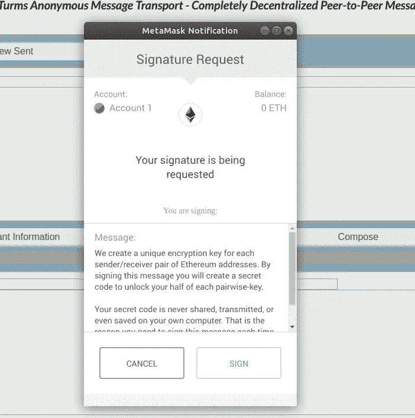

# Turms 匿名消息传输中的完美前向保密

> 原文：<https://medium.com/coinmonks/perfect-forward-secrecy-in-turms-anonymous-message-transport-f770527992bd?source=collection_archive---------1----------------------->

Turms AMT(匿名消息传输)是一个对等消息系统，用于在以太坊地址之间发送加密消息(参见[介绍 Turms 匿名消息传输](/@alejandrodiaz_71295/introducing-turms-anonymous-message-transport-2e40b31dbdc2?source=friends_link&sk=1cdec02ea57b2fd0bb66d5e711d0a256))。

在未加密的公共区块链上发送加密信息是一项挑战。因此，在本文中，我将解释我们是如何在 Turms AMT 中做到这一点的。


我们在 Turms AMT 中有以下加密目标:

*   发送者和接收者都应该能够用同一个密钥解密消息——一个只有他们才能导出的密钥。
*   密钥导出必须不需要“握手”；也就是说，即使一方离线，它也需要工作。
*   加密技术应该包含“完美的前向保密”；也就是说，解密一条消息的密钥应该不能解密任何未来的消息。
*   加密的信息应该是无法被现代最先进的硬件破解的。

## 完美前向保密

*完美的前向保密*是指解密密钥随着每条消息而变化——因此，即使一条消息的解密密钥被泄露，也只是有助于解密一条消息(而不是整个消息线程)。这对 Turms AMT 特别有用:我们想象人们会使用 Turms AMT 在区块链上存储重要信息，如可执行的合同或金融义务；而且，在某些时候，人们可能希望向第三方透露其中一条消息的内容，例如证明发送了什么。完美的前向保密将使共享一条消息的加密密钥成为可能，同时仍然保持所有其他消息的安全——即使是来自同一个 Turms 帐户的消息。

## 一口

为了实现我们的加密目标，我们决定在发送方和接收方之间使用一种 Diffie-Hellman-Merkle 密钥交换来生成 PMK(成对主密钥)；然后将随机数(随每条消息更新的值)与 PMK 一起散列以生成 PTK(成对临时密钥)，该用于 AES 加密每条消息。

真拗口！

我保证我会在接下来的段落中更简单地分解它。

## 基本加密概念

在加密通信中，使用加密密钥将*明文*消息编码成只能使用解密密钥解码的*密文*消息。有许多不同的编码/解码算法，称为密码。但是广义地说，密码可以分为对称密码和非对称密码，对称密码意味着加密密钥和解密密钥相同，非对称密码意味着两个密钥不同。在不对称加密的情况下，通信的每一方实际上都有一个*密钥对*；也就是两个一起工作的密钥，一个公钥，一个私钥。用公钥加密的消息只能用私钥解密，反之亦然。加密通道的每一端共享其公钥，另一端使用该公钥在发送消息之前对消息进行加密。在接收到加密的消息时，每一方都使用其从不共享的私钥来解密消息。

## 密钥分发问题

对于没有适当解密密钥的邪恶窃听者来说，加密密码不足以使对话变得不透明。还有一个额外的问题，称为“密钥分发问题”，即如何将解密密钥以无法被第三方截获的方式发送给消息的预期接收方。当使用非对称加密时，密钥分发问题不是这样一个问题——每一方只给出它的公共加密密钥。因此，假设您知道公钥确实属于另一个端点，您可以加密消息，因为只有相应私钥的持有者才能解密密文。

但是当使用对称加密时，加密消息的密钥与解密消息的密钥相同。在这种情况下，有一个非常现实的问题，即让端点同意使用什么密钥，以防止可能监视密钥协商的第三方得知密钥。这个问题就好比我想给你寄一个宝贝，但是不信任邮递员。我可以把宝藏锁在一个盒子里；但是我怎样才能把锁的钥匙寄给你，这样邮递员就不能复制它了？

## 迪菲-赫尔曼-梅克尔密钥交换

Diffie-Hellman-Merkle 密钥交换是一个协商私有密钥的聪明系统，这样即使一个邪恶的第三方能够观察整个协商(因为它是在公共区块链上)，他们仍然不能获得协商的对称密钥！Diffie-Hellman 协议依赖于一个数学单向函数:

```
f(g,s,p) = g^s % p
```

上式中 hat 为幂运算子，百分比为*模*运算子；也就是说，公式的意思是“将`**g**`升至`**s**`的幂，然后除以`**p**`得到*的余数*。

在这种情况下，我们称该函数为单向函数，因为即使您知道`**g**`和`**p**`，也知道结果`(**g**^**s** % **p**)`，仍然不可能得出`**s**`。原因是现代计算机中的乘幂和除法运算速度非常快，即使是对于疯狂的大数字也是如此。但是知道除法的*余数*并不能告诉你被除数是多少，即使你知道除数；检查*每个可能的*除数`(**g**^**s**)`会非常耗时。例如，将`**g**`设为 2、`**s**`设为秘密数、`**p**`设为已知素数。`**s**`和`**p**`都是 2048 位，非常大。但是`**s**`是一个 2048 位的数字，`**g**^**s**`是超级大的(为了比较，考虑宇宙中只有大约 2 个⁵⁶原子)。

## 密钥推导

在 Diffie-Hellman-Merkle 密钥交换中， **s** 是永不泄露的秘密。但它不是加密密钥。每一方(a 方和 b 方)都有自己的秘密，`**s**`——我们称之为`**sa**`和`**sb**`。并且每一方使用它们的秘密和预定义的值`**g**`和`**p**`计算它们自己的*公共*密钥、`**fa**`和`**fb**`，如下所示:

```
fa = (g^sa) % p
fb = (g^sb) % p
```

每一方都公开宣布他们的公钥(`**fa**`和`**fb**`)，*！为了计算只有双方知道的私钥，每一方使用相同的单向函数，但是这次用另一方公布的公钥替换`**g**`:*

```
*key(a) = (fb^sa)%p = ([(g^sb)%p] ^ sa) % p
key(b) = (fa^sb)%p = ([(g^sa)%p] ^ sb) % p*
```

*因为模块数学的一个奇妙的定理，原来`key(a)`会等于`key(b)`。也就是说，交换取幂运算的顺序不会改变最终结果。*

## *Turms AMT 中的 Diffie-Hellman-Merkle 密钥交换*

*我们首先生成一个超级私有*密钥——加密密钥*。这是一个 256 位的对称密钥，它永远不会保存在你的计算机上，也不会被传送到任何地方，传送给任何人。这是从您每次启动 Turms AMT 时生成的 Keccak 签名中导出的密钥。*

**

*请注意，没有人有能力生成您的超级私有密钥-加密密钥。要做到这一点，他们需要能够伪造你的凯克卡签名——如果他们能做到这一点，那么整个以太坊区块链的安全就可能受到威胁——所以重点是:*他们不能*。*

*但是 256 位不足以创建一个面向未来的、安全的 Diffie-Hellman 秘密。因此，当您向 Turms 匿名消息传输注册您的以太坊地址时，我们会生成一个随机的 2048 位 Diffie-Hellman 秘密，`**s**`。我们使用超级密钥-加密密钥来加密该秘密，并将加密的秘密存储在区块链上。此外，当您注册您的 Turms AMT 账户时，我们会生成一个 Diffie Hellman 公钥`(**g**^**s**) % **p**`，并将其存储在 Turms AMT 智能合约的区块链(未加密)中。*

*每当您启动 Turms AMT 时，我们会从区块链中读取您的加密秘密，并使用您的超级密钥-加密密钥对其进行解密。这就是你如何得到`**s**`。*

*当您想要加密或解密发往/来自另一个地址的消息时，您首先计算一个 PMK(成对主密钥)，该密钥对于您的地址和另一个地址的组合是唯一的。您使用 Diffie-Hellman 技术进行计算:您有自己的 Diffie-Hellman 秘密`**s**`和另一方的 Diffie-Hellman 公钥，它们存储在 Turms AMT 智能契约中。所以现在你和另一边都计算同一个密钥，也就是 PMK；但是你们都不会用 PMK 加密或解密任何东西——当然也不会把它发到任何地方或保存起来。*

*相反，您使用 PMK 来计算 PTK(成对瞬时密钥)，它仅用于加密/解密单个消息。您通过创建 PMK 和您的以太坊地址、另一端的以太坊地址以及从发送端发送的消息数量的散列来计算 PTK。对于收到的每条消息，你们都计算相同的 PTK，它可用于加密和解密一条消息。这就是我们如何实现“完美的前向保密”——即使用于加密一条消息的 PTK 以某种方式被黑客攻击，或者被故意泄露——仍然不可能解密在相同的两方之间发送的任何其他消息。*

## *限制*

*在严格的完美前向保密中，发送方和接收方有必要为每个“会话”使用新的值`**p**`和`**g**`。但这在 Turms AMT 中不可行，因为发送方和接收方之间没有握手。这种严格的完美前向保密的额外安全性只有在有多个“会话”的情况下才有意义，因为它保护一个会话，即使暴露了不同会话的 PMK。Turms AMT 实施的*完美前向保密协议*仅在不同消息的 *PTK* 被暴露时保护该消息。这与能够在不损害任何其他信息的情况下暴露个人信息的 PTK 的预期目标是一致的。这种限制强调了保持您的 Ethereum 私钥安全的重要性。*

## *摘要*

*Turms AMT 允许您在以太网地址之间发送加密消息。它现在在 ipfs 上发布:
[https://cloudflare-ipfs . com/ipns/message transport . turmsanonymous . io/](https://cloudflare-ipfs.com/ipns/messagetransport.turmsanonymous.io/)
或
[https://ipfs.io/ipns/messagetransport.turmsanonymous.io/](https://ipfs.io/ipns/messagetransport.turmsanonymous.io/)
请讲，给我发个信息——我的以太网地址是 imontoya.eth，我很乐意听到你的消息！*

*Alejandro Diaz*

> *[直接在您的收件箱中获取最佳软件交易](https://coincodecap.com/?utm_source=coinmonks)*

*[](https://coincodecap.com/?utm_source=coinmonks)*