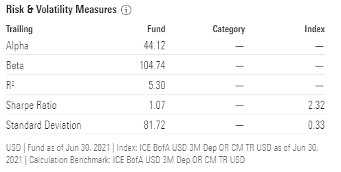

# 灰度加密货币信托的表现(GBTC-埃塞-BCHG)

> 原文：<https://medium.com/coinmonks/performance-of-grayscale-cryptocurrency-trusts-gbtc-ethe-bchg-ccb8d4d1ec6d?source=collection_archive---------6----------------------->

灰度仍然是加密货币行业机构投资的唯一投资工具。

它允许机构和经认可的投资者将部分投资组合投资于 SEC 报告投资机制(信托)的加密货币股票。

灰度提供了多种加密货币供机构采用。它于 2013 年成立了第一只基金——灰度比特币信托(GBTC)。

在随后的几年里，它在商业模式中增加了更多的加密货币，比特币现金、以太坊、莱特币和 ZCash 成为投资者选择的首选。

这些信托的股票多年来一直表现突出，然而，在今年年初，我们观察到大多数灰度信托在 OTCQX 的二级市场上表现不佳，并且大多数信托的交易价格低于 NAV(净资产值)。

在本文中，我们将检查最近形成的差异，并观察顶级灰度信任的性能。

# 简单解释灰度信任如何工作

灰度的模型不同于加密货币现货市场。它向对加密敞口感兴趣的基金提供其每个信托的股份，并在其托管下持有加密货币。

简单来说，from 从“现货”加密市场为其客户购买加密，将此加密保存在自己的钱包中(而不是卖回给现货)，并将每种加密货币的份额“托管”给投资者。

这些股票有 6-12 个月的锁定期，取决于每个信托的法律程序。比特币和以太坊的锁定期为 6 个月，而其他资产的锁定期为 12 个月。

灰度的利润来自于向客户提供服务的年费(2.5%)。

# 灰度信托/基金

灰度目前为机构加密风险提供以下金融工具:

*   ***比特币(GBTC)(自 2013 年)***
*   ***以太坊(ETHE)(自 2017)***
*   ***比特币现金(BCHG)(2018 年起)***
*   ***ZCash***
*   ***恒星***
*   ***莱特币***
*   ***横置***

**最新增补(2021 年):**

*   ***【基本注意力令牌(蝙蝠)***
*   ***链环***
*   ***【分散魔法】***
*   ***Filecoin***
*   ***Livepeer***

**灰度还提供两种指数基金**(一篮子加密货币):

*   **DeFi 基金**

*   **数字大盘股基金**

*   **XRP 信托**

灰度曾经提供一个涟漪 XRP 信托，但自 2021 年 1 月以来，它决定解散该基金，并在现货市场清算 XRP。

*(* [*新闻稿*](https://www.globenewswire.com/news-release/2021/01/13/2158237/0/en/Grayscale-Investments-Commences-Dissolution-of-Grayscale-XRP-Trust.html) *)*

# 灰度信任的性能

## **GBTC——灰度比特币信托**

这是灰度提供的领先产品。自成立以来，它的表现超过了传统资产类别，被顶级企业家、富有的投资者以及养老基金和共同投资基金等机构选中。

目前灰度管理着约 260 亿美元的比特币(BTC)资产。

自成立以来，GBTC 取得了非凡的回报，目前为 24，510%(8 年内投资回报率为 245 倍)。(*自上次编辑*以来，该数字已增长至 26，657%)。

*图片来源:* [*晨星*](https://www.morningstar.com/etfs/pinx/gbtc/performance)

在评估 GBTC 的风险时，“晨星”将该资产列为高风险投资。数据不受过去 **5 年期间**GBTC 价格的历史变动和价格均值标准差的影响。

*Source:* [*Morningstar*](https://www.morningstar.com/etfs/pinx/gbtc/performance)

这里重要的是阿尔法和贝塔轨迹。

> Alpha 衡量基金基于 beta 的预期收益与其实际收益之间的差异。正的阿尔法值表明基金的表现比贝塔值预测的要好。鉴于基金的贝塔系数，负阿尔法系数表明基金表现不佳。
> 
> 贝塔衡量基金对市场波动的敏感度。贝塔系数大于 1 表明投资比市场更不稳定。如果贝塔小于 1，投资的风险比市场小。

*来源:* [*晨星*](https://www.morningstar.com/etfs/pinx/gbtc/performance)

在这种情况下，Beta 是 104.74，表明 GBTC 的投资非常不稳定，不像大多数其他资产类别。

然而，风险/回报比率给出了非常积极的反馈，远远超过了所选择的分类(交易-杂项指数)，ICE 美国银行。

*Source:* [*Morningstar*](https://www.morningstar.com/etfs/pinx/gbtc/performance)

**GBTC 对资产净值的贴水**

自 2013 年成立以来，GBTC 首次出现折价交易。然而，从图表中我们可以看到，这种折扣似乎是最近由市场调节的，并且即将结束:

虽然 GBTC 与现货(加密)交易所的价格相关性不大，但持续的两位数贴水为整体看涨情绪提供了一个反指标。

我最近还写了一篇文章，解释说 GBTC 折扣的结束可能表明机构的兴趣再次增加，以及二级市场提供的套利投机的结束。("[GBTC 折扣终于看起来用尽了](https://leofinance.io/@pantera1/gbtc-discount-finally-seems-exhausted#@hivebuzz/hivebuzz-notify-pantera1-20210729t233358)")

## **以太——灰度以太坊信托**

以太坊是 gray 在 2017 年 12 月决定继续由 ETHE 的股票交易所创建信托的第二种加密货币。

它向以太坊资产的机构投资者提供加密货币敞口，与所有其他灰度产品一样，该信托的股票在二级市场 OTCQX 交易所交易。

目前，GBTC 和 ETHE 都注册为 SEC 报告基金。灰度还向美国证券交易委员会提交了另外三个信托(比特币现金、莱特币等)。

自成立以来，以太信托见证了 193.85%的强劲增长，灰度在以太坊的管理价值为 73 亿美元。

Source: [Morningstar](https://www.morningstar.com/etfs/pinx/gbtc/performance)

以太坊信托成立于 2017 年牛市的顶峰，该资产自成立以来损失了 75%以上。在长达两年的熊市之后，它最终恢复并产生了接近 200%的业绩。

没有 5 年期的风险指标，因为基金的活跃期不到 5 年。

*Source:* [*Morningstar*](https://www.morningstar.com/etfs/pinx/ethe/quote)

**3 年期**风险评估表明，ETHE 在此期间表现出色，但也遇到了巨大的波动。巨大的标准差证明了这一点，同时也表明这是一项风险极高的资产。

*Source:* [*Morningstar*](https://www.morningstar.com/etfs/pinx/ethe/quote)

高风险也意味着极高的回报，在以太坊的案例中，3 年期的回报接近 200%。

**相对于资产净值的折扣**

Ycharts

e 与 GBTC 的情况类似，在 OTCQX 内折价交易数月。

虽然 GBTC 似乎正在复苏，也许会开始密切关注现货市场，但这张图表可能不是机构投资增加的明确指标。

灰度持股也不具有代表性，作为整体情绪可能变化的指标，它可能会导致不正确的结果，并且几乎没有影响。

## **BCHG——比特币现金信托**

比特币现金信托成立于 2018 年 1 月，仅比以太坊信托晚几周。

从一开始，它的表现就没有 GBTC 和埃塞那么好。其原因是，比特币现金是在价格达到 ATH 峰值时通过灰度引入机构的。2018 年 1 月 3 日，BCH 的价格约为 2500 美元。

BCHG 仅在大约一年前开始在 OTCQX 交易所交易，尽管自成立以来其总量出现了巨大的增长，但其下降了 61.85%，这归因于 BCH 在基金成立时的极端价格估值。

由于 BCHG 上市不到一年，因此没有准确的业绩和风险管理数据。

不建议分析不到一年的 BCHG 业绩。5 年的分析包含了我们将要需要的数据，所以比较在市场上时间很短的资产不会得到关于性能和风险的良好假设。其他灰色资产也是如此，它们在二级市场的交易时间还不够长，不足以进行分析。

然而，有一些数据我们可以认为是有价值的，其中之一是 OTCQX 交易所的每周销售在过去几周以非常低的价格看着大量的交易。

*Source:* [*OTCMarkets*](https://www.otcmarkets.com/stock/BCHG/overview)

到 2020 年底，BCHG 溢价接近 2000%，现在已经蒸发，也变成了折价。

Source: Grayscale

BCHG 折价也可以归因于在 5 月份加密货币活动达到高峰以及中国发起的矿业整顿之后，机构投资者表现出的兴趣普遍较低。

然而，在 BCHG 价格接近历史低点的情况下，交易量正在飙升，这可能是趋势逆转的短期指标。过去几周，比特币现金的现货价格也表现得更好，这可能是机构情绪变化的决定性因素。

我经常在我的文章中讨论灰度，最新的文章包含了一些关于 GBTC 表现的更多信息:([灰度的比特币现金信托成为 SEC 报告公司](https://read.cash/@Pantera/grayscales-bitcoin-cash-trust-to-become-sec-reporting-company-84ac9c2c))。

# 结论

分析其余灰度的表现，不会和比特币现金有什么区别。

自与 BCH 同日发行以来，莱特币的表现也一直不佳。除了这些资产，其余的如 ZCash、Stellar 和 Horizen 在机构中并不怎么受欢迎，交易量仍然很低。

今年添加的加密货币仍处于测试阶段，值得一提的是 **Cardano** ，它已被添加到“大盘股基金”中，占该基金每股的 3%，但它仍未作为单一资产灰度信托呈现。

投资时，时机永远是最重要的。作为散户投资者，无论一项资产能够代表什么样的潜力，我们仍然必须考虑到加密货币市场的高风险。

机构投资者对这些资产有不同的需求、要求和愿景。

**图片:**导语图片来源: [Unsplash](https://unsplash.com/photos/wn57cSQ7VzI) (作者:[汉斯·艾斯科宁](https://unsplash.com/@eiskonen))(修改，[来源](https://www.pngitem.com/middle/hTJJbRb_grayscale-investments-hd-png-download/)(免费下载))

***活跃于:***

*●* [*阅读。现金*](https://read.cash/@Pantera) *●* [*噪音。现金*](https://noise.cash/u/Pantera99) *●* [*备忘录。现金*](https://memo.cash/profile/16QQohWB3U9PC9kwCNasPorwYKmZ5oNYeE) *●* [*中型*](/@panterabch) *●* [*蜂巢*](https://hive.blog/@pantera1)*●*[*Steemit*](https://steemit.com/@pantera1)*●*[*声乐*](https://vocal.media/authors/pantera) *●* [*头脑*](https://www.minds.com/pantera99/)

*●* [*推特*](https://twitter.com/Panterabch)*●*[*LinkedIn*](https://www.linkedin.com/in/panterabch/)*●*[*Reddit*](https://www.reddit.com/user/PanteraBCH)

*最初发布于*[*https://read . cash*](https://read.cash/@Pantera/performance-of-grayscale-cryptocurrency-trusts-gbtc-ethe-bchg-fa573918)*。*

> 加入 [Coinmonks 电报频道](https://t.me/coincodecap)，了解加密交易和投资

## 也阅读

 [## 加密交易机器人——最佳免费加密交易机器人

### 2021 年币安、比特币基地、库币和其他密码交易所的最佳密码交易机器人。四进制，位间隙…

medium.com](/coinmonks/crypto-trading-bot-c2ffce8acb2a)  [## 最佳 6 个加密交易信号电报通道

### 这是乏味的找到正确的加密交易信号提供商。因此，在本文中，我们将讨论最好的…

medium.com](/coinmonks/best-crypto-signals-telegram-5785cdbc4b2b)  [## BlockFi 评论 2021:利弊和利率

### 今天，我们提出了一个全面的 BlockFi 评论，这是一个成立于 2017 年的加密贷款平台，拥有其…

blog.coincodecap.com](https://blog.coincodecap.com/blockfi-review)  [## 加密税务软件——五大最佳比特币税务计算器[2021]

### 不管你是刚接触加密还是已经在这个领域呆了一段时间，你都需要交税。

medium.com](/coinmonks/best-crypto-tax-tool-for-my-money-72d4b430816b)