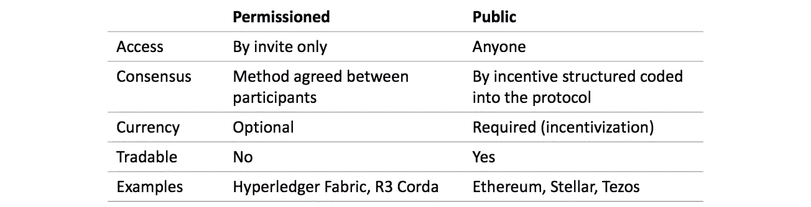
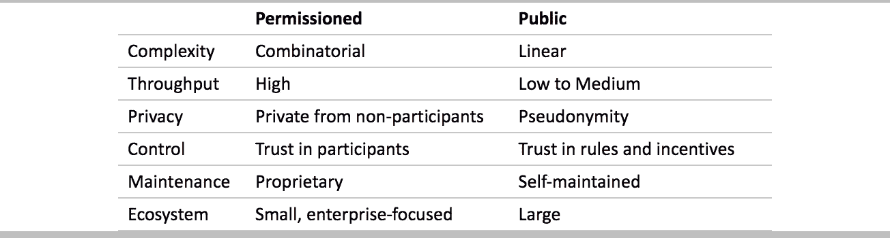
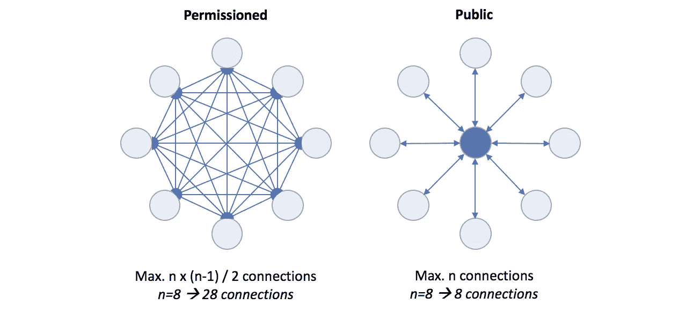

# 许可区块链是一个死胡同

> 原文：<https://medium.com/coinmonks/permissioned-blockchains-are-a-dead-end-67c2b060bc52?source=collection_archive---------1----------------------->

## 不要这样做，组合的复杂性会杀了你

当我与考虑如何建立区块链用例的公司人员讨论时，我听到了很多关于公共总账的担忧:技术不够成熟，速度太慢，我们需要保护我们的专有数据。我觉得有一些误解，人们低估了许可分类帐的一个主要缺点:组合的复杂性。因此，我想支持公共分类账，并分享我对这个话题的 2 美分。

区块链技术毫无疑问**成为过去几年最有前途的创新驱动力之一**。有[严肃的商业用例](/coinmonks/enterprise-blockchain-where-is-the-business-value-ead60bbd2cb2)，在 [coinmarketcap](https://coinmarketcap.com/) 上列出了大约 2000 个项目，为不同的问题开发解决方案，并且已经[公开宣布了 80 多个行业试点项目](/coinmonks/enterprise-blockchain-are-we-there-yet-7090b3841b11)，并且可能已经进行了很多次。 [Gartner 和普华永道预计，到 2030 年，以区块链为重点的项目**将每年产生约 3 万亿美元的商业价值**。](https://bitcoinmagazine.com/articles/pwc-global-survey-corporate-interest-blockchain-rise/#1535410294)

> [发现并回顾最佳区块链软件](https://coincodecap.com)

当建立任何新的区块链项目时，首要的问题之一总是关于[基础层技术](https://blog.goodaudience.com/enterprise-blockchain-which-are-enterprise-ready-46bd4b49dd02)，以及**应该使用许可还是公共分类帐**。两者之间的关键区别是在公共账簿中，任何人都可以加入网络。如果允许参与，则提前选择参与者，并且只允许这些人访问网络。

Key characteristics of permissioned and public ledgers

市场上已经有几个**区块链即服务(BaaS)产品**可以代表客户建立和运行一个许可的区块链。 [IBM 是目前的市场领导者，拥有 32%的市场份额，其次是微软，拥有 19%的市场份额](https://www.cbinsights.com/research/tech-giants-blockchain-projects/?utm_source=CB+Insights+Newsletter&utm_campaign=616dc8bd4f-WedNL_09_12_2018&utm_medium=email&utm_term=0_9dc0513989-616dc8bd4f-88472157)。还有[，例如 AWS、Oracle 和 SAP 都提供 BaaS 产品](/coinmonks/enterprise-blockchain-are-we-there-yet-7090b3841b11)。

Comparison of benefits and disadvantages of each

现在我们来看看**两种型号的潜在优缺点**。在我看来，复杂性是最关键的方面，但我会在最后详细说明这一点，只要坚持一会儿。

关于**吞吐量(即交易量或 TPS)** ，许可分类帐现在领先。Hyperledger Fabric 最高可处理 10k TPS，相比之下 Stellar 为 2k，以太坊为 20。不过这是暂时的:Zilliqa 之类的协议从一开始就是为高 TPS 设计的，以太坊(如 Caspar、Plasma)的更新将会增加容量，第 2 层解决方案也是如此。因此，我认为公平地说，这很快将不再是一个瓶颈。

关于隐私有很多误解。许可网络本身授予的唯一隐私来自非参与者。考虑到区块链网络只有在有多个参与者(潜在的竞争对手)的情况下才有意义，与非参与者无关的私有收益很少。无论如何，隐私需要以不同的方式解决，例如通过有效载荷数据加密或零知识交易。在这里，[许可的分类帐](https://www.ibm.com/developerworks/cloud/library/cl-blockchain-private-confidential-transactions-hyperledger-fabric-zero-knowledge-proof/index.html)实际上比不上[谜](https://enigma.co/)或 [Tezos](https://hackernoon.com/scaling-tezo-8de241dd91bd) 这样的项目。

控制是一个棘手的问题，因为问题是你更信任谁:公平竞争的竞争对手还是按计划运行的机器编码激励系统。如果你使用一个许可的网络进行货币价值交换，由于没有公开交易的代币，在参与者破产的情况下，你实际上可能会失去。另一方面，公共账本面临被黑的风险。让我们称它为这次的平局。

说到系统的**维护也差不多。由于自己建立和运行网络是不切实际的，因此您需要决定是让技术服务提供商(BaaS)运行您的许可网络，还是让非营利组织和自治社区运行公共网络。又是平局，有点像在商业软件和开源软件之间做决定。**

**生态系统**方面是指基础层协议和解决方案的进一步发展。由于大型技术公司专注于许可系统，解决方案更侧重于企业使用。公共分类帐拥有更大的生态系统，并开始[通过一些令人兴奋的解决方案](https://blog.goodaudience.com/the-crypto-toolbox-accelerators-for-enterprise-adoption-d7b3c67cff17)增加他们对企业的关注。

Illustration: Combinatorial complexity

然而最关键的方面是复杂性:管理网络的数量，以及管理网络的更新。如果每个人都与他们的合作伙伴和供应商建立一个许可网络，我们将有一个不同网络的组合爆炸，每个公司都必须管理其成员。并且每当一个新成员需要加入网络或者一个成员离开网络时，必须与其他参与者更新协议；乘以网络的数量。在公共网络中，这些都不是问题，一切如常。

在我看来，许可网络是死胡同，也许除了非常具体的利基。我想人们还没有注意到它最大的缺点，因为几乎没有项目已经超越了试验阶段。有很多关于吞吐量隐私的讨论，尽管这并没有真正的影响。大多数其他考虑因素，如**控制、维护和生态系统都相当平衡**。然而关键的争论是复杂性:**从长远来看，许可系统的组合复杂性将是毁灭性的**。

**混合的公共/许可方法可能是一条出路**，将许可和公共系统集成到一个公共分类账中(例如由 [Aergo](https://www.aergo.io/) 建立的)。如果复杂性是通过总账管理的，你可以根据具体情况决定走哪条路，两全其美。在此之前，最好坚持使用公共网络！

> [直接在您的收件箱中获得最佳软件交易](https://coincodecap.com/?utm_source=coinmonks)

