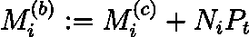

# DeFi 中的永久互换

> 原文：<https://medium.com/coinmonks/perpetual-swaps-in-defi-749997209ba3?source=collection_archive---------0----------------------->

Racing in Vail, Colorado. Source: Photo by Shichou.

## 哪种方法会赢得比赛？

永久掉期以两种不同的形式出现在分散融资(DeFi)中。要么像他们的中央对手一样使用限价订单簿，要么使用自动做市商(AMM)方法。在本文中，我们回顾了当前的方法，并打赌哪种方法将在中期内胜出。

# 1.介绍

永久掉期为投资者提供了一种简单的方式来获得资产的杠杆多头和空头敞口。该合约类似于传统的期货合约。BitMEX 于 2016 年[ [1](https://www.bitmex.com/app/perpetualContractsGuide) ]为 BTCUSD 推出了永久性掉期产品。德里比特、FTX、币安、OKEX 等其它交易所此后也实施了永久交易。永久债券成为非常受欢迎的集中交易产品，并像其他产品一样，找到了进入 DeFi 的途径。

我们首先回顾永久掉期产品，然后回顾现货市场的自动做市商(AMMs)。

> 如果你熟悉传统的资产管理协议和永久互换，你可以跳到第二部分。

## 什么是永久互换？

假设我们在 BTCUSD 上有一个永久合同。交易者存放抵押品，可以进入多头或空头交易，并可以利用他们的交易。如果合约价格上涨 1 美元，无杠杆多头交易者赚 1 美元，如果价格下跌 1 美元，损失 1 美元。对于短期合同持有人来说，反之亦然。交易者也支付或接收*资金支付*，直到他们平仓。

对于传统期货，随着到期日的临近，其价格向现货价格移动。这是套利的结果(详见[ [2](https://www.investopedia.com/ask/answers/06/futuresconvergespot.asp) )。与传统的期货不同，永久债券没有到期日。因此，需要有另一种机制将期货价格拉向现货价格。这个机制就是有*资金支付。如果永久价格高于现货价格，多头支付空头。这降低了产品的长期吸引力，导致长期合约需求的变化，推动价格向现货方向下跌。类似的，如果价格低于现货，空头支付多头，价格向上移动。实际合同规格见例如【 [1](https://www.bitmex.com/app/perpetualContractsGuide) 和【 [3](https://www.deribit.com/pages/docs/perpetual) 】。*

## 自动做市商

自动做市商(AMMs)出现于 2017 年 Bancor 协议，见[ [5](https://en.wikipedia.org/wiki/Bancor_(cryptocurrency)) ]，旨在进行现货加密货币交易(相对于期货)。

传统上，金融市场通过限价订单簿运行，做市商在其中填写买入和卖出*限价订单。*限价单是由买卖意向、价格和数量指定的。一个*市场订单*是由购买/销售意向和数量定义的。市价单通过将请求金额与限价单簿中提供的最佳价格相匹配来执行。

AMMs 抛弃限价指令簿，用“流动性提供者”(LPs)取代做市商(即下达限价指令的市场参与者)。有限合伙人存放代币，然后收取费用。通常他们的股份也有风险。与市场秩序类似的是“互换”代币。交换代币的价格由算法决定。例如，传统的 *Bancor 型 AMM* 使用一个常数乘积函数:

①*x⋅y = c*

其中， *x* 为第一枚硬币的金额， *y* 为第二枚硬币的金额(用同一种货币表示)，c 为常数。当下注者投入更多代币时，传统上等量的两个硬币， *x* 和 *y* 被更新，常数 *c* 增加。当硬币被交换时，必须满足等式(1)。如果市场参与者交换了第一枚硬币的数量 *a* ，他们收到的第二枚硬币的数量 *b* 通过确保硬币数量的乘积保持不变来确定，因此对 *b* 求解以下等式:

(2) *(x+a)(y-b) = c*

如果赌注者存入硬币，常数 *c* 变大，交易者面临的滑点就会减少，这意味着下大单时的价格与下小单时的价格不会相差太远。如果 *c* 很大，价格是粘性的，套利者很难将价格转移到其他交易所交易的市场价格方向。在这种 AMM 式的情况下，赌注者面临“非永久性损失”的风险。我们不需要为了这篇文章而一头扎进无常的失落，但是详细的解释可以在这里找到[ [6](https://medium.datadriveninvestor.com/impermanent-loss-in-defi-the-risks-involved-in-providing-liquidity-67c54fdf1cfc) ]。

除了 Bancor 之外，现货市场的 AMM 定价功能的其他值得注意的实现是[平衡器](http://balancer.finance/whitepaper/)，以及 [Uniswap](https://uniswap.org/) 经历了不同 AMM 方法(v2、v2.1、v3 等)的演变。).

# 2.AMM vs 订单簿

既然我们已经掌握了现货市场和永续产品的资产管理模型，我们就可以开始评估违约永续产品了。

*Ready to start.* Source: [Nintendo](https://play.nintendo.com/news-tips/game-releases/mario-kart-tour-mobile-game-release-date/).

在分散式交流中，“跑在前面”通常是一个需要注意的问题。例如，市场买入订单可以由快速交易者以较低的价格买入并以较高的价格卖出给慢速交易者。抢先交易成为区块链交易所的一个问题，因为交易在执行前会向验证者广播，通过更高的采矿费购买优先权或其他取决于区块链的技术，抢先交易是可能的。对于限价订单簿指数和基于 AMM 的指数来说，前期运作都是一个问题。参见[ [4](https://consensys.github.io/smart-contract-best-practices/known_attacks/#front-running) ]可以很好的解释抢跑的问题。一些 dex 已经实施了隐藏交易的方法来解决这个问题。

一般来说，给 dex 带来流动性是相当困难的。传统形式的 AMM 被认为是“资本低效的”，也就是说，与基于订单簿的模型相比，传统的 AMM 需要更多的资本来观察相同水平的滑点(=进行大额交易时价格恶化)。对传统 AMMs“资本效率低下”的简短解释是，在基于订单簿的交易所中，做市商围绕市场价格下单，但在传统 AMMs 中，资金隐含在所有价格中。要更深入地了解这一讨论，请参见[ [9](https://blog.bancor.network/amplified-liquidity-designing-capital-efficient-automated-market-makers-in-bancor-v2-3cec8891c3a1) 。然而，维持资产管理公司的适当流动性水平更简单，因为这里的流动性供应是被动的。相反，对于基于订单簿的交易所，做市商需要在新信息到达时不断调整他们的订单。

1.  正如我们将在本文中看到的，有*种资本高效的 AMM 永久互换方法*
2.  资产管理系统用被动流动性提供者(LPs)取代了订单簿模型中主动做市商的功能。有限合伙人存放抵押品并在不主动发布限价单的情况下赚取费用。作者认为，与通过被动地从资本高效的 AMM 赚取费用的有限合伙人吸引足够的流动性相比，在订单模式下，通过活跃的做市商吸引足够的流动性可能更加困难
3.  限价订单也可以在基于 AMM 的 DEX 中执行，因此即使 DEX 想要提供限价订单，也不需要订单簿模型
4.  构建 DEX 所基于的区块链需要能够通过订单簿模式(与 AMM 模式相反)处理更多的吞吐量

出于这些原因，在当前的 DeFi 环境下，作者的赌注在于永久互换的 *AMM 模型*,而不是订单簿模型。因此，以下各节专门讨论永久资产管理制度。

# 3.永久互换的 AMMs

使用 AMM 模型的著名永久互换项目有***F***[***utureSwap***](https://docs.futureswap.com/)、 ***永久协议*** 和 ***MCDEX*** 。FutureSwap 显然意识到秘密武器是定价功能，他们目前没有透露他们的确切方法。因此，在本文中，我们只剩下两个 AMM 来评估。

dex 上基于订单簿的永久实现的例子有 [dYdX](https://dydx.exchange/) 、[内射](https://injectiveprotocol.com/)和 [Leverj](https://leverj.io/) 。

## 3.1 永久协议

[**恒常协议**](https://docs.perp.fi/) 使用恒常乘积函数，来确定价格，详见第 1 节:

**Equation 1**

其中 *x* 是第一个代币的金额， *y* 是第二个代币的金额(用相同的货币表示)，并且 *c* 是常数。关于永久价格如何确定的详细示例，请参见[【7】“永久 AMM 的深入探讨](/perpetual-protocol/a-deep-dive-into-our-virtual-amm-vamm-40345c522eeb)”。附录 A1 列出了永久协议的关键要素，这些要素不是阅读本文其余部分的必要知识。

在现货市场(如 Uniswap v1)，定价函数中的常数 *c* 是下注多少代币的结果。在永久协议中， *c* 由治理(AMM 操作符)设置。永久协议团队声明，随着时间的推移，他们希望朝着算法选择 *c* 的方向发展。

如果 *c* 选得太高，即使是非常大的交易也几乎没有滑点。这对交易者来说最初是好的，但是大额交易可能导致 AMM 的巨额净敞口，并使系统处于风险之中。抵押品可能会根据利益相关者的情绪和市场价格的变动而快速变化，然而， *c* 是由(缓慢的)治理设定的。因此，作者声称当前的永久协议定价方法与潜在风险不一致。

Know your risks. Source: [Gigazine.net](https://gigazine.net/gsc_news/en/20170717-mario-game-over-screens/)

建立一个与 AMM 面临的风险挂钩的定价函数似乎是合理的。这就是 MCDEX 在他们提议的定价方法中所尝试的。

## 3.2 MCDEX

截至 2021 年 5 月， [MCDEX](https://mcdex.io/) 正在开发其 AMM 的第 3 版，其白皮书已经发布，请参见[ [8](https://mcdexio.github.io/documents/en/Shared-Liquidity-AMM-of-MAI-PROTOCOL-v3.pdf) ]。我们在这里使用这份白皮书作为参考。

> MCDEX 的定价方法激励交易商减少 AMM 净敞口。

***举例:*** *如果多头敞口的交易者有 26 个 ETH，空头敞口的交易者有 20 个 ETH，则 AMM 的净敞口为-6 个 ETH。定价函数被定义为使得在这种情况下结束短期交易将具有比结束长期交易更有利的定价。*

MCDEX 共享不同市场的押记抵押品，例如，押记者在 USDC 提交抵押品以服务 ETHUSDC 和 BTCUSDC 市场，因此 MCDEX 对抵押品使用“池保证金”的名称。附录 *A1* 介绍了 MCDEX AMM 公司的关键要素，阅读本文并不需要了解这些要素。

## MCDEX 定价

How much? Source: [Nintendo](https://supermarioemulator.com/)

MXDEX AMM 的中间价 *P(mid)* 定义如下。

**Equation 2**

其中 *P(idx)j* 代表资产 *j* (如 BTCUSD 价格)*，*由 [oracle](https://en.wikipedia.org/wiki/Blockchain_oracle) ， *Nj* 为资产 *j 的 AMM 净风险敞口，β* 为参数(> 0)，而 *M* 为称为*池保证金*的可用抵押品

交易者为规模为 *n* 的交易支付的 ***填充价格*** 是通过对上述定价函数 *pj(N)* 从 *Nj* 到 *Nj+n* 进行积分并将该积分除以 *n* 来确定的。我们在*附录 A3* 中详细展示了这一点。

当 *M → ∞* 时，填充价格接近指数价格。当 *M →0* 时，对于交易者来说，填充价格越来越偏离指数价格，偏离方向越来越不利(高滑点)。交易越大，滑点越高。与交易规模相比，池保证金越大，滑点越低。最后，滑移也可以通过选择参数*β*0 来控制。

## 潜入泳池边缘

Diving. Source: [Nintendo](https://play.nintendo.com/news-tips/news/super-mario-maker-2-free-final-update-details/).

定价公式(等式(2))考虑了相对于**池保证金** *M* 的交易量。

MCDEX 将池保证金 M 定义为抵押品的价值，使用我们在平仓所有头寸时面临的填充价格，该价格是我们通过对交易金额整合定价函数而获得的。因此，我们对池裕度有如下定义:

**Equation 3**

其中 *Mc* 等于所有未平仓头寸的担保品净值。对于感兴趣的读者，我们在附录 *A2、*中详细介绍了这一计算。然而，重点是交易者改变了 *M、*，而等式(1)假设了一个常数 *M* 。

> 因此，当交易者在一个订单中交易金额 *x* 时，与在 *k* 订单中交易金额 *x/k* 时相比，交易者将面临不同的价格，假设在此期间指数价格没有变化。

我们在**图 1** 中说明了定价方法的这一特性。设置参数使得 AMM 是净多头( *Nj=3，Mj=50，000 美元，p(idx)=2000 美元，β=0.05* )，并且交易者进入名义 2 的多头交易。

*   AMM 是净多头(Nj=3)，因此我们希望多头交易者进入市场，将 AMM 敞口归零。与此相一致，中间价低于指数价 2000 美元
*   图 1 显示，如果多头交易者进行了许多小笔交易，他们得到的平均成交价格会比他们进行 1 笔交易时得到的好。

**切蛋糕的时候多点蛋糕？**如果交易者以许多订单结束交易，他们以 AMM 为代价获得了更好的执行价格。

**Figure 1: With the MCDEX pricing approach, the fill price for a given amount depends on the number of orders placed (all else equal).**

# 4.结论

我们认为 AMMs 是 DeFi 永久掉期比基于订单簿的 dex 更有前途的模式。

*永久协议*是 DeFi 永久协议的简单解决方案。其定价机制与该工具的潜在风险不一致。也就是说，AMM 算子通过治理来控制滑移(常数 *c* )。如果抵押品可能太薄， *c* 应该更高，这样威尔士就不会将 AMM 置于风险之中。如果抵押品泛滥，c 应该更低，以防止太多的滑动。永久协议的目标是通过算法确定 *c* ，这将是解决这一风险的一个机会。

MCDEX 引入了一个定价函数，它包含了相对于当前抵押品的交易规模。结果，当交易变大时，滑点增加，相对小的交易滑点减少。

我们认为 MCDEX 的定价方法有改进的空间:

1.  交易者在交易数量 x 时收到不同的执行价格，与交易数量 x 乘以数量 x/k(其他条件相同)时相反。因此，精明的交易者可以在提高 AMM 风险的同时提高价格
2.  随着 AMM 超额抵押的增加，池保证金的计算具有非直观的限制行为(详见附录 A2)

MCDEX 很好地考虑了“违约瀑布”(谁承担了哪些损失，参见附录 A1)。MCDEX 不直接包含基础工具的价格波动。我们可以通过滑动参数间接引入波动性。也就是说，滑移参数 *β* 可以为更高波动性的资产设置得更高。

在当前环境下，MCDEX 的方法看起来是最有前途的。作者会把他的鸡蛋放在这个篮子里。🍳

*免责声明:在撰写本文时和可预见的将来，作者与本文中审查的项目没有任何关联、关联、授权、支持、投资或任何方式的联系。*

# 参考

[1][https://www.bitmex.com/app/perpetualContractsGuide](https://www.bitmex.com/app/perpetualContractsGuide)
【2】[https://www . investopedia . com/ask/answers/06/futuresconvergespot . ASP](https://www.investopedia.com/ask/answers/06/futuresconvergespot.asp)
【3】[https://www.deribit.com/pages/docs/perpetual](https://www.deribit.com/pages/docs/perpetual)
【4】[https://consensys . github . io/smart-contract-best-practices/known _ attacks/# front-running](https://consensys.github.io/smart-contract-best-practices/known_attacks/#front-running)
【5】[https://en . Wikipedia . org/wiki/Bancor](https://en.wikipedia.org/wiki/Bancor_(cryptocurrency))

# 附录

## A.1 永久议定书的关键要素

《AMM 永久议定书》的**要素**如下。

*   交易者在每个市场存入 1 个代币(如 ETHDAI 市场的 DAI)作为抵押品
*   指数价格来源于 oracle，协议规定了*融资利率*(定义见第 1 节“什么是永久掉期”)，类似于集中交易，使用指数与 AMM 价格的时间加权平均值
*   在存入 *a* 代币(如戴)并设置杠杆 *L* 后，交易者被常数乘积函数赋予另一代币(如 ETH)的数量 *b* ，从而在*(*中求解 *b*
*   在这个阶段，不需要桩。然而，如果价格大幅上涨，保证金可能会被超过，将没有足够的资金支付对手。因此，永久协议将交易费用集中到一个默认基金中，在这种情况下将被标记。如果这些资金仍然不够，赌注基金被用来弥补 AMM 的损失。

MCDEX AMM v3 的**关键元素**如下。

*   交易员存入 1 个令牌，作为 DEX 上*多重*永久掉期市场的抵押品。这有时也被称为*共享流动性池*。在 V3 中，ETHUSDC 的担保品是 USDC，但在以前的版本中是 ETH
*   指数价格来源于 oracle，协议规定给定市场(如 ETHUSDC)的*融资利率*为 AMM 净风险敞口与该市场抵押品比率的函数
*   交易者存入 USDC，设定杠杆，做多或做空。定价激励交易者降低 AMM 风险。定价是交易后 AMM 净风险敞口与该市场的抵押品之比的函数。定价还包括最小的买卖差价，如果交易方向降低了 AMM 敞口，就会得到更有利的价格
*   与永久协议类似，如果保证金抵押品不足，赌注者将分担损失，MCDEX 还保留一笔违约基金。MCDEX 实施了进一步的措施，作为 AMM 失败的风险缓解措施:(1)对流动性提供者的提款罚款，以及(2)AMM 敞口的上限，超过该上限就不能再进行该方向的交易。“默认瀑布”(损失如何分担)定义得很好。

## A.2 .池保证金的计算

## 池边缘

为了理解池保证金 *M* ，我们首先检查单个交易者 *i* 的净保证金。交易者进入头寸的瞬间，交易者 *i* 的担保物价值 *Mc* 通过减去填充价格和数量进行调整:

**Equation A1**

其中 *Ni* 是交易者 *i* 的成交名义(如 1 ETH)，而 *Po* 是成交价格。调整后的抵押品 *Mc* 可用于计算交易者的保证金余额 *Mb* :

**Equation A2**

其中 *Pt* 为当前价格。准确地说，价格 *Pt* 是交易者收到的成交价格。下面的例子应该有助于理解等式(A1)和(A2)。

***例*** *:如果交易者在 Po=4000 美元做空 1 ETH (N=-1)，现金 Mc=1000 美元，根据等式(A1)，Mc 设置为 5000 (=1000+4000)。使用等式(A2)，我们看到 Mb 的结果是 1000 美元(= 5000–4000)，这是因为价格没有变化，因此交易值为 0，因此保证金等于存入的现金。现在，如果价格涨到 4100 美元，做空的交易者损失 100 美元，我们用等式(A2)得到 Mb = 900(= 5000–4100)。*

既然我们理解了等式(A1)和(A2 ),我们可以处理 AMM 曝光。首先，我们将 *Mc* (没有指数 *i* )定义为所有交易者和所有流动性提供者存入的现金量，减去他们在等式(A1)中的输入量。然后，类似于等式(A2)，我们通过将每个市场 1，…，K 的当前 AMM 价格乘以名义价格与 *Mc* 相加，获得 AMM 抵押品，称为*池保证金*。对于价格，MCDEX 计算实际填充价格，因此，我们通过将定价函数从 0 整合到其名义 *Nj* 来获得风险敞口:

**Equation A3**

其中 *pj(n)* 是在等式(2)中找到的定价函数。

定价函数，方程(2)，也依赖于 *M* ，并且求解方程(A3)得到一个二次方程。二次性质意味着存在一些裕度水平，在这些裕度水平上没有对 *M* 的实值解，否则有两个解。 *M* 的最终解决方案如下。

**Equation A4**

其中 *β* 是滑点参数， *Pj(idx)* 指数价格， *Nj* 市场 j 的 AMM 净敞口。**我们看到，如果填充价格是指数价格，则 *Mb* 对应于可用的抵押品。**从第一个和第二个等式中，我们看到，如果δ= Mb，则 *Mb=Mc* ，这是所有 AMM 净敞口 *Nj* 都为零的情况。与 *Mb* 相比，AMM 净暴露越高(负或正)，δ越小，M 越低。不那么直观的是，当指数价格上升时，AMM 是正的，因此有更好的担保。在δ变为负值之前，AMM 停止提供流动性。因此，池余量将在范围 *[0.5 Mb，Mb]内结束。*

# A.3 .定价

通过对定价函数积分，我们得到产品 *j* 交易量 *δ* 时的填充价格，等式(2):

**Equation A5**

其中 n2 := Nj -δ是交易后的 AMM 名义值。我们求解积分如下。

**Equation A6**