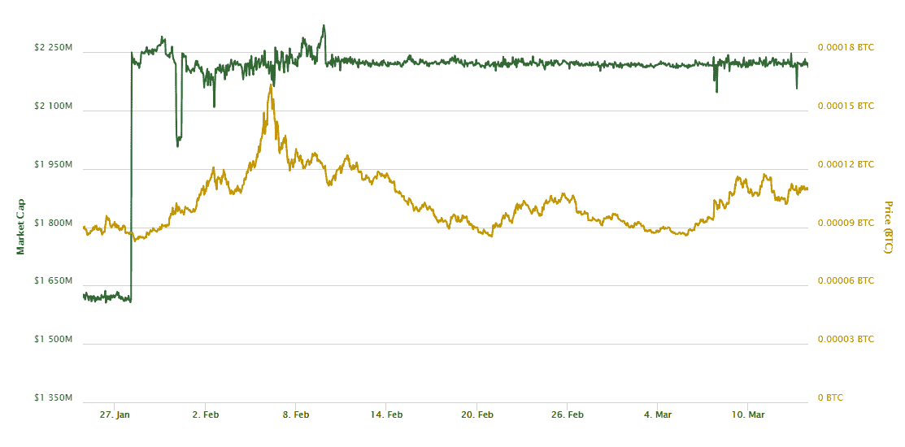

# 博士比率，底部采矿和峰值系绳

> 原文：<https://medium.com/coinmonks/phd-ratio-rock-bottom-mining-peak-tether-5e11269667f1?source=collection_archive---------4----------------------->

Credit: [**BetterCallTone**](https://www.youtube.com/channel/UCdF6u66GMqbFBtUW_wlrs7g)

比特币的 Hashrate(每日 PetaHashes)与每日采矿收益(PetaHashDollar)之比是一个评估每日采矿盈利能力的强大指标。此外，当绘制过去五年的图表时，其总体趋势代表了一种量化和可视化 ASICs 效率相对进展的好方法(更具体地说，是该指标的倒数:1/相对采矿效率)。

**PHD Ratio**: the overall macro-trends in the era of ASICs. Data sourced from: [**blockchain.info**](http://blockchain.info)

然而，这是一个相对的、未经调整的指标。在评估长期趋势时，其每美元的数学正确单位(peta)散列值有些不合适。对于调整后的版本，不仅需要考虑处理能力效率的提高(大约 60 倍)，还需要考虑其他更难以量化的因素。这些因素与设备的配置和冷却、规模经济、这些操作的地理重新定位以及获取廉价电力/冷却的其他创新方式有关(这些方面不可避免地受到规模和较小利润率的驱动)。

这种更恰当的采矿效率测量方法必须与 PHD 比率反向计算，并采用适当的单位，如美元/兆焦耳。就本文的目的而言，博士比率应该足以给出比特币市场中发挥作用的硬物理和财务限制的整体图景。

# 被束缚在谷底和高速之间

**操纵市场的基本原理**

比特币主要且不可避免的抛售压力来自采矿业务，目的是为其运营成本融资，以及投资升级和保持竞争优势——这是一种极其微妙的平衡行为。因此，他们必须有一个长期战略，并尽最大能力判断市场周期。2017 年牛市的乐观情绪可能导致对顶部需要筹集的现金数量以及分配给增长(增加其 hashrate)的收益与用于支付未来运营成本的储蓄的比率过于乐观的错误估计。

考虑到目前的利润曲线区域，有理由推测矿商在交易所的帮助下一直在支撑价格，以满足他们的销售需求，而不会进一步增加销售压力，使价格更低。这样的协同努力对所有相关方都有好处:相互竞争的采矿业务、交易所，以及各种规模的看涨交易者都非常欢迎。

显而易见，这种性质的市场操纵不能通过随意向市场倾销 BTC 来实现。它必须以精心策划的方式进行，矿商 BTC 的抛售压力必须被另一种资产吸收，最好是某种运作方式模糊、不受监管且容易控制的资产。这反过来又可以被用作平衡物，并“模拟”购买压力:满足**系绳**。

> **第一次比特币涨势/** “死猫反弹”18 年 2-3 月- >无明显变化系绳 MC/ supply”:

Source: [**CoinMarketCap.com**](http://CoinMarketCap.com)

> **第二次比特币涨势/** “死猫反弹”18 年 4-5 月
> 系绳 MC 变化:从 230 万到 220–210 万
> ~1 亿–2 亿系绳“撤销”:

Source: [**CoinMarketCap.com**](http://CoinMarketCap.com)

# 第三次和第四次(正在进行的)拉力赛

**&峰值系绳**: **28.6 亿美元(历史峰值，“市值”/“流通供应量”)**

> ****第三次拉力赛** /“死猫反弹”2018 年 6-7 月
> 系绳 MC 变化:从 270 万到 250-240 万
> ~ 2-3 亿系绳**【撤销】**(正确关联)**
> 
> ****第四次(正在进行的)拉力赛**2018 年 8 月—9 月
> 【“死猫反弹”且文章发表时已不再持续】系绳 MC 变化:从 2.4 变为 2.85
> ~ 4.5 亿系绳**“已打印”！！！****

****

**Source: [**CoinMarketCap.com**](http://CoinMarketCap.com)**

# **关于比特币市场的现状，“博士比率”能告诉我们什么？**

****

**在前两个市场周期中，比特币的反弹远早于 PHD 比率:2013 年进入盈利周期的一半，2014 年至 2015 年为三分之一。然而，目前，我们发现自己比过去几个周期更接近盈利能力/效率曲线的渐近锥形。**这可能会从根本上改变这种关系和价格行为的动态**。然而，从这些数据中可以直观地得出的最有可能的情况是最不令人兴奋的:市场已经见底(或很快形成略低的低点)，然后**继续横盘交易，直到 2019 年 3 月。****

**如果有数学或金融背景的人能给我一些关于上述分析的反馈，并提出有益的意见，指出我可能遗漏的任何东西，并在此指标/分析中予以考虑，我将不胜感激。**

> ****免责声明:本文内容仅作为我个人的观察和问题，以供进一步考虑、回答或丢弃，因此本文远非详尽，不是也不能作为任何金融/投资/交易建议的基础。****

> **[在您的收件箱中直接获得最佳软件交易](https://coincodecap.com/?utm_source=coinmonks)**

****