# Phemex 评论 2021 |零费用，无 KYC[更新]

> 原文：<https://medium.com/coinmonks/phemex-review-4cfba0b49e28?source=collection_archive---------4----------------------->

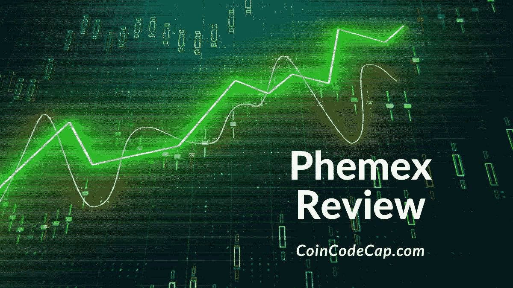

在这篇文章中，我们将回顾一下 [Phemex](https://blog.coincodecap.com/go/phemex) ，这是一个相对较新的[比特币交易交易所](/coinmonks/crypto-exchange-dd2f9d6f3769)，它为初学者和高级交易者提供专业水平的衍生品交易。八名前摩根士丹利高管于 2019 年 11 月 25 日在新加坡推出了 [Phemex](https://blog.coincodecap.com/go/phemex) 。Phemex 有一个以用户为中心的方法和相当令人兴奋的功能，所以系好安全带。

使用 **DDLJW** 邀请码并享受费用折扣。

# Phemex 评论:摘要

1.  [Phemex](https://blog.coincodecap.com/go/phemex) exchange 是金融犯罪执法网络部注册的货币服务企业。
2.  KYC 不需要开始在 Phemex 进行交易。
3.  用户可以用高达 100 倍的杠杆交易永久合约。
4.  该平台提供多种高级订单进行交易。
5.  用户可以在 [Phemex](https://blog.coincodecap.com/go/phemex) 上创建子账户。每个帐户可以有自己的帐户余额和权限。
6.  用户可以使用 Phemex 模拟账户练习交易加密货币，而不会将自己的资金置于风险之中。
7.  高级会员可以进行零手续费现货交易。
8.  Phemex 提供可观的奖金。
9.  该平台提供全天候实时聊天选项。
10.  用户可以使用 Phemex 移动应用程序随时随地进行交易。

# Phemex 怎么入门？

按照以下简单的步骤在 Phemex 上创建一个帐户:

1.  进入 [Phemex 网站](https://blog.coincodecap.com/go/phemex)
2.  按右上角的“注册”按钮
3.  填写您的电子邮件地址并设置密码
4.  使用 **DDLJW** 邀请码并享受费用折扣。
5.  输入验证码以验证您的电子邮件地址
6.  使用您的新凭据登录 Phemex

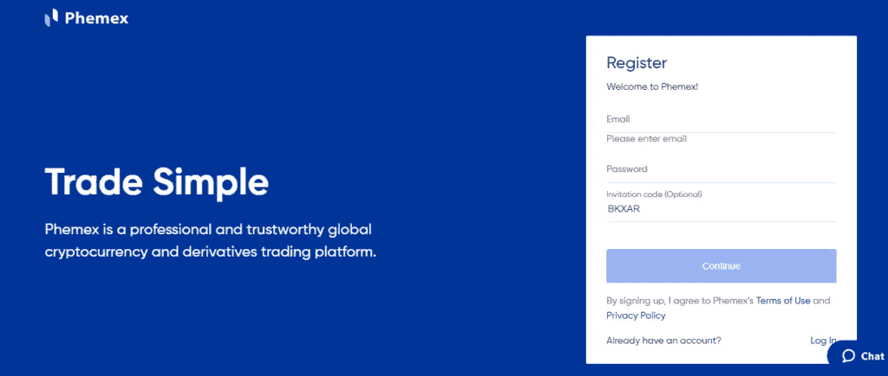

# 如何在 Phemex 上存款？

您可以按照以下步骤将加密货币直接转移到 Phemex 钱包:

1.  登录你的 [Phemex 账户](https://blog.coincodecap.com/go/phemex)
2.  点击右上角的“资产”选项
3.  点击“存款”按钮并选择加密货币
4.  复制所选硬币的唯一钱包地址
5.  使用您的个人加密钱包扫描二维码或复制并粘贴地址开始交易。选择所需金额，并将其发送到您的 Phemex 钱包。

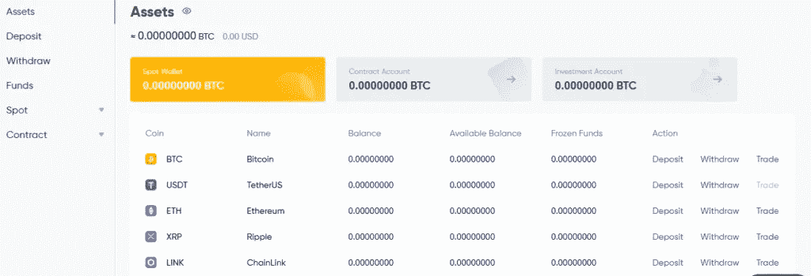

# Phemex 的杠杆作用

杠杆交易涉及使用借入的资金或其他金融资产来放大回报。尽管这种策略可以放大潜在回报，但也存在潜在的亏损风险。

你将能够在 [Phemex](https://blog.coincodecap.com/go/phemex) 交易杠杆高达 100 倍的永久合约。第一步是分配你资金的特定部分或保证金来开仓。之后，选择交易的杠杆数量。

如果你不想处理杠杆交易的复杂性，你应该看看我们的指南[杠杆代币](https://blog.coincodecap.com/leveraged-token)。

# 合约交易

合同包括卖方、买方和固定价格。合约交易让你在预定的价格和日期根据资产的价格变动进行交易。在动荡的市场中交易时，你可以确保利润或对冲各种其他投资。合约交易有助于成倍增加回报，但也有风险。你可以通过合约交易获得每日利润。

[Phemex](https://blog.coincodecap.com/go/phemex) 合约遵循一个制造商和接受者的模式。提取订单簿流动性的接受者将为每次执行(如市价订单)支付 0.075%的费用。向订单簿提供报价的制造商将从每次执行中获得回扣(例如，限价订单)。

在交易合约时，考虑融资费用是至关重要的。 [Phemex](https://blog.coincodecap.com/go/phemex) 每 8 小时收取一次资助费。该费用可以是负数，也可以是正数，这可能导致可能的收益或损失。当融资利率为负时，空头将向多头支付一定比例的头寸。或者，长期持有人将从他们的头寸中获得利息。

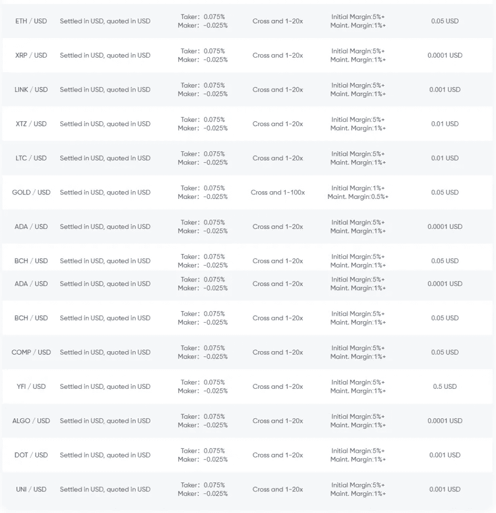

# 现款现货交易

只有高级用户才能零手续费从事现货交易。标准用户必须支付 0.1%的交易费作为制造商或接受者。利用 API 交易的交易者将不得不支付 0.1 %的交易费。

# Phemex 审查:订单类型

## 限价订单

在这种类型的订单中，您设置了一个限价。选择限价单意味着你只能以指定的价格卖出或买入。如果达到限价，订单就会被执行。

## 条件指令

只有高级用户才能使用 [Phemex](https://blog.coincodecap.com/go/phemex) 上的条件订单。这些订单有点类似于限价订单。唯一的区别是有条件的订单有一个触发价格。直到达到你指定的价格，订单才被激活或触发。条件订单对高级和专业交易者很有用。

## 市场定购单

选择市价订单包括以最优惠的价格立即执行您的订单。该订单根据订单簿执行。之后它以最好的价格被填充。

## 止损止盈

无论是盈利还是亏损，你都可以为你的交易设定一个预定的止损点来限制你的风险。不想频繁检查未平仓头寸的交易者可以依靠这个工具。

# Phemex 高级会员

注册账户后， [Phemex](https://blog.coincodecap.com/go/phemex) 用户有资格获得为期 7 天的免费高级会员试用。但是，完全高级帐户提供了其他方式无法提供的额外功能。作为完全高级用户，您可以享受以下功能:

*   交易加密现货交易所
*   在现货市场执行的订单产生零交易费用
*   通过提前订单(即有条件订单类型)管理现货市场的风险
*   向您的家人和朋友赠送 30 天的完整高级试用版

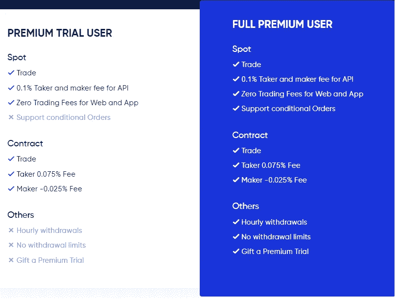

# 零手续费现货交易

[Phemex](https://blog.coincodecap.com/go/phemex) 不对其现货市场收取交易费用；而是提供会员等级。Phemex 允许其高级会员免费交易。因此，这个平台对高交易量的交易者很有吸引力。Phemex 高级会员的费用:

*   30 天 9.99 美元
*   90 天 19.99 美元
*   一年 69.99 美元

使用 **DDLJW** 邀请码，享受费用折扣。

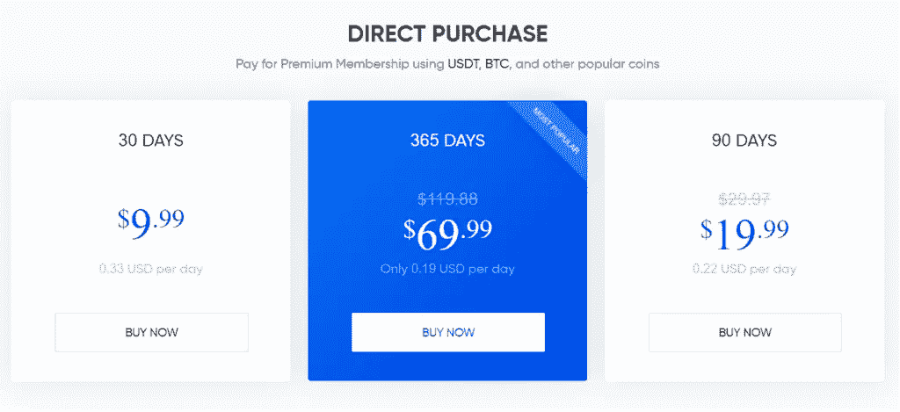

# Phemex 子账户功能

在 Phemex 上，你可以创建子账户。每个帐户可以有自己的帐户余额和权限。该功能允许交易者为不同的交易策略创建子账户。为每个子账户设置有限的余额也是可能的。子账户系统让你在账户间自由转移余额。因此，每一个新的策略都可以被交易者测试。

# Phemex 模拟账户

您可以练习交易加密货币，而不会将自己的资金置于风险之中。 [Phemex](https://blog.coincodecap.com/go/phemex) 模拟账户模拟交易环境，提供与主平台相同的功能和特性。

# Phemex 奖金

您可以通过完成平台上的大量任务获得诱人的奖金。

使用 **DDLJW** 邀请码并享受费用折扣。

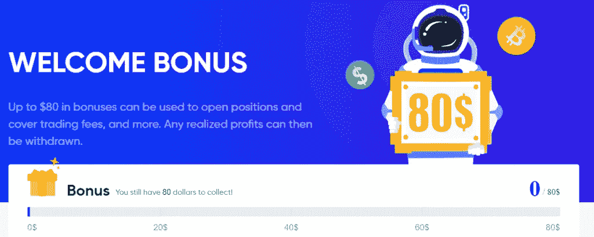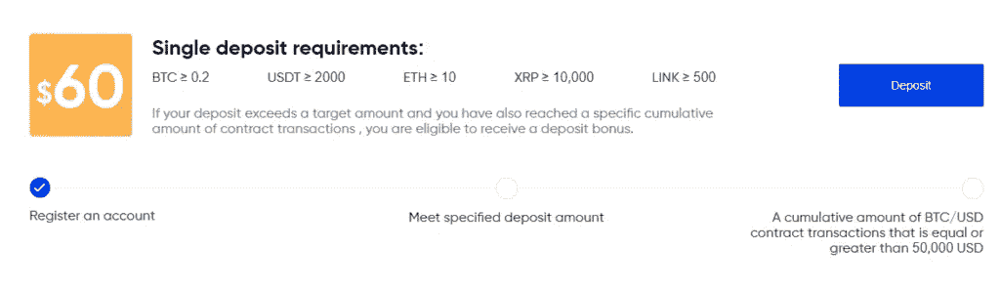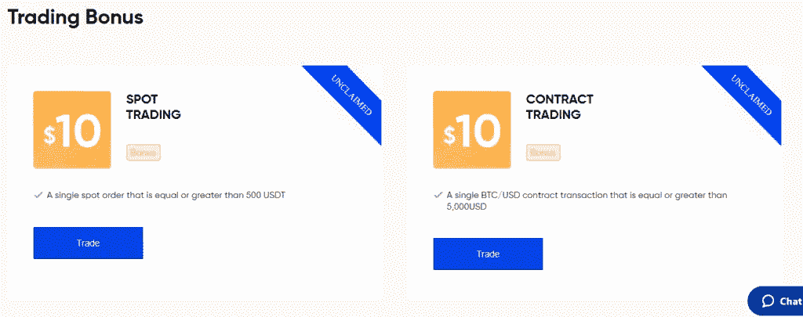

# Phemex 存取费

向 [Phemex 的](https://blog.coincodecap.com/go/phemex)交易账户存款或从该账户提款都是免费的。但是，有最低存款要求和最低取款限额。

你还必须为取款支付标准的区块链手续费。该费用可能因加密资产和网络负载而异。

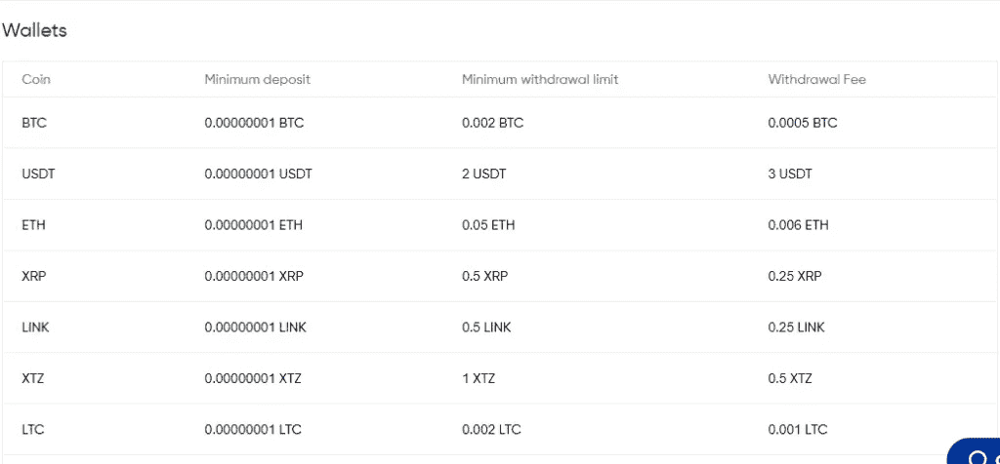

# Phemex 合法吗？

Phenex exchange 是一家完全在金融犯罪执法网络部注册的货币服务公司。

# Phemex 评论:安全性

[Phemex](https://blog.coincodecap.com/go/phemex) 应用分级确定性[冷钱包](https://blog.coincodecap.com/how-to-secure-your-crypto-wallet#Cold_storage)系统。该系统为每个用户分配一个单独的冷钱包存款地址。Phemex 会定期通过离线签名将所有存款聚集到多签名冷钱包中。

该交易所使用[亚马逊网络服务(AWS)](https://aws.amazon.com/) 云来确保其服务器的安全。此外，Phemex 还利用防火墙来分隔其内部网络中的交易区。

Phemex 声称，由于其恢复系统，交易者的停机时间为零。恢复系统应该给用户 99.9%的高可用性。然而，这个平台并没有存在很长时间来总结任何事情。

# Phemex 移动应用程序

[Phemex](https://blog.coincodecap.com/go/phemex) 应用程序适用于 Android 和 iOS 移动操作系统。该应用程序具有许多特性、内置工具和功能。所以这个 app 随时随地都好用。下面列出了一些关键特性:

1.  交易界面对于新手和有经验的交易者来说都很容易理解和操作。
2.  交易视图图表可用于决策和价格分析。
3.  各种绘图工具，内置指标，便于技术分析。
4.  该应用程序还提供多种时间框架，这对长期交易者和黄牛党都很有用。
5.  此处提供买入止损单、高级订单类型和限价单。

借助 Phemex app 在 [Phemex](https://blog.coincodecap.com/go/phemex) 平台上进行所有交易活动。使用[此链接](https://play.google.com/store/apps/details?id=com.phemex.app)下载应用程序。

使用 **DDLJW** 邀请码并享受费用折扣。

# Phemex 评论:用户界面

用户界面对使用技术分析的交易者很重要。关于 [Phemex](https://blog.coincodecap.com/go/phemex) ，工具和图表界面令人印象深刻。体验流畅、简单、完美。而且 Phemex 提供了优秀的绘图工具和技术指标。另外， [TradingView](https://blog.coincodecap.com/go/tradingview) 提供了制图软件。

在左侧，在**选择市场**选项旁边，用户可以看到可用的配对。一旦选择了一对，就会显示订单输入窗口。在这里，您可以使用加密永久合约或现货交易进行交易。Phemex 有多种订单类型，包括:

*   限价订单
*   有条件订单
*   市场订单

“订单”窗口显示金额百分比。合约市场的订单窗口也有一个杠杆滑块。

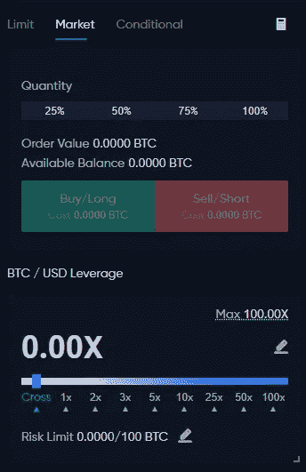

在右侧，可以看到订单簿。它显示人们愿意购买或出售所选加密货币的所有价格。

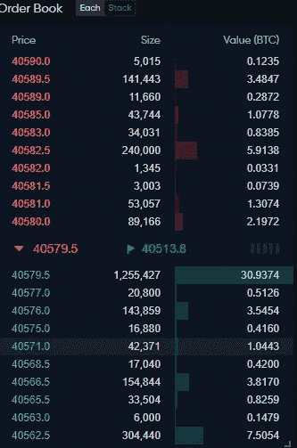

# Phemex 评论:客户支持

该平台提供全天候实时聊天选项。您也可以通过 Twitter、脸书、Telegram 和以下电子邮件地址联系 [Phemex](https://blog.coincodecap.com/go/phemex) :

1.  支持-support@phemex.com
2.  产品反馈-product@phemex.com
3.  报告问题和错误-it@phemex.com
4.  投诉-complaints@phemex.com

# Phemex 评论:利弊

## 赞成的意见

1.  提供高达 100 倍的杠杆作用
2.  创建子账户的功能
3.  不需要 KYC
4.  多种高级订单类型可用
5.  基本用户界面
6.  专注于社区

## 骗局

1.  一个相对较新的平台，于 2019 年推出
2.  不支持加密到加密对
3.  与其他衍生产品交易所相比，流动性较低

# Phemex 审查:结论

虽然 [Phemex](https://blog.coincodecap.com/go/phemex) 是一个相对较新的平台，但它为用户提供了大量的机会和好处。这里的缺点相对较少。这种交换简单易懂，易于使用。Phemex 的特色在于它允许用户创建子账户。这可能会让 Phemex 相对于其他交易平台拥有竞争优势。

# 常见问题

**有没有 Phemex 手机 app？**

是的，Phemex 应用程序适用于 Android 和 iOS 移动操作系统。该应用程序具有许多特性、内置工具和功能。所以这个 app 随时随地都好用。

**phe MEX 支持哪些国家？**

Phemex 不仅适用于美国、古巴、魁北克、新加坡、朝鲜、塞瓦斯托波尔、苏丹、伊朗和叙利亚。

Phemex 上的有条件订单只针对高级会员吗？

是的，只有高级用户才能使用 Phemex 上的条件订单。这些订单有点类似于限价订单。唯一的区别是有条件的订单有一个触发价格。

**phe MEX 上有哪些加密货币？**

交易所支持[比特币](https://blog.coincodecap.com/a-candid-explanation-of-bitcoin)、以太坊、Ripple、ChainLink、Tezos、莱特币。Phemex 还为合约提供黄金/美元交易对。

> 加入 [Coinmonks 电报小组](https://t.me/joinchat/uiLERCQL1fQ5ZjA1)并了解加密交易和投资

## 另外，阅读

*   最好的[加密交易机器人](/coinmonks/crypto-trading-bot-c2ffce8acb2a) | [网格交易机器人](https://blog.coincodecap.com/grid-trading)
*   [加密副本交易平台](/coinmonks/top-10-crypto-copy-trading-platforms-for-beginners-d0c37c7d698c) | [五大 BlockFi 替代方案](https://blog.coincodecap.com/blockfi-alternatives)
*   [CoinLoan 点评](/coinmonks/coinloan-review-18128b9badc4)|[Crypto.com 点评](/coinmonks/crypto-com-review-f143dca1f74c) | [火币保证金交易](/coinmonks/huobi-margin-trading-b3b06cdc1519)
*   [尤霍德勒 vs 考尼洛 vs 霍德诺特](/coinmonks/youhodler-vs-coinloan-vs-hodlnaut-b1050acde55a) | [Cryptohopper vs 哈斯博特](https://blog.coincodecap.com/cryptohopper-vs-haasbot)
*   [杠杆令牌](/coinmonks/leveraged-token-3f5257808b22) | [最佳密码交易所](/coinmonks/crypto-exchange-dd2f9d6f3769) | [Paxful 点评](/coinmonks/paxful-review-4daf2354ab70)
*   [如何在印度购买比特币？](/coinmonks/buy-bitcoin-in-india-feb50ddfef94) | [WazirX 审核](/coinmonks/wazirx-review-5c811b074f5b) | [BitMEX 审核](https://blog.coincodecap.com/bitmex-review)
*   [双子座 vs 比特币基地](https://blog.coincodecap.com/gemini-vs-coinbase) | [比特币基地 vs 北海巨妖](https://blog.coincodecap.com/kraken-vs-coinbase) | [硬币罐 vs 硬币点](https://blog.coincodecap.com/coinspot-vs-coinjar)
*   [币安 vs 北海巨妖](https://blog.coincodecap.com/binance-vs-kraken) | [美元成本平均交易机器人](https://blog.coincodecap.com/pionex-dca-bot)
*   [印度比特币交易所](/coinmonks/bitcoin-exchange-in-india-7f1fe79715c9) | [比特币储蓄账户](/coinmonks/bitcoin-savings-account-e65b13f92451)
*   [币安收费](/coinmonks/binance-fees-8588ec17965) | [Botcrypto 审查](/coinmonks/botcrypto-review-2021-build-your-own-trading-bot-coincodecap-6b8332d736c7) | [Hotbit 审查](/coinmonks/hotbit-review-cd5bec41dafb) | [KuCoin 审查](https://blog.coincodecap.com/kucoin-review)
*   [我的密码交易经验](/coinmonks/my-experience-with-crypto-copy-trading-d6feb2ce3ac5) | [购买硬币评论](https://blog.coincodecap.com/buycoins-review)
*   [加密货币储蓄账户](/coinmonks/cryptocurrency-savings-accounts-be3bc0feffbf) | [YoBit 审核](/coinmonks/yobit-review-175464162c62) | [Bitbns 审核](/coinmonks/bitbns-review-38256a07e161)
*   [最佳比特币保证金交易](/coinmonks/bitcoin-margin-trading-exchange-bcbfcbf7b8e3) | [比特币保证金交易](https://blog.coincodecap.com/bityard-margin-trading)
*   [加密保证金交易交易所](/coinmonks/crypto-margin-trading-exchanges-428b1f7ad108) | [赚取比特币](/coinmonks/earn-bitcoin-6e8bd3c592d9) | [Mudrex 投资](https://blog.coincodecap.com/mudrex-invest-review-the-best-way-to-invest-in-crypto)
*   [BlockFi 信用卡](https://blog.coincodecap.com/blockfi-credit-card) | [如何在币安购买比特币](https://blog.coincodecap.com/buy-bitcoin-binance)
*   [顶级付费加密货币和区块链课程](https://blog.coincodecap.com/blockchain-courses) | [币安评论](/coinmonks/binance-review-ee10d3bf3b6e)
*   [MXC 交易所评论](/coinmonks/mxc-exchange-review-3af0ec1cba8c) | [Pionex vs 币安](https://blog.coincodecap.com/pionex-vs-binance) | [Pionex 套利机器人](https://blog.coincodecap.com/pionex-arbitrage-bot)
*   [在美国如何使用 BitMEX？](https://blog.coincodecap.com/use-bitmex-in-usa) | [BitMEX 回顾](https://blog.coincodecap.com/bitmex-review) | [币安 vs Bittrex](https://blog.coincodecap.com/binance-vs-bittrex)

*最初发表于 2021 年 2 月 9 日*[*https://blog.coincodecap.com*](https://blog.coincodecap.com/phemex-review)T22。