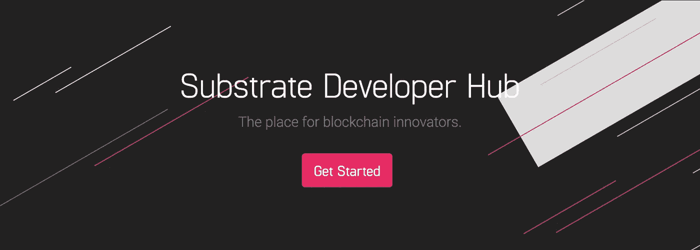

# 捡起铁锈并在波尔卡多特基板上构建 PoC—2/2

> 原文：<https://medium.com/coinmonks/picking-up-rust-and-build-a-poc-on-polkadot-substrate-2-2-fa652de118ae?source=collection_archive---------0----------------------->

*这是我的学习经验系列的第 2/2 部分，学习如何捡起铁锈和衬底来编写 PoC 应用程序。*

*链接更新于 2022 年 1 月 15 日*

[Substrate](https://substrate.io/) 是整个[波尔卡多特生态系统](https://polkadot.network/)更大的保护伞下的一个区块链框架，由 Parity (btw，[他们正在雇佣](https://www.parity.io/jobs/#jobboard)开发！).