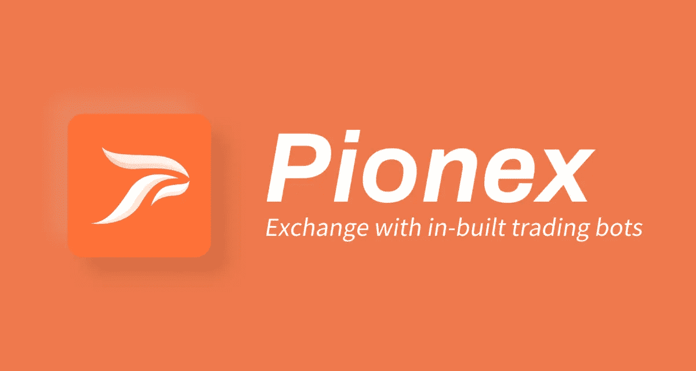
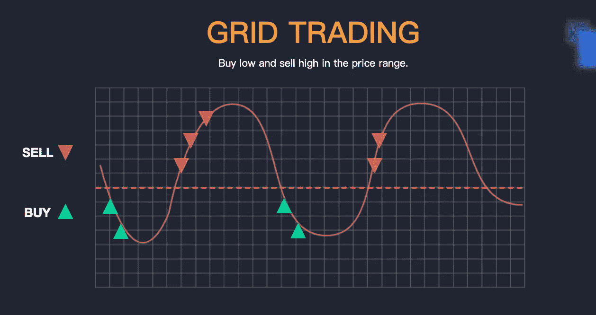
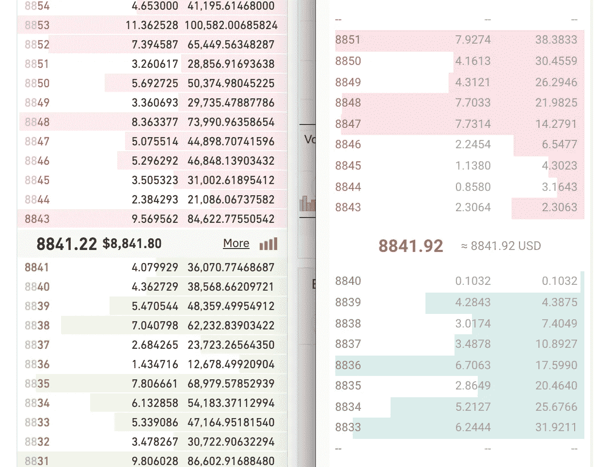
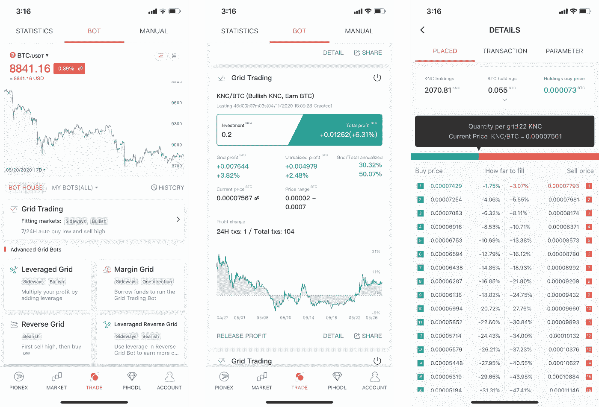
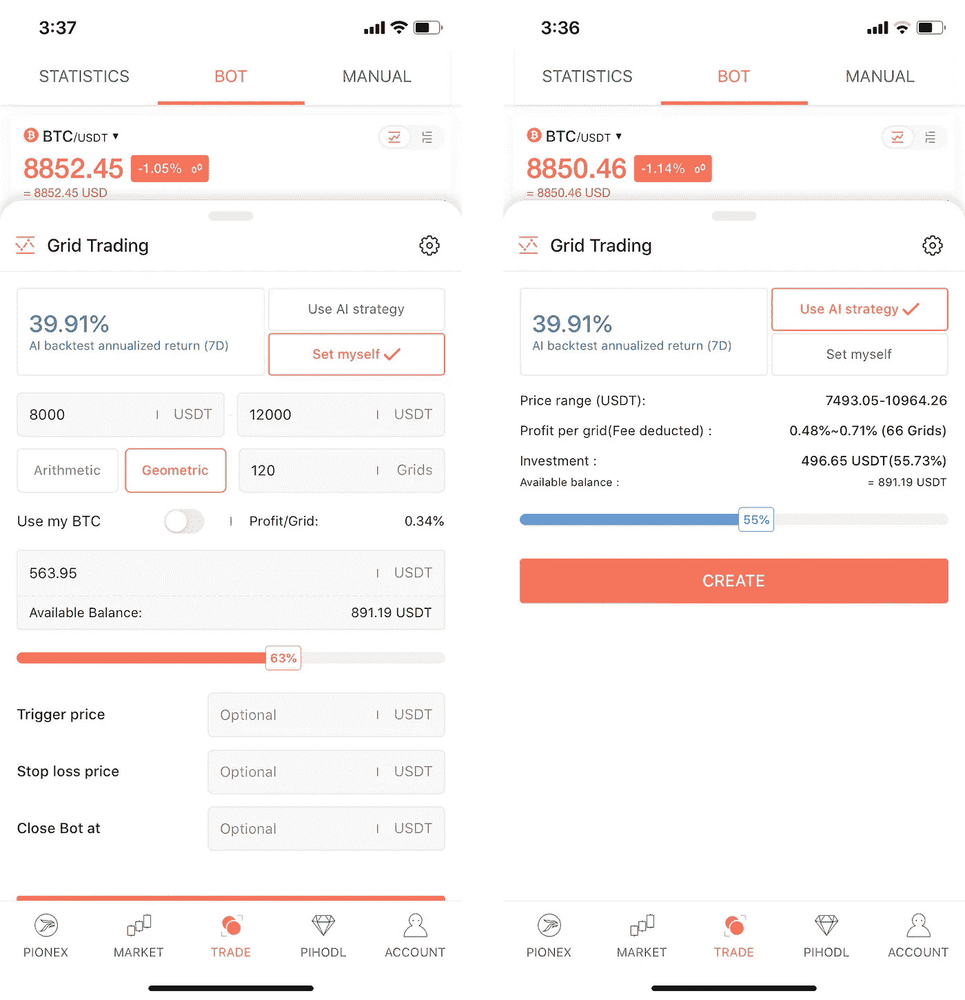
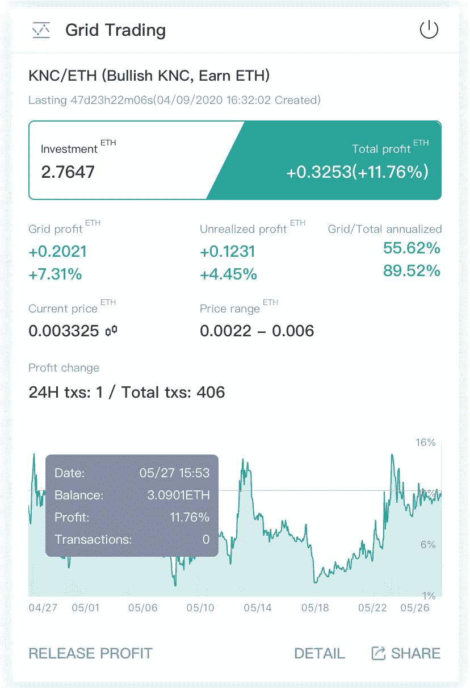

# Pionex 评论 2022 —免费加密交易机器人

> 原文：<https://medium.com/coinmonks/pionex-review-exchange-with-crypto-trading-bot-1e459d0191ea?source=collection_archive---------0----------------------->

## Pionex 是为交易自动化提供工具的后起之秀。Pionex 上提供了 9 个加密交易机器人。阅读 Pionex 及其交易机器人的完整评论

[Pionex](https://coincodecap.com/go/pionex) 为您的加密货币交易提供自动化工具。在本文中，我们将回顾 Pionex 及其交易机器人。

# 概观

[自动交易机器人](/coinmonks/crypto-trading-bot-c2ffce8acb2a)是密码交易员的上升趋势。几个加密交易机器人平台使用 API 密匙让交易者 24*7 执行他们的策略。因此，我们不需要在加密交易机器人的帮助下整天坚持图表。另一方面，尽管越来越多的交易员正在接受自动化交易机器人，但 Pionex 正试图通过集成的交易所，用易于内置的交易机器人来帮助交易员。

> 在 [Pionex](https://coincodecap.com/go/pionex) 上没有月费，他们只收取交易费，因为它也是一个交易所。
> 
> 试试 Pionex [杠杆代币](https://coincodecap.com/leveraged-token)用更少的钱赚更多。然而，更多的利润伴随着更多的风险。

# Pionex 交换概要

*   **内置** [**加密交易机器人**](/coinmonks/crypto-trading-bot-c2ffce8acb2a) —在交易所提供 9 种不同的自动化交易工具。
*   **最低的交易费用** —机器人全部免费，而交易所交易费对制造者和接受者只有 0.05%。
*   **优秀的流动性** —创新的流动性引擎聚合了币安和火币的流动性。
*   **受管制** —受新加坡和美国管制。

# 特征

## 提供 9 个自动交易机器人。(更多马上来！)

GRID Bot — Grid Trading

1.  **网格机器人(GRID Trading Bot)——**网格机器人是几款加密交易机器人中的后起之秀。这是一个古老而强大的交易策略，从波动的市场中获利。你所要做的就是为它设定一个范围，它会帮助你在这个范围内自动“低买高卖”。
2.  **Infinity Grids Bot —** 使用 Grids Bot 时，您可能会错过价格上涨时的趋势利润。这就是无限网格机器人脱颖而出的时候。无限网格机器人类似于网格机器人，但没有上限。它仍然可以帮助你“24*7 低买高卖”，但与 GRID Bot 相比，这部分资金相对较少。
3.  **杠杆式网格机器人—** 将网格机器人与[加密贷款](https://coincodecap.com/category/lend-and-borrow)功能相结合，这就是杠杆式网格机器人的工作原理。整个概念还是和 GRID Bot 一样，但是有了杠杆(高达 3 倍)，你就可以用你的原理赚取更多的利润。但是！杠杆化也意味着有平仓的机会，在使用之前要注意风险。
4.  **保证金电网 Bot —** 类似于杠杆电网 Bot，但担保品不涉及保证金电网 Bot 中的电网 Bot。你也可以选择长或短，而使用保证金网格机器人。
5.  **反向电网 Bot —** 反向电网 Bot 是一个聪明的策略，用电网交易策略增加你的报价金额。它以更高的价格卖出你的[比特币](https://blog.coincodecap.com/a-candid-explanation-of-bitcoin/)，再以更低的价格回购。
6.  **杠杆反向网格 Bot —** 将反向网格 Bot 与加密贷款功能相结合，将获得杠杆反向网格 Bot。与反向网格机器人功能相同，但您可以利用杠杆赚取更多利润。不过，在使用杠杆交易时，要注意平仓的风险。
7.  **DCA Bot(美元成本平均法)——**美元成本平均法是投资密码市场的一种有用策略。您可以为您的 DCA 计划设置期限，机器人会帮助您进行 DCA，而不是手动进行。
8.  **跟踪止盈机器人—** 跟踪止盈是众所周知的策略之一。由于加密货币市场的波动性，使用 TTP 机器人进行倒票既棘手又容易。
9.  TWAP 机器人——如果你是一只鲸鱼，那么你应该熟悉 TWAP 方法。它帮助你在一段时间内积累或出售你的包包。

> [更多**教程**和**感言**在 Pionex 博客](https://medium.com/pionex)

## 流动性聚合引擎

Pionex 是第一家将币安交易所和 Huobi 全球交易所的流动性集合在一起的交易所。

> 在深入探讨这个话题之前，让我们先浏览一下订单簿。

Left: Binance; Right: Pionex

据 Pionex 的 CTO 介绍，Pionex 可以聚合币安和火币 50~60%的订单。因为即使在币安和霍比，订单簿上也有一些假订单。所以不可能从币安和火币中聚合出 100%的全部，只要他们能把假货和其他的区别开来。

但即使币安和火币合并了 60%的流动性，也足以让他们的用户使用 Pionex 上的自动交易机器人。

## 最低交易费用——0.05%

成为币安和霍比做市商的一部分；这就是 Pionex 从这些交易所聚集流动性的方式。作为做市商，Pionex 在币安和 Huobi 上享受非常低的交易费用。**这就是为什么 Pionex 只向他们的用户收取 0.05%的费用，并且仍然可以享受币安和霍比流动性的特权。**

> [Pionex](https://coincodecap.com/go/pionex) 为其用户提供[做市商程序](https://pionex.zendesk.com/hc/en-us/articles/360041226753-Pionex-Market-Maker-Program)。只要你在 Pionex 拥有 10 万美元以上的资产，就可以申请该计划，享受 0%的创客费。

# 如何在 Pionex 上使用网格机器人

Pionex 是第一个将 GRID Bot(网格交易机器人)带入密码世界，并使其为全世界的密码交易者所熟知的公司。**甚至 3Commas、Bitsgap、TradeSanta 等密码交易 bot 平台都遵循**[**Pionex GRID bot**](http://blog.coincodecap.com/go/pionex)**的 UI/UX。**

Use Grid Bot on Pionex App — 1

*   **第 1 步—在您的 Pionex 账户中存入一些资金**
*   **步骤 2 —选择一个交易对并设置网格机器人的参数**

使用网格机器人有两种模式。如果你是网格机器人的新手，你可以使用**人工智能策略**来设置你的网格机器人。你也可以使用**设定自己**模式设定自己的策略。

**网格机器人的“人工智能策略”模式如何工作**

1.  **机器人估计过去七天的硬币波动。**以此为基础，bot 建立通道或区间的上下限，进行内摆交易。
2.  然后，网格机器人将分配给你选择的交易对的金额进行分割。它在选定的通道内设置了一个限价买卖单网格。因此，一旦价格达到高于当前价格的某条线，机器人将卖出 X，在 y 中获利。当价格下降时，它将无限买入 y。以此类推，同时价格保持在通道内。

Use GRID Bot on Pionex App — 2

**网格机器人如何在自我设置模式下工作**

在**自我设定**模式中，您可以独立调整价格范围、网格数量以及它们之间的距离。这些调整将允许你用适当的知识改进策略。当在网格机器人的手动模式下工作时，请记住网格之间的最小**距离必须大于佣金的大小乘以二(买卖费)**以便机器人交易获利。

*   **步骤 3——每天检查表现**

**Pionex** 提供关于网格机器人性能的综合数据。有了网格机器人数据，密码交易者就可以很容易地检查性能。

GRID Bot performance in Pionex

# Pionex 套利机器人——加密套利 VIP 机器人

该平台提供现货期货加密套利机器人。这个加密货币套利机器人使你能够从一项资产在多个市场的差价中获利。此外，这种加密套利机器人提供了相对较高的回报，可能达到 50%，并降低了风险。而且比特币套利机器人在 Pionex 是完全免费使用的。

但是，套利合法吗？答案是，是的，对于任何愿意使用比特币套利机器人进行更安全交易的人来说，这是完全合法的。要了解更多信息，请阅读我们关于 [Pionex 套利机器人](https://coincodecap.com/pionex-arbitrage-bot#h-summary-tl-dr)的指南。

# Pionex 的用户体验—移动优先！

[**Pionex**](https://coincodecap.com/go/pionex) **在所有的加密交易机器人平台中，他们的移动应用程序拥有最好的 UI/UX。**他们总是遵循移动优先的规则，在网站之前发布移动应用上的新功能。在全球最知名的移动性能数据公司 [App Annie](https://www.appannie.com/en/) 上查看他们的应用更新，他们的应用更新了许多新功能。4 月份 6 个版本，5 月份到现在 5 个！

[**下载 Pionex App >**](https://coincodecap.com/go/pionex)

# 性能和安全性

Pionex 交易所背后的团队是 [BitUniverse](https://www.bituniverse.org/) 团队。BitUniverse 是一款一体化的加密自动投资组合和交易机器人应用程序，也是韩国、印度尼西亚和台湾最受欢迎的加密投资组合应用程序。

## **在新加坡和美国受到监管**

Pionex 已获得美国金融犯罪执法网颁发的 MSB(货币服务业务)许可证。币安、火币和多家顶级交易所申请的是同一个牌照。Pionex 是第一家拥有内置交易机器人的加密货币交易所，由美国许可证授予。

# 什么比用 API 密匙连接你的交易机器人更好？

Pionex！大多数币安交易机器人、库币交易机器人或比特币基地交易机器人使用 API 密钥进行连接。然而，使用 Pionex 交易机器人，您可以跳过将其与第三方交易机器人连接的麻烦。此外，就像 Huobi 交易机器人、KuCoin 机器人、Gate.io 的机器人一样，Pionex 也提供内置的交易机器人。

# 结论

如果你是一个喜欢使用加密交易机器人的加密交易者，Pionex 将是你的首选。不要为 API 键和 API 键的不稳定性能而烦恼。转到 Pionex，开始使用其内置的自动化交易机器人。与所有其他交易所相比，[**费用**](https://www.pionex.com/en-US/fees) **是最低的**，这在使用 bot 时为您节省了大量利润。

Pionex 团队认为移动优先，因此网站 UI/UX 的更新可能会比其移动应用程序晚一点。如果你喜欢在桌面上交易，你应该记下这一部分。

如果你是自动化交易机器人的新手，来参观 Pionex 吧！**不必为 bot 服务支付昂贵的订阅费。**Pionex Exchange 上提供了 9 种不同的加密机器人。开始使用它，调整它以适应你的交易风格。

*   *本文包含附属链接*

> 加入 Coinmonks [电报频道](https://t.me/coincodecap)和 [Youtube 频道](https://www.youtube.com/c/coinmonks/videos)获取每日[加密新闻](http://coincodecap.com/)

## 另外，阅读

*   [复制交易](/coinmonks/top-10-crypto-copy-trading-platforms-for-beginners-d0c37c7d698c) | [加密税务软件](/coinmonks/crypto-tax-software-ed4b4810e338)
*   [网格交易](https://coincodecap.com/grid-trading) | [加密硬件钱包](/coinmonks/the-best-cryptocurrency-hardware-wallets-of-2020-e28b1c124069)
*   [最佳加密交易所](/coinmonks/crypto-exchange-dd2f9d6f3769) | [印度最佳加密交易所](/coinmonks/bitcoin-exchange-in-india-7f1fe79715c9)
*   [面向开发人员的最佳加密 API](/coinmonks/best-crypto-apis-for-developers-5efe3a597a9f)
*   最佳[密码借贷平台](/coinmonks/top-5-crypto-lending-platforms-in-2020-that-you-need-to-know-a1b675cec3fa)
*   [杠杆代币的终极指南](/coinmonks/leveraged-token-3f5257808b22)
*   [加密交易的最佳 VPNs】](https://coincodecap.com/best-vpns-for-crypto-trading)
*   [最佳加密分析或链上数据](https://coincodecap.com/blockchain-analytics) | [Bexplus 评论](https://coincodecap.com/bexplus-review)
*   [NFT 十大市场造币集锦](https://coincodecap.com/nft-marketplaces)
*   [AscendEx Staking](https://coincodecap.com/ascendex-staking)|[Bot Ocean Review](https://coincodecap.com/bot-ocean-review)|[最佳比特币钱包](https://coincodecap.com/bitcoin-wallets-india)
*   [Bitget 回顾](https://coincodecap.com/bitget-review)|[Gemini vs block fi](https://coincodecap.com/gemini-vs-blockfi)|[OKEx 期货交易](https://coincodecap.com/okex-futures-trading)