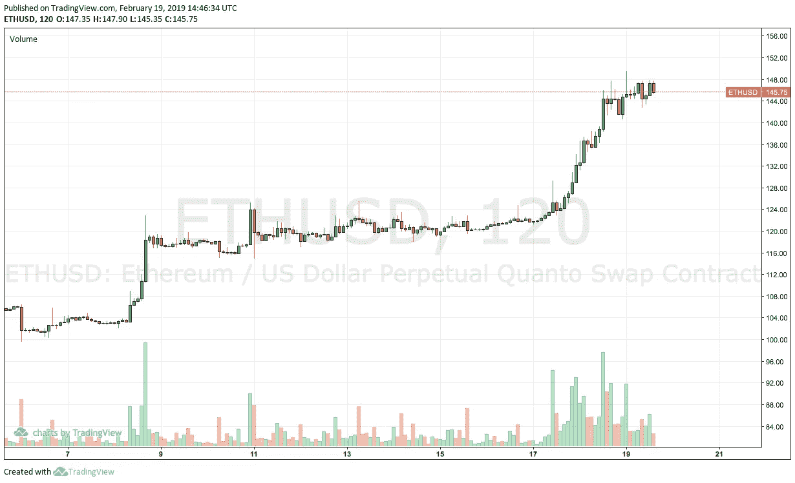

# Python 教程:如何使用 BitMEX API

> 原文：<https://medium.com/coinmonks/pip-install-bitmex-calls-official-lib-code-89b08ceaabf9?source=collection_archive---------0----------------------->



## TL；速度三角形定位法(dead reckoning)

了解如何使用 Python 代码从 [BITMEX](https://coincodecap.com/use-bitmex-in-usa) API 下订单、取消订单以及获取报价。向下滚动到本文的底部，找到最简单文档的链接。

下单和所有其他功能都记录在那里，比普通的 API 文档更容易理解。


This is a screenshot from the swagger.json file

## 关于语法的重要说明

当您在 swagger.json 文件中查找特定函数时，使用 Cmd + F 搜索您需要的函数(即 order)。

找到 operationId 后，使用下面的代码将 operationId 转换为可操作的 API 调用。

总的来说:

```
parentOperation.childOperation
```

变成了:

```
client.parentOperation.parentOperation_childOperation().result()
```

让我们将上面的 operationId 'Order.getOrders '转换成可行的调用。

` ` Order.getOrders `

成为

```
client.Order.Order_getOrders().result()
```

其中 Order 是 parentOperation，getOrders 是 childOperation。

现在，例如，让我们说你希望一次下很多订单。在 swagger.json 文件中搜索“bulk ”,您将找到 Order.newBulk

```
Order.newBulk
```

变成了:

```
client.Order.Order_newBulk().result()
```

这是一个奇怪的语法，所以只需复制/pasta。一定不要忘记。每次调用结束时的 result()。

下面，我将通过几个例子来说明如何使用这个 API。最后，我还将介绍错误和解决方法。

一如既往地感谢“掌声”和任何反馈。

# BitMEX 模块安装

假设你用的是 python3。

## 第一步

安装 bravado

```
sudo pip install bravado
```

## 第二步

```
sudo pip install bitmex
```

# Python 客户端

## Python 客户端认证

创建新的 python 文件。在文件顶部包含以下内容，以实例化客户端。

```
from bitmex import bitmexapi_key = ''
api_secret = ''client = bitmex(test=False, api_key=api_key, api_secret=api_secret)
```

一旦您在空白处填入了 api 键，您的客户端就通过了身份验证，您就可以进行真正的 API 调用了！

## API 调用—下单、挂牌或取消订单

## 下订单(operationId = Order.new)

每当我们想要进行 API 调用时，我们只需在 [swagger.json 文件](https://github.com/BitMEX/api-connectors/blob/master/swagger.json)中寻找相应的操作来进行调用。在 swagger.json 文件中搜索所需的 operationId，在本例中为 Order.new. Then change

```
Order.new
```

到

```
client.Order.Order_new().result()
```

不要忘记在订单中添加一些参数:

```
client.Order.Order_new(symbol='ETHUSD', orderQty=10000, price=390).result()
```

上面的代码将以 390 美元的价格做多 10000 份 ETHUSD 永久掉期合约。不要忘记。结果()。

## 取消订单(订单取消)

如果您想要取消所有订单，操作 id 为 Order.cancelAll。以下是正确的 python 语法:

```
client.Order.Order_cancelAll().result()
```

# 常见错误

## 获取报价时出现禁止的 403 错误

当试图使用 bitmex [自述文件](https://github.com/BitMEX/api-connectors/tree/master/official-http/python-swaggerpy)中规定的报价端点时，您可能会得到一个禁止的 403 异常。以规定的方式获取报价可能会产生以下错误:

```
bravado.exception.HTTPForbidden: 403 Forbidden: <html><head><title>403 Forbidden</title></head><body bgcolor="white"><center><h1>403 Forbidden</h1></center></body></html>
```

但是我们需要一些方法来得到价格。以下是获取 ETHUSD 价格的一种变通方法:

```
import requests, jsonresponse = requests.get("[https://www.bitmex.com/api/v1/orderBook/L2?symbol=eth&depth=1](https://www.bitmex.com/api/v1/orderBook/L2?symbol=eth&depth=1)").json()ether_ask_price = response[0]['price']ether_bid_price = response[1]['price']print ether_ask_price
print ether_bid_price
```

> 加入 Coinmonks [电报频道](https://t.me/coincodecap)和 [Youtube 频道](https://www.youtube.com/c/coinmonks/videos)获取每日[加密新闻](http://coincodecap.com/)

## 另外，阅读

*   [复制交易](/coinmonks/top-10-crypto-copy-trading-platforms-for-beginners-d0c37c7d698c) | [加密税务软件](/coinmonks/crypto-tax-software-ed4b4810e338)
*   [网格交易](https://coincodecap.com/grid-trading) | [加密硬件钱包](/coinmonks/the-best-cryptocurrency-hardware-wallets-of-2020-e28b1c124069)
*   [密码电报信号](/coinmonks/top-3-telegram-channels-for-crypto-traders-in-2021-8385f4411ff4) | [密码交易机器人](/coinmonks/crypto-trading-bot-c2ffce8acb2a)
*   [币安 vs Bitstamp](https://coincodecap.com/binance-vs-bitstamp)|[bit panda vs 比特币基地 vs Coinsbit](https://coincodecap.com/bitpanda-coinbase-coinsbit)
*   [如何购买 Ripple (XRP)](https://coincodecap.com/buy-ripple-india) | [非洲最好的加密交易所](https://coincodecap.com/crypto-exchange-africa)
*   [非洲最佳密码交易所](https://coincodecap.com/crypto-exchange-africa) | [晤交易所评论](https://coincodecap.com/hoo-exchange-review)
*   [eToro vs robin hood](https://coincodecap.com/etoro-robinhood)|[MoonXBT vs by bit vs Bityard](https://coincodecap.com/bybit-bityard-moonxbt)
*   [有哪些交易信号？](https://coincodecap.com/trading-signal) | [比特斯坦普 vs 比特币基地](https://coincodecap.com/bitstamp-coinbase)
*   [最佳加密交易所](/coinmonks/crypto-exchange-dd2f9d6f3769) | [印度最佳加密交易所](/coinmonks/bitcoin-exchange-in-india-7f1fe79715c9)
*   [开发者最佳加密 API](/coinmonks/best-crypto-apis-for-developers-5efe3a597a9f)
*   最佳[密码借贷平台](/coinmonks/top-5-crypto-lending-platforms-in-2020-that-you-need-to-know-a1b675cec3fa)
*   [杠杆代币终极指南](/coinmonks/leveraged-token-3f5257808b22)