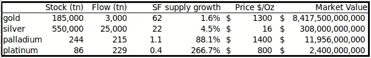

# PlanB 从库存到流动的假人

> 原文：<https://medium.com/coinmonks/planb-stock-to-flow-for-dummies-cfd0c74db99e?source=collection_archive---------2----------------------->

# 介绍

[PlanB](https://twitter.com/100trillionUSD) 是一位荷兰投资者，以其对法律和量化金融主题的深入了解而闻名。PlanB 在加密社区中是众所周知的。他创造了一个引人入胜的模型，叫做“ [**库存到流量**](/@100trillionUSD/modeling-bitcoins-value-with-scarcity-91fa0fc03e25)’(STF)模型。这个模型利用比特币的稀缺性来解释比特币的价值。让我们一起试着弄清楚这到底是怎么回事，好吗？

# 稀缺性和库存到流量

比特币是第一个可以作为货币使用的**数字对象**。比特币是稀缺的，因为我们知道比特币的最大供应量为 2100 万枚硬币。很难获得新的比特币，就像在地下深处开采黄金一样。就此而言，黄金和比特币都很难获得。你必须投资金钱来获得黄金或比特币。

比特币可以通过‘捐赠’计算能力来获得。称为节点的快速服务器可以做到这一点。它们为这项任务进行了优化。这些节点有助于保护比特币网络，并在**块**链上连接填充有交易规范的**块**。作为奖励，这些节点将获得比特币。因此，我们可以假设它很难获得，对吗？
我们把这个过程叫做[工作证明](https://en.wikipedia.org/wiki/Proof_of_work#:~:text=Proof%20of%20work%20(PoW)%20is,minimal%20effort%20on%20their%20part.) (PoW)。像美元这样的法定货币没有这些东西。可以直接打印出来。它也很容易伪造。一点都不稀缺。

**SF = STOCK / FLOW** 我们已经确定比特币非常难以获得。实际上，加倍努力获取更多比特币甚至不会奏效，因为网络会自动增加获取新比特币的难度。无论如何，我们将根据比特币的新增年产量来衡量当前的比特币存量**。(stock - > flow)高比率表示更稀缺。稀缺性越强，价值越高。**

> 大约在 2022 年，比特币的存量-流量比将超过黄金的存量-流量比！

Stock-to-flow ratio for gold, silver, palladium, and platinum.

生产目前的黄金储备需要 62 年。白银需要 22 年，而铂金似乎是最容易生产的。

比特币有 1880 万个硬币的存量。每天大约有 900 个比特币被挖掘出来。这相当于每年 328.500 个比特币。我们可以确定 **SF = 57.2。这使得比特币的排名仅次于黄金。**

**Halvings**
每四年，新比特币的创造量就会减半。我们称这些事件为“比特币减半”。显然，这些减少对于存货与流动比率来说是非常重要的。SF 会因为这些减半而增加！随着货币通货膨胀的降低，价格也会下降。

# 价值影响

我们确定稀缺性，用 **SF 衡量，**影响价值。多年来比特币的价格图表实际上表明这一理论是正确的。价值往往更高。很酷吧？这家伙可能发现了什么！

PlanB 的下一步是根据 SF 值创建一个模型。他使用以下数据建立了一个模型:

*   比特币每月 SF 比率
*   每月流入经济体的新比特币数量
*   丢失硬币的更正。前 100 万枚硬币不予考虑。
*   历史比特币价格数据
*   黄金和白银数据

结果令人兴奋:

Charts made with gnuplot and gnumerics by PlanB

**关系**黄金、白银和比特币。这是由随机性引起的几率接近于零。主导价格的影响似乎是 SF 比率。当然，其他因素也会影响比特币的价格，比如黑客攻击、新闻、监管等。但这些影响都很小。

此外，观察黄金、白银和比特币之间的相似之处。这些其实印证了这个模型。

# 比特币 SF 模型

[PlanB](https://twitter.com/100trillionUSD) 还做了一个直接可视化的比特币价格对 SF 比率的模型。结果似乎是一样的。这张图表最近被上传到了 [PlanB](https://twitter.com/100trillionUSD) 的推特上。

2021–2022 predications regarding Bitcoin and SF ratio

# 幂律和分形

幂律是两个量之间的关系。在这种情况下，幂律告诉我们，当比特币减半时，比特币的价值会增加 10 倍。在减半事件中，SF 翻倍。所以，这三个量之间是有关系的。

> 幂律很有趣，因为它们揭示了看似随机的复杂系统的潜在规律性。

**跟随 PlanB:**[**PlanB @ 100 trillion USD**](https://twitter.com/100trillionUSD)**或**[**PlanBTC.com**](http://planbtc.com/)

# 确认

PlanB 没有写这篇文章。原文[可以在这里](/@100trillionUSD/modeling-bitcoins-value-with-scarcity-91fa0fc03e25)找到。我重写了文章《傻瓜的秘密》,使它更容易阅读。

# 欣赏

如果你喜欢这篇文章，表明你的欣赏。这会让我看到我的文章是否有趣，是否被需要。你可以通过喜欢这篇文章或者在 [Twitter](https://twitter.com/Jaap_NL_) 或 [Medium](/@jaapsh) 上关注我。谢谢！

# 我也在推特上:-)

在推特上关注我:[https://twitter.com/Jaap_NL_](https://twitter.com/Jaap_NL_)

> 加入 Coinmonks [电报频道](https://t.me/coincodecap)和 [Youtube 频道](https://www.youtube.com/channel/UCbyDhTbOiKh2iUMKBi4-4Zg)了解加密交易和投资

## 另外，阅读

*   [尤霍德勒 vs 科恩洛 vs 霍德诺特](/coinmonks/youhodler-vs-coinloan-vs-hodlnaut-b1050acde55a) | [Cryptohopper vs 哈斯博特](https://blog.coincodecap.com/cryptohopper-vs-haasbot)
*   [币安 vs 北海巨妖](https://blog.coincodecap.com/binance-vs-kraken) | [美元成本平均交易机器人](https://blog.coincodecap.com/pionex-dca-bot)
*   [如何在印度购买比特币？](/coinmonks/buy-bitcoin-in-india-feb50ddfef94) | [WazirX 评论](/coinmonks/wazirx-review-5c811b074f5b) | [BitMEX 评论](https://blog.coincodecap.com/bitmex-review)
*   [比特币主根](https://blog.coincodecap.com/bitcoin-taproot) | [Bitso 点评](https://blog.coincodecap.com/bitso-review) | [排名前 6 的比特币信用卡](/coinmonks/bitcoin-credit-card-bc8ab6f377c6)
*   [双子座 vs 比特币基地](https://blog.coincodecap.com/gemini-vs-coinbase) | [比特币基地 vs 北海巨妖](https://blog.coincodecap.com/kraken-vs-coinbase)|[coin jar vs coin spot](https://blog.coincodecap.com/coinspot-vs-coinjar)
*   [印度密码交易所](/coinmonks/bitcoin-exchange-in-india-7f1fe79715c9) | [比特币储蓄账户](/coinmonks/bitcoin-savings-account-e65b13f92451) | [Paxful 审核](/coinmonks/paxful-review-4daf2354ab70)
*   [我的密码交易经验](/coinmonks/my-experience-with-crypto-copy-trading-d6feb2ce3ac5) | [比特币基地评论](/coinmonks/coinbase-review-6ef4e0f56064)
*   [CoinFLEX 评论](https://blog.coincodecap.com/coinflex-review) | [AEX 交易所评论](https://blog.coincodecap.com/aex-exchange-review) | [UPbit 评论](https://blog.coincodecap.com/upbit-review)
*   [AscendEx 保证金交易](https://blog.coincodecap.com/ascendex-margin-trading) | [Bitfinex 赌注](https://blog.coincodecap.com/bitfinex-staking) | [bitFlyer 点评](https://blog.coincodecap.com/bitflyer-review)
*   [麻雀交换评论](https://blog.coincodecap.com/sparrow-exchange-review) | [纳什交换评论](https://blog.coincodecap.com/nash-exchange-review)
*   [加密货币储蓄账户](/coinmonks/cryptocurrency-savings-accounts-be3bc0feffbf) | [赌注加密](https://blog.coincodecap.com/staking-crypto) | [加密交易机器人](https://blog.coincodecap.com/best-crypto-trading-bots)
*   [BigONE 交易所评论](/coinmonks/bigone-exchange-review-64705d85a1d4) | [CEX。IO 审查](https://blog.coincodecap.com/cex-io-review) | [交换区审查](/coinmonks/swapzone-review-crypto-exchange-data-aggregator-e0ad78e55ed7)
*   [最佳比特币保证金交易](/coinmonks/bitcoin-margin-trading-exchange-bcbfcbf7b8e3) | [比特币保证金交易](https://blog.coincodecap.com/bityard-margin-trading)
*   [加密保证金交易交易所](/coinmonks/crypto-margin-trading-exchanges-428b1f7ad108) | [赚取比特币](/coinmonks/earn-bitcoin-6e8bd3c592d9) | [Mudrex 投资](https://blog.coincodecap.com/mudrex-invest-review-the-best-way-to-invest-in-crypto)
*   [WazirX vs coin dcx vs bit bns](/coinmonks/wazirx-vs-coindcx-vs-bitbns-149f4f19a2f1)|[block fi vs coin loan vs Nexo](/coinmonks/blockfi-vs-coinloan-vs-nexo-cb624635230d)