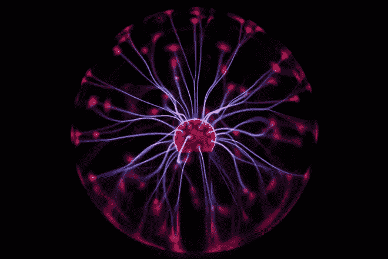
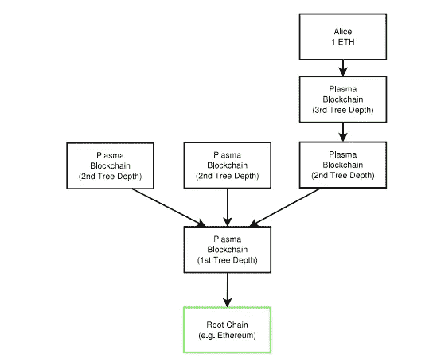
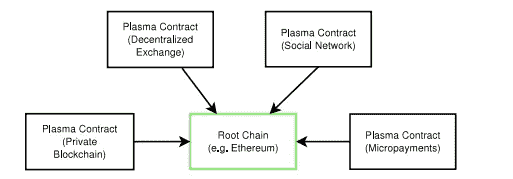
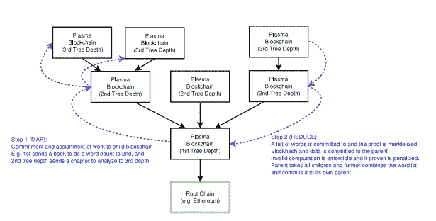

# 等离子体—第 2 层缩放协议

> 原文：<https://medium.com/coinmonks/plasma-layer-2-scaling-protocol-5a1263d86bc8?source=collection_archive---------9----------------------->

[https://www.investopedia.com/news/what-plasma-and-how-will-it-strengthen-ethereum-blockchain/](https://www.investopedia.com/news/what-plasma-and-how-will-it-strengthen-ethereum-blockchain/)

以太坊缩放问题在过去几周已经成为一个广为谈论的话题。去年是[隐猫](https://www.coindesk.com/cat-fight-ethereum-users-clash-cryptokitties-congestion/)。这一次，我第一次听说这是一次交易。每个人都在推动以太坊尽早解决缩放问题。等离子体是为数不多的结垢解决方案之一。本文简要介绍等离子体的概念。

**什么是血浆？？**

许多人说，未来在于保持以太坊的准确性和完整性，并将交易开销转移到不同的水平。约瑟夫·卢宾称之为以太坊的“第二阶段”。等离子体是一种第二层扩展协议，由 Joseph Poon 和 Vitalik Buterin 在 2017 年 8 月的一篇论文中首次提出。这是一种以高度可伸缩的方式进行链外交易的技术。它与国家频道和 Truebit 站在一起。

这个想法是让许多链指向父链(mainnet)。这些链称为子链。子链还可以派生出更多的子链。这就像区块链的区块链。这些链本身可以作为独立的区块链运行，只是间歇性地更新到父链(如果需要)。他们可以有自己的共识机制(耶！！再也没有工作证明了！).

Plasma Whitepaper — Plasma tree structure

第一次看等离子(如果实施得当)，将降低交易费用(与主链相比低得多！)和更快的执行速度。这将是每秒数百万次交易。

**是如何实现的？**

基本上，有等离子根链是使用智能合同在主区块链创建的。智能合同强制执行根血浆链的利益证明协议。该根链连接到主链，并在某些情况下定期更新到主链，如提款、争议或提交给根链的欺诈证据。

Plasma Whitepaper — Smart contracts on root chain

智能合同将包含子链的规则、子链的状态散列，它们有助于从主链到子链的资产交换。一旦血浆链建立，用户可以在血浆链上部署更多独立于主链的智能合同，并像在主链上一样进行常规交易。智能合约的全部细节不必在主链上提供。在此之前，任何人开始在等离子体链上交易，他们必须将主链上的资产转移或转换到等离子体链上。

等离子出口是关键的安全特征之一。各方可以随时撤回他们的资金和资产回到主链。可能会有大规模退出或个人退出。退出遵循挑战期协议，该协议类似于闪电网络中的协议。任何人甚至可以监控血浆链，并向主链提交欺诈证明。如果证明有欺诈行为，该冻结的发行者将受到处罚。欺诈证据甚至可以提交给母血浆链，如果不能解决，可以提交给更高层次的链，最终导致主链。最糟糕的事情是整个血浆链受到损害。即使在这种情况下，血浆链可以在主链上进行大规模退出和撤回。

**等离子体的设计目标**

1.  一个区块链来统治他们
2.  信任最小化
3.  分类帐可扩展性
4.  子链应该是可伸缩的
5.  本地化计算
6.  欺诈证据
7.  每个链条都是独一无二的

**技术细节**

Plasma 基于 MapReduce 的概念。一个非常著名的框架，在大部分处理大数据集的工作中使用。这是一个两阶段的方法:

*   map 阶段发布数据承诺。
*   返回结果时，Reduce 阶段包括状态转换的 merkle 化证明。

Plasma whitepaper — How Plasma makes use of MapReduce

**好处**

*   更大的数据集也许是可能的
*   复杂和计算密集型事务可以在等离子体链上执行。
*   费用可以低很多。更快的确认。
*   在主链上节省电力和内存。
*   兼容其他链上解决方案，如分片、块大小等。
*   以太坊中的许多计算限制在各自的等离子体链中消失了。
*   争议解决。
*   预先设计的出口。
*   移动到其他区块以防欺诈。

**一如既往，有哪些问题？**

*   子血浆链中的大量出口可能导致主网络拥塞，并导致挑战期的延迟。
*   如果没有人监控血浆链，就没有提交欺诈证据的余地。
*   主链上的交易关闭，甚至在血浆链上的交易关闭之前。
*   根链受到 51%的攻击，这将影响整个等离子链生态系统。
*   如果父链出现问题并停止生成块，子链负责修复父链。
*   一旦建立了共识，改变它将是非常困难的。您必须退出等离子体链，并将功能转移到另一个等离子体链。

**区块链实施等离子协议的例子**

*   宇宙/波尔卡多特
*   OMI sego——分散式交易所，货币不可知

**参考文献**

1.  [http://plasma.io/plasma.pdf](http://plasma.io/plasma.pdf)
2.  [https://medium . com/@ argon group/ether eum-plasma-explained-608720 d3c 60e](/@argongroup/ethereum-plasma-explained-608720d3c60e)
3.  [https://medium . com/chain-cloud-company-blog/plasma-in-10-minutes-c 856 da 94 e 339](/chain-cloud-company-blog/plasma-in-10-minutes-c856da94e339)
4.  [https://www . coin desk . com/斯坦福-大学-发射-新-区块链-研究-中心/](https://www.coindesk.com/stanford-university-launches-new-blockchain-research-center/)
5.  [https://block geeks . com/guides/what-is-omis ego-the-plasma-protocol/](https://blockgeeks.com/guides/what-is-omisego-the-plasma-protocol/)
6.  [https://medium . com/@ robertgreenfieldiv/simplicating-the-plasma-white paper-3b 8 a4 be 2 BC 57](/@robertgreenfieldiv/simplifying-the-plasma-whitepaper-3b8a4be2bc57)
7.  [https://medium . com/@ Collin . cusce/why-business-needs-ether eum-plasma-now-scaling-problems-pt-1-8d 6186438 b5](/@collin.cusce/why-business-needs-ethereum-plasma-now-scaling-problems-pt-1-8d6186438b5)
8.  [https://medium . com/@ Collin . cusce/why-business-needs-ether eum-plasma-now-how-it-works-key-components-pt-2-37a 82737 CD 54](/@collin.cusce/why-business-needs-ethereum-plasma-now-how-it-works-key-components-pt-2-37a82737cd54)
9.  [https://medium . com/@ Collin . cusce/why-business-needs-ether eum-plasma-now-what-it-enables-pt-3-CB 340654 e 96 f](/@collin.cusce/why-business-needs-ethereum-plasma-now-what-it-enables-pt-3-cb340654e96f)
10.  [https://coin central . com/2018/07/07/plasma-an-innovative-framework-to-scale-ether eum/](https://coincentral.com/2018/07/07/plasma-an-innovative-framework-to-scale-ethereum/)