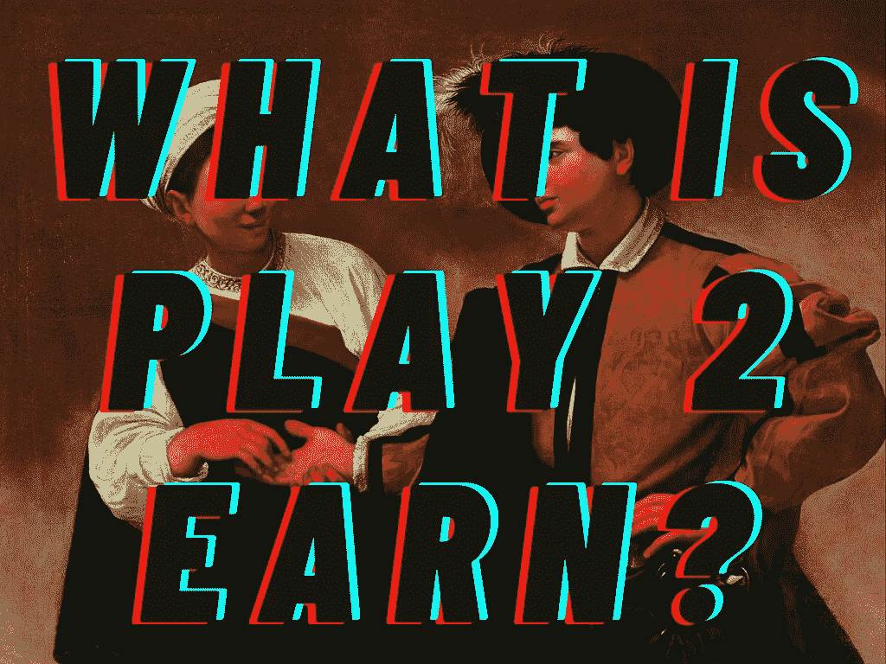
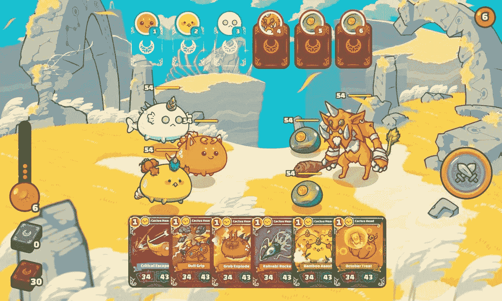
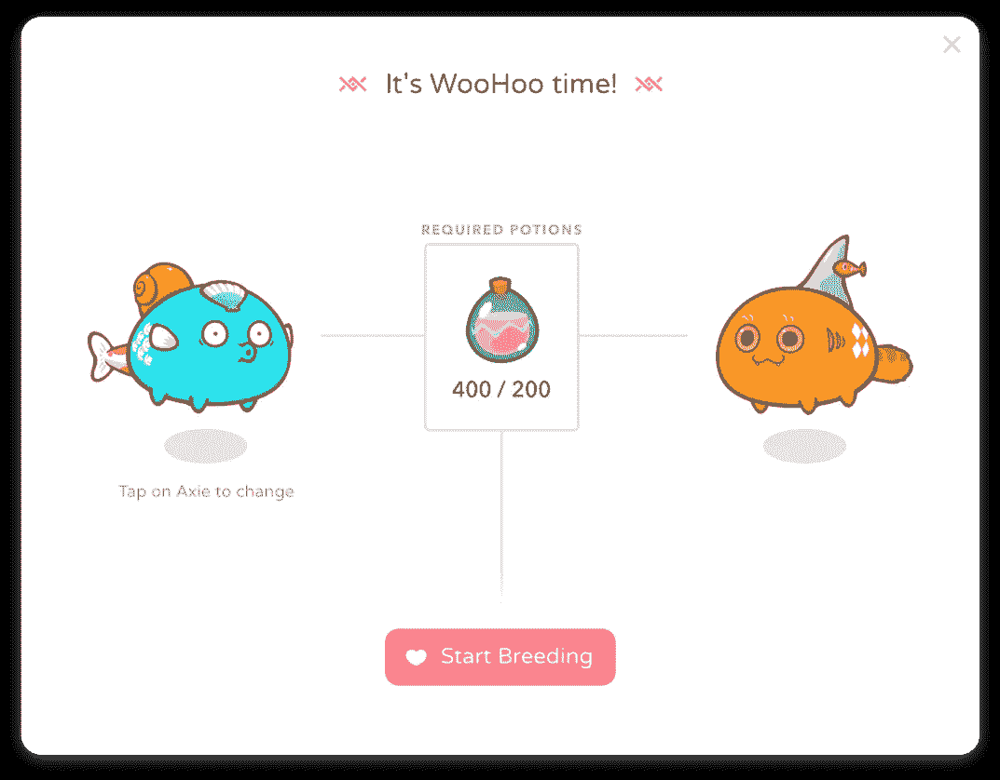
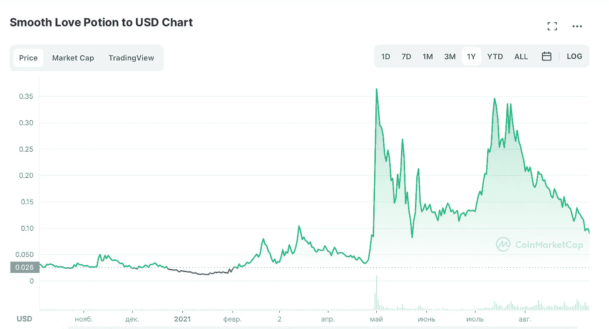
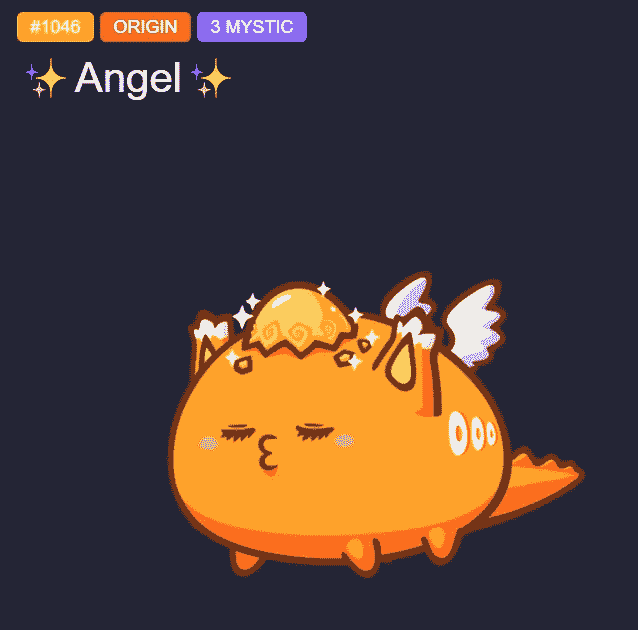
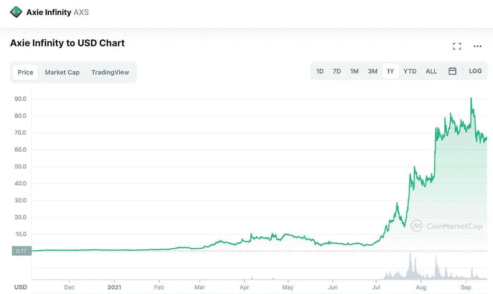
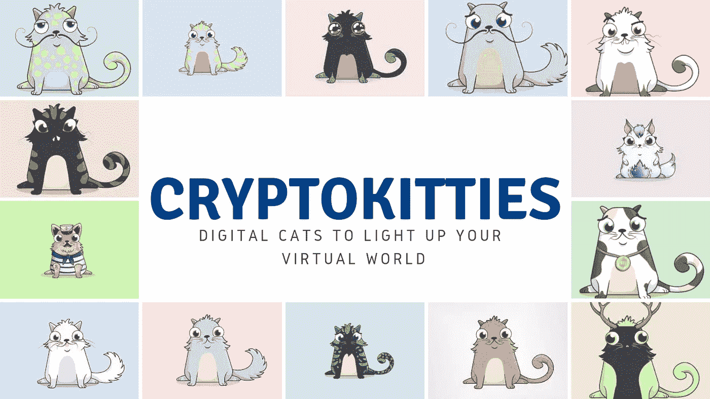
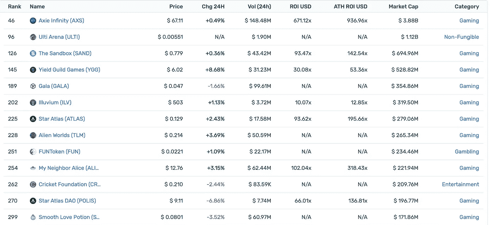

# Play 2 Earn:密码市场的新趋势

> 原文：<https://medium.com/coinmonks/play-2-earn-a-new-trend-on-the-crypto-market-6507461e5bc6?source=collection_archive---------3----------------------->

What is Play To Earn?

近年来，博彩业以前所未有的速度发展。高额利润吸引了新的开发商，竞争加剧，刺激了行业增长。尽管如此，游戏的经济模式仍然是一个问题，它同时适合玩家和开发者。

如今出现了一种新的非常有前途的模式，它被称为**即玩即赚(Play2Earn)** 。

由于我从我的[推特粉丝](https://twitter.com/SERGOMOSCOW)和与我一起工作的客户[那里得到了许多关于它的问题，我想向你提供这个模型的简短概述，这样你可以在早期阶段使用这些信息在未来赚取一些利润。尽管如此，不要忘记做你自己的研究。](https://x10.agency/)

以前，游戏只被视为一种娱乐方式。但是现在，一种新的游戏正在出现，它不仅有趣，而且是一种有吸引力的投资。

最近，像 Axie Infinity 和沙盒 T9 这样的游戏越来越受欢迎。复杂的经济体系将他们与经典游戏联系在一起。

Axie Infinity (Play2Earn game)

例如，在《模拟人生》中，你可以用一种特殊的货币，西蒙利昂，购买从比萨饼到房子的任何东西。但是没有游戏中的货币有真实价值。根本就没有流动性，也没有让这种流动性出现的基础设施。尽管如此，对这种流动性的需求总是存在的。

像《魔兽世界》这样的游戏已经涌现出一个游戏内物品和角色交换的灰色市场。这是一个完全混乱无序的市场。自由行动模式是一种满足上述流动性需求的决策。

## 那么 Play 2 赚游戏是如何运作的，它们的目的是什么？

最好用一些例子来解释游戏赚钱的经济模式。

这个方向的领导者是 Axie Infinity，这是一款由越南开发商 Sky Mavis 开发的神奇宝贝风格的游戏。它拥有大约 100 万的日活跃用户。游戏的主角是可爱的毛茸茸的动物，叫做 Axies。用户可以繁殖它们，购买和训练它们，在它们的帮助下完成任务，进行战斗。目标是得到小爱药水(SLP)。使用 SLP 球员可以创造新的轴，并获得更多的优势。

SLP, Axie Infinity

同时，SLP 是一种加密货币，可以在加密交易所买卖。据报道，尽管 SLP 的汇率在不断变化，但顶级玩家每天从他们的轴上赚 1,500 SLPs(在写这篇文章的时候相当于 270 美元)。自 2020 年以来，加密货币的价值一直在上升。值得注意的是，在“赚取游戏”模式中，货币的价值取决于需要它的玩家数量。

SLP token price

Axie 本身可以在专门的市场上作为 NFT 出售。我想提醒你的是，[NFT(不可替代代币)](https://hackernoon.com/the-ultimate-guide-to-nft-marketing-and-promotion-2jl33ky)是区块链的数字收藏品，最近在艺术界大受欢迎。该游戏不仅允许你出售 Axie，还允许你出售游戏中的任何物品——房地产、鲜花和其他物品。交易在以太坊区块链进行。

# 如何开始您的 Play 2 收入之旅

例如，要开始玩 Axie Infinity，你需要购买(或借用)三个 Axie。定价从 190 美元起，尽管平均价格在 350 美元左右。高等级角色花费更多。

最贵的名为 Angel 的三重神秘 Axie 在 2020 年底售出，售价 300 ETH(当时约合 12 万美元)。与此同时，2021 年初，这款游戏中的另一处房产以 150 万美元购入。所有 Axie Infinity NFTs 的月交易量约为 1.7 亿美元。

Angel Axie

还有一种加密货币与游戏有关。它被称为轴无限碎片(AXS)。AXS 的投资者可以对游戏生态系统的治理进行投票，也可以用它来获得社区金库的股份。最近，AXS 的发展速度令人印象深刻。最近几周，人民币升值逾 6 倍。

AXS token price

在这里，我想回到“赚到就玩”的游戏与老式经济模式的比较，比如《魔兽世界》中的模式。Axie Infinity 提供了一种舒适合法的买卖游戏资产的方式，而不是不受控制的、灰色的、无关联的交易。这是一个双赢的局面，这一点很重要——玩家可以在没有被禁或被骗风险的情况下进行交易，而开发商则获得了运营基础设施的所有利润。

# 更多玩 2 赚游戏

除了 Axie Infinity 之外，还有另一个流行的“玩到赚”游戏，它已经聚集了一整个社区的粉丝。

是关于[隐猫](https://www.cryptokitties.co/)的。在这个游戏中，数码猫是主要的价值:它们被购买，繁殖，并出售以太坊。这些猫是 NFT，不仅是开发者的财富来源，也是社区的财富来源。目前最贵的加密小猫叫做 Dragon，售价为 ETH600(约合 17 万美元)。

CryptoKitties Play2Earn

“玩赚”游戏还创建了玩家和创作者可以见面、分享智慧和达成交易的社区。一个很好的例子是沙盒，类似于《我的世界》。玩家可以在那里创造物品并以 NFT 的形式交换。

The Sandbox Play2Earn

这个游戏的经济模型是基于它自己的加密货币，沙子。赚取沙子的方法之一是出售数字房地产(土地)，玩家可以在店面中展示这些房地产，与其他用户分享他们的经验。据沙盒报道，仅在今年 2 月，就有多达 2352 块土地被出售，总价值为 280 万美元。

同样重要的是要注意到，大品牌看到了成为这个不断增长的市场的一部分的潜力。比如《行尸走肉》特许经营即将登陆平台。用户将能够访问游戏中的僵尸世界，根据沙盒的说法，这是朝着创建“虚拟游乐园”迈出的一步。像这样的品牌可能会吸引更广泛的受众到平台上。

# 那么 Play2Earn 是什么呢？

总而言之:游戏赚钱的经济模式让玩家创造新的数字资产，并通过游戏的基础设施进行交易。

更重要的是，在游戏中使用“玩赚”模式，玩家可以赚取虚拟的游戏内货币，这种货币是流动的，可以很容易地出售给其他加密货币和法定货币。

如今这种新的游戏市场模式刚刚兴起，但看起来会流行很久。过去，许多游戏支持在线社区，但是通过增加产生财务收益的能力，玩赚游戏可以使社区更加活跃。

正如我所说，这种趋势才刚刚开始，我认为关注游戏赚钱项目可能对你有益。

和往常一样，不要忘记做自己的研究。

***如果你想了解密码和 NFT 行业的最新动态和研究，想参加不同的密码比赛和活动——***[***在 Twitter 上关注我。***](https://twitter.com/SERGOMOSCOW?ref=hackernoon.com)

***在此期间，如果你对 crypto 有任何疑问或者你是 Crypto / DeFi / NFT 项目，想了解更多关于*** [***如何推广你的项目***](https://x10.agency/) ***，你可以随时通过*** [***电报***](https://t.me/baloyan) 联系我

## 查看我以前的文章:

*   [**如何免费创建和铸造您的第一个 NFT(不可替换的代币)**](/coinmonks/how-to-create-and-mint-your-first-nft-non-fungible-token-for-free-e99e375ffe86?source=user_profile---------0----------------------------)
*   [**NFT 营销推广终极指南**](/coinmonks/the-ultimate-guide-to-nft-marketing-and-promotion-b13c9b02aa3d?source=user_profile---------1----------------------------)
*   [**2021 年密码行业 6 大预测(无交易)**](/coinmonks/6-predictions-for-crypto-industry-in-2021-without-trading-9d9f5ff32f8a?source=user_profile---------2----------------------------)

> 加入 Coinmonks [电报频道](https://t.me/coincodecap)和 [Youtube 频道](https://www.youtube.com/channel/UCbyDhTbOiKh2iUMKBi4-4Zg)了解加密交易和投资

## 另外，阅读

*   [网格交易机器人](https://blog.coincodecap.com/grid-trading) | [Cryptohopper 审查](/coinmonks/cryptohopper-review-a388ff5bae88) | [Bexplus 审查](https://blog.coincodecap.com/bexplus-review)
*   [加密复制交易平台](/coinmonks/top-10-crypto-copy-trading-platforms-for-beginners-d0c37c7d698c) | [如何在 WazirX 上购买比特币](/coinmonks/buy-bitcoin-on-wazirx-2d12b7989af1)
*   [CoinLoan 点评](https://blog.coincodecap.com/coinloan-review)|[Crypto.com 点评](/coinmonks/crypto-com-review-f143dca1f74c) | [火币保证金交易](/coinmonks/huobi-margin-trading-b3b06cdc1519)
*   [Bookmap 评论](https://blog.coincodecap.com/bookmap-review-2021-best-trading-software) | [美国 5 大最佳加密交易所](https://blog.coincodecap.com/crypto-exchange-usa)
*   [如何在 FTX 交易所交易期货](https://blog.coincodecap.com/ftx-futures-trading) | [OKEx vs 币安](https://blog.coincodecap.com/okex-vs-binance)
*   [OKEx vs KuCoin](https://blog.coincodecap.com/okex-kucoin) | [摄氏替代度](https://blog.coincodecap.com/celsius-alternatives) | [如何购买 VeChain](https://blog.coincodecap.com/buy-vechain)
*   [币安期货交易](https://blog.coincodecap.com/binance-futures-trading)|[3 commas vs Mudrex vs eToro](https://blog.coincodecap.com/mudrex-3commas-etoro)
*   [如何购买 Monero](https://blog.coincodecap.com/buy-monero) | [IDEX 评论](https://blog.coincodecap.com/idex-review) | [BitKan 交易机器人](https://blog.coincodecap.com/bitkan-trading-bot)
*   [尤霍德勒 vs 科恩洛 vs 霍德诺特](/coinmonks/youhodler-vs-coinloan-vs-hodlnaut-b1050acde55a) | [Cryptohopper vs 哈斯博特](https://blog.coincodecap.com/cryptohopper-vs-haasbot)
*   [顶级付费加密货币和区块链课程](https://blog.coincodecap.com/blockchain-courses) | [币安评论](/coinmonks/binance-review-ee10d3bf3b6e)
*   [MXC 交易所评论](/coinmonks/mxc-exchange-review-3af0ec1cba8c) | [Pionex vs 币安](https://blog.coincodecap.com/pionex-vs-binance) | [Pionex 套利机器人](https://blog.coincodecap.com/pionex-arbitrage-bot)
*   [如何在印度购买比特币？](/coinmonks/buy-bitcoin-in-india-feb50ddfef94) | [WazirX 评论](/coinmonks/wazirx-review-5c811b074f5b) | [BitMEX 评论](https://blog.coincodecap.com/bitmex-review)
*   [印度的加密交易所](/coinmonks/bitcoin-exchange-in-india-7f1fe79715c9) | [比特币储蓄账户](/coinmonks/bitcoin-savings-account-e65b13f92451) | [HitBTC 审查](/coinmonks/hitbtc-review-c5143c5d53c2)
*   [币安费用](/coinmonks/binance-fees-8588ec17965) | [Botcrypto 审核](/coinmonks/botcrypto-review-2021-build-your-own-trading-bot-coincodecap-6b8332d736c7) | [Hotbit 审核](/coinmonks/hotbit-review-cd5bec41dafb) | [KuCoin 审核](https://blog.coincodecap.com/kucoin-review)
*   [我的加密副本交易经验](/coinmonks/my-experience-with-crypto-copy-trading-d6feb2ce3ac5) | [AAX 交易所评论](/coinmonks/aax-exchange-review-2021-67c5ea09330c)
*   [Bybit 融资融券交易](/coinmonks/bybit-margin-trading-e5071676244e) | [币安融资融券交易](/coinmonks/binance-margin-trading-c9eb5e9d2116) | [Overbit 审核](/coinmonks/overbit-review-9446ed4f2188)
*   [有哪些交易信号？](https://blog.coincodecap.com/trading-signal) | [比特斯坦普 vs 比特币基地](https://blog.coincodecap.com/bitstamp-coinbase)
*   [ProfitFarmers 回顾](https://blog.coincodecap.com/profitfarmers-review) | [如何使用 Cornix Trading Bot](https://blog.coincodecap.com/cornix-trading-bot)
*   [加密货币储蓄账户](/coinmonks/cryptocurrency-savings-accounts-be3bc0feffbf) | [YoBit 审核](/coinmonks/yobit-review-175464162c62) | [Bitbns 审核](/coinmonks/bitbns-review-38256a07e161)
*   [Botsfolio vs nap bots vs Mudrex](/coinmonks/botsfolio-vs-napbots-vs-mudrex-c81344970c02)|[gate . io 交流回顾](/coinmonks/gate-io-exchange-review-61bf87b7078f)
*   [CoinFLEX 评论](https://blog.coincodecap.com/coinflex-review) | [AEX 交易所评论](https://blog.coincodecap.com/aex-exchange-review) | [UPbit 评论](https://blog.coincodecap.com/upbit-review)
*   [AscendEx 保证金交易](https://blog.coincodecap.com/ascendex-margin-trading) | [Bitfinex 赌注](https://blog.coincodecap.com/bitfinex-staking) | [bitFlyer 点评](https://blog.coincodecap.com/bitflyer-review)
*   [Bitget 回顾](https://blog.coincodecap.com/bitget-review)|[Gemini vs block fi](https://blog.coincodecap.com/gemini-vs-blockfi)|[OKEx 期货交易](https://blog.coincodecap.com/okex-futures-trading)