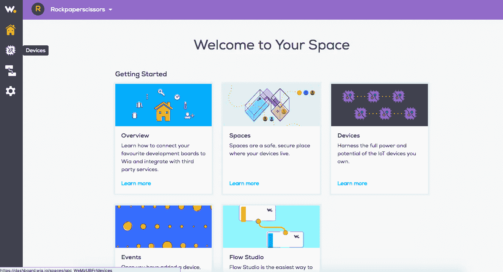
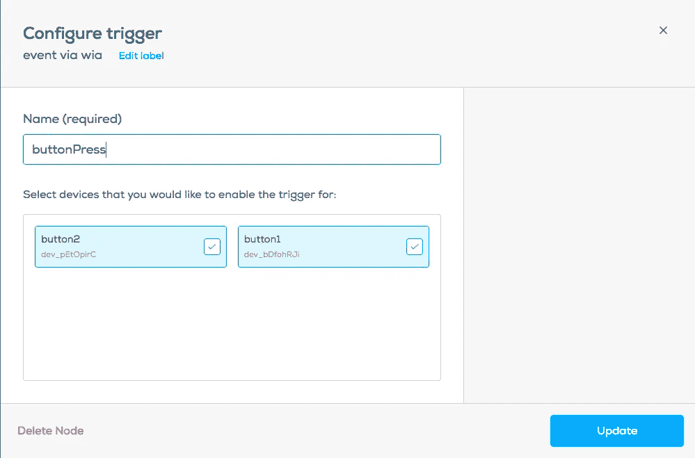
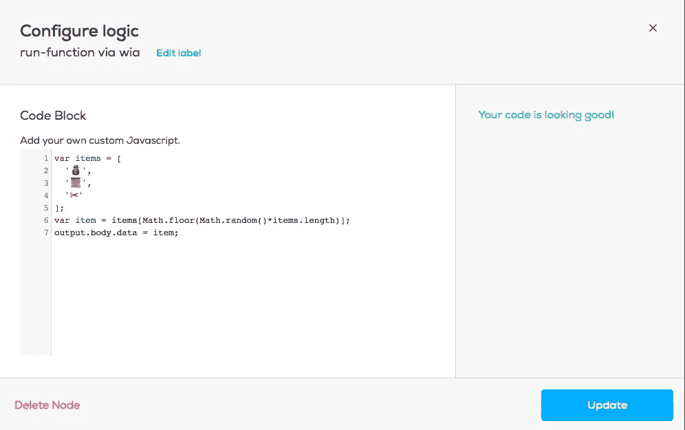
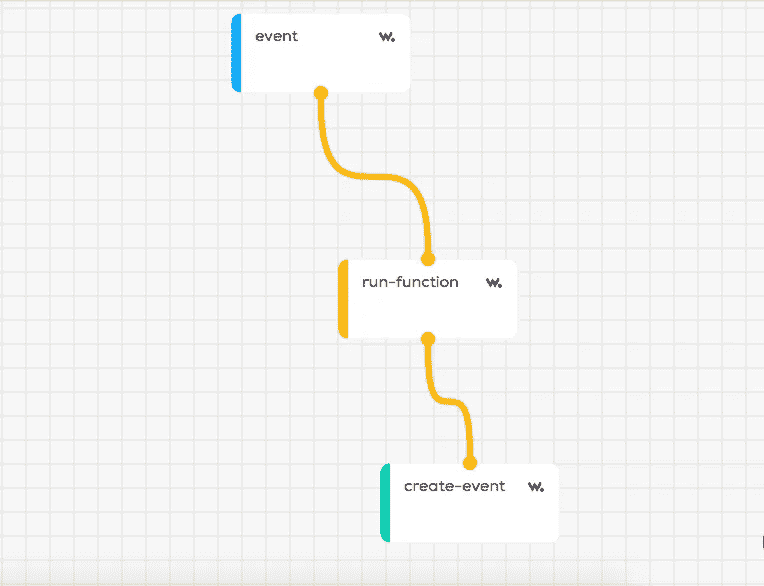
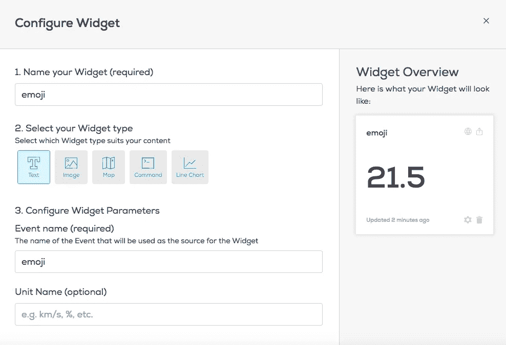

# 使用 ESP2866 玩石头剪刀布

> 原文：<https://medium.com/coinmonks/play-rock-paper-scissors-using-the-esp2866-5304cc4b6488?source=collection_archive---------12----------------------->


在本教程中，我们将使用 ESP8266、Wia 仪表板和 Github 构建一个在线石头、剪子、布游戏。

# 你需要什么

*   2 个 ESP8266
*   2 根微型 USB 转 USB 电缆

开始之前，您必须有一个 Wia 帐户。[您可以在这里创建一个](https://dashboard.wia.io/login)。

如果您还没有使用 Arduino 设置您的 ESP8266，您需要先这样做。本教程将告诉你如何去做。

# 入门指南

首先，将 USB 电缆连接到其中一个 ESP8266，并将其插入您的计算机或笔记本电脑。

打开 Arduino IDE。你可以在这里下载的最新版本。在 Arduino IDE 中，创建一个新的草图并另存为`playerOne.ino`。创建第二个草图，将其命名为`playerTwo.ino`。

接下来，导航到 Wia 仪表板，创建一个新的`space`和`add device`。给它起个类似“playerOne”的名字。



添加设备后，导航至页面左侧的`Devices`选项卡。选择您的设备，然后导航至`configuration`选项卡。您将看到您的设备 ID 以及您的`device_secret_key`。稍后您将需要设备密钥。

# 代码

将以下代码复制并粘贴到名为 playerOne.ino 的 Arduino 草图中。

```
#**include** <Arduino.h>
#**include** <ESP8266WiFi.h>
#**include** <ESP8266WiFiMulti.h>
#**include** <ESP8266HTTPClient.h>#**define** USE_SERIAL SerialESP8266WiFiMulti WiFiMulti;**const** **char*** ssid     = "name-of-your-Wifi";
**const** **char*** password = "your-Wifi-Password";// get this from the wia dashboard. it should start with `d_sk`**const** **char*** device_secret_key = "your-device-secret-key";boolean buttonState = HIGH;
boolean buttonDown = false;**void** **setup**() {
  // put your setup code here, to run once:
  pinMode(0, INPUT);
  Serial.begin(115200);
  **while** (!Serial) {
    ; // wait for serial port to connect. Needed for native USB port only
  }
  WiFi.mode(WIFI_STA);
  WiFiMulti.addAP(ssid, password);
}**void** **loop**() {
  // put your main code here, to run repeatedly:
  buttonState = digitalRead(0);
  // check if the pushbutton is pressed.
  // if it is, the buttonState is LOW:
  **if** (buttonState == LOW) {
    **if** (buttonDown == false) {
      Serial.println("Button Pushed");
      buttonDown = true;
      postToWia();
      delay(750);
    }
  } **else** {
    buttonDown = false;
  }
}**void** **postToWia**() {
  // wait for WiFi connection
  **if**((WiFiMulti.run() == WL_CONNECTED)) {
    HTTPClient http;
    USE_SERIAL.print("[HTTP] begin...\n");
    // configure wia rest api
    http.begin("http://api.wia.io/v1/events");
    USE_SERIAL.print("[HTTP] POST...\n"); // set authorization token
    http.addHeader("Authorization", "Bearer " + String(device_secret_key));
    // set content-type to json
    http.addHeader("Content-Type", "application/json");
    // start connection and send HTTP headers. replace name and data values with your own.
    **int** httpCode = http.POST("{\"name\":\"buttonPress\"}");
    // httpCode will be negative on error

    **if**(httpCode > 0) {
        // HTTP header has been send and Server response header has been handled
        USE_SERIAL.printf("[HTTP] POST... code: %d\n", httpCode);
        // file found at server
        **if**(httpCode == HTTP_CODE_OK) {
            String payload = http.getString();
            USE_SERIAL.println(payload);
        }
    } **else** {
        USE_SERIAL.printf("[HTTP] POST... failed, error: %s\n", http.errorToString(httpCode).c_str());
    }
    http.end();
  }
}
```

更改以下值:

*   `name-of-your-WiFi`到您的 WiFi 的名称。这必须是您的电脑正在使用的同一个 WiFi 网络。
*   `your-WiFi-password`输入您的 WiFi 网络密码
*   `you-device-secret-key`您的设备密钥，可在 Wia 仪表盘的`Devices > Configuration`下找到

点击 Arduino IDE 中的`upload`将代码上传至您的设备。然后，将您的设备放在一边。记住这个设备是`playerOne`并且包含 playerOne 代码。

将第二台设备连接到您的计算机，并将其添加到您在 Wia 仪表板中的共享空间。这个设备将有一个完全不同的`device-secret-key`。从配置选项卡中收集密钥。将之前的代码复制并粘贴到 Arduino 文件`playerTwo.ino`中，但更改`device-secret-key`以匹配第二个设备。

将文件`playerTwo.ino`中的代码上传到您的第二个设备上。

# Wia 流程

现在，在您的 Wia 仪表板中，单击左侧边栏中的`Flows`。创建一个新的流程，随便你怎么命名。

从 trigger 选项卡中拖动一个`Event`，并将其命名为 buttonPress。选择两个设备。



在`logic`选项卡中，拖动一个`run-function`节点。将黄点从`Event`节点拖到`run-function`节点。在框中，复制并粘贴以下代码:

```
**var** items = [
    '🗿',
    '📜',
    '✂'
];**var** item = items[Math.floor(Math.random()*items.length)];
output.body.data = item;
```

您的屏幕应该是这样的:



点击`Update`。
然后，在`action`选项卡中，拖动一个`event`并将其命名为`emoji`。要连接节点，请拖动橙色的点。您的屏幕应该是这样的:



接下来，导航至`Devices > playerOne`。这将带您进入设备的概览页面。在右上角，点击`add a widget`。标题写`emoji`，事件写`emoji`。然后，导航回侧边栏上的`Devices`，选择您的设备进行`playerTwo`。创建一个新的小部件，为标题编写`emoji`，为事件编写`emoji`。



将两个设备都插入电脑。按下两个装置上的`flash`按钮。你的小工具将显示设备是选择石头、布还是剪刀。

然而，在两个设备之间导航并不是玩游戏的有效方式。所以，我们必须制作一个网页，同时向我们展示每个玩家的选择结果。

为此，我们将使用 Github。你可以在这里创建一个账户。

# 网页

首先登录 Github。创建一个新的存储库，并将其命名为 your-github-username.github.io。

创建存储库后，将其打开。点击`create new file`。将下面的代码复制粘贴到一个名为`index.html`的文件中。文件**必须**命名为 index.html。

```
<!DOCTYPE html>
<**html**>
  <**head**>
    <**meta** charset="UTF-8">
    <**title**>Wia Game</**title**>
  </**head**>
  <**body**>
    <**h1**>Wia Rock Paper Scissors</**h1**>
  </**body**>
</**html**>
```

这是 HTML 样板文件。为了实时查看我们的游戏更新，我们需要嵌入来自 Wia 的小部件。回到 Wia 仪表板，导航到两个播放器设备之一。在概览中，您可以看到您的小部件。单击小部件右上角带箭头的框。选择设置`anyone can view this widget`。复制代码以嵌入小部件。代码以< iframe >开始，以< /iframe >结束。

回到 GitHub，编辑`index.html`文件。将小部件代码粘贴在标题`<h1>Wia Rock Paper Scissors</h1>`下。

对另一台设备的小部件重复此操作。现在，您的 HTML 文件应该如下所示:

```
<!DOCTYPE html>
<**html**>
  <**head**>
    <**meta** charset="UTF-8">
    <**title**>Wia Game</**title**>
  </**head**>
  <**body**>
    <**h1**>Wia Rock Paper Scissors</**h1**>
    <**iframe**> YOUR WIDGET </**iframe**>
    <**iframe**> YOUR SECOND WIDGET </**iframe**>
  </**body**>
  </**html**>
```

要查看您的新网页，请导航至`[https://your-github-username.github.io/](https://your-github-username.github.io/)`

这就是你的游戏！