# 在歌剧中为安卓玩以太博物馆

> 原文：<https://medium.com/coinmonks/playing-with-ethereum-in-opera-for-android-d1fb1b0ba7bb?source=collection_archive---------1----------------------->

Opera 浏览器现在(从 2019 年 6 月起)包含一个内置的 Ethereum 钱包。要设置钱包，需要同步[安卓应用](https://play.google.com/store/apps/details?id=com.opera.browser)和[桌面应用](https://www.opera.com/)。

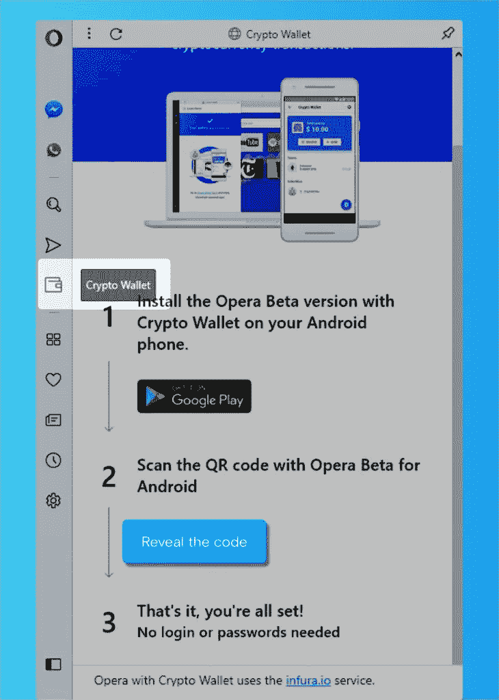

Show to Code to sync the Ethereum account

在桌面应用程序上，转到左侧的加密钱包边栏，单击“显示代码”，然后用应用程序扫描它(更多详细信息[在这里](https://help.opera.com/en/how-to-use-operas-crypto-wallet-on-your-computer/))。

然后，移动浏览器将包括在 Opera 中创建的以太网帐户。您可以接收和发送乙醚。

这很好，但是更好的是能够使用 ethereum dapps(分散应用程序),比如🧀[cheese wizards](https://www.cheezewizards.com)……或者移动浏览器中更有用的东西。

问题是，就像许多最先进的分布式总帐/区块链应用程序一样，文档仍然不是很好，它需要一些挖掘……所以让我们一起挖掘吧！

首先，我们需要能够浏览移动控制台，这样我们就可以了解 [web3js](https://web3js.readthedocs.io/en/1.0/) 将如何在那里工作。所以我建立了一个静态网页，在网络服务器上访问，并验证了 Android 上的 Opera 可以打开它。

然后，我们需要在那里连接调试控制台。这里有一些简洁的文档，但是有点过时了。简而言之，你需要一个浏览器在桌面上做调试(我们将使用 Opera)，你需要连接一个带有 USB 电缆的 Android 设备，你需要在 Android 开发者选项上启用 USB 调试。然而，如上所述的 opera 调试设置对我不起作用。

在 windows 上，我不得不使用 adb (Android Debug Bridge，通常与 Android Studio 一起安装，或者可以在 Studio 内转到“工具”>“SDK 管理器”进行安装)。

就我而言，adb 在我的主目录下，位于 AppData \ Local \ Android \ SDK \ platform-tools 下。我使用了一个 Windows Powershell，并在命令行中运行:

```
.\adb.exe devicesadb server version (39) doesn't match this client (41); killing...
could not read ok from ADB Server
* failed to start daemon
adb.exe: failed to check server version: cannot connect to daemon
```

哎呀！通过使用 Task Manager(ctrl+shift+ESC)进行一些挖掘后，我看到我运行了另一个 adb.exe 进程，有一个不同的版本。通过右键单击>属性，我看到了它是从哪里开始的，我有一个应用程序在后台运行，具有不同的 adb 版本。我卸载了这个应用程序，并没有真正使用它。这使我能够正确运行 adb 并显示连接的设备:

```
.\adb.exe devicesList of devices attached
0048905859      device
```

快速 adb 有用的命令您应该知道:

```
.\adb.exe start-server
(starts -- duh -- the adb daemon).\adb.exe kill-server
(stops the daemon)
```

为了允许调试使用，对于 Opera:

```
.\adb.exe forward tcp:9222 localabstract:com.opera.browser.devtools* daemon not running; starting now at tcp:5037
* daemon started successfully
```

如果你看到上面的信息，你做得很好。给自己一个鼓励。


(补充说明:如果你想调试 Android Chrome，也很容易，只需使用下面的命令即可)

```
.\adb.exe forward tcp:9222 localabstract:chrome_devtools_r
emote
```

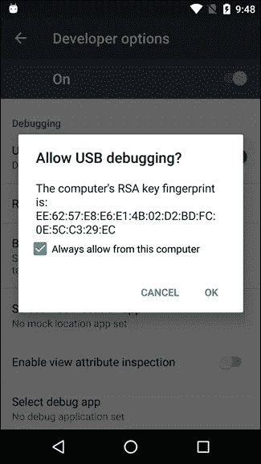

(顺便说一句，在这里的某一点上，它应该要求你允许从你的计算机上进行 USB 调试。不确定什么时候，但显然你必须允许。)

此时，您已经将本地 tcp 端口 9222 转发到 Android 的调试控制台。现在，文档又被关闭了。转到 localhost:9222 可以调试 Chrome，但对我来说，它对 Opera 不起作用。

多亏了我的同事[若昂·加布里埃尔·泽鲍特·贾尔迪姆](https://medium.com/u/338e934bcc1b?source=post_page-----d1fb1b0ba7bb--------------------------------)(又名[XBL _ 臀肌抽搐](https://www.twitch.tv/xbl_gluteos)，看看这个)，他发现你可以在 Opera 中输入 chrome://inspect，这会给你展示一个很酷的小屏幕:

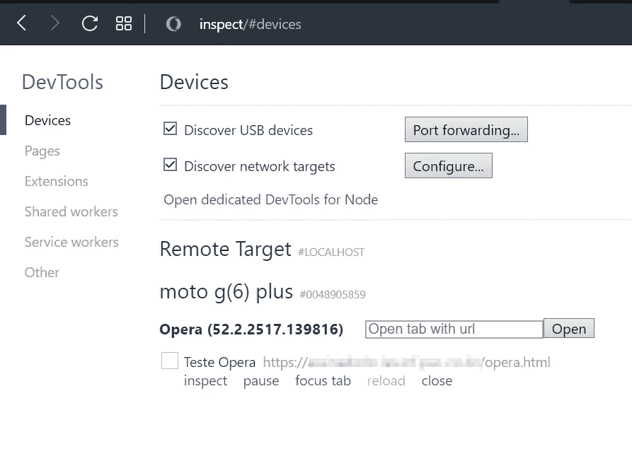

Type chrome://inspect to access the connected device

啊哈！现在我们在谈话。我们可以打开一个新的网址，检查 Android 上的一个打开的标签，各种各样的好东西。


（📢注意——更新⚠:你*必须*为你的页面使用 ***https*** 否则将无法工作！我刚刚浪费了我都不知道要花多长时间！)

所以，最后，我们完成了牦牛的剃毛🐂！让我们在 Android 上玩以太坊吧！

这是我的网页。警告⚠，极其复杂！

```
<!DOCTYPE html>
<html>
<head>
  <title>Test Opera</title>
</head>
<body>
  Working!
</body>
</html>
```

我检查了网页，打开了 JavaScript 控制台。不知道它会不会像[元掩码](https://metamask.io/)插件那样注入 web3js。显然不是…😖

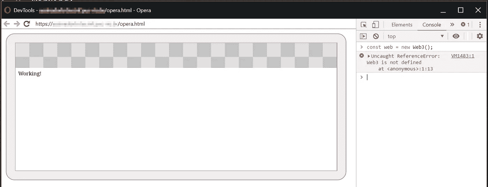

Inspected tab with the Console: no Web3

在某种程度上，Android 上的 Opera 会要求你允许从该网站访问你的钱包，当然，你需要允许:

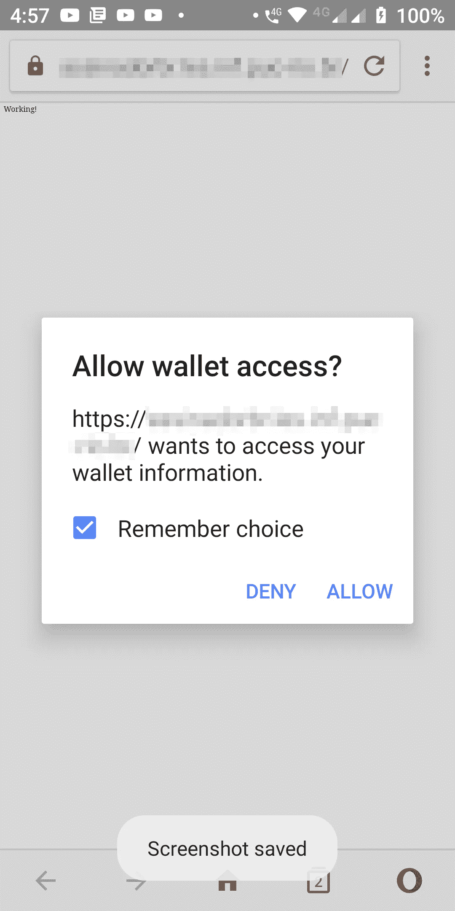

好了，我们来添加 web3js，我从 CDN JSDelivr 添加了一个 [web3js 1.0(注意目前 1.0 是测试版，不稳定)。我知道，代码更复杂。处理好它！](https://cdn.jsdelivr.net/gh/ethereum/web3.js@1.0.0-beta.34/dist/)

```
<!DOCTYPE html>
<html>
<head>
 <title>Test Opera</title>
 <script src="https://cdn.jsdelivr.net/gh/ethereum/web3.js@1.0.0-beta.34/dist/web3.min.js" type="text/javascript"></script>
</head>
<body>
  Working!
</body>
</html>
```

如果我们在控制台上重新加载，现在，我们可以这样做:

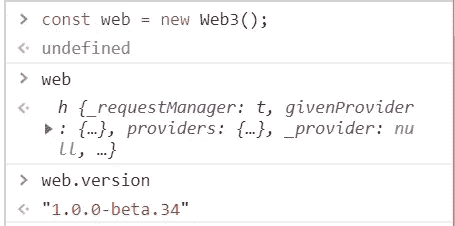

哦耶！我们有 web3js🤗！现在让我们做一些更有趣的事情。在 Opera 桌面上，我将它设置为使用 Ropsten testnet(仔细研究，你会发现如何使用，你不需要我详细说明，对吧？).然后我发了💸一些 0.1 测试乙醚(爱我，假钞🤑！)到那个账户。

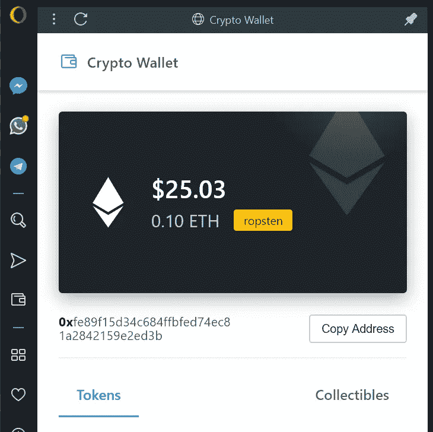

On the Opera Desktop Sidebar, clicking on the wallet icon

在 Android 上的 Opera 上，也连接到 Ropsten(哦，好的，只需点击右下角的 Opera O 图标>加密钱包>右上角的 Gear 图标>网络)以确保你在同一个网络上，然后我们就可以在控制台上玩了:

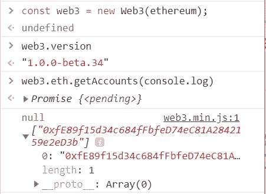

所以，现在我们已经连接到以太坊网络，并获得了当前帐户！让我们取得平衡:

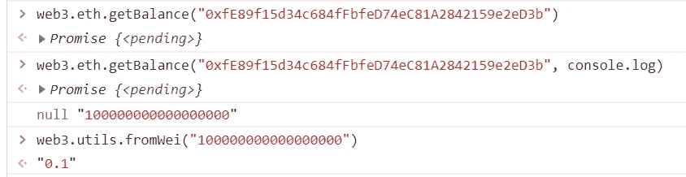

所以我们在那个帐户上有 0.1 Eth 或 10000000000000 魏。酷！

我想知道…我们甚至可以发送一些 Eth 到另一个帐户吗？让我们试试…

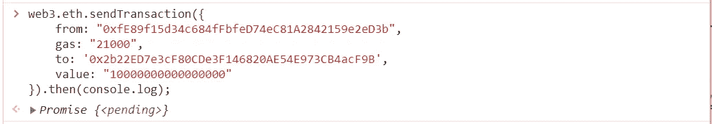

Trying to send Eth…

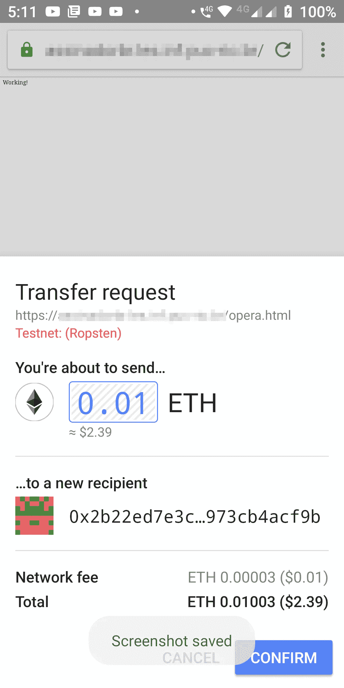

Confirm to send Ether

当然，它需要用户授权才能允许转移，所以它甚至弹出了一个确认屏幕！

太酷了。😎

更酷的是，它甚至要求我的安全模式或指纹☝来验证交易。爱死了。

它还显示了一条交易挂起消息，允许您点击查看 [Etherscan](https://ropsten.etherscan.io/tx/0x66cd31f84c4e60bddf840f11ea444c198590fc4115d61ad8db2b99c40aad5eaa) 上的挂起交易。我印象深刻！

我这样做了两次，因为截图不是很好，所以我收到了 0.02 ETH total，它显示在这个帐户上，我已经在不同的浏览器上设置了 Metamask。


The account received the transaction.

好吧！让我们回顾一下我们所做的:

*   我们在 Windows 和 Android 上使用 Opera。
*   我们在 Window 上创建了一个以太坊钱包。
*   我们通过扫描二维码同步了两个应用程序上的钱包
*   我们通过 USB 连接了 Android 设备
*   我们使用 adb 来允许在 Android 上调试 Opera
*   我们创建了一个非常简单的网页，并在其中添加了 web3js
*   我们将它设置为使用 Ropsten testnet
*   我们通过远程控制台玩以太坊账户
*   我们把乙醚从那个账户转到了另一个账户

所以现在我们有了可以使用以太坊 DApps 的手机浏览器！这在我的书上写得太棒了！我很期待用这个。

你喜欢吗？给我留言，让我知道你的想法。并查看后续报道，这样你就知道如何[用新的私钥](/@rpaskin/wow-signing-a-message-on-opera-on-android-with-a-private-key-cff9bca84c06)在 Android 上的 Opera 上签署消息。

干杯，

—罗尼

***P.S.*** *送给各位葡语朋友:* Gostou do conteúdo？你知道以太坊有什么节目吗？dêuma ol hada no meu curso de[programo de Contratos intelligentes com solidarity na Udemy](https://www.udemy.com/contratos-inteligentes/)。好的，我会去葡萄牙的！一个骗子说，他可能写了一个号码 6000！阿布拉科斯！

> 另请阅读:[最佳硬件钱包](/coinmonks/the-best-cryptocurrency-hardware-wallets-of-2020-e28b1c124069)

[](https://coincodecap.com/?utm_source=coinmonks)