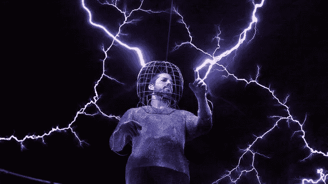
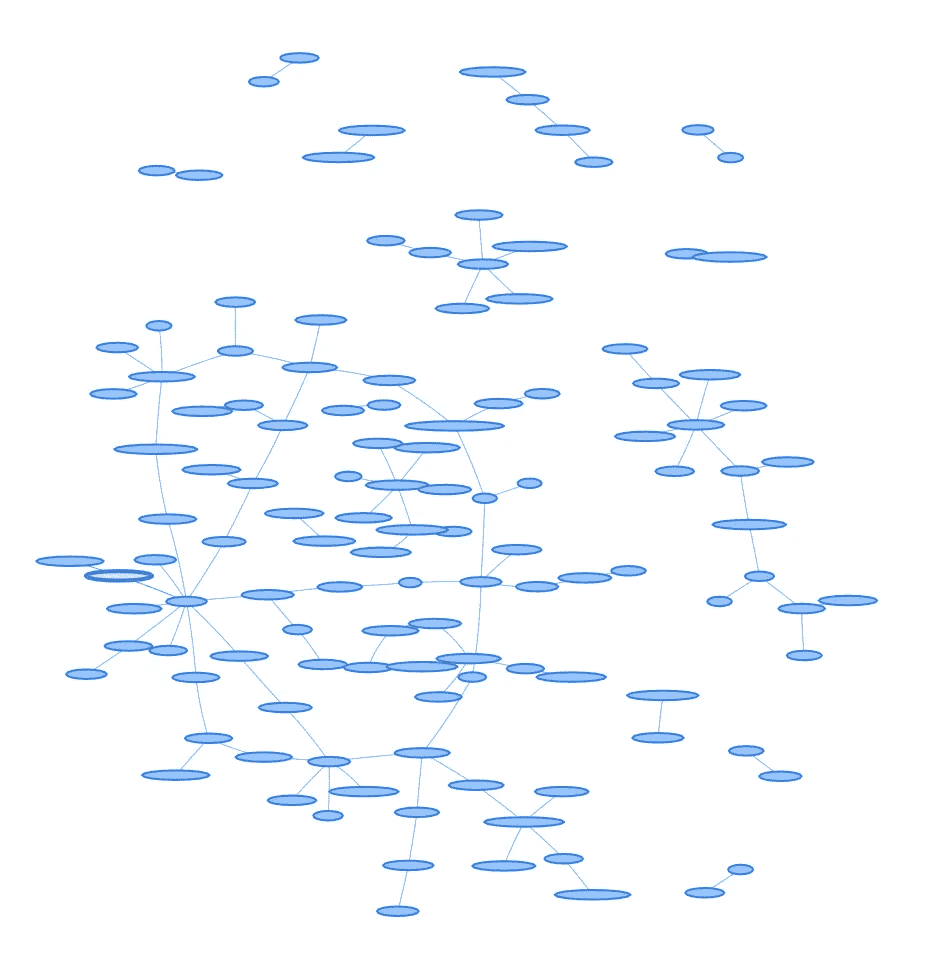
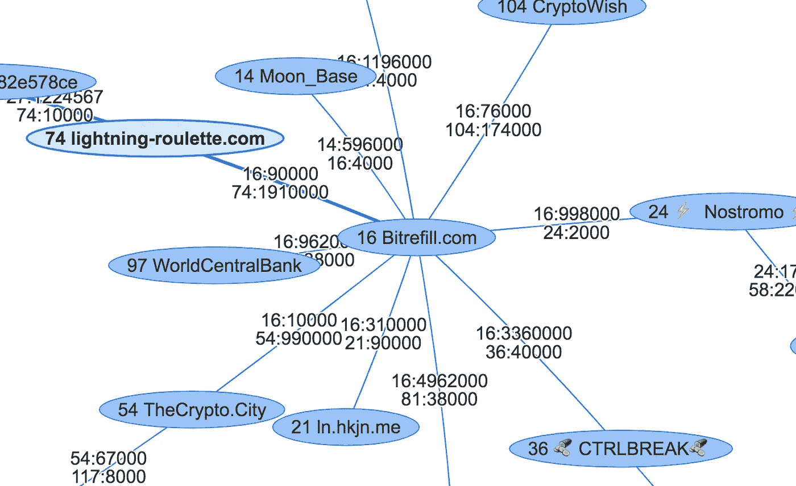

# 玩闪电网

> 原文：<https://medium.com/coinmonks/playing-with-lightning-network-90ecc678fe70?source=collection_archive---------10----------------------->

# 蛰伏的能力，隐藏的平衡

玩闪电听起来很危险，但是很好玩，而且我还活着。我的大部分节点和通道也是。到目前为止，我已经在 LN 上建立了许多实验性的东西。“边做边学”是我更喜欢的道路。

Me playing with Lightning. Actually, no it is [David Blaine](https://www.indiatoday.in/movies/celebrities/story/david-blaine-goes-high-voltage-with-latest-stunt-117662-2012-10-03)

我想了很久的一个实验是关于每个通道的平衡。根据设计，您只能看到通道的总容量，实际的余额不会广播，但除了共享通道的两个节点之外，其他所有时间都是隐藏的。因此，发送者实现必须尝试多条路径，寻找至少具有足够总容量的潜在路径。

实际上，总容量目前也没有在网络上公布，你必须问区块链，这使得轻钱包更加困难。他们中的一些人甚至看都不看就尝试，这在大多数情况下都很有效。即使已知一个信道有 10Msat 的容量，你也无法知道每一端是 5Msat，还是一端是 0。

所以，我决定一探究竟。我将最终开始探测网络，看看它真正的样子和感觉。这将是令人兴奋的。我认为，到目前为止，像这样的分析只是在理论上根据已知的图表进行的，而从未在现实中进行过。

我在我的频道平衡器上做了这个实验。基本上，我只需要改变探路者算法，从平衡我自己的通道，到探测网络上的任意通道。稍后我可能会写一个关于我的渠道平衡项目的故事。简而言之:成功了。

因此，探测器实际执行的操作如下:

随机选择一个节点。计算到它的路径，包括使用什么通道等。像这样，A 是源节点，D 是目的节点:

A->B->C->D

我们要考察 C 和 d 之间的平衡。

因此，让我们首先尝试看看您可以通过多少路到达 d。通过计算该路线的最小通道容量，您已经知道了可能的上限。然而，这是一个极其乐观的值，与你在现实中能推动的事情无关。理论上也没有。考虑在你的方向上，每个通道是否有 0 和最大容量之间的随机平衡，将它们排列起来，取最小值。它甚至不会是**最小通道的一半**。事实上，今天有许多频道在一边或另一边有 0。还有被禁用的频道和[僵尸节点](/@robban_69827/lightning-network-routing-fud-and-zombies-776b8238e66b)，我们不知道，但认为它们在线。所以，诸如此类的事情使得计算变得毫无价值。我们不妨从底层开始蛮干。

# 鲁莽地探测网络

第一阶段:从 1000 sat 开始，如果有效，翻倍到 2000，然后到 4000，以此类推。假设你成功通过了 8000 sat，但没有通过 16000 sat。

第二阶段:试试中间的，12000 sat，两者相差 4000 sat。如果那样的话，你会增加 2000 sat，否则你会减少 2000 sat。然后重复 1000 次 sat 增加/减少。假设你在经历了这一切后，最终得到了 13000 英镑。这个数字大约是你发送 A->B->C->D 的总量。

第 3 阶段:接下来，您希望验证限制实际上是 C->D，而不是 B->C，因此您将 13000 的数字增加到 15000，以确保万无一失，并尝试将 A->B->C。如果这行得通，您可以假设 13000 的限制是 C->D 之间的平衡。我们发现并揭示了平衡。

一旦有了更好的错误报告，并且开发人员对错误应该是什么样子有了共识，就可以改进这种方法。但是现在癫痫小丑发作产生了一些有用的结果。

冲洗并对网络的其余部分重复上述操作。

成功的探测需要很多时间，因为大多数路径根本不起作用。这可能是由于不恰当的平衡，以及并非所有的实现都在通道关闭时发出信号，这使得它们难以避免。鉴于 3000 个 mainnet 节点中有超过 2/3 的节点出现故障，有很多通道也出现故障。我们必须有耐心。

除了探索平衡，理论上，这将最终得到一个更准确的可视化工具，只显示实际上**进行**远期支付的渠道。

因此，连接和平衡被发现并被验证有效:

Probing in action

Close-up on Bitrefill

请注意，这些数字可能会有一点或多点的偏差。一些渠道比其他渠道更能改变平衡，事情可能会出错。导致问题的一个原因是，即使我指定了一个特定的通道，节点也可能决定通过两个节点之间的并行通道进行路由(因为指定的通道具有太低的平衡)。这是有创意的，但对于探测和平衡，甚至可能对于 AMP 支付来说，这是非常令人不安的，我认为节点将停止这样做。

现在似乎出现了一种共识，即广播容量是一件好事，尤其是对钱包较轻的人来说，广播平衡不会伤害任何人。毕竟，我们显然无论如何都能探测到，而且到目前为止还没有人受伤。

将这一点与通过纳入余额使故障标准化和更加详细结合起来，将为原子多路径支付快速找到可行路径铺平道路。闪电网络的未来看起来非常光明。只需要清理一些东西，装上一些被忽略的螺丝。

不断增长的探测闪电网络可以在这里找到【https://www.moneni.com/lightningprobe 

> [在您的收件箱中直接获得最佳软件交易](https://coincodecap.com/?utm_source=coinmonks)

