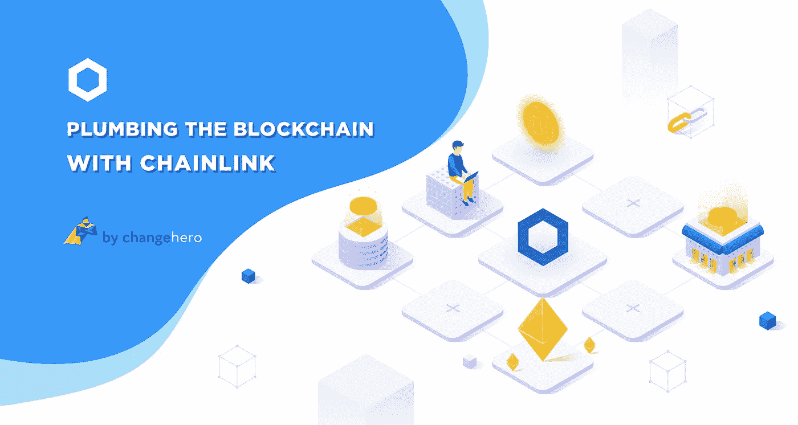
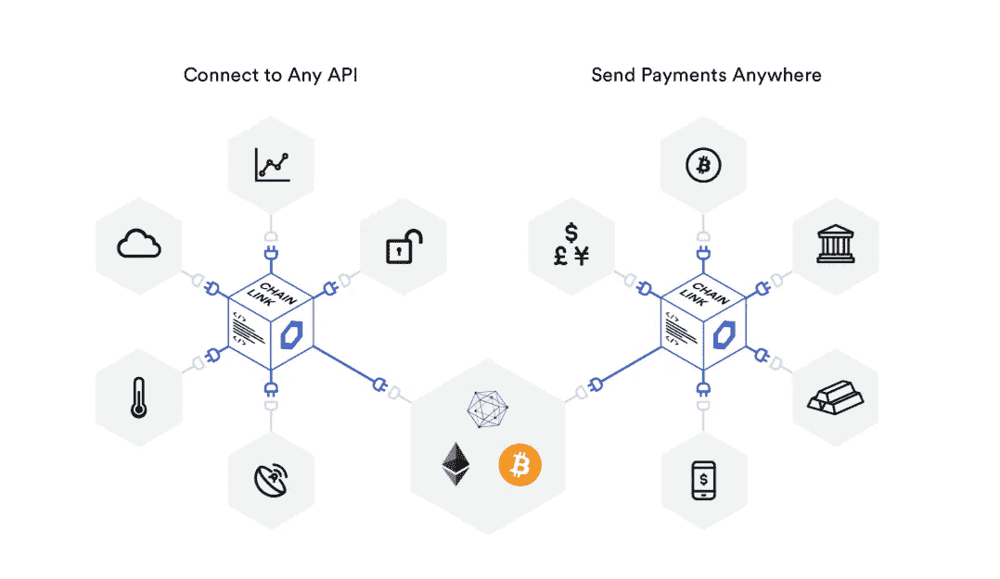

# 用 ChainLink 连接区块链

> 原文：<https://medium.com/coinmonks/plumbing-the-blockchain-with-chainlink-6037bae3e6c?source=collection_archive---------5----------------------->

智能合约打开了区块链的黑匣子，为金融科技提供了急需的突破。虽然密码被破解了，但仅限于链条。这些项目非常需要一种与外界沟通的方式来充分发挥其潜力。ChainLink 就是这样一个项目，它填补了这一空白，使各种项目能够与链外应用程序进行通信。

最近，ChainLink 因其在市场上令人印象深刻的表现而在加密社区中四处奔走。在这篇短文中，ChangeHero 将向你概述[链节](https://chain.link/)以及它们与众不同的地方。

## 神谕——奇迹

简而言之，智能合同是一段代码，它包含用户协议，并在满足预设条件时自动处理交易。相对于传统的合同和财务系统，它们确实是一个巨大的飞跃，但是它们不能从链外环境或 API 中获取数据。这是因为区块链有一个连接问题，不能与外界交换信息，限制了它的功能。

Source: [ChainLink](https://chain.link/features/)

这就是 Chainlink 的用武之地。Oracles 是区块链和真实世界数据之间的桥梁。这些支持来回传输数据，扩展了区块链技术的潜在使用案例。Chainlink 是一个分散的 oracle 网络，用于向区块链提供数据。该项目由 Sergey Nazarov 和 Steve Ellis 在 2014 年创立，有趣的是在以太坊出现之前。根据他们的[白皮书](https://link.smartcontract.com/whitepaper)，该项目旨在为智能合同的连接性问题提供一个可行的解决方案。它是第一个与 IBM 的中间件不相上下的分布式 Oracle 服务。

## 链上架构

Chainlink 使用一组独立的节点从 oracles 收集数据。这些节点通过请求契约来回复来自用户的数据请求或查询。链上架构有三种主要的契约类型:信誉契约、订单匹配契约和聚合契约。第一种方法通过设置性能指标来检查 oracle 服务提供商的信誉。而订单匹配合同根据服务级别协议(SLA)参数从 oracle 供应商处收集报价。它还选择投标并通过信誉合同确认 oracle SLA。聚集契约的主要功能是收集来自 Oracles 提供者的响应，并计算链接查询的最终集合结果。此外，它还向信誉合同提供度量。最后，on-chain 架构也有三个主要步骤，Oracle 选择、数据报告和结果聚合。

## 链外架构

最初，ChainLink 开始向以太网提供 oracle 服务。离线时，该项目有一个 oracle 节点网络，用于处理以太网上的数据请求。这个节点网络由处理区块链交互、调度和与外部源通信的 ChainLink 核心提供动力。这些节点可以实时提供来自任何行业的数据。这的确是革命性的，可以释放智能合约的全部潜力。

> [发现并回顾最佳加密软件](https://coincodecap.com)

## 安全系统

ChainLink 采用分散式方法来提供 oracle 服务。此外，它还提供了多种功能，为用户增加了一层额外的安全性。

**验证系统:**所有在链上的 Oracle 都被监控，并提供基于 Oracle 的可用性和正确性的性能度量。这些都有助于用户选择 oracles。

**声誉系统:**它类似于日常业务中的评论系统。它记录并发布基于 oracles 性能的用户评级。

**认证服务:**为了增加 oracle 提供商的合法性，该团队向那些享有提供高质量服务声誉的提供商颁发认证。

**链接**

LINK 是 ChainLink 平台的本机令牌。ERC-20 令牌可用于向从链外数据源获取数据的节点运营商支付费用。检索数据的价格将由节点运营商考虑对链外资源的需求和类似资源的供应来单独设定。与其他加密货币类似，LINK token 也可以在所有主要交易所存储和交易。林克在 2020 年开始了一轮巨大的牛市，涨幅超过两倍，并在 2020 年 2 月 16 日达到 4.83 美元的历史高点。截至发稿时，LINK 的交易价格为 4.19 美元，根据 CoinMarketCap 的数据，其市值超过 14 亿美元。

## 连接未连接的人

ChainLink 是扩展智能合同可能性的项目之一。它与 SWIFT 的紧密联系也为其成功做出了贡献。尽管该项目目前仅与以太坊、比特币和 Hyperledger 兼容，但预计未来将扩展对所有智能合约平台的支持。在 ChainLink 等分散式 oracle 服务的帮助下，智能合同将能够与外部世界无缝连接，并能够转变智能合同提供服务的方式。

如果你喜欢这个帖子和评论来引发讨论，请给我们一个掌声。要想在 crypto exchange 上获得更多这样的文章和令人兴奋的优惠，请在 [Twitter](https://twitter.com/Changehero_io?lang=en) 和 [Medium](/@changehero) 上关注 [ChangeHero](https://changehero.io/) 。

> [直接在您的收件箱中获得最佳软件交易](https://coincodecap.com/?utm_source=coinmonks)

