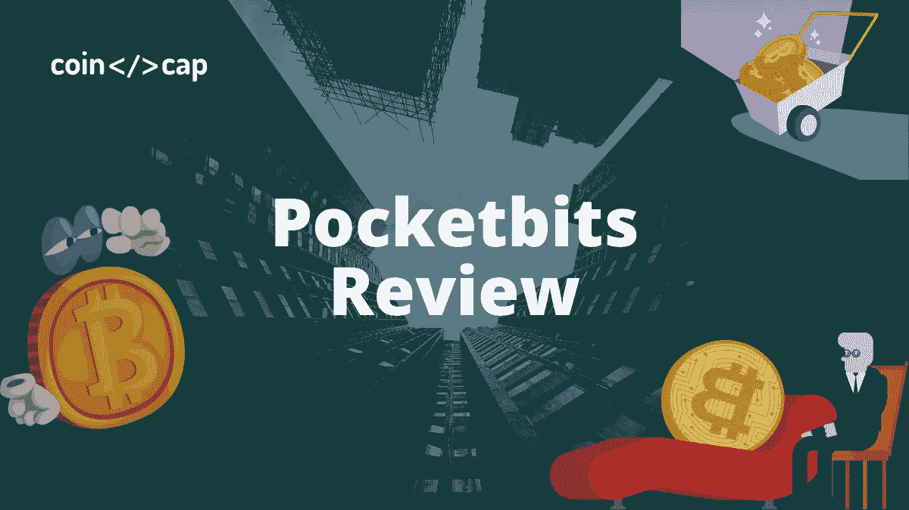
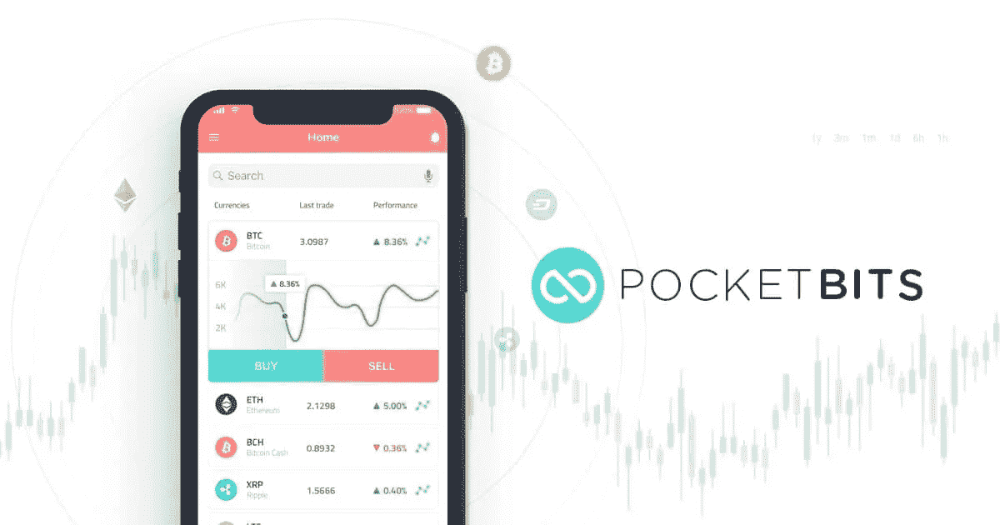
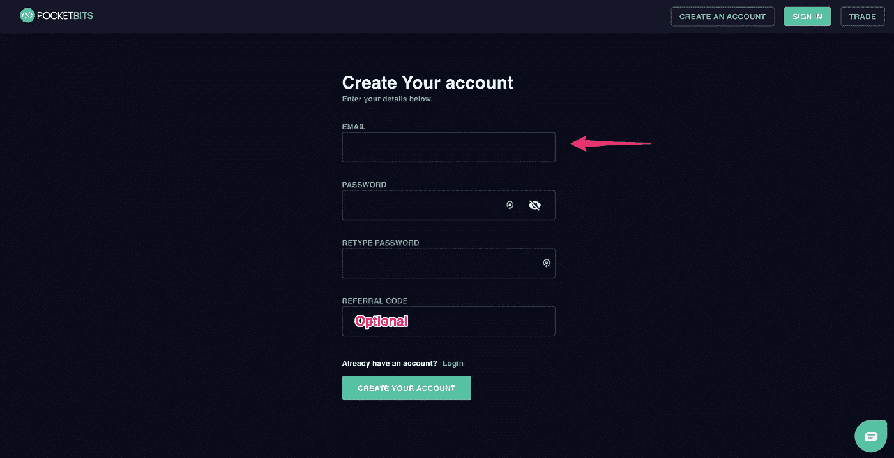
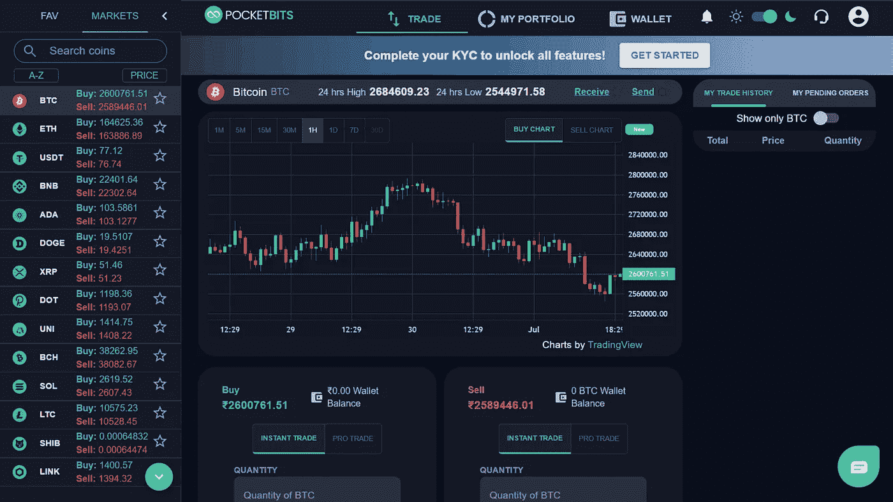
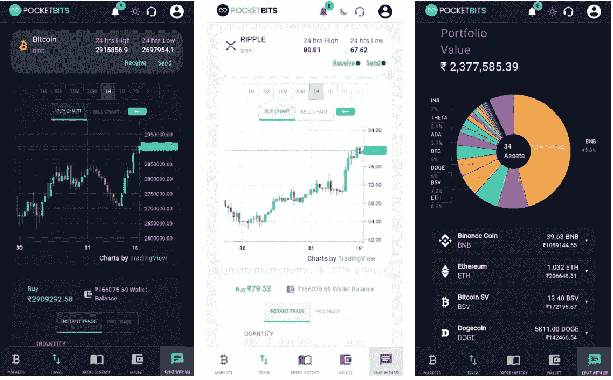
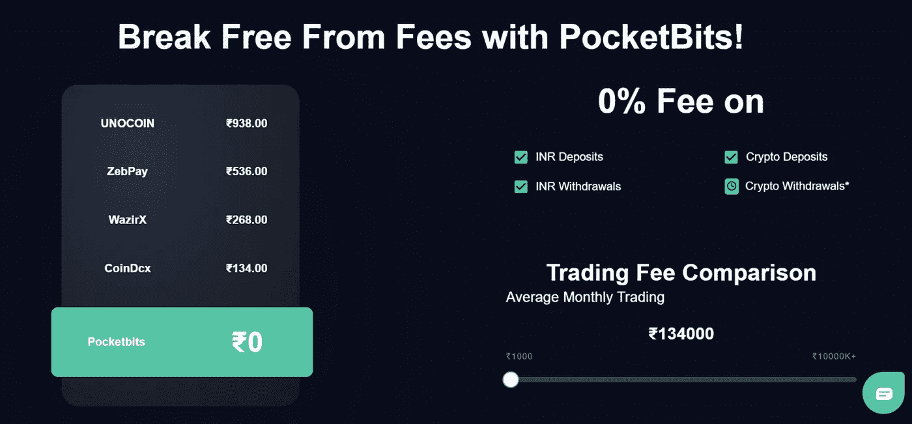
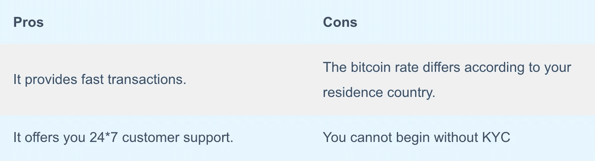

# Pocketbits 评论:安全吗？

> 原文：<https://medium.com/coinmonks/pocketbits-review-929d86fefc42?source=collection_archive---------5----------------------->

**PocketBits Review**

你想知道今天活跃的最早的印度密码交易所之一吗？那么，这个 [**袖珍**](https://pocketbits.in/createacc?ref=CZ99-X520) 复习就在你的身边了。此外，该平台成立于 2017 年，对你来说可能不算早，但它无疑已经在加密市场占据了一席之地。那么，让我们来详细谈谈口袋比特。

# 总结(TL；博士)

*   [**Pocketbits**](https://pocketbits.in/createacc?ref=CZ99-X520) 是一个[加密货币交易所](https://coincodecap.com/crypto-exchange)平台，可以让你进行比特币和 altcoins 的交易。
*   它有一个用户友好的界面。
*   pocketbits 的交易速度很快，不需要太多时间。
*   它允许你以市价单或限价单买卖资产。
*   存款或提取印度卢比不收取任何费用。
*   平台采取所有必要的预防措施来保护其用户的机密数据的安全。
*   团队会为您提供全天候支持，帮助您解决任何 Pocketbits 网站或移动应用程序问题。
*   您还可以参加 bug bounty 计划，并有资格因发现安全问题并提供解决方案而获得奖励。

Buy Pocketbits

# 什么是 Pocketbits？

Pocketbits

[**Pocketbits**](https://pocketbits.in/createacc?ref=CZ99-X520) 是一个数字加密交易平台，是进入加密市场的早期乘客。该平台由 Sohail Merchant 创建，旨在将每个人与一个对所有人开放的金融系统联系起来。它为初学者以及密码市场的专业人士提供服务。

该平台区别于印度竞争对手的关键在于其零费用。让我们在本文的后面部分讨论这个问题。此外，如果你正在寻找一个移动应用程序来在旅途中进行交易，那么尝试阅读我们的[在印度购买比特币的最佳应用程序](https://coincodecap.com/buy-bitcoin-app-india)。然而，如果你是一个寻求指导的初学者，请参考我们的[投资加密货币](https://coincodecap.com/crypto-investing-guide)指南。

# Pocketbits 评论:主要特点

*   它促进了几分钟内的快速交易。
*   这个加密货币交换平台界面友好，易于使用。
*   它允许用户将款项直接打到他们的银行账户上。
*   Pocketbits 为您提供了一个移动应用程序，帮助您即使使用手机也能访问交易平台。
*   它为客户的个人数据提供了极好的安全性。

Buy Pocketbits

# 如何在 Pocketbits 上创建帐户？

*   在 [**Pocketbits**](https://pocketbits.in/createacc?ref=CZ99-X520) 上创建账户是一个简单快捷的过程。
*   首先，访问 Pocketbits 网站，点击“创建账户”然后输入您的电子邮件，并为您的帐户设置密码。
*   之后，点击“创建您的帐户”
*   如果有推荐代码，请输入推荐代码；否则就没必要了。
*   最后，通过 OTP 验证您的电子邮件，这样就完成了。此外，完成口袋位 KYC 解锁所有功能。

Pocketbits review: create an account

# 如何在 Pocketbits 上买卖加密资产？

## 口袋比特评论:市场秩序

*   登录您的 **Pocketbits** 账户。
*   请搜索您想要交易的硬币，然后选择它。
*   如果您想购买硬币，请输入您希望购买所需货币的总 INR 值。
*   交易以最佳可用价格执行，但可能因市场波动而变化。点击“确定”并继续。
*   此外，如果您希望出售硬币，则输入您愿意出售货币的 INR 值。如上述步骤所述，应遵循准确的程序。

Buy/ Sell at Pocketbits

## Pocketbits 评论:限价单

*   输入您希望购买的资产的价格和数量。
*   设置低于当前市场价格的价格是一个成功的亲交易买单。
*   此外，您还可以在 **Pocketbits** 网站上的“我的未决订单”下跟踪您的未决订单，也可以取消您的订单。
*   在设置了买入交易后，相关的 INR 信用将被锁定并显示在“订单中”，订单完成后，加密资产将被添加到您的钱包中。
*   现在，在出售的情况下，输入你想要出售的价格和数量。
*   在设置卖出交易后，适当的加密余额会显示在“订单中”，一旦订单完成，就会添加到钱包中。

Buy Pocketbits

# Pocketbits 移动应用程序

该平台配备了一款 android [移动应用](https://play.google.com/store/apps/details?id=com.pocketbits)，可在 Google play 商店下载。此外，手机应用程序的用户界面很体面，和网站一样好。

Pocketbits review: mobile app

# 零花钱

平台 [**Pocketbits**](https://pocketbits.in/createacc?ref=CZ99-X520) 相信为其客户提供一个透明的环境。此外，该平台在其网站上提供了一个滑块，可以帮助您比较不同交易所对输入交易金额的收费。

Pocketbits Fees

## Pocketbits 评论:存款费

自称为“巴拉特的零费用英雄平台”的 Pocketbits 对客户完全免费。该平台不收取任何印度卢比或加密存款费用。

## Pocketbits 评论:交易费

平台[从买价和卖价之间的差价中获利。因此，他们不向用户收取额外的交易费用。此外，您可以使用滑块来计算您在其他交易所支付的费用。](https://blog.coincodecap.com/go/pocketbits)

## 提取印度卢比的费用

提取印度卢比不收取任何费用。

## 密码取款费

加密取款的费用会根据区块链条件定期调整。

Buy Pocketbits

# Pocketbits 评论:Bug 赏金计划

[漏洞奖励计划](https://pocketbits.in/bugbounty)让你有资格获得奖励，如果你成功发现或发现他们网站上的安全问题。如果问题实际上很复杂，你至少要赚 1000 印度卢比。您需要转发安全问题的描述和解决方案。但是，您必须将您的帐户用于所有研究目的。

**还有，读**

 [## 加密交易机器人|最佳 16 款比特币交易机器人[免费和付费]

### 2021 年币安、比特币基地、库币和其他密码交易所的最佳密码交易机器人。四进制，位间隙…

medium.com](/coinmonks/crypto-trading-bot-c2ffce8acb2a) 

# Pocketbits 评论:客户支持

你可以选择聊天，这是消除你所有疑虑的简单方法。客户支持人员乐于助人，您的问题会在几分钟内得到回复。关于你所有的问题，你都得到了所有必要的指导和解决方案。客户[支持团队](https://support.pocketbits.in/support/solutions)全天候为您服务。该公司正在尽最大努力设定标准，以提供最大的客户满意度。

# Pockebits 安全吗？

[**Pocketbits**](https://pocketbits.in/createacc?ref=CZ99-X520) 中的安全性受到特别关注，无论是电子媒介、网络还是实体。他们试图从各个方面保护您的数据。此外，他们还希望您不要将数据泄露给任何第三方或在线来源。

然而，请注意，通过互联网传输的数据并不总是完全安全的。因此，如果您在共享信息时注意所有的预防措施，那将是最好的。此外，如果对 pocketbits 的安全性有任何疑问，您可以联系 support@pocketbits.in

# 口袋比特评论:利弊

Pors and Cons

# Pocketbits 审查:结论

如今，加密货币交易正成为许多人的日常工作。然而，如果你是一个密码市场的初学者，那么 **Pocketbits** 是一个很好的平台。它有几个特点，将说服你使用这个平台进行交易和投资。

Pocketbits 于 2017 年问世，拥有一个易于理解和使用的平台。他们提供最好的服务，建立透明的环境。此外，它还提供具有竞争力的价格和快速的交易执行。

Buy Pocketbits

# 常见问题

**pocket bits 位于哪里？**

Pocketbits 位于印度的 Nashik。这是一个加密货币交易平台，允许您向公司购买/出售加密货币。它是最值得信赖的加密交换平台之一。

**密码交换是如何工作的？**

加密交易平台允许你交易和投资法定或稳定硬币的加密货币。它在买方和卖方之间充当中间人，后者通过交易费或佣金获得回报。

**什么是比特币交易所？**

比特币交易所是交易者买卖比特币的平台。它就像一个经纪人，交易者必须为他们得到的服务付费。

> 加入 Coinmonks [电报频道](https://t.me/coincodecap)和 [Youtube 频道](https://www.youtube.com/c/coinmonks/videos)了解加密交易和投资

## 另外，阅读

*   最佳加密[硬件钱包](/coinmonks/hardware-wallets-dfa1211730c6) | [Bitbns 评论](/coinmonks/bitbns-review-38256a07e161)
*   [新加坡十大最佳加密交易所](https://coincodecap.com/crypto-exchange-in-singapore) | [购买 AXS](https://coincodecap.com/buy-axs-token)
*   [红狗赌场评论](https://coincodecap.com/red-dog-casino-review) | [Swyftx 评论](https://coincodecap.com/swyftx-review) | [CoinGate 评论](https://coincodecap.com/coingate-review)
*   [投资印度的最佳密码](https://coincodecap.com/best-crypto-to-invest-in-india-in-2021)|[WazirX P2P](https://coincodecap.com/wazirx-p2p)|[Hi Dollar Review](https://coincodecap.com/hi-dollar-review)
*   [加拿大最好的加密交易机器人](https://coincodecap.com/5-best-crypto-trading-bots-in-canada) | [库币评论](https://coincodecap.com/kucoin-review)
*   [用于 Huobi 的加密交易信号](https://coincodecap.com/huobi-crypto-trading-signals) | [HitBTC 审核](/coinmonks/hitbtc-review-c5143c5d53c2)
*   [TraderWagon 回顾](https://coincodecap.com/traderwagon-review) | [北海巨妖 vs 双子星 vs BitYard](https://coincodecap.com/kraken-vs-gemini-vs-bityard)
*   [如何在 FTX 交易所交易期货](https://coincodecap.com/ftx-futures-trading) | [OKEx vs 币安](https://coincodecap.com/okex-vs-binance)