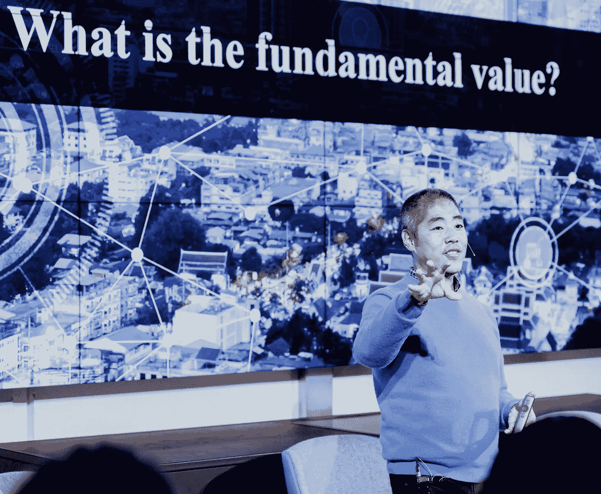
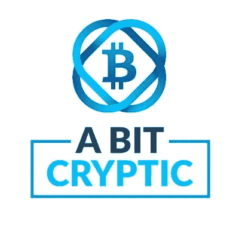

# 与 Miko Matsumura 的播客，关于同意和开源资金！

> 原文：<https://medium.com/coinmonks/podcast-with-miko-matsumura-on-consent-and-open-source-money-41929b164f78?source=collection_archive---------13----------------------->

查看我们对硅谷资深布道者 Miko Matsumura 的精彩采访，他追溯了早期互联网时代的开源运动如何引领我们走向加密货币以及未来在哪里。可在 [iTunes](http://abitcryptic.cast.rocks/feed.xml) 和 [Google Play](https://play.google.com/music/m/Dnwca3chxwhv54gbdsxq74vvfla?t=5_Miko_Matsumura__Voting_with_Your_Feet-A_Bit_Cryptic) 上下载！

以下亮点:

# **巫女的来历**

Miko 自称是“开源狂热者”，在硅谷的 25 年里，他与许多初创公司合作过。他的第一次正式演出要追溯到 1995 年，当时他是首席 Java 传道者。这是 Java 编程语言和互联网消费化的早期。这个开源基金会是加密货币的天然支点，因为它就像开源货币。

## **什么是开源？钱为什么是开源软件？**

Miko 认为这是基于同意的经济的一个被证明的基础。Github 拥有价值一万亿美元的自由软件，这是在没有硬激励的情况下实现的。

Miko 看开源软件吃软件。这是一个传授知识的逻辑系统，使创新永久化，就软件开发而言，类似于推进社会的进化矩阵。

他喜欢社区氛围。一旦社区找到解决方案，它就成为基础设施的一部分。由于持续改进，本质上，它是一个自我改进的矩阵，竞争人们的同意。

## **什么是同意？**

在开源领域，人们是自愿参与的。用户表示同意开源，因为他们渴望自由软件。但是人们可以看到开源软件与商业(专有)软件竞争。实际上，开发者这样做是为了乐趣、竞争和荣耀。有公司从这些软件中受益的例子，所以他们也对社区有所贡献。

但它的核心是达尔瓦尼主义，由对同意的竞争所驱动。软件业比以往任何时候都大，但是规则是由开源软件驱动或定义的。

同样，开源货币将是货币的规则；开源的钱会争夺人们的同意。在任何经济体系下，人们都会用脚投票。

Miko speaking at an event on [Blockchain Unleashed](https://www.youtube.com/watch?v=fNJGjkl1-Jk&feature=youtu.be), hosted by Modex, in London

## **作为开源软件的加密货币**

在早期，对开源开发的激励最多是宽松的。但对于加密货币和区块链项目，核心用户受到激励——终端用户、开发人员、团队等。

人们被赋予权力并获得财务独立。核心用户在采用、发展和改进网络方面有既得利益。人们的生活依赖于网络的成功。涌入这一行业的资本——高达 60 亿美元。对于最初的硬币发行-使它成为一个人才抢夺。

钱现在是聪明的钱，因为人们可以投票。围绕可编程货币有很多实验，因为它可以激励网络和用户行为。用美元进行货币政策实验是不可行的，也不符合社会需求，因为美元本身不具备确定性的可编程特征。

## **可编程货币不是源于政治，而是开源**

目前，政府主导着货币，但它不一定是这样的。如果你有专有资金，它会在同意的基础上与全球开源资金竞争。

游戏可以以各种结果展开，但人们会用脚投票。有不同的杠杆，比如法规。历史证据表明，调控市场趋势有多难。

很难把妖怪放回瓶子里，尤其是当你看到住所竞争的时候。例如，由于日本对中国和韩国的友好态度，日本在加密市场获得了相当大的份额。

## **你如何监管开源资金？**

很难监管一个基于同意和开源资金模式的全球市场。权力下放正在酝酿之中，甚至不可避免。

在全球金融危机之后，我们采纳了奥地利经济学的元素。我们看到中央控制的经济体系并没有像预期的那样运行。我们不相信中央组织有至高无上的权力。

Miko 建议拿起“Satoshi 之书”，这是一个来自中本聪的电子邮件展览。这些电子邮件显示，Satoshi 是一个令人难以置信的开源设计师，他是最初的比特币白皮书的作者。他借用了很多想法，但是游戏理论结构表明他对人类行为非常着迷。

## **首次发行硬币的成功原则**

在为许多 ico 提供建议后，Miko 发现了三个要素(非规定性的)。

1.  说服有才能的人为你工作。核心团队至关重要，因为这些项目涉及许多方面。
2.  想想“加密经济时代”:快速发货，因此是一个强大、可信的团队——最好是一个经历过开发周期的团队。
3.  良好的治理结构。要问的问题:是否有一个可信的成功和收益机制来激励网络的创造者。它有合理的监管链吗？是否有多重签名钱包、象征性锁定/授权时间表或强有力的董事会？

Miko 对这些垂直领域有浓厚的兴趣:金融服务、游戏和共享经济——因为他的领域知识可以让他了解如何采用模式。相反，他倾向于远离其他行业，如虚拟现实、医疗保健和能源。

> [在您的收件箱中直接获得最佳软件交易](https://coincodecap.com/?utm_source=coinmonks)

# 学分:

**播客主持人:** [杰夫·皮特森](https://www.linkedin.com/in/jeffcpeterson) &阿兰·莱昂

**节目编剧:** [当度](https://www.linkedin.com/in/dang-du-330068106)

**关注我们:**

[**中型**](/@abitcryptic) **，** [**中型**](https://steemit.com/@abitcryptic)

**推特:**[**@ keepitcryptic**](https://twitter.com/keepitcryptic)

**播客:**[**Itunes**](https://itunes.apple.com/us/podcast/a-bit-cryptic/id1359437472?mt=2)**，**[**Google Play**](https://play.google.com/music/listen?u=0#/ps/Ig4xr743xcrdqqcbvokbxrf4j5i)