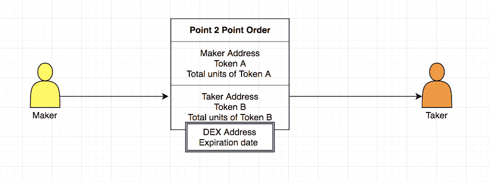
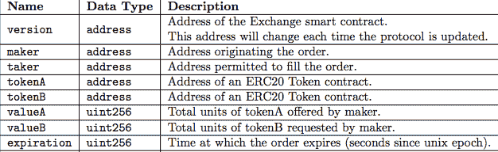
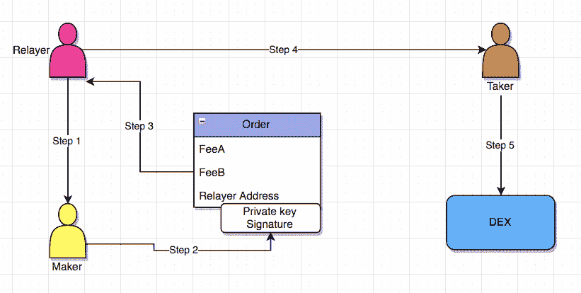

# 0x 协议上的点对点命令和广播命令

> 原文：<https://medium.com/coinmonks/point-to-point-orders-and-broadcast-orders-on-0x-protocol-50ad4087d099?source=collection_archive---------7----------------------->

如果你不知道 0x 协议的[链外顺序和链内结算的一般顺序，请阅读我们以前的文章。](/@usmanework99/diving-deep-into-0x-protocol-547efb83ffed)[“深入 0x 协议”](/@usmanework99/diving-deep-into-0x-protocol-547efb83ffed)

现在我们来详细说说点对点顺序和通过 Relayer 的广播顺序。

**点到点顺序:**

通过点对点订单，制造商和接受者可以直接交换代币。在点对点模式中，订单生成者在创建订单时会考虑特定的收货人，因此订单只能填写该收货人的地址，这使得该订单对其他所有人都无效。

让我们看一下图 1.2

( Figure 1.2)

图 1.3 中解释了点对点顺序的消息格式

(Figure 1.3)

**通过中继器广播命令:**

为了创造流动性，必须有一些公开的订单簿，卖家可以在上面发布订单，买家可以填写订单。这里的广播订单解决了这个问题，它允许任何人维护一个订单簿，并对他们的服务收取少量费用。任何主持和维护订单簿的人都被称为中继者。中继者从不像其他交易所那样执行交易，只有接受者可以执行他们的订单。

(Figure 1.4)

为了理解继电器的工作原理，让我们看一下图 1.4，并逐步讨论。

**第一步:** Relayer 提供一份收费表(服务费),以及收取该费用的地址。

**第二步:** Maker 创建一个订单，根据 relayer 的规范设置 feeA 和 feeB [1]的值，然后 Maker 用他/她的私钥签署地址。

**第三步:**订单生成者签字后，将订单发送给继电器。

继电器收到订单，并检查其是否符合要求(费用表)，如果不符合，订单将被拒绝。如果是，则中继员将该订单记入他/她的订单簿。

**第 4 步:**接受者得到一份更新的订单簿，上面有制造商下的新订单。

**第五步:**接受者通过将订单提交给分散式交易所智能合约来完成制造商的订单。

然后进行令牌传输。

[1] feeA =制造商向转播商支付的代币，作为他/她的服务。

feeB =接受者支付给转播者的代币。

感谢 [Sidra Tariq](/@sidratariq) 对我们这篇文章的帮助。