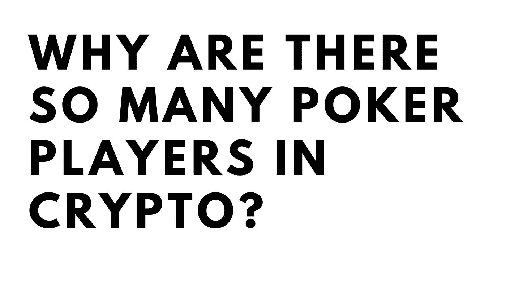
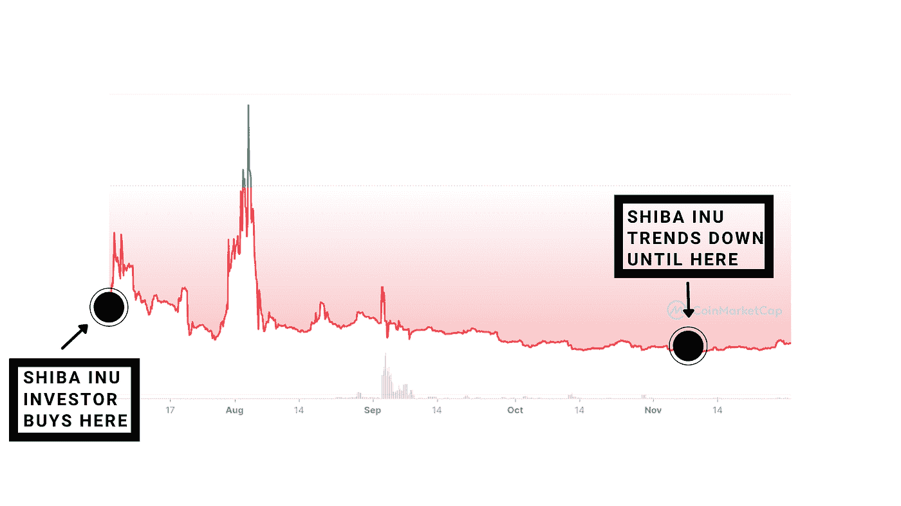
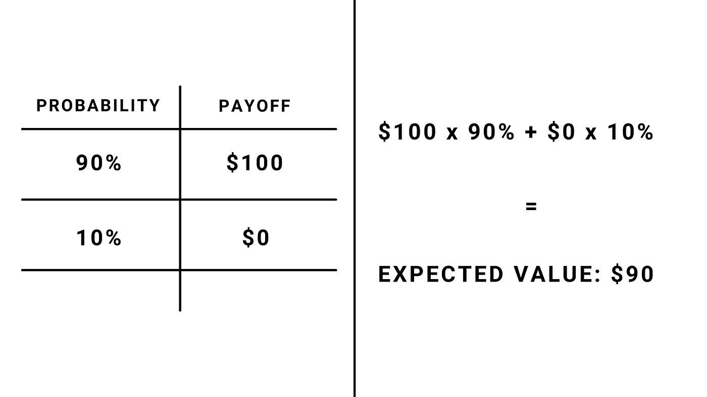
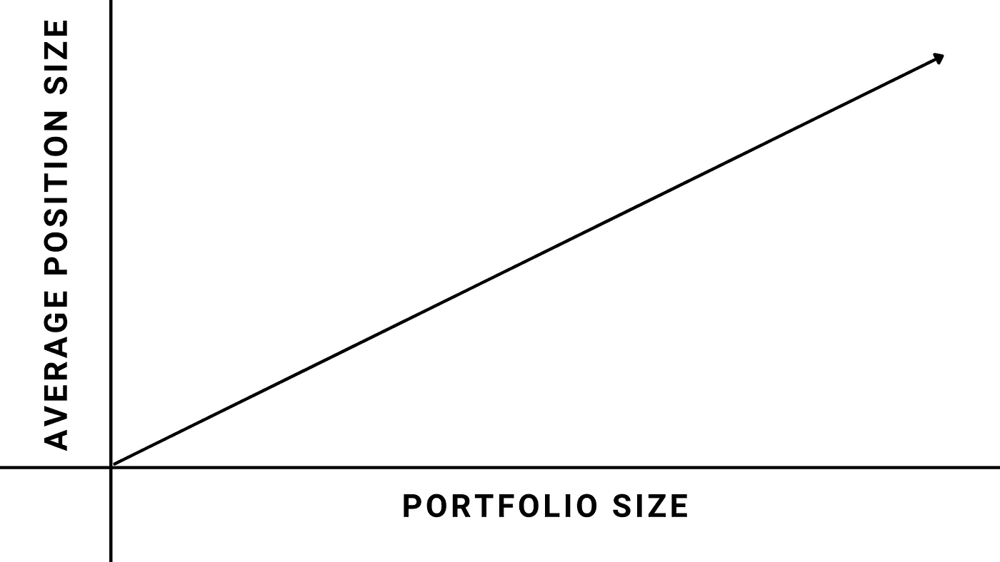
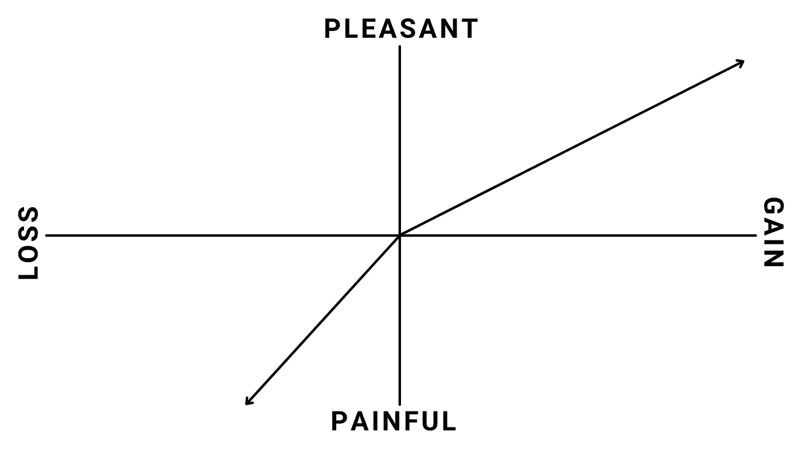

# 加密投资者的扑克智慧:避免陷阱，找到优势

> 原文：<https://medium.com/coinmonks/poker-wisdom-for-crypto-investors-avoiding-traps-and-finding-an-edge-ef49ea90e8b5?source=collection_archive---------5----------------------->

## 我的内容只有一小部分发表在媒体上。如果你想获得所有加密实用主义者的 altcoin 报告和投资分析，请在此免费注册简讯。

在过去的几周里，我开始意识到 crypto 中有多少最敏锐和最成功的头脑有玩扑克的背景。这里有一个不全面的列表:

*   三箭资本 CEO、[投资方**苏柱**](https://twitter.com/zhusu)
*   以太坊联合创始人， [**米海艾丽西**](https://twitter.com/MihaiAlisie)
*   宏观交易员和博弈理论家 [**乔迪·亚历山大**](https://twitter.com/gametheorizing)
*   化名传奇道具操盘手 [**化名光**](https://twitter.com/lightcrypto)
*   扑克玩家出身的密码倡导者 [**丹尼尔·凯茨**](https://twitter.com/junglemandan)

这只是五个有扑克经验的著名名字，或者更重要的是，有博弈论经验，研究战略互动。

那么，从扑克到密码有哪些交叉概念呢？毫无疑问，这两个领域马上就有一些共同的想法:期望值计算、面向概率的思维、战略决策、如何找到优势、风险管理。

让我明确一件事:这些是非常不同的学科，具有非常不同的技能组合，聪明人往往会在他们参与的任何行业中浮到顶端。然而，它仍然值得一看，看看我们是否能在关键时刻学到一些东西。

​

# 1.以结果为导向的思维的危险

**用扑克术语来说:**假设你正在玩扑克，根据对手早期的玩法，你认为他有口袋国王或 a。你有一对 10。翻牌圈和河牌圈对你俩都没什么好处。你的对手在河牌圈前全押，你决定试试运气，跟注。最后一张牌出现了一张 10，你突然得到了一张 3。你赢得了底池，并断定你是个天才。

在现实中，概率表明，在最后一张牌翻出来之前，你有 9%的胜算，这意味着你全押是个傻瓜——你只是运气好。你根据结果得出你是天才的结论，而不是任何基本事实、价值计算或概率。这被称为结果导向思维，它不仅在数学上有缺陷，而且随着时间的推移，这种观点会让你赔钱。

**将知识应用到 Crypto:** 打这个赌就相当于是那个在柴犬身上赌了 8000 美元，现在是亿万富翁的家伙。当然，他现在有 50 亿美元，但他在 400 多天里一直持有一笔根本毫无价值的投资。几乎任何股票或密码都比他的更有现实价值。他的投资更有可能变成零，而不是 50 亿。坦白地说，他没有早点卖掉他的投资的事实证明他是一个比我们想象的更糟糕的投资者！​

FOMO(害怕错过)是结果导向思维的一个很好的例子。它让我们无视理性，只关注一个结果:价格上涨。以结果为导向的思维也以另一种方式运作:也许你做了基础研究，看了看技术分析，寻找一个完美的切入点，但尽管如此，你的投资还是下降了。

那次损失不值得你自责。目标是根据合理的论点和合理的计划做出合理的投资决策。如果你能做到这一点，随着时间的推移，你会在 crypto 中赚钱。如果你依赖基于结果的思维，你很可能会以失败告终(或者只有在你运气好的时候才会赢)。

**教训:**

*   **成功的投资并不总是好的投资**
*   **FOMO 是注重结果的思维**
*   在明智的决策上赔钱没什么好羞愧的
*   **在错误的决策上赚钱是一件坏事**

# 2.坏节拍:理解期望值

**用扑克术语来说:**你听过团队‘烂打’吗？这是一个扑克术语，指的是当你有一手好牌，从数学上来说有可能赢，但你的对手很幸运，你最终成为输家。从另一个角度来看:即使有 90%的可能性，你仍然会失去 10%的机会。“期望值”是正数，但任何一手牌都可能让你亏损。

**将知识应用于加密:**假设你发现了一个很棒的小盘股 alt，它锁定了大量的[价值](https://coinmarketcap.com/alexandria/glossary/total-value-locked-tvl)，其市值与做同样事情的竞争对手相比微不足道。即使 TVL /市值比率上升到其竞争对手的水平，硬币也会涨 3 倍。

虽然看起来你发现了一个被低估的宝石，但你的替代硬币仍有可能被黑客攻击或被盗，或者在你购买后的第二天出现了可怕的市场低迷。如果你把所有的钱都投进去了，那你就彻底倒霉了。

但是，如果你在不同时期分散投资于 10 个具有相同特征的代用币，你可能会做得很好。你知道时间和机会会降临到他们身上，不要下太大的赌注，从长远来看，这些赌注是值得的。了解某项投资的预期价值，你将做出更好的长期投资决策。

**课程:**

*   **厄运降临**
*   **做许多高期望值的决定，随着时间的推移，你会赚到钱**
*   **了解价格上涨的概率和幅度**

# 3.头寸规模:投资适量

**用扑克术语来说:**假设您连续三手牌的胜算是 75%，但您每次都下注原始资金的三分之一。你在一些高期望值的赌博中运气不佳，现在你已经输光了所有的钱。

请记住:您的资金必须得到保护！随着你筹码的增加，你可以用更多的资金进入风险更高的仓位。随着你的资金减少，是时候缩减规模了。

**将知识应用于加密:**在加密投资中，有一件事比任何事情都重要:保本。如果你没有钱去投资，你就不可能再起来战斗了。如果你想参与加密市场，让你的资本获得丰厚回报是可选的。但是有资本？那是百分百有必要的。

头寸规模的要点是使用预期收益和可用余额来最大化回报。当你开始时，很容易下大赌注快速成长，但这是错误的方法。从小处着手，通过一点一点地赚钱来积累你的财富。随着你的规模扩大，你可以开始增加你的头寸规模，以利用你新发现的杠杆优势(有时人们投资也不够)。如果你的投资组合最终缩水了一点，是时候再次缩减规模了。

**课程:**

*   不要让厄运将你击垮
*   **不要被小投资组合的大赌注所诱惑**
*   随着你投资组合的增长，上下调整你的仓位大小

# 4.非理性错误:追逐亏损

**用扑克术语来说:**许多扑克新手在输掉一大笔钱后，试图立即“把钱赚回来”，通常是通过加大赌注。这包括玩最低下注额/平均底池金额更高的扑克游戏。你最终会在不利的情况下与更有技巧的玩家比赛，从而更快地输掉更多的钱。这是一个恶性循环。

**将知识应用到加密中:**在加密中，当人们遭受重大损失时，他们通常会犯以下三种错误之一:

1.  卖掉所有东西，永远离开这个地方
2.  开始玩高风险资产
3.  利用杠杆来使他们的钱回来

所有这些决策都是愚蠢的，并且是基于沉没成本的。钱没了，没办法再要回来。每一天，你都是从零开始，你的投资决策应该被重新评估。

请记住，人类天生厌恶损失:对我们来说，失去 100 美元比获得 100 美元更痛苦。有一些理论解释了为什么会这样，但这几乎是普遍适用的。还记得你第一次大规模提款吗？比你第一次助跑疼多了，不是吗？

上面的图表有助于说明我的观点。损失和收益在痛苦程度上不是线性的:1 美元的损失比 1 美元的收益感觉更好，等等。这是另一个需要避免的偏见。为了进行有效的风险/回报计算，我们应该尽量避免这种损失厌恶，因为它会导致我们做出扭曲的风险-回报计算。

**课程:**

*   我们应该避免因为新的得失而改变自己的观点
*   沉没成本已经消失，与未来的决策无关。
*   **意识到并抵制损失厌恶**

# 正和游戏:密码的王牌

如果所有这些比较让你认为加密更多的是赌博而不是投资，我有一些好消息。

扑克是经济学家所说的零和游戏:在一场扑克游戏中，没有创造或毁灭金钱，只有重新分配。你每损失 100 美元，就会有其他人赚到。这些是竞争性的游戏，在游戏中，拥有优势的人将赢得时间，并为自己创造积极的价值。

有趣的是，**交易** cryptos 也是零和游戏:当收益与市场平均水平相比时。它只涉及玩家试图维持优势，一些人成功，另一些人失败。

但是**投资**加密，几乎所有类型的投资(除了期权和期货)都是**正和游戏:**收益和损失的总和大于零。所以如果我们都买同样的 altcoin，水涨船高，我们都能共赢。这并不是说你不会输，但当平均加密投资趋势上升时，每个人都有可能赢。通过选择花时间在 crypto 上，而不是像 crypto 这样的零和游戏，你已经领先一步了。

正价值游戏是最好的游戏类型，因为它们为每个人增加了价值。通过了解如何玩它们，以及了解如何避免有时会困住我们的常见陷阱和偏见，我们可以为我们的投资组合创造高于平均水平的长期回报。

> 加入 Coinmonks [电报频道](https://t.me/coincodecap)和 [Youtube 频道](https://www.youtube.com/c/coinmonks/videos)了解加密交易和投资

## 另外，阅读

*   [BlockFi 信用卡](https://blog.coincodecap.com/blockfi-credit-card) | [如何在币安购买比特币](https://blog.coincodecap.com/buy-bitcoin-binance)
*   [火币交易机器人](https://blog.coincodecap.com/huobi-trading-bot) | [如何购买 ADA](https://blog.coincodecap.com/buy-ada-cardano) | [Geco。一次回顾](https://blog.coincodecap.com/geco-one-review)
*   [加密复制交易平台](/coinmonks/top-10-crypto-copy-trading-platforms-for-beginners-d0c37c7d698c) | [五大 BlockFi 替代品](https://blog.coincodecap.com/blockfi-alternatives)
*   [CoinLoan 点评](https://blog.coincodecap.com/coinloan-review)|[Crypto.com 点评](/coinmonks/crypto-com-review-f143dca1f74c) | [火币保证金交易](/coinmonks/huobi-margin-trading-b3b06cdc1519)
*   [Bybit vs 币安](https://blog.coincodecap.com/bybit-binance-moonxbt)|[stealth x 回顾](/coinmonks/stealthex-review-396c67309988) | [Probit 回顾](https://blog.coincodecap.com/probit-review)
*   [顶级付费加密货币和区块链课程](https://blog.coincodecap.com/blockchain-courses)
*   [在美国如何使用 BitMEX？](https://blog.coincodecap.com/use-bitmex-in-usa) | [BitMEX 评论](https://blog.coincodecap.com/bitmex-review)
*   [最佳期货交易信号](https://blog.coincodecap.com/futures-trading-signals) | [流动性交易所评论](https://blog.coincodecap.com/liquid-exchange-review)
*   [南非的加密交易所](https://blog.coincodecap.com/crypto-exchanges-in-south-africa) | [BitMEX 加密信号](https://blog.coincodecap.com/bitmex-crypto-signals)
*   [MoonXBT 副本交易](https://blog.coincodecap.com/moonxbt-copy-trading) | [阿联酋的加密钱包](https://blog.coincodecap.com/crypto-wallets-in-uae)
*   [雷米塔诺评论](https://blog.coincodecap.com/remitano-review)|[1 英寸协议指南](https://blog.coincodecap.com/1inch)
*   [MoonXBT vs Bybit vs 币安](https://blog.coincodecap.com/bybit-binance-moonxbt) | [Arbitrum:第二层解决方案](https://blog.coincodecap.com/arbitrum)
*   [买 PancakeSwap(蛋糕)](https://blog.coincodecap.com/buy-pancakeswap)|[matrix export Review](https://blog.coincodecap.com/matrixport-review)
*   [最佳免费加密信号](https://blog.coincodecap.com/free-crypto-signals) | [YoBit 评论](/coinmonks/yobit-review-175464162c62) | [Bitbns 评论](/coinmonks/bitbns-review-38256a07e161)
*   [OKEx 评论](/coinmonks/okex-review-6b369304110f) | [Kucoin 交易机器人](/coinmonks/kucoin-trading-bot-automate-your-trades-8cf0ca2138e0) | [期货交易机器人](/coinmonks/futures-trading-bots-5a282ccee3f5)
*   [AscendEx Staking](https://blog.coincodecap.com/ascendex-staking)|[Bot Ocean Review](https://blog.coincodecap.com/bot-ocean-review)|[最佳比特币钱包](https://blog.coincodecap.com/bitcoin-wallets-india)
*   [霍比审核](https://blog.coincodecap.com/huobi-review) | [OKEx 保证金交易](https://blog.coincodecap.com/okex-margin-trading) | [期货交易](https://blog.coincodecap.com/futures-trading)