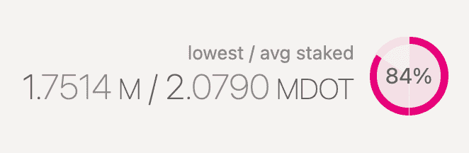

# 波尔卡多特:悲观的卷起世界

> 原文：<https://medium.com/coinmonks/polkadot-a-pessimistic-rollup-world-89fee1cfcd5f?source=collection_archive---------3----------------------->

## 以卷为中心的未来会让波尔卡多特过时吗？

可伸缩性、互操作性和模块化。这些术语都是 web3 未来的一部分，也是 Polkadot 的核心。

作为领先的零层，Polkadot 为不同的执行环境(“副链”)提供了一个共享的安全层(“中继链”)，每个执行环境都适合各自的用例。副链可以相互作用和交换价值，实现引以为豪的跨链互操作性。凭借其精心设计的链上治理系统，决策在链上自主制定，Polkadot 拥有一个吸收创新和适应变化的有意义的工具。不喜欢什么？

rollups 的决定性出现。[上以太坊](https://vitalik.ca/general/2021/12/06/endgame.html)。

在我看来，以 rollup 为中心的以太坊实现了 Polkadot 的愿景，但有两个关键区别:它没有在去中心化上做出妥协，保留了一个由单一“金钱”束缚的生态系统。

# 什么是汇总？

一般来说，rollup 是一种将执行移出主链而不牺牲其安全性的方法。有两类汇总:乐观汇总和 zk 汇总。

乐观汇总对事务进行批处理，并向主链提交一个有代表性的散列。该汇总被认为是乐观的，因为状态转换被认为是正确的，除非受到挑战。从累计中提取资金需要用户提交保证金，并受质询期的限制。在一个完全由主链仲裁的过程中，挑战者可以提交“欺诈证据”，如果成功的话，还可以赢得退出保证金。如今，实时乐观汇总包括 Arbitrum、Boba 和乐观。

Arbitrum is currently the rollup with the [highest total value locked](https://l2beat.com/) (TVL) on DeFi

另一方面，zk-rollup 利用零知识加密将事务压缩成“有效性证明”。这一证明代表了一般的状态转换，并在汇总的主链智能合约上得到验证。因此，任何给定的状态都被认为是有效的，退出主链不受质疑期的限制。今天，StarkWare 和 zkSync 正在领导 zk-rollups 的开发。

# 汇总勾选(波尔卡点卡)框

向以汇总为中心的以太坊的转变是由关键职责的模块化分离定义的:安全性、执行和数据可用性。

安全将由以太坊主链负责。类似于中继链，其作用将是提供一个分散、稳定和安全的共识层。

另一方面，执行将转向汇总。像 parachains 一样，rollups 是可定制的、可伸缩的和可互操作的执行层，它们被绑定到共享的安全层。

它们是可定制的，因为汇总的概念与执行环境无关。rollup 可以拥有最适合其用例的任何执行环境，只要其状态转换被提交到安全层。Sorare 和 dYdX 都是针对各自的业务逻辑进行优化的汇总。

它们是可扩展的，因为它们可以在不牺牲不信任的情况下纵向扩展到无限的程度。一个 rollup 可以是一个像 Solana 一样的以吞吐量为中心的区块链，也可以是一台超级强大的机器——无论哪种方式，它的信任属性都取决于主链。

它们是可互操作的，因为互操作性协议的竞争性、创造性空间已经出现。像 [Connext](https://xpollinate.io/) 、 [Synapse](https://synapseprotocol.com/) 和 [Hop](https://hop.exchange/) 这样的解决方案已经允许用户无缝地跨越 L2 桥接资产，并且他们还在继续迭代。

在所有这些方面，以 rollup 为中心的以太坊将把 Polkadot 的愿景变为现实。

# 而卷装占了上风

让我们从权力下放开始。目前，Polkadot 上的验证器数量上限为 297 个，大约需要 175 万 dot(约 4300 万美元)的专有和指定股份才能进入验证器集。相比之下，以太坊信标链有超过 200，000 个验证器节点，入场券是 32 ETH(约 128，000 美元)。

Snapshot from [polkadot.dotapps.io](https://cloudflare-ipfs.com/ipns/polkadot.dotapps.io/#/staking/targets) taken on December 18th 2021

去中心化是优势吗？除非你认为抵制审查和可信的中立是公共区块链的重要属性。然而，这一点是没有实际意义的，因为上卷并没有牺牲去中心化的好处。

此外，rollups 在捕捉以太坊的巨大网络效应方面处于更好的位置。除了依赖以太坊的安全属性，他们正在形成共享其应用程序、基础设施、开发者工具等等。

Ethereum developer platform A[lchemy recently extended its service to Optimism](https://blog.alchemy.com/blog/alchemy-optimism).

最重要的是，汇总共享以太坊的基础货币。乙醚目前是 Arbitrum、Boba 和乐观主义的基础货币。与这些平台(现在和未来)相关的代币很可能在治理和赌注方面具有效用，*但* *不能作为货币*。

这一点很重要，因为网络效应是围绕资产而不是执行环境固化的。为了说明这一点，替代以太坊虚拟机(如币安智能链、Celo 或 Avalanche)如果都做同样的事情，如何在长期内区分自己？

为了实现网络效应，资产必须针对“金钱”进行优化。自从 EIP-1559 的通货紧缩经济学生效以来，以太已经补充了它作为广泛使用的交换媒介的地位，具有明确的储值主张。通货紧缩的货币稳健性是一个公开的问题，但这个迷因肯定是根深蒂固的。相比之下，尽管 DOT 在联系、管理和赌注方面有其效用，但它并不是波尔卡多特世界中的货币。

The EIP-1559 money meme ([Justin Drake](https://twitter.com/drakefjustin/status/1367900072252473345))

# 终局

以 rollup 为中心的以太坊是智能合约区块链之间竞争的最后阶段吗？

在我看来，由零知识证明驱动的模块化结构将成为主导范式，以太坊是明显的——但有缺陷的——领导者。该网络向股权证明的转换仍悬而未决，我担心它的非流动性赌注模式将把赌注以太网集中在 Lido 中，Lido 是([部分由 VC 拥有的](https://www.theblockcrypto.com/linked/103874/eth2-staking-protocol-lido-raises-73-million-paradigm))液体赌注协议。此外，缺乏一个正式和透明的治理体系是任何有抱负的数字联邦的弱点。

也许另一个唯一拥有[长期](https://ex.rs/scaling-tezos/)基于模块化[路线图](https://www.youtube.com/watch?v=oqBSs0DSuzQ)的生态系统是 Tezos。其流动的利害关系证明、运营治理和正式验证就绪性是一个引人注目的设计，但其 cryptoverse 的份额仍然很小。也就是说，最近育碧、潘通和 Rarible 进入其生态系统是光明未来的最新迹象。

[Arthur Breitman](https://medium.com/u/50f422e6e1a9?source=post_page-----89fee1cfcd5f--------------------------------) – founding architect of Tezos – explains the modular paradigm.

波尔卡多呢？如果以 rollup 为中心的范例成为主流，Polkadot 可以充当数据可用性层。

目前，在链上持久化交易数据是驱动以太坊汇总交易成本的[。并非所有的应用程序都需要基础层上持久数据的信任特征。](https://notes.ethereum.org/@vbuterin/data_sharding_roadmap#Step-1-tx-calldata-expansion)[validium](https://ethereum.org/en/developers/docs/scaling/validium/)像 Sorare 向以太坊提交有效性证明——而不是交易数据——而[volities](/starkware/volition-and-the-emerging-data-availability-spectrum-87e8bfa09bb)允许用户在交易级别选择数据可用性偏好。在这种情况下，Polkadot 的异构、可互操作的分片模型可能是信任最小化的离线数据可用性的理想解决方案。

波尔卡多特拥有聪明的头脑、专注的社区、庞大的资金储备和升级能力——这些当然都很重要。然而，如果不是这样，波尔卡多特将在一个滚动的世界里无所事事。_________________________________________________________________

*感谢*[*Polynya*](https://medium.com/u/923c922a6d67?source=post_page-----89fee1cfcd5f--------------------------------)*通过媒体和 Twitter 帮助我了解模块化区块链的愿景。*

> 加入 Coinmonks [电报频道](https://t.me/coincodecap)和 [Youtube 频道](https://www.youtube.com/c/coinmonks/videos)了解加密交易和投资

## 另外，阅读

*   [加拿大最好的加密交易机器人](https://blog.coincodecap.com/5-best-crypto-trading-bots-in-canada) | [赌注加密](https://blog.coincodecap.com/staking-crypto)
*   [如何在印度购买比特币？](/coinmonks/buy-bitcoin-in-india-feb50ddfef94) | [瓦济克斯审查](/coinmonks/wazirx-review-5c811b074f5b)
*   [布洛克菲 vs 比特币基地](https://blog.coincodecap.com/blockfi-vs-coinbase) | [比特坎评论](https://blog.coincodecap.com/bitkan-review) | [币安评论](/coinmonks/binance-review-ee10d3bf3b6e)
*   [Coldcard 评论](https://blog.coincodecap.com/coldcard-review) | [BOXtradEX 评论](https://blog.coincodecap.com/boxtradex-review)|[uni swap 指南](https://blog.coincodecap.com/uniswap)
*   [阿联酋 5 大最佳加密交易所](https://blog.coincodecap.com/best-crypto-exchanges-in-uae) | [SimpleSwap 评论](https://blog.coincodecap.com/simpleswap-review)
*   [购买 Dogecoin 的 7 种最佳方式](https://blog.coincodecap.com/ways-to-buy-dogecoin) | [ZebPay 评论](https://blog.coincodecap.com/zebpay-review)
*   [iTop VPN 审查](https://blog.coincodecap.com/itop-vpn-review) | [曼陀罗交易所审查](https://blog.coincodecap.com/mandala-exchange-review)
*   [比特币基地 vs 瓦济克斯](https://blog.coincodecap.com/coinbase-vs-wazirx) | [比特鲁点评](https://blog.coincodecap.com/bitrue-review) | [波洛涅克斯 vs 比特鲁](https://blog.coincodecap.com/poloniex-vs-bittrex)
*   [美国最佳加密交易机器人](https://blog.coincodecap.com/crypto-trading-bots-in-the-us) | [经常性回顾](https://blog.coincodecap.com/changelly-review)
*   [A-Ads 审查](https://blog.coincodecap.com/a-ads-review) | [Bingbon 审查](https://blog.coincodecap.com/bingbon-review) | [Mudrex 投资](https://blog.coincodecap.com/mudrex-invest-review-the-best-way-to-invest-in-crypto)
*   [最好的卡达诺钱包](https://blog.coincodecap.com/best-cardano-wallets) | [冰棒副本交易](https://blog.coincodecap.com/bingbon-copy-trading)
*   [印度最佳 P2P 加密交易所](https://blog.coincodecap.com/p2p-crypto-exchanges-in-india) | [柴犬钱包](https://blog.coincodecap.com/baby-shiba-inu-wallets)
*   [8 大加密联盟项目](https://blog.coincodecap.com/crypto-affiliate-programs) | [eToro vs 比特币基地](https://blog.coincodecap.com/etoro-vs-coinbase)