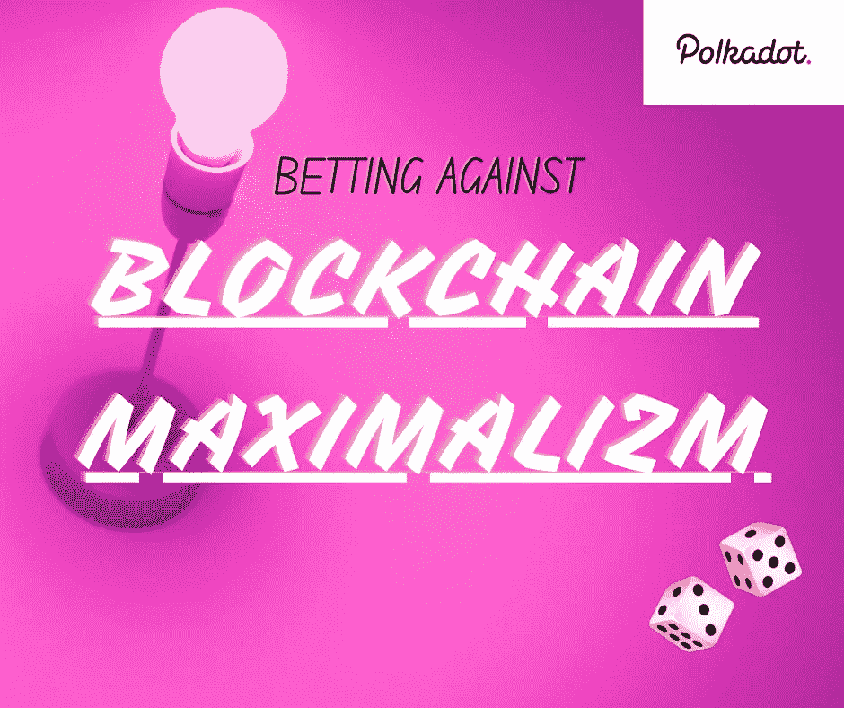

# Polkadot:反对区块链最大化主义

> 原文：<https://medium.com/coinmonks/polkadot-betting-against-blockchain-maximalism-ccfe4fd9db90?source=collection_archive---------9----------------------->

波尔卡多特会成为下一个伟大的奥特币吗？

2021 年的加密货币一直都是关于“智能合约战争”的。

人们很兴奋地想知道哪种加密货币会胜过以太坊，成为下一个伟大的 altcoin。

Designed by Author

我最近[在 Quora 上回答了一个类似的问题](https://qr.ae/pGzN8a)，在短时间内获得了 21.5K+的浏览量和 199+的投票。甚至…