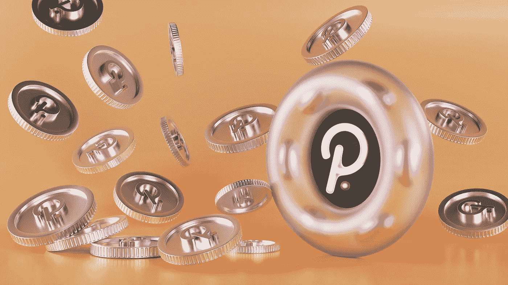
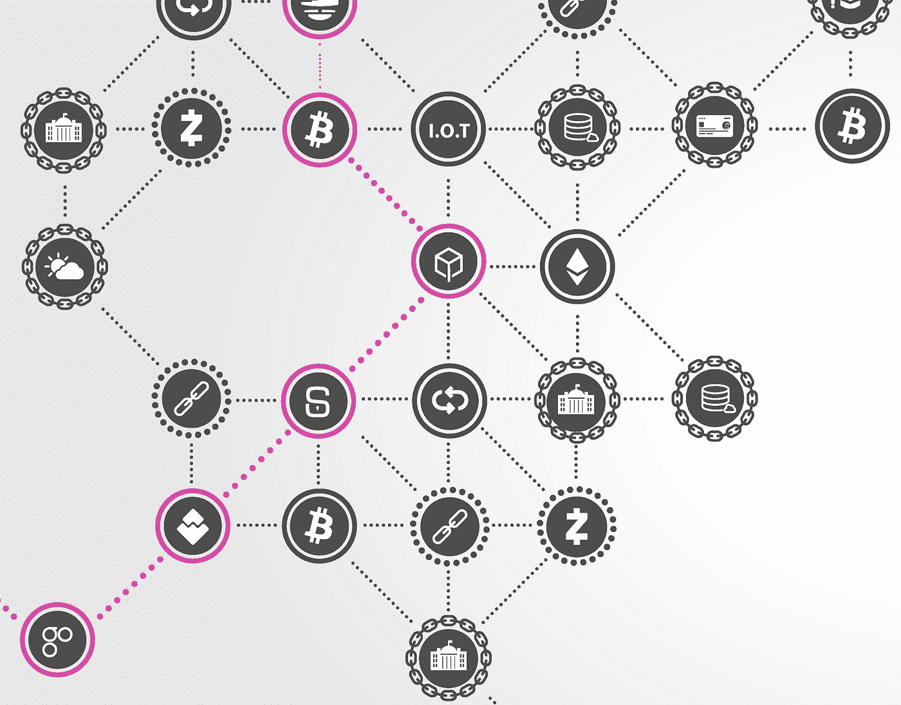
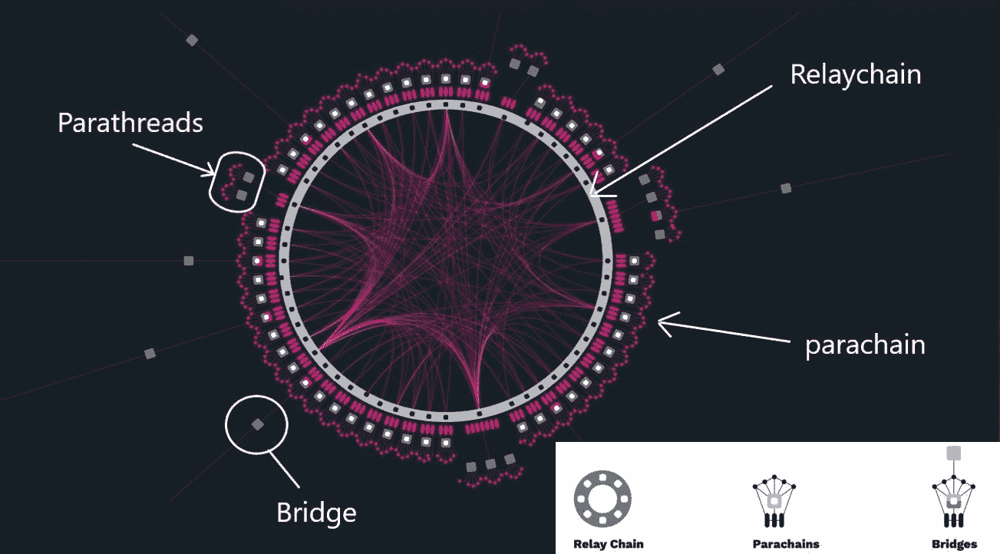
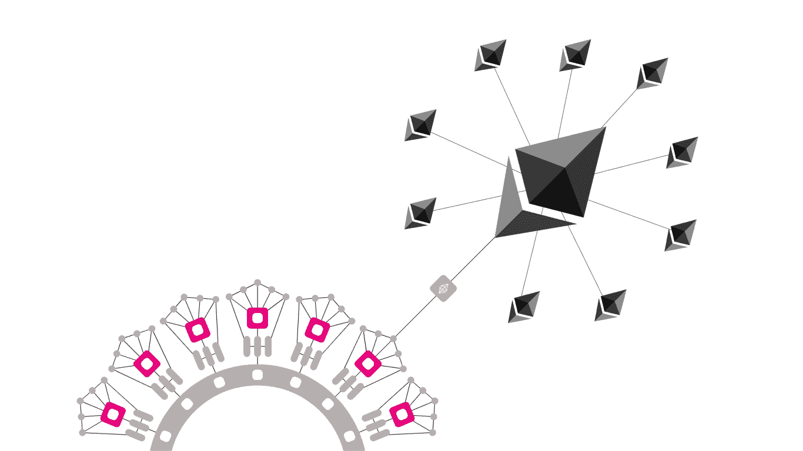
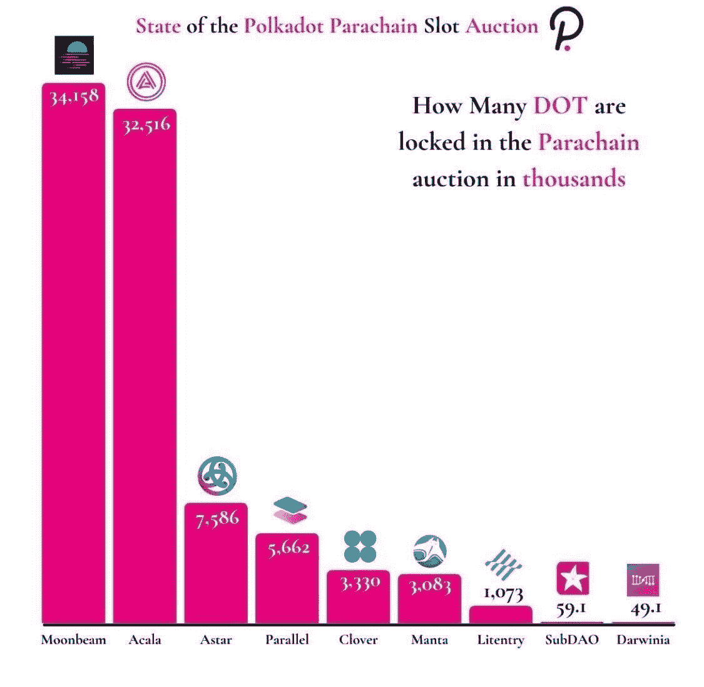

# 波尔卡多特——连接区块链世界

> 原文：<https://medium.com/coinmonks/polkadot-connecting-the-world-of-blockchains-d4136bae1265?source=collection_archive---------1----------------------->

unsplash

## 什么是波尔卡多？

要开始理解 Polkadot，我们必须首先解决现有的区块链互操作性问题。今天，许多区块链孤立经营，一个连锁店无法与另一个连锁店“交流”或“运作”。类似于互联网出现之前，计算机是存储数据但无法相互连接的孤立系统，直到 TCP/IP 被发明出来。以太坊、索拉纳和比特币本身就很棒，但它们需要能够无缝地相互通信。波尔卡多特网络是一种创建和连接区块链的方法。它是由以太坊的联合创始人兼首席技术官加文·伍德博士于 2017 年建立并发布的，他认为以太坊将只是“拼图的一小块”。

## 波尔卡多特能达到什么目的？

Polkadot 是“区块链的互联网”，随着区块链技术在世界范围内越来越广泛地使用，将需要一种区块链通信机制，类似于 HTML 允许网站、浏览器和服务器相互通信的方式。

Source: techcrunch.com

Polkadot 的技术允许数据在公共的、开放的、未经许可的区块链和私人的、经许可的区块链之间传输。公共和私人区块链之间的沟通是这个项目的一个重要方面。当我们这么说的时候，我们到底是什么意思？考虑开发从私有区块链获取许可数据并在公共区块链上使用的应用程序的可能性。例如，一所学校的私人许可学术记录链可以向公共链上的学位验证智能合同发送证明。健康记录、用于投票的数字身份等等都可以以相同的方式使用；可能性是无限的。

## 波尔卡多特背后的技术

Polkadot 是作为网络层 0 构建的，允许以太坊这样的第 1 层区块链在同一个网络上一起工作。在其核心部分，Polkadot 是一个由中继链和副链组成的安全区块链。

Source: usenobi.com

***中继链***

波尔卡多特网络的核心，网络上的所有区块链都连接到这里，就像轮辐连接到车轮的轮毂。它负责网络的共享安全、共识和互操作性。

***副链***

主权区块链可以拥有自己的令牌，并针对特定用途优化其功能。

***副线程***

类似于 Parachains，但采用现收现付模式。对于不需要持续连接到主网络的区块链来说更经济。

***桥梁***

允许副链和副线程与以太坊和比特币等外部网络连接和通信。

中继链上的区块链可以针对特定用例进行优化，允许团队准确地整合他们需要的功能。中继链允许 Polkadot 同时处理来自网络中所有链的事务，增加可扩展性。

***网络更新***

Polkadot 支持无叉链升级(各方没有意见分歧和形成替代链的机会)，团队可以更容易、更快地将新功能引入 Polkadot 上的区块链。

***跨链通信***

Source: bitfalls.com

中继链为链之间的相互通信提供了一种安全的方式。跨链消息机制允许链跨两个不同的区块链传输任何形式的数据，如以太坊和比特币。例如，考虑一个令牌、账户余额或真实世界的股票价格。这鼓励了利用各种链的独特能力的新型服务的开发。

***治理***

Polkadot 由所有利益相关者在链上透明地管理，通过使用本地令牌 dot 对公投进行提议和投票。与此同时，边区块链链是完全的主权和自由，以他们认为合适的方式管理自己的区块链。

***网络安全***

Polkadot 使用指定的利害关系证明来选择验证者。Polkadot 中的所有验证器在共识协议中具有相同的权重。也就是说，要获得链的 2/3 以上的支持，必须有 2/3 以上的验证者支持，而不是 2/3 的股份。同样，验证者的奖励与他们的活动挂钩，主要是阻止生产和终结的理由，而不是他们的股份数量。这就产生了一种激励，以较低的赌注提名验证者，因为他们将从他们的赌注令牌中获得更高的回报。

***定制***

Polkadot 的基板框架托盘—提供使用 Polkadot 基板创建定制区块链所需的单独组件，无需从头开始。它本质上提供了拖放功能，使得创建应用程序更加容易。

## 波尔卡多特的潜力

Polkadot 有能力创建一个区块链生态系统来重塑世界，旨在创建一个快速，互联，平稳运行的网络，允许高度定制和良好的基础，以任何新项目作为副链添加到他们的网络。

想象一下这样一个世界，大型企业可以将它用于数据存储、金融或医疗保健；政府可以将它用于智能合同法和投票及教育的身份管理；消费者可以从游戏、个人储蓄和社交网络中受益；所有这些都可以互相交流和互动，一些在私人的，另一些在公共的，定制的波尔卡多特连接的区块链。

Source: medium.com/polkadot-network

Polkadot 网络现在才开始成长和发展，通过公开拍卖在 Parachains 上创建了许多有前途的项目。据加文·伍德博士说，如果系统完全投入运行，每秒钟将能处理 100 万次交易。

## 摘要

对 Polkadot 进行估值可能与试图对当今互联网上全球计算机的互联性进行估值一样复杂。Polkadot 很可能是区块链的互联网，让世界各国政府、主要企业和慈善机构以最安全的方式运作，没有欺诈、数据利用和其他困扰当今互联网的问题。

我们可以保证，任何选举都不会有虚假投票，私人数据不会被黑客攻击或泄露，可持续的服装或食品来源将通过供应链得到验证。如今，这样的行动需要人类的参与，这滋生了不信任、利益冲突以及腐败。

*免责声明:本文包含的信息仅用于教育目的，并不构成 Wheatstones 的任何形式的建议或推荐，用户在做出(或避免做出)任何投资决定时也不打算依赖这些信息。*

> 加入 Coinmonks [电报频道](https://t.me/coincodecap)和 [Youtube 频道](https://www.youtube.com/c/coinmonks/videos)了解加密交易和投资

## 另外，阅读

*   [加拿大最好的加密交易机器人](https://blog.coincodecap.com/5-best-crypto-trading-bots-in-canada) | [赌注加密](https://blog.coincodecap.com/staking-crypto)
*   [如何在印度购买比特币？](/coinmonks/buy-bitcoin-in-india-feb50ddfef94) | [WazirX 审查](/coinmonks/wazirx-review-5c811b074f5b)
*   [最佳网上赌场](https://blog.coincodecap.com/best-online-casinos) | [硬件钱包](/coinmonks/hardware-wallets-dfa1211730c6)
*   [如何在 WazirX 上购买柴犬(SHIB)币？](https://blog.coincodecap.com/buy-shiba-wazirx)
*   [比特币主根](https://blog.coincodecap.com/bitcoin-taproot) | [排名前 6 的比特币信用卡](/coinmonks/bitcoin-credit-card-bc8ab6f377c6)
*   [最佳免费加密信号](https://blog.coincodecap.com/free-crypto-signals) | [YoBit 评论](/coinmonks/yobit-review-175464162c62) | [Bitbns 评论](/coinmonks/bitbns-review-38256a07e161)
*   【Huobi 的加密交易信号 | [BitMEX 评论](https://blog.coincodecap.com/bitmex-review)
*   [7 个最佳零费用加密交易平台](https://blog.coincodecap.com/zero-fee-crypto-exchanges)
*   [分散交易所](https://blog.coincodecap.com/what-are-decentralized-exchanges) | [比特 FIP](https://blog.coincodecap.com/bitbns-fip) | [Pionex 审查](https://blog.coincodecap.com/pionex-review-exchange-with-crypto-trading-bot)
*   [用信用卡购买密码的 10 个最佳地点](https://blog.coincodecap.com/buy-crypto-with-credit-card)
*   [OKEx 评论](/coinmonks/okex-review-6b369304110f) | [Kucoin 交易机器人](/coinmonks/kucoin-trading-bot-automate-your-trades-8cf0ca2138e0) | [期货交易机器人](/coinmonks/futures-trading-bots-5a282ccee3f5)
*   [AscendEx Staking](https://blog.coincodecap.com/ascendex-staking)|[Bot Ocean Review](https://blog.coincodecap.com/bot-ocean-review)|[最佳比特币钱包](https://blog.coincodecap.com/bitcoin-wallets-india)
*   [霍比审核](https://blog.coincodecap.com/huobi-review) | [OKEx 保证金交易](https://blog.coincodecap.com/okex-margin-trading) | [期货交易](https://blog.coincodecap.com/futures-trading)
*   [Godex.io 审核](/coinmonks/godex-io-review-7366086519fb) | [邀请审核](/coinmonks/invity-review-70f3030c0502) | [BitForex 审核](https://blog.coincodecap.com/bitforex-review)
*   [Crypto.com 费用](/coinmonks/binance-fees-8588ec17965) | [Botcrypto 审查](/coinmonks/botcrypto-review-2021-build-your-own-trading-bot-coincodecap-6b8332d736c7) | [替代方案](https://blog.coincodecap.com/crypto-com-alternatives)
*   [有哪些交易信号？](https://blog.coincodecap.com/trading-signal) | [Bitstamp vs 比特币基地](https://blog.coincodecap.com/bitstamp-coinbase) | [买索拉纳](https://blog.coincodecap.com/buy-solana)
*   [ProfitFarmers 回顾](https://blog.coincodecap.com/profitfarmers-review) | [如何使用 Cornix Trading Bot](https://blog.coincodecap.com/cornix-trading-bot)
*   [MXC 交易所评论](/coinmonks/mxc-exchange-review-3af0ec1cba8c) | [Pionex vs 币安](https://blog.coincodecap.com/pionex-vs-binance) | [Pionex 套利机器人](https://blog.coincodecap.com/pionex-arbitrage-bot)
*   [我的密码交易经验](/coinmonks/my-experience-with-crypto-copy-trading-d6feb2ce3ac5) | [《比特币基地评论》](/coinmonks/coinbase-review-6ef4e0f56064)
*   [CoinFLEX 评论](https://blog.coincodecap.com/coinflex-review) | [AEX 交易所评论](https://blog.coincodecap.com/aex-exchange-review) | [UPbit 评论](https://blog.coincodecap.com/upbit-review)
*   [AscendEx 保证金交易](https://blog.coincodecap.com/ascendex-margin-trading) | [Bitfinex 赌注](https://blog.coincodecap.com/bitfinex-staking) | [bitFlyer 审核](https://blog.coincodecap.com/bitflyer-review)
*   [麻雀交换评论](https://blog.coincodecap.com/sparrow-exchange-review) | [纳什交换评论](https://blog.coincodecap.com/nash-exchange-review)
*   [维护卡审核](https://blog.coincodecap.com/uphold-card-review) | [信任钱包 vs MetaMask](https://blog.coincodecap.com/trust-wallet-vs-metamask)