# Polkadot DeFi:测试 Acala 平台

> 原文：<https://medium.com/coinmonks/polkadot-defi-testing-the-acala-platform-99b26afc1ba5?source=collection_archive---------2----------------------->

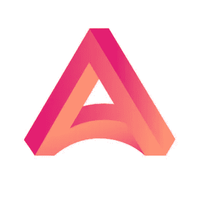

有很多关于 ACALA(Polkadot 中的 DeFi)的宣传。我最近在 Testnet 中测试了这个平台。这是一本指南。

## **登陆**

进入[阿卡拉 App](https://apps.acala.network/)

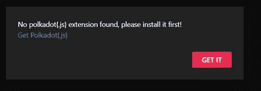

您将需要 polkadot.js 扩展名。安装并连接您的钱包。

## **获取 Testnet 令牌**

Acala 目前在曼陀罗测试网。使用以下[链接](https://wiki.acala.network/learn/get-started)获取测试令牌。我将使用不和谐机器人。

在“# acala-testnet-水龙头”组中给出您的地址！滴滴

格式。您将收到 testnet 令牌。现在你可以走了。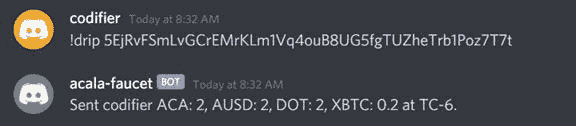

我能看到阿卡拉钱包里的代币。请注意，所有这些标记都是为了测试目的，没有实际价值。

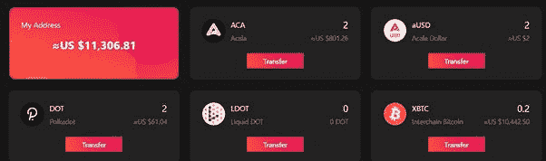

## **钱包**

钱包有 3 个标签。Acala，收藏品(是的 Acala 会做 NFTs)，跨链。

您可以将您的金额以相同的代币或澳元的形式转移到某个地址。

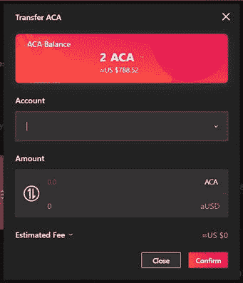

在收藏品门户网站下查看您的收藏品。

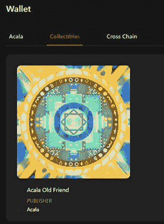

交叉链有两部分:

Polkadot 与比特币和以太坊网络之间的桥梁。

它还具有令牌的 Polkadot 间转移功能。

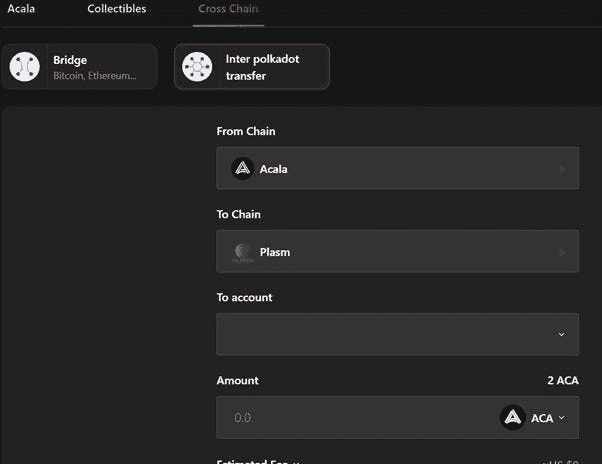

## **借贷**

澳元是与美元挂钩的稳定货币。转到借款 aUSD 并选择您的抵押品(点击开始)。

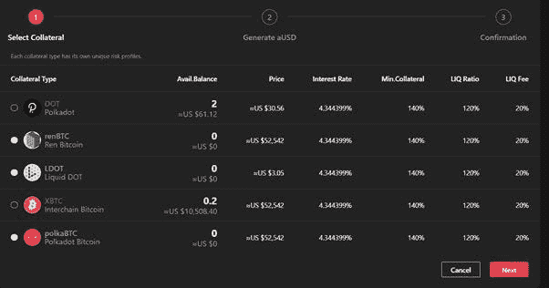

在贷款之前，我们需要讨论一些重要的参数。

**利率:**你所借澳元的年利率。对于 xBTC，它是 4.344%(在本例中)。

**最小值。担保品:**注意，你不能将价值相同的贷款作为你的担保品。这是为了确保缓冲，以确保在市场波动的情况下有一定范围的抵押品保持正值。在这种情况下，它是 140%。

**流动性比例:**这是一个借贷平台最大的风险。如果你的抵押品贷款比率低于 120%，你的抵押品将被自动出售，以弥补平台遭受的损失。您必须始终检查这是否保持在 120%以上

点击下一步。

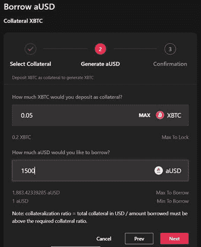

我选择我想作为抵押品的 xBTC 的数量。系统自动告诉我可以借多少。在这种情况下，最大 1883 澳大利亚元，最小 1 澳大利亚元。我选择较低的金额(1500 澳元)作为抵押。这是为了确保我的抵押品总是多于贷款额(大于 140%)。确认交易。系统告诉我我的抵押金额，目前是 175%。

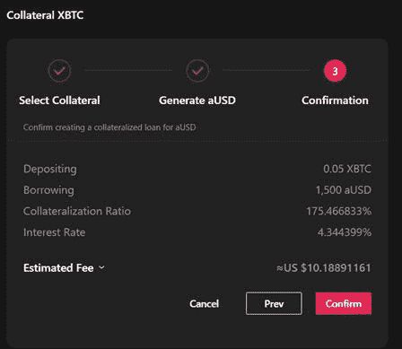

我的贷款没有创建，也没有生成 aUSD。概览部分将为我提供我的钱包详细信息和贷款金额的完整图片。只要我有抵押品，我就能创造更多的贷款。

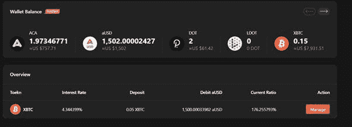

## **互换**

交换功能的灵感来自 Uniswap。然而，该方案是建立在 Acala 底物链上的。这将是所有波尔卡多特代币的绝佳接入点。现在，人们只能通过 Polkastarter 或付费网络获得 IDO 令牌，或者从 Uniswap 获得 ERC-20 令牌。一旦 Acala 进入 mainnet，人们可以直接从 Swap 功能中购买所有这些基于底物的代币。

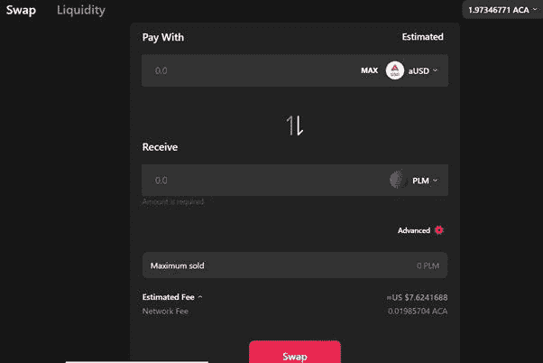

您还可以通过使用流动性功能为平台添加流动性。你必须向 Acala 提交令牌对，你将获得 ACA 奖励。一旦您为一个代币投入您想要存入的金额，系统将自动告诉您要存入的另一个代币的金额。在这种情况下，aUSD 和 xBTC。

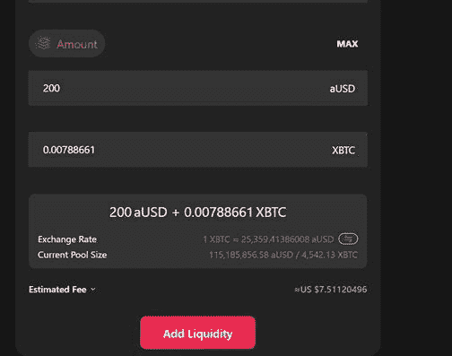

作为回报，您将获得 LP 令牌。当您想要撤销相同的 LP 时，您可以通过点击撤销功能并从下拉列表中选择 LP 来实现。

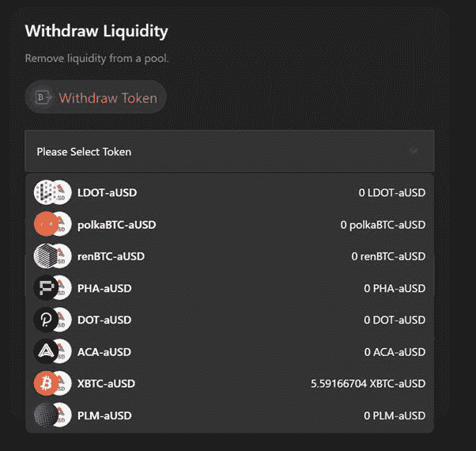

## **赚取**

除了通过提供流动性赚取的掉期费用之外，Earn 是一项附加功能。Earn 让您下注 LP 代币，从稳定费和 ACA 分配计划中赚取额外的 aUSD。

点击管理，然后存入您的 LP 令牌进行下注。你会开始积累 ACA。你可以声称你有足够的积累。

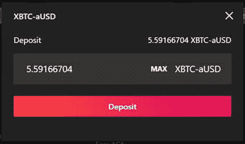

## **液体打桩**

液态圆点(LDOT)是圆点的衍生物。一旦被钉死，点被锁定 28 天，LDOT 使它成为液体。它可以交易，用于支付，也可以作为抵押品来产生澳元。

你通过点的赌注得到的 LDOT 的数量是通过一个算法。

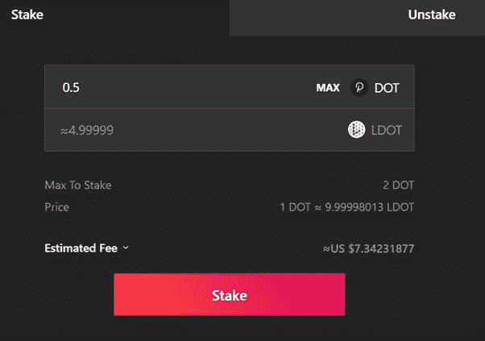

## **结论**

我发现 ACALA 真的很有趣，特别是液体点和它自己的稳定硬币的介绍。在 Parachain 拍卖期间，人们可以通过 bonding DOT 获得 ACALA。希望一切顺利。下次见。

**阅读上一篇:** [区块链基础知识:区块链的结构第一部分](https://tulip311bit.medium.com/blockchain-basics-structure-of-a-blockchain-part-1-86cb87559440)

***注:*** *本帖最初发表于* [*此处*](https://www.voice.com/post/@tulip/polkadot-defi-testing-the-acala-platform-1616737973-1308839232) *为与 voice.com 有关联的密码作者。*

**通过我的推荐加入**

[Crypto.com](https://binance.com/en/register?ref=E8PCD3AF)——[币安](https://platinum.crypto.com/r/sut3pd9bzn)

跟我来

**👉** [推特](https://twitter.com/rumadas123)

**👉** [Linkedin](https://www.linkedin.com/in/ruma-das-a1439320/)

> 加入 Coinmonks [Telegram group](https://t.me/joinchat/EPmjKpNYwRMsBI4p) 学习加密交易和投资

## 另外，阅读

*   [什么是融资融券交易](https://blog.coincodecap.com/margin-trading)
*   最好的[密码交易机器人](/coinmonks/crypto-trading-bot-c2ffce8acb2a) | [网格交易](https://blog.coincodecap.com/grid-trading)
*   [3 商业评论](/coinmonks/3commas-review-an-excellent-crypto-trading-bot-2020-1313a58bec92) | [Pionex 评论](/coinmonks/pionex-review-exchange-with-crypto-trading-bot-1e459d0191ea) | [Coinrule 评论](/coinmonks/coinrule-review-2021-a-beginner-friendly-crypto-trading-bot-daf0504848ba)
*   [AAX 交易所评论](/coinmonks/aax-exchange-review-2021-67c5ea09330c) | [德里比特评论](/coinmonks/deribit-review-options-fees-apis-and-testnet-2ca16c4bbdb2) | [FTX 交易所评论](/coinmonks/ftx-crypto-exchange-review-53664ac1198f)
*   [n 零复习](/coinmonks/ngrave-zero-review-c465cf8307fc) | [Phemex 复习](/coinmonks/phemex-review-4cfba0b49e28) | [PrimeXBT 复习](/coinmonks/primexbt-review-88e0815be858)
*   [Bybit Exchange 审查](/coinmonks/bybit-exchange-review-dbd570019b71) | [Bityard 审查](/coinmonks/bityard-review-7d104239be35) | [CoinSpot 审查](https://blog.coincodecap.com/coinspot-review)
*   [3 commas vs crypto hopper](/coinmonks/3commas-vs-pionex-vs-cryptohopper-best-crypto-bot-6a98d2baa203)|[赚取加密利息](/coinmonks/earn-crypto-interest-b10b810fdda3)
*   最好的比特币[硬件钱包](/coinmonks/the-best-cryptocurrency-hardware-wallets-of-2020-e28b1c124069?source=friends_link&sk=324dd9ff8556ab578d71e7ad7658ad7c) | [BitBox02 回顾](/coinmonks/bitbox02-review-your-swiss-bitcoin-hardware-wallet-c36c88fff29)
*   [莱杰 vs n ave](/coinmonks/ledger-vs-ngrave-zero-7e40f0c1d694)|[莱杰 nano s vs x](/coinmonks/ledger-nano-s-vs-x-battery-hardware-price-storage-59a6663fe3b0)
*   [密码本交易平台](/coinmonks/top-10-crypto-copy-trading-platforms-for-beginners-d0c37c7d698c)
*   [CoinLoan 评论](/coinmonks/coinloan-review-18128b9badc4) | [YouHodler 评论](/coinmonks/youhodler-4-easy-ways-to-make-money-98969b9689f2) | [BlockFi 评论](/coinmonks/blockfi-review-53096053c097)
*   最好的[加密税务软件](/coinmonks/best-crypto-tax-tool-for-my-money-72d4b430816b) | [硬币追踪评论](/coinmonks/cointracking-review-a-reliable-cryptocurrency-tax-software-5114e3eb5737)
*   最佳[加密借贷平台](/coinmonks/top-5-crypto-lending-platforms-in-2020-that-you-need-to-know-a1b675cec3fa) | [杠杆代币](/coinmonks/leveraged-token-3f5257808b22)
*   [block fi vs Celsius](/coinmonks/blockfi-vs-celsius-vs-hodlnaut-8a1cc8c26630)|[Hodlnaut 评论](/coinmonks/hodlnaut-review-best-way-to-hodl-is-to-earn-interest-on-your-bitcoin-6658a8c19edf)
*   [Bitsgap 审查](/coinmonks/bitsgap-review-a-crypto-trading-bot-that-makes-easy-money-a5d88a336df2) | [Quadency 审查](/coinmonks/quadency-review-a-crypto-trading-automation-platform-3068eaa374e1) | [Bitbns 审查](/coinmonks/bitbns-review-38256a07e161)
*   [埃利帕尔泰坦评论](/coinmonks/ellipal-titan-review-85e9071dd029) | [赛克斯斯通评论](/coinmonks/secux-stone-hardware-wallet-review-15-discount-coupon-2020-7577032faa6e)
*   [本地比特币审核](/coinmonks/localbitcoins-review-6cc001c6ed56) | [加密货币储蓄账户](https://blog.coincodecap.com/cryptocurrency-savings-accounts)
*   最佳[区块链分析](https://bitquery.io/blog/best-blockchain-analysis-tools-and-software)工具| [赚比特币](/coinmonks/earn-bitcoin-6e8bd3c592d9)
*   [加密套利](/coinmonks/crypto-arbitrage-guide-how-to-make-money-as-a-beginner-62bfe5c868f6)指南| [如何做空比特币](/coinmonks/how-to-short-bitcoin-568a2d0b4ae5)
*   最佳[加密制图工具](/coinmonks/what-are-the-best-charting-platforms-for-cryptocurrency-trading-85aade584d80) | [最佳加密交易所](/coinmonks/crypto-exchange-dd2f9d6f3769)
*   [如何在印度购买比特币？](/coinmonks/buy-bitcoin-in-india-feb50ddfef94) | [WazirX 审核](/coinmonks/wazirx-review-5c811b074f5b)
*   [印度比特币交易所](/coinmonks/bitcoin-exchange-in-india-7f1fe79715c9) | [比特币储蓄账户](/coinmonks/bitcoin-savings-account-e65b13f92451)
*   [CoinDCX 评论](/coinmonks/coindcx-review-8444db3621a2) | [加密保证金交易交易所](https://blog.coincodecap.com/crypto-margin-trading-exchanges)

*包含附属链接*

> [直接在您的收件箱中获得最佳软件交易](/coinmonks/newsletters/coinmonks)

