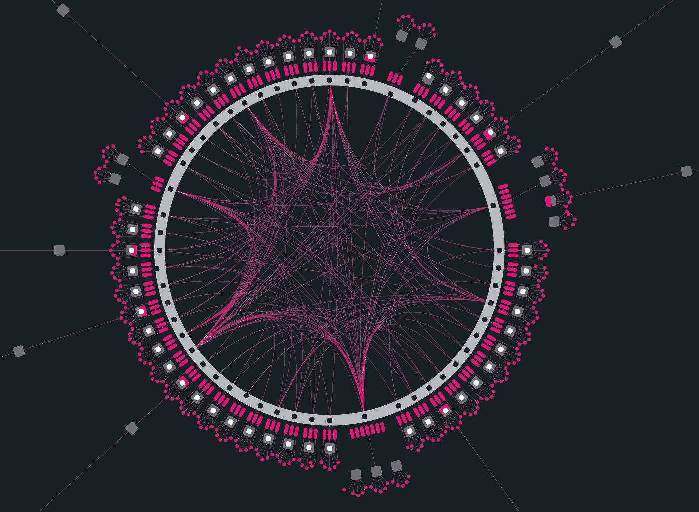

# 什么是波尔卡多副链？

> 原文：<https://medium.com/coinmonks/polkadot-parachain-f0a45ac7e056?source=collection_archive---------10----------------------->

## 什么是波尔卡多副链？为什么它们在 DOT 生态系统中是如此重要的概念，它们是如何工作的？

加密货币世界中最有趣的生态系统和项目之一无疑是 Polkadot。Polkadot 是一种以互操作性和可伸缩性为其优势的协议，允许从…