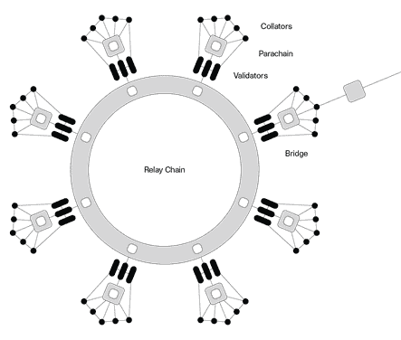
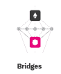
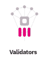
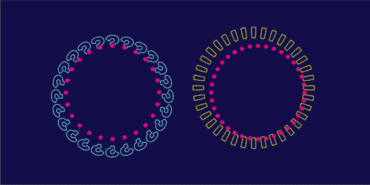

# 波尔卡多特系列第 1 部分—概述

> 原文：<https://medium.com/coinmonks/polkadot-series-part-1-overview-1ad0c7b8d442?source=collection_archive---------5----------------------->

在[语音](https://www.voice.com/post/@tulip/polkadot-series-part-1-overview-1605101607-1)看我的原帖。

Polkadot 是下一代区块链协议，它将多个专用区块链连接成一个统一的网络。这些可能包括公共网络、无许可网络、私有联盟链或 oracles 以及其他 Web3 技术。该网络拥有一套先进的治理工具，可以自主执行网络升级。对网络分叉没有要求。

# **波尔卡多特建筑**

## ***中继链***

中继链是 Polkadot 的核心链。根据设计，它具有最少的功能。其主要职责是作为一个整体与不同的链进行协调。

它持有相对较少的交易类型

它的功能很少，例如不支持智能合同

使用 DOT 在链上进行验证

其他特定功能委托给副链。

## ***副链***

Parachains 是允许事务并行处理而不是一个接一个处理的碎片。

仿链处理 Polkadot 网络中的大部分计算。

副链生成的证据可以被分配给副链的验证器验证。这个证明证实了副链的状态转变。

副链可能具有不同的性质和使用情况。

parachain 必须赢得 para Chain 插槽拍卖，以确保特定时间长度的中继链插槽。

## ***副线程***

副线程保持链外，但是，他们必须赢得个别区块的拍卖。

副线程可以选择成为副链，反之亦然

## ***桥梁***

桥梁使波尔卡多特生态系统与外部区块链兼容。Polkadot 使用一种称为 XCMP 的本地互操作性技术，这种技术允许 parachains 进行无信任通信。

## ***共享安全***

中继链的安全性取决于相连的副链。该网络确保了整个系统的有效性是完整的，没有一个单独的部分是可破坏的。

由于大量的铆接，继电器链条非常安全。这也使得副链非常安全。

## **治理**

Polkadot 令牌(DPT)持有者控制着协议。他们享有所有平台特权，如管理协议升级和修复。受博弈论的影响，跑马圈地保证了好的行动者得到奖励，坏的行动者受到惩罚。使用股份证明，Polkadot 允许通过绑定令牌添加新的副链。过时和无用的副链被移除。

## ***验证器***

验证器运行节点并在中继链上产生块。它们需要被选入验证器集。它们还接受来自整理器的有效状态转换的证据。作为回报，他们将获得赌注奖励。

## ***整理器***

整理器是收集副链事务并产生状态转换证明的完整节点。它们存在于副链和中继链上。它们还可以使用 XCMP 在副链之间进行通信。

## ***提名者***

提名者是小点持有者，他们将他们的股份委托给活跃的验证者。作为回报，他们获得 DOT 奖励作为赌注奖励的一部分。

## ***渔民***

渔民充当着监视网络的警察。他们向验证者报告任何不良行为。这可以是一个双重角色，排序器和任何 parachain full 节点都可以执行此任务。

# **波尔卡多特的优势**

**鳞片** —波尔卡多特由分片的副链组成。这些副链可以并行处理许多事务。这增强了网络处理能力，并显著提高了可扩展性。

**专业化** —每个副链都可以根据特定的使用情况进行定制。这给了他们更多的灵活性，副链可以提供更好的服务。使用基板开发框架将帮助团队开发和定制他们的区块链。

**协作** — Polkadot 支持链内和链间通信和互操作性。Polkadot 上的网络和应用程序可以在它们之间共享信息和功能。

自治——Polkadot para chains 上的社区做出决策并管理网络的治理。他们可以自由地定制和优化副链治理，试验特性，或者复制已经创建的模块。

**无叉升级** — Polkadot 支持无叉升级，使区块链能够随着更好技术的出现而轻松发展和适应。

波尔卡多特是一个高度创新的区块链，具有先进的功能。它通常被认为是以太坊最重要的竞争对手。它已经有 100 多个应用程序构建其上。我预测波尔卡多特生态系统会有一个非常光明的未来。

**参考:**波尔卡多

如果你能在评论中留下你的观点供进一步讨论，我将不胜感激。

**看我之前的文章:** [BNB 金库:为什么对币安这么重要？](https://tulip311bit.medium.com/bnb-vault-why-is-it-so-important-for-binance-43e3581087ca)

跟我来吧

**👉**推特:【https://twitter.com/rumadas123】T2

**👉**领英:[https://www.linkedin.com/in/ruma-das-a1439320/](https://linkedin.com/in/ruma-das-a1439320)

## 另外，阅读

*   [最佳加密交易机器人](/coinmonks/whats-the-best-crypto-trading-bot-in-2020-top-8-bitcoin-trading-bot-c16adeb13317)
*   [Deribit 审查](/coinmonks/deribit-review-options-fees-apis-and-testnet-2ca16c4bbdb2) |选项、费用、API 和 Testnet
*   [FTX 密码交易所评论](/coinmonks/ftx-crypto-exchange-review-53664ac1198f)
*   最好的比特币[硬件钱包](/coinmonks/the-best-cryptocurrency-hardware-wallets-of-2020-e28b1c124069?source=friends_link&sk=324dd9ff8556ab578d71e7ad7658ad7c)
*   [密码本交易平台](/coinmonks/top-10-crypto-copy-trading-platforms-for-beginners-d0c37c7d698c)
*   最好的[加密税务软件](/coinmonks/best-crypto-tax-tool-for-my-money-72d4b430816b)
*   [最佳加密交易平台](/coinmonks/the-best-crypto-trading-platforms-in-2020-the-definitive-guide-updated-c72f8b874555)
*   最佳[加密贷款平台](/coinmonks/top-5-crypto-lending-platforms-in-2020-that-you-need-to-know-a1b675cec3fa)
*   [莱杰 vs 特雷佐](/coinmonks/ledger-vs-trezor-best-hardware-wallet-to-secure-cryptocurrency-22c7a3fd391e)
*   [block fi vs Celsius](/coinmonks/blockfi-vs-celsius-vs-hodlnaut-8a1cc8c26630)vs Hodlnaut
*   Bitsgap 评论——一个轻松赚钱的加密交易机器人
*   为专业人士设计的加密交易机器人
*   [PrimeXBT 审查](/coinmonks/primexbt-review-88e0815be858) |杠杆交易、费用和交易
*   HaasOnline 评论享受九折优惠
*   Bitmex 的[保证金交易指南](/coinmonks/the-idiots-guide-to-margin-trading-on-bitmex-dbbd7742c6fc?source=friends_link&sk=7bfa99d2a181142510c8442c8ddb0786)
*   [eToro 评论](/coinmonks/etoro-review-78807ddeb33c) |交易股票、密码、交易所交易基金、差价合约和商品
*   [Bitmex 高级保证金交易指南](/coinmonks/bitmex-advanced-margin-trading-guide-2270c195ce25?source=friends_link&sk=1d986cca731f5084b9a2db4a4bc4a7ad)
*   [开发人员的最佳加密 API](/coinmonks/best-crypto-apis-for-developers-5efe3a597a9f)
*   [最佳区块链分析工具](https://bitquery.io/blog/best-blockchain-analysis-tools-and-software)
*   [加密套利](/coinmonks/crypto-arbitrage-guide-how-to-make-money-as-a-beginner-62bfe5c868f6)指南:新手如何赚钱
*   顶级[比特币节点](https://blog.coincodecap.com/bitcoin-node-solutions)提供商
*   最佳[加密制图工具](/coinmonks/what-are-the-best-charting-platforms-for-cryptocurrency-trading-85aade584d80)
*   了解比特币的[最佳书籍有哪些？](/coinmonks/what-are-the-best-books-to-learn-bitcoin-409aeb9aff4b)

> [直接在您的收件箱中获得最佳软件交易](https://coincodecap.com?utm_source=coinmonks)

