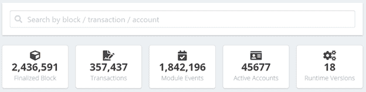
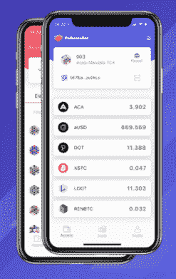
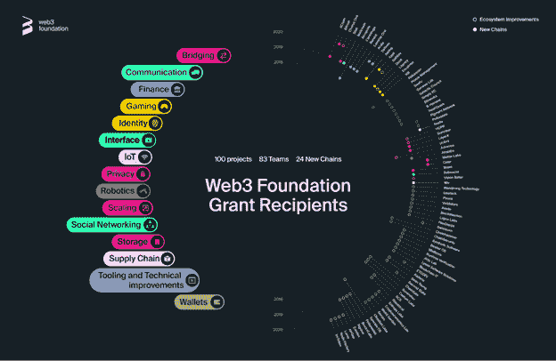

# Polkadot 系列第 2 部分:Polkadot 为其生态系统项目提供了什么

> 原文：<https://medium.com/coinmonks/polkadot-series-part-2-what-polkadot-offers-to-its-ecosystem-projects-45e8f1514f39?source=collection_archive---------4----------------------->

在[语音](https://www.voice.com/post/@tulip/polkadot-series-part-2-what-polkadot-offers-to-its-ecosystem-projects-1605205302-1)阅读我的原创文章。

**在本系列的第 1 部分(** [**Polkadot 系列第 1 部分—概述**](https://tulip311bit.medium.com/polkadot-series-part-1-overview-1ad0c7b8d442) **)中，我提供了 Polkadot 技术的概述。我们发现 Polkadot 的架构方法与 ETH 1.0 不同。**

Polkadot 有一些基本的好处:

1.仿链条使您能够按照自己的要求定制您的链条

2.副链与中继链(核心链)具有相同的安全级别

3.由于并行链的可用性，每个链都具有更快的事务处理速度

上述好处足以吸引任何新项目的注意力。除此之外，Polkadot 还为其生态系统项目带来了以下好处。

[**波尔卡多特遥测服务**](https://telemetry.polkadot.io/#/Polkadot) :

遥测服务提供网络信息。随着波尔卡多特，你将能够看到像草间弥生其他姐妹链。下面是一个示意图。

**基板和 Polkadot UI:**

基板是波尔卡多特的建筑框架。开发者可以用 React.js 和 RxJS 开始构建

[**基板 UI**](https://github.com/paritytech/oo7) :

这是可以触发和监督所有不同功能操作的 UI。

[**波尔卡博特:**](https://gitlab.com/Polkabot)

Polkabot 是一个聊天机器人，提供有关 Polkadot 网络的信息。Polkabot 目前带有以下插件:

**BlockStats:** 一个监视网络的看门狗插件，如果某些指标不正常，它会给出触发和统计信息。

**StallWatcher:** 是 Polkadot PoC-2 的看门狗。这个网络相对较新，只有少量的验证器。如果最后一个块是在 X 秒钟之前产生的，StallWatcher 将发出警报。

**报告者:**作为治理观察者，报告者在任何新的治理提案和全民公决开始投票时通知用户。

**验证器:**作为验证器的眼睛，这个插件提供关于验证器加入或离开网络的信息，并在验证器被攻击时发出警告。

****:****

****

**这是 Polkadot 数据浏览器和分析平台**

****:****

********

****这是波尔卡多特的手机钱包。它具有各种功能，包括****

******资产信息**:****

****o 转移****

****免费资产转让****

****二维码支持****

****o 接收****

****二维码支持****

****实时链上数据视图****

****o 离线签名:冷钱包保持离线状态，通过二维码签名****

****o 社会恢复:****

****通过社会关系账户追回损失的账户。****

****o 记录****

****方便的账户操作和细节跟踪****

******打桩******

****验证器分析:用图表和数据分析验证器****

****o 提名者:通过绑定资产来提名您想要的验证者。****

****o 常见操作:常见操作包括绑定/取消绑定、奖励类型、更改控制器、提名、支付等。****

******历史******

****o 与赌注相关的运营的过往交易历史****

****o 奖励和斜线的细节。****

******治理******

****o 民主:****

****查看并投票支持或反对公投提案。****

****通过为一定数量的区块绑定最低保证金，创建一个提案。****

****o 理事会:****

****投票选举理事会成员****

****提交候选人。****

****财政部:查看并投票支持或反对财政支出提案。****

****o Polkassembly:治理论坛。****

******链间**:****

****这是区块链钱包的下一次进化。不同的链现在可以在它们之间执行任意的消息传递。移动钱包中各种副链之间发起的交易可以交互。****

> ****Polkadot 已经为其生态系统项目提供了许多这样的好处。这些项目不需要从零开始，不必过多考虑区块链的基本原理，而是可以更多地关注产品功能。****

******波尔卡多特项目******

****Polkadot 正在建立一个完整的项目生态系统。以下是几个类别****

****智能合同链****

****数据监管网络****

****甲骨文连锁店****

****身份链****

****金融链****

****物联网链****

****零知识隐私链****

****文件存储链****

****以太坊桥****

****下图是 Web3 基金会(Polkadot 的母公司)对各种项目的拨款情况。下载图片，看到右手边你会看到所有的名字！****

****100 个项目****

****83 个团队****

****24 条新链条****

********

****在本系列接下来的部分中，我将介绍这些项目，并介绍如何使用 Polkadot 钱包。****

******保持更新！订阅！******

****如果你能在评论中留下你的观点供进一步讨论，我将不胜感激。****

****参考:[波尔卡多](https://polkadot.network/)****

****阅读我以前的文章:[波尔卡多特系列第一部分——概述](https://tulip311bit.medium.com/polkadot-series-part-1-overview-1ad0c7b8d442)****

******跟我来******

******👉推特:[https://twitter.com/rumadas123](https://twitter.com/rumadas123)******

******👉**领英:[https://www.linkedin.com/in/ruma-das-a1439320/](https://linkedin.com/in/ruma-das-a1439320)****

## ****另外，阅读****

*   ****[最佳加密交易机器人](/coinmonks/whats-the-best-crypto-trading-bot-in-2020-top-8-bitcoin-trading-bot-c16adeb13317)****
*   ****[Deribit 审查](/coinmonks/deribit-review-options-fees-apis-and-testnet-2ca16c4bbdb2) |选项、费用、API 和 Testnet****
*   ****[FTX 密码交易所评论](/coinmonks/ftx-crypto-exchange-review-53664ac1198f)****
*   ****[比特交换评论](/coinmonks/bybit-exchange-review-dbd570019b71)****
*   ****最好的比特币[硬件钱包](/coinmonks/the-best-cryptocurrency-hardware-wallets-of-2020-e28b1c124069?source=friends_link&sk=324dd9ff8556ab578d71e7ad7658ad7c)****
*   ****[密码本交易平台](/coinmonks/top-10-crypto-copy-trading-platforms-for-beginners-d0c37c7d698c)****
*   ****最好的[加密税务软件](/coinmonks/best-crypto-tax-tool-for-my-money-72d4b430816b)****
*   ****[最佳加密交易平台](/coinmonks/the-best-crypto-trading-platforms-in-2020-the-definitive-guide-updated-c72f8b874555)****
*   ****最佳[加密贷款平台](/coinmonks/top-5-crypto-lending-platforms-in-2020-that-you-need-to-know-a1b675cec3fa)****
*   ****[莱杰纳米 S vs 特雷佐 one vs 特雷佐 T vs 莱杰纳米 X](https://blog.coincodecap.com/ledger-nano-s-vs-trezor-one-ledger-nano-x-trezor-t)****
*   ****[block fi vs Celsius](/coinmonks/blockfi-vs-celsius-vs-hodlnaut-8a1cc8c26630)vs Hodlnaut****
*   ****Bitsgap 评论——一个轻松赚钱的加密交易机器人****
*   ****为专业人士设计的加密交易机器人****
*   ****[PrimeXBT 审查](/coinmonks/primexbt-review-88e0815be858) |杠杆交易、费用和交易****
*   ****[HaasOnline 评论](/coinmonks/haasonline-review-d8d1a3400419)享受九折优惠****
*   ****Bitmex 上的[保证金交易的白痴指南](/coinmonks/the-idiots-guide-to-margin-trading-on-bitmex-dbbd7742c6fc?source=friends_link&sk=7bfa99d2a181142510c8442c8ddb0786)****
*   ****[eToro 评论](/coinmonks/etoro-review-78807ddeb33c) |交易股票、密码、交易所交易基金、差价合约和商品****
*   ****[BlockFi 评论](/coinmonks/blockfi-review-53096053c097) |从您的密码中赚取高达 8.6%的利息****
*   ****[面向开发人员的最佳加密 API](/coinmonks/best-crypto-apis-for-developers-5efe3a597a9f)****
*   ****[最佳区块链分析工具](https://bitquery.io/blog/best-blockchain-analysis-tools-and-software)****
*   ****[加密套利](/coinmonks/crypto-arbitrage-guide-how-to-make-money-as-a-beginner-62bfe5c868f6)指南:新手如何赚钱****
*   ****顶级[比特币节点](https://blog.coincodecap.com/bitcoin-node-solutions)提供商****
*   ****最佳[加密制图工具](/coinmonks/what-are-the-best-charting-platforms-for-cryptocurrency-trading-85aade584d80)****
*   ****了解比特币最好的[书籍有哪些？](/coinmonks/what-are-the-best-books-to-learn-bitcoin-409aeb9aff4b)****

> ****[直接在您的收件箱中获得最佳软件交易](/coinmonks/newsletters/coinmonks)****

********