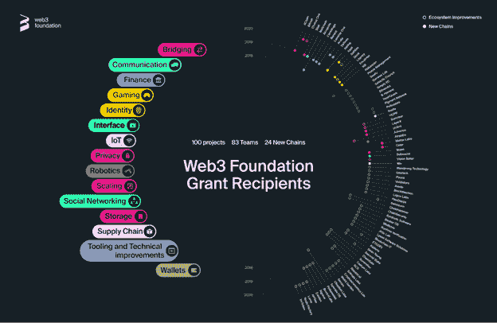
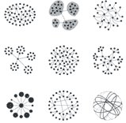
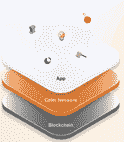

# 波尔卡多特系列第 3 部分:波尔卡多特顶级项目

> 原文：<https://medium.com/coinmonks/polkadot-series-part-3-top-projects-in-polkadot-1269df1dc173?source=collection_archive---------1----------------------->

在[语音](https://www.voice.com/post/@tulip/polkadot-series-part-3-top-projects-in-polkadot-1605279987-1)阅读我的原创文章。

在我以前的文章( [Polkadot 系列第 2 部分:Polkadot 为其生态系统项目提供什么](https://tulip311bit.medium.com/polkadot-series-part-2-what-polkadot-offers-to-its-ecosystem-projects-45e8f1514f39))中，我谈到了 Polkadot 正在做些什么来鼓励各种项目使用它的平台。

**自 2018 年以来，项目一直在波尔卡多特上建设。从获得 Polkadot 资助的项目数量可以看出生态系统的发展。**

到目前为止，共有 83 支队伍获得了波尔卡多特资助。以下是按年份分列的补助金清单

**2018–9 赠款**

**2019–51 拨款**

**2020-23 年拨款**

这些项目跨越不同的行业领域

**1。智能合同链:**

**:**

****

**Edgeware 是一个 WASM 智能合约平台，它采用了一种完全不同的架构。它试图创建一个协调开销较低的系统。它对治理的关注确保了更大的透明度。**

**[**苦鲁普**](https://kulupu.network/)**

****

**Kulupu 使用底层框架构建，使用工作证明作为其共识方法。它的创新在于将工作证明共识引擎与不需要分叉的升级相结合。**

****2。定义****

**[**阿卡拉网**](https://acala.network/)**

****

**Acala Network 是一个跨链 DeFi 平台，旨在成为 Polkadot 的金融中心。它提供了强大的基础，如分散的稳定货币，分散的交易所，赌注衍生品。**

****

********

****Akropolis 在这个领域已经有很长时间了，最初的实现是在以太坊。这是一个可定制的特定于域的财务协议。它支持图灵完全虚拟机。该项目提供了在分散的基于智能合同的自我保管或指定一个受监管的保管人之间的选择。****

****[**拓链**](https://riochain.io/)****

********

****Rio Chain 既支持移动应用，也支持桌面应用。它引入了多令牌钱包和块浏览器等工具。****

******3。数据监管网络******

****这些网络将文件存储链连接成精选的数据集****

****[**海洋议定书**](https://oceanprotocol.com/)****

********

****非常流行的 Ocean 协议是一种令牌化的数据服务，其业务、技术和治理框架交织在一起。它允许以安全的方式共享数据、存储、计算、算法和服务****

****它在服务上实施了赌注，以确保数据的质量和声誉。****

****[蓝泽 ](https://bluzelle.com/)****

********

****Bluzelle 充当 Web3 的分散数据库。用户向 Bluzelle 付费以访问存储空间或对分散数据库进行读/写。Bluezelle 将在未来带来类似 Oracles 的解决方案。****

******4。供应链******

****[**origin tiil**](https://origintrail.io/)****

********

****Origin Trail 是一个跟踪令牌驱动产品跟踪解决方案。它的解决方案，ODN 是以太坊上的知识图第二层解决方案。波尔卡多特已经将 ODN 整合到他们的生态系统中，供在此基础上建设的项目使用。在未来，Origin Trail 计划推出 oracle 框架、数据市场等。****

****[**停靠**](https://dock.io/)****

********

****Dock 通过各种工具提供可验证的凭证。这些可用于创建分散身份(did ),也可用于创建、管理和展示凭证****

******5。神谕******

****[**链环**](https://chain.link/)****

********

****Chainlink 正在用去中心化的 oracles 在 Web 3.0 生态系统中构建智能合约，以获得可靠的外部数据。****

******6。游戏******

****[**达尔文主义**](https://darwinia.network/)****

********

****达尔文网络是一个异构的跨链桥协议。它专注于 Defi、游戏、DEX、NFT 市场等。****

******7。NFT******

****[**独特网络**](https://usetech.com/unique)****

********

****Unique Network 最近赢得了 Hackusama 竞赛。它是一种基于底物的 NFT 链。它为游戏创作者提供了可以在大众市场快速部署的解决方案。****

****看看我写的关于他们的 NFT 的文章[第一批波尔卡多特 NFT:sub ponks](https://voice.com/post/@tulip/the-first-polkadot-nfts-substrapunks-1604598466-1)****

******8。桥梁******

****[**数学链**](https://mathchain.org/)****

********

****MathChain 是一个基于 Substrate 的智能钱包 Parachain。他们也是数学钱包的创造者。****

******9。缩放******

****[**策勒**](https://www.celer.network/)****

********

****非常流行的 Celer 网络是一个第 2 层扩展平台。其创新的链外扩展技术和激励一致的加密经济学允许开发者创建高度可扩展的分散应用。****

******结论******

****波尔卡多特的一些项目已经相当有名了。我参加了他们中一些人的测试网，看到了他们所展示的素质和专业精神。另外，Substrate 提供的后端技术非常优秀。我们也看到了一个趋势，一些主要的以太坊项目(Chainlink，Origin Trail)正在扩展对 Polkadot 生态系统的支持。一些波尔卡多特项目肯定会爆发，我们很快就会看到波尔卡多特项目与以太坊竞争。****

****参考:[Polk project](https://polkaproject.com/)****

****如果您能在评论中留下您的观点以供进一步讨论，我将不胜感激。****

****阅读我以前的文章: [Polkadot 系列第 2 部分:Polkadot 为其生态系统项目提供了什么](https://tulip311bit.medium.com/polkadot-series-part-2-what-polkadot-offers-to-its-ecosystem-projects-45e8f1514f39)****

******跟着我******

******👉https://twitter.com/rumadas123 推特[T21](https://twitter.com/rumadas123)******

******👉**领英:[https://www.linkedin.com/in/ruma-das-a1439320/](https://linkedin.com/in/ruma-das-a1439320)****

> ****加入 Coinmonks [电报频道](https://t.me/coincodecap)和 [Youtube 频道](https://www.youtube.com/c/coinmonks/videos)获取每日[加密新闻](http://coincodecap.com/)****

## ****另外，阅读****

*   ****[复制交易](/coinmonks/top-10-crypto-copy-trading-platforms-for-beginners-d0c37c7d698c) | [加密税务软件](/coinmonks/crypto-tax-software-ed4b4810e338)****
*   ****[网格交易](https://coincodecap.com/grid-trading) | [加密硬件钱包](/coinmonks/the-best-cryptocurrency-hardware-wallets-of-2020-e28b1c124069)****
*   ****[密码电报信号](http://Top 4 Telegram Channels for Crypto Traders) | [密码交易机器人](/coinmonks/crypto-trading-bot-c2ffce8acb2a)****
*   ****[最佳加密交易所](/coinmonks/crypto-exchange-dd2f9d6f3769) | [印度最佳加密交易所](/coinmonks/bitcoin-exchange-in-india-7f1fe79715c9)****
*   ****[面向开发人员的最佳加密 API](/coinmonks/best-crypto-apis-for-developers-5efe3a597a9f)****
*   ****最佳[密码借贷平台](/coinmonks/top-5-crypto-lending-platforms-in-2020-that-you-need-to-know-a1b675cec3fa)****
*   ****[免费加密信号](/coinmonks/free-crypto-signals-48b25e61a8da) | [加密交易机器人](/coinmonks/crypto-trading-bot-c2ffce8acb2a)****
*   ****杠杆代币的终极指南****