# Polkadot 系列第 4 部分:用户指南、风险参数和最佳实践(1/2)

> 原文：<https://medium.com/coinmonks/polkadot-series-part-4-user-guide-risk-parameters-and-best-practices-1-2-37bc2b43464a?source=collection_archive---------7----------------------->

在[语音](https://www.voice.com/post/@tulip/polkadot-series-part-4-user-guide-risk-parameters-and-best-practices-12-1605797528-1)看我的原帖。

**在我之前的文章中(阅读:** [**Polkadot 系列第三部分:Polkadot**](https://tulip311bit.medium.com/polkadot-series-part-3-top-projects-in-polkadot-1269df1dc173) **中的顶级项目)，我已经带你了解了 Polkadot 的基础知识。Polkadot staking 已经实现，但是还没有变得那么流行。这主要是因为打桩过程的复杂性及其所承担的风险。这篇由两部分组成的文章旨在为您提供指导，并让您了解一些最佳实践。**

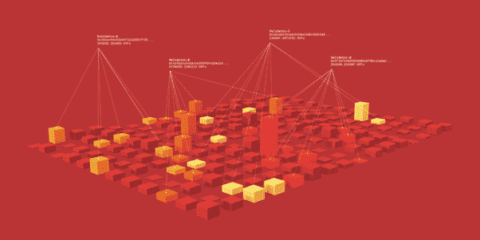

Polkadot staking 由命名者和验证者组成。验证器运行节点，而命名器与验证器相关联。我们将扮演提名者的角色。

我们将使用 Polkawallet for Android 来执行定位。

可以直接从 Google Play 下载 Polkawallet。为了检查真实性，我将增加一些额外的步骤。

**下载 Polkawallet**

转到[波尔卡多特链接](https://polkadot.network/build)

向下滚动到底部。点击 Polkawallet。

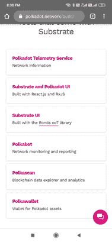

它会带你去 Polkawallet 网站。点击 Google Play。

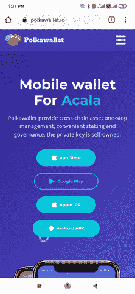

*最佳实践*:检查真实性的一种方法是查看下载和评论的数量。Polkawallet 的下载量仍然很低，但现在应该没问题(相对较新)。

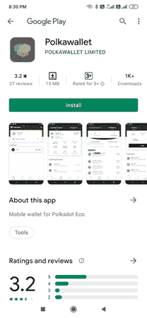

**创建账户:**

打开应用程序。如果您没有现有帐户，请单击创建帐户。

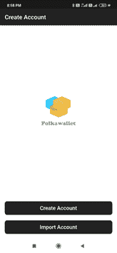

查看后续步骤的说明，然后继续查看助记关键短语。这将是一个 12 位数的短语。

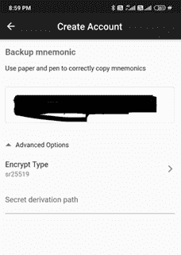

安全地记下助记关键短语，并在下一页重新输入。

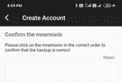

你应该都准备好了。

您也可以选择使用导入帐户选项导入旧钱包。

进入之前，请确保您已经设置了您的名称和密码。你也可以启用你的指纹，这很容易使用，但不安全。

**首页导航**

我直接进入资产页面。默认情况下，它已采取草间弥生。该页面将显示所有基于草间弥生的资产。它还显示我的钱包余额和地址细节。

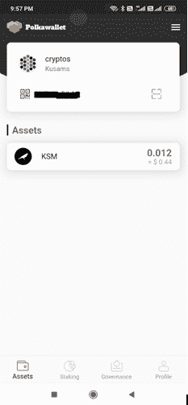

单击单个资产将为您提供转移或接收资产的选项。你也可以看到你以前的交易。

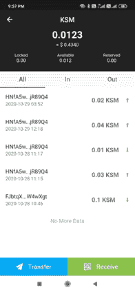

在右上角，有一个下拉菜单，我们可以从中选择区块链。当前可用的选项有 Polkadot、Kusama、Acala 和层流。

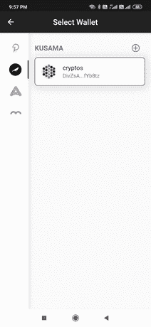

请注意地址的变化，因为我将区块链从草间弥生改为波尔卡多特。

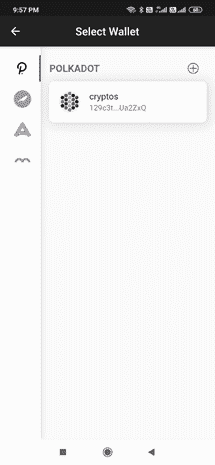

如果我现在点击这个地址，我将进入 Polkadot 主页。

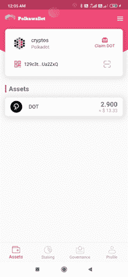

**打桩**

在开始本指南之前，这里有一些你应该知道的细节。

波尔卡多特每年有 10%的通货膨胀率。

赌注带来大约 20%的年回报率。随着验证器和提名器的增多，这种情况会减少

。风险

解除绑定后，令牌将在网络中锁定(绑定)28 天。

**如果验证者行为不当(例如离线、攻击网络或运行修改过的软件)，将受到严厉惩罚。因此明智地选择验证器是非常重要的。我们将在第 2 部分**中详细介绍

请注意，在 Polkadot 中有两种类型的帐户

隐藏账户充当一个冰冷的钱包。控制资金运作。

控制器充当热钱包。财务总监的任何非资金行为。

鼓励将这两个帐户分开，但这不是强制性的。此外，请注意，不债券你的全部金额，保持一些金额单独支付费用。

**粘合**

在你提名之前，你必须保证你的点。请注意，您将锁定您的 for 28 天。

去打桩。我有 2.9 点(从交换机发送)。截至目前，我还没有债券和点，因此所有参数为零。整个 2.9 点可用于粘合。

点击债券基金。选择您想要的保证金金额(留出一些金额作为费用)

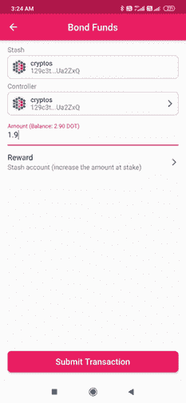

选择奖励的类型。你有三种类型:

1.隐藏帐户(增加赌注金额)—您的奖励将直接添加到您的赌注中)

2.隐藏帐户(不要增加赌注的金额)-奖励将不会增加

3.控制者帐户(不要增加赌注金额)—操作由控制者帐户控制。

我的藏匿账户和控制账户是一样的。我选择第一个方案。

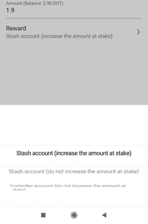

您可以支付最低费用，以加快交易速度

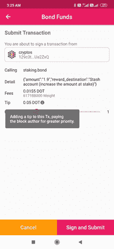

输入您的应用程序密码。签名并提交。我的友谊结束了。交易记录显示我的绑定是成功的。我也有少量的费用。我的保证金是 1.90 点

现在我们到了最重要的一步，提名。这一步很棘手。理解如何选择正确的验证器是非常重要的。我将在本文的第 2 部分讨论这个问题。这个帖子是为 Cryptowriter 和 Voice 联合发布的。

如果你能在评论中留下你的观点供进一步讨论，我将不胜感激。

阅读我之前的文章:  [Polkadot 系列第 3 部分:Polkadot 中的顶级项目](https://tulip311bit.medium.com/polkadot-series-part-3-top-projects-in-polkadot-1269df1dc173)

**跟我来**

**👉**推特:【https://twitter.com/rumadas123】T4

**👉领英:[https://www.linkedin.com/in/ruma-das-a1439320/](https://linkedin.com/in/ruma-das-a1439320)**

## 另外，阅读

*   [最佳加密交易机器人](/coinmonks/whats-the-best-crypto-trading-bot-in-2020-top-8-bitcoin-trading-bot-c16adeb13317)
*   [Deribit 审查](/coinmonks/deribit-review-options-fees-apis-and-testnet-2ca16c4bbdb2) |选项、费用、API 和 Testnet
*   [FTX 密码交易所评论](/coinmonks/ftx-crypto-exchange-review-53664ac1198f)
*   [Bybit 交换审查](/coinmonks/bybit-exchange-review-dbd570019b71)
*   最好的比特币[硬件钱包](/coinmonks/the-best-cryptocurrency-hardware-wallets-of-2020-e28b1c124069?source=friends_link&sk=324dd9ff8556ab578d71e7ad7658ad7c)
*   [密码本交易平台](/coinmonks/top-10-crypto-copy-trading-platforms-for-beginners-d0c37c7d698c)
*   最好的[加密税务软件](/coinmonks/best-crypto-tax-tool-for-my-money-72d4b430816b)
*   [最佳加密交易平台](/coinmonks/the-best-crypto-trading-platforms-in-2020-the-definitive-guide-updated-c72f8b874555)
*   最佳[加密借贷平台](/coinmonks/top-5-crypto-lending-platforms-in-2020-that-you-need-to-know-a1b675cec3fa)
*   [莱杰纳米 S vs 特雷佐 one vs 特雷佐 T vs 莱杰纳米 X](https://blog.coincodecap.com/ledger-nano-s-vs-trezor-one-ledger-nano-x-trezor-t)
*   [block fi vs Celsius](/coinmonks/blockfi-vs-celsius-vs-hodlnaut-8a1cc8c26630)vs Hodlnaut
*   Bitsgap 评论——一个轻松赚钱的加密交易机器人
*   为专业人士设计的加密交易机器人
*   [PrimeXBT 审查](/coinmonks/primexbt-review-88e0815be858) |杠杆交易、费用和交易
*   HaasOnline 评论享受九折优惠
*   Bitmex 的[保证金交易的白痴指南](/coinmonks/the-idiots-guide-to-margin-trading-on-bitmex-dbbd7742c6fc?source=friends_link&sk=7bfa99d2a181142510c8442c8ddb0786)
*   [eToro 评论](/coinmonks/etoro-review-78807ddeb33c) |交易股票、密码、交易所交易基金、差价合约和商品
*   [区块链评论](/coinmonks/blockfi-review-53096053c097) |从您的密码中赚取高达 8.6%的利息
*   [开发者最佳加密 API](/coinmonks/best-crypto-apis-for-developers-5efe3a597a9f)
*   [最佳区块链分析工具](https://bitquery.io/blog/best-blockchain-analysis-tools-and-software)
*   [加密套利](/coinmonks/crypto-arbitrage-guide-how-to-make-money-as-a-beginner-62bfe5c868f6)指南:新手如何赚钱
*   顶级[比特币节点](https://blog.coincodecap.com/bitcoin-node-solutions)提供商
*   最佳[加密制图工具](/coinmonks/what-are-the-best-charting-platforms-for-cryptocurrency-trading-85aade584d80)
*   了解比特币最好的[书籍有哪些？](/coinmonks/what-are-the-best-books-to-learn-bitcoin-409aeb9aff4b)

> [直接在您的收件箱中获得最佳软件交易](/coinmonks/newsletters/coinmonks)

