# Polkadot 系列第 5 部分:用户指南、风险参数和最佳实践(2/2)

> 原文：<https://medium.com/coinmonks/polkadot-series-part-5-user-guide-risk-parameters-and-best-practices-2-2-11341cbab1ba?source=collection_archive---------5----------------------->

在[语音](https://www.voice.com/post/@tulip/polkadot-series-part-5-user-guide-risk-parameters-and-best-practices-22-1605798604-1)阅读我的原创文章。

**在本文的第 1 部分(**[**】Polkadot 系列第 4 部分:用户指南、风险参数和最佳实践(1/2)**](https://tulip311bit.medium.com/polkadot-series-part-4-user-guide-risk-parameters-and-best-practices-1-2-37bc2b43464a) **)中，我介绍了使用 Polkawallet 进行 Polkadot 下注的初始步骤。Polkawallet 易于使用，可以随时进行监控。然而，作为一个移动钱包，它并没有包含所有的功能。对于分析，我们将使用桌面应用程序。**

在这一部分，我们将涵盖两个主要部分

如何选择验证器

如何提名

**打桩(续)**

***如何选择验证器***

Polkawallet 有查看验证器列表的选项。

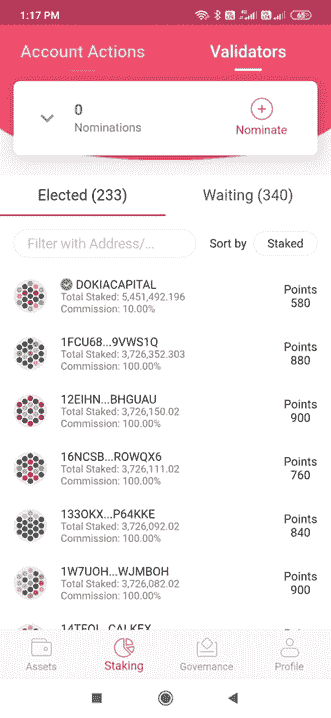

您还可以点击验证器并查看它们的详细信息。但是，钱包没有显示对比。

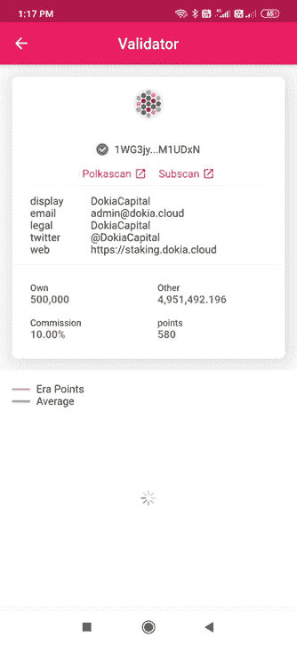

因此，我更喜欢在桌面应用程序中选择验证器。

首先，您需要一个 Polkadot.js 扩展名。你可以使用[这个链接](https://github.com/polkadot-js/extension)从 Github 轻松下载

使用您在 Polkawallet 中使用的相同关键字输入分机。

现在到了 Polkadot 桌面应用程序。的。js 扩展会自动与应用程序同步。应用程序[的链接在这里](https://polkadot.js.org/apps#/staking)

使用您的扩展授权应用程序，它应该会自动弹出。

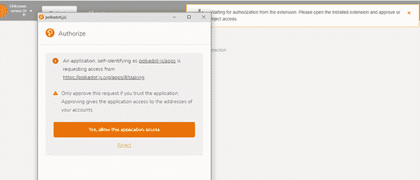

您将进入登录页面。注意左上角的 Polkadot 网络，正文中的验证器列表，以及对验证器、命名器和块的分析。

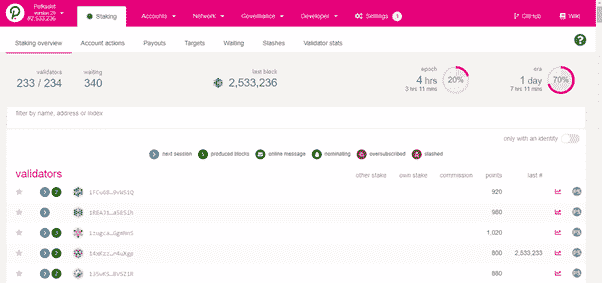

再次确认一下，进入账户，你会看到你的余额(和 Polkawallet 一样)

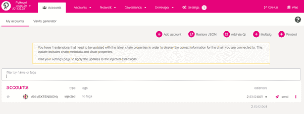

要开始我们的验证器分析，让我们进入网络->定位->目标

请注意，Polkadot 奖励每个验证器相同数量的点。下面是一个快速计算器

输入你将提名的点数，以找到你将获得的每个纪元的回报(这也将取决于带有验证器的数量)

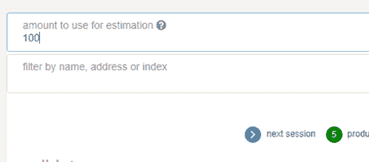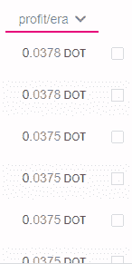

要选择一个好的验证器，请执行以下步骤

**第一步:有身份的账户**

选择对提名者透明的验证者。这意味着他们应该有一个网站，电子邮件 ID 等。

你可以点击验证者的名字，看看他们是否提供了细节。

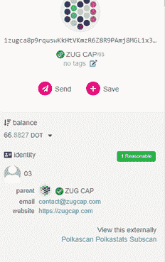

一个简单的方法是过滤所有这样的验证器，只选择一个有身份的帐户

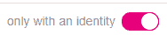

做一个彻底的调查。

**第二步:查看股权多少**。所有权股份越大，验证者在赌注游戏中拥有的皮肤就越多，然而，这也意味着验证者拥有更大的权力。此外，你将获得较少的奖励。你需要在这里找到平衡。不要贪求很高的报酬。

**第三步:验证者佣金**。验证者拿的佣金越多，你得到的奖励就越少。然而，验证器需要一些佣金才能盈利。不要使用零佣金验证器。尝试重新找到平衡，选择低百分比。

**第四步:性能**转到每个验证器最右边的分析。

你就看性能是否稳定了。在下面的例子中，性能并不稳定，验证器只是在最近几个时代才获得奖励。

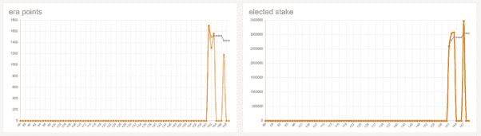

此外，我们可以看到他们还没有面临任何削减，直到现在

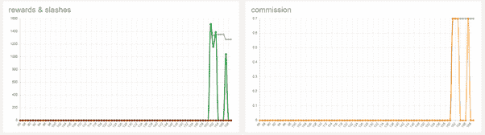

另外，记住每个验证器的佣金。

**步骤 5:超额订阅和削减**检查验证器没有超额订阅。只有排名前 256 位的提名者才能获得奖励。

看看下面两个验证者名字旁边的图标。不要提名任何有这些图标的人

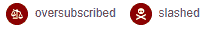

验证者池大股份被更严厉地削减，提名者被鼓励选择小的验证者。

选择验证者后，点击 Polkawallet 上的“提名”按钮，找到您的验证者，选择并完成交易。

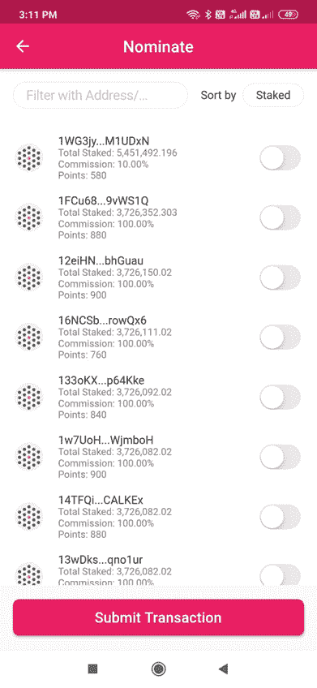

您的定位已完成。几个要点:

1.拆垛需要 28 天

2.你必须在 84 个纪元内领取你的奖励，在波尔卡多特大约是 84 天。

希望这篇文章对你有帮助。

**阅读我以前的文章，**第 1 部分( [Polkadot 系列第 4 部分:用户指南、风险参数和最佳实践(1/2)](https://tulip311bit.medium.com/polkadot-series-part-4-user-guide-risk-parameters-and-best-practices-1-2-37bc2b43464a) )

**参考文献:**

[中等](/figment/staking-dot-the-rewards-and-risks-c8f4087ad5ba)

[波尔卡多特维基](https://wiki.polkadot.network/docs/en/learn-staking#:~:text=In%20order%20to%20be%20paid,and%2021%20days%20on%20Kusama)

萨姆·尤根 Youtube

跟我来

**👉**推特:[https://twitter.com/rumadas123](https://twitter.com/rumadas123)

**👉**领英:[https://www.linkedin.com/in/ruma-das-a1439320/](https://linkedin.com/in/ruma-das-a1439320)

## 另外，阅读

*   最好的[密码交易机器人](/coinmonks/crypto-trading-bot-c2ffce8acb2a)
*   [Uniswap API](https://bitquery.io/blog/uniswap-pool-api) —如何获取 Uniswap 数据？
*   [德里比特评论](/coinmonks/deribit-review-options-fees-apis-and-testnet-2ca16c4bbdb2) |选项、费用、API 和 Testnet
*   [FTX 密码交易所评论](/coinmonks/ftx-crypto-exchange-review-53664ac1198f)
*   [Bybit 交换审查](/coinmonks/bybit-exchange-review-dbd570019b71)
*   最好的比特币[硬件钱包](/coinmonks/the-best-cryptocurrency-hardware-wallets-of-2020-e28b1c124069?source=friends_link&sk=324dd9ff8556ab578d71e7ad7658ad7c)
*   [密码本交易平台](/coinmonks/top-10-crypto-copy-trading-platforms-for-beginners-d0c37c7d698c)
*   [bits gap vs 3 commas vs quad ency](https://blog.coincodecap.com/bitsgap-3commas-quadency)
*   最好的[加密税务软件](/coinmonks/best-crypto-tax-tool-for-my-money-72d4b430816b)
*   [最佳加密交易平台](/coinmonks/the-best-crypto-trading-platforms-in-2020-the-definitive-guide-updated-c72f8b874555)
*   最佳加密贷款平台
*   [莱杰纳米 S vs 特雷佐 one vs 特雷佐 T vs 莱杰纳米 X](https://blog.coincodecap.com/ledger-nano-s-vs-trezor-one-ledger-nano-x-trezor-t)
*   [block fi vs Celsius](/coinmonks/blockfi-vs-celsius-vs-hodlnaut-8a1cc8c26630)vs Hodlnaut
*   Bitsgap 评论——一个轻松赚钱的加密交易机器人
*   为专业人士设计的加密交易机器人
*   [PrimeXBT 审查](/coinmonks/primexbt-review-88e0815be858) |杠杆交易、费用和交易
*   [alt ready 审查](https://blog.coincodecap.com/altrady-reivew)
*   [埃利帕尔泰坦评论](/coinmonks/ellipal-titan-review-85e9071dd029)
*   [赛克斯·斯通评论](https://blog.coincodecap.com/secux-stone-hardware-wallet-review)
*   [BlockFi 评论](/coinmonks/blockfi-review-53096053c097) |从您的密码中赚取高达 8.6%的利息
*   面向开发者的最佳加密 API
*   [最佳区块链分析工具](https://bitquery.io/blog/best-blockchain-analysis-tools-and-software)
*   [加密套利](/coinmonks/crypto-arbitrage-guide-how-to-make-money-as-a-beginner-62bfe5c868f6)指南:新手如何赚钱
*   顶级[比特币节点](https://blog.coincodecap.com/bitcoin-node-solutions)提供商
*   最佳[加密制图工具](/coinmonks/what-are-the-best-charting-platforms-for-cryptocurrency-trading-85aade584d80)
*   了解比特币最好的[书籍有哪些？](/coinmonks/what-are-the-best-books-to-learn-bitcoin-409aeb9aff4b)

> [直接在您的收件箱中获得最佳软件交易](/coinmonks/newsletters/coinmonks)

