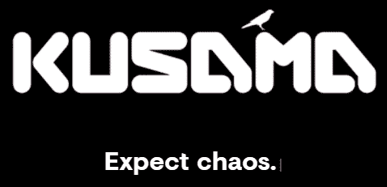
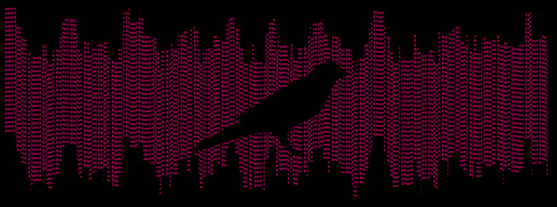
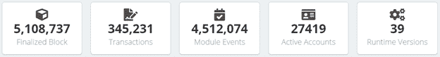
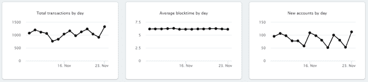

# 波尔卡多系列第六部:草间弥生，波尔卡多的野姐姐

> 原文：<https://medium.com/coinmonks/polkadot-series-part-6-kusama-polkadots-wild-sister-a15de9aaf085?source=collection_archive---------7----------------------->

在[语音](https://www.voice.com/post/@tulip/polkadot-series-part-6-kusama-polkadots-wild-sister-1606658575-1)看我的原帖。

**草间弥生是波尔卡多的‘金丝雀网络’。它是 Polkadot 的早期实验版本，具有经济价值，开发人员可以在 Polkadot 中发布之前使用它进行实验。**

Kusama 允许开发人员和团队构建他们的产品并部署 parachain。它允许他们测试运行时升级，并在真实环境中尝试 Polkadot 的各种功能，包括治理、标记、提名和验证。草间弥生的早期警告有助于开发者在波尔卡多特顺利进行最终发布。

任何开发者都可以参加草间弥生。草间弥生由草间弥生代币(KSM)持有者维持。网络是分散的，没有单点故障。任何变更都首先在治理中被提议和投票。

**历史**

草间弥生网络最初是一个权威证明网络。2019 年 10 月，它过渡到利益证明。第一个 PoS 阶段由 20 个验证者组成，其中 9 个由 Web3 基金会管理，6 个由奇偶技术公司管理(都是母公司)。其余 5 家由通过 Phragmén 选举选出的高风险社区成员经营。Kusuma 逐渐升级了它的功能。目前，它已完全投入使用，生产了 500 多万块。

KSM 曾经通过一个高摩擦的水龙头向公众开放，但现在已经退役了。Web3 Foundation 正在考虑为需要 KSM 来构建的人分发 KSM 的新方法。

**缺失的区块**

2020 年 1 月，运行时升级中的一个事故导致草间弥生网络块生产暂停。这一不幸事故完全损坏了链条。作为一个解决方案，Kusama 在有问题的运行时升级发生之前被回滚。块创建的速度增加到现实世界中时间速度的 6 倍。通常持续一小时的草间弥生会议将只持续 10 分钟。这种情况一直持续到验证器赶上现在。但是，这导致了许多丢失的块。草间弥生今天的漏块率比波尔卡多高。

**数字中的草间弥生**

以下来自波尔卡斯坎[https://polkascan.io/kusama](https://polkascan.io/kusama)的关键分析视图将向您展示网络的一致性和逐步增长。

**开发者如何使用草间弥生？**

**作为验证者进行测试:**草间弥生验证者的定位要求比波尔卡多特低得多。这为开发者消除了障碍。像“千验证者”这样的项目帮助社区验证者提升排名。

**部署 parachain:**任何新的 parachain 功能(例如参与 para chain 插槽拍卖、可组合的应用程序)首先在 Kusama 中部署。

**感受一下治理的味道:**你可以以议员的身份参加竞选，或者利用民主投票支持新的运行时提案。

**草间弥生财库**

草间弥生金库是通过收取交易费来收集代币，削减并押注草间弥生网络上的低效率。国库由草间弥生委员会管理。他们主要代表被动的利益相关者。任何机构群体成员都可以提交一份提案，保证金为申请金额的 5%或 20 KSM(以较高者为准)。这是一种反垃圾邮件机制。提案包括以下领域

基础设施部署

网络安全运营

生态系统条款

软件开发

营销活动

社区和外联活动

目前使用国库资金的两种方式是小费和支出建议:

**小费:**小费的价值是根据小费者给的所有小费的中位数来决定的。该机制已被用于奖励参与开发、参与翻译教育材料、在社交媒体上代表草间弥生等的社区成员。

**支出提案:**社区成员可以获得资金，用于开发对草间弥生网络有用的项目。需要提交一份支出提案，该提案需要得到委员会的批准。

最近，财政部提出了一个奖金机制。这就产生了一个新的角色，叫做“策展人”。策展活动的开支建议将委托给“策展人”。

**结论**

草间弥生是波尔卡多特的支柱。它为计划稍后在 Polkadot 启动的项目提供了安全性和安全感。因此，波尔卡多特的成功受到草间弥生成功的严重影响。这两条链为了不同的目的共存在一起，只会一起变得更强大。

**阅读我以前的文章** [用户指南、风险参数和最佳实践(2/2)](https://tulip311bit.medium.com/polkadot-series-part-5-user-guide-risk-parameters-and-best-practices-2-2-11341cbab1ba)

**跟着我**

**👉**推特

**👉** [领英](https://www.linkedin.com/in/ruma-das-a1439320/)

## 另外，阅读

*   最好的[密码交易机器人](/coinmonks/crypto-trading-bot-c2ffce8acb2a)
*   [Uniswap API](https://bitquery.io/blog/uniswap-pool-api) —如何获取 Uniswap 数据？
*   [德里比特评论](/coinmonks/deribit-review-options-fees-apis-and-testnet-2ca16c4bbdb2) |选项、费用、API 和 Testnet
*   [FTX 密码交易所评论](/coinmonks/ftx-crypto-exchange-review-53664ac1198f)
*   [Bybit 交换审查](/coinmonks/bybit-exchange-review-dbd570019b71)
*   最好的比特币[硬件钱包](/coinmonks/the-best-cryptocurrency-hardware-wallets-of-2020-e28b1c124069?source=friends_link&sk=324dd9ff8556ab578d71e7ad7658ad7c)
*   [密码本交易平台](/coinmonks/top-10-crypto-copy-trading-platforms-for-beginners-d0c37c7d698c)
*   [bits gap vs 3 commas vs quad ency](https://blog.coincodecap.com/bitsgap-3commas-quadency)
*   最好的[加密税务软件](/coinmonks/best-crypto-tax-tool-for-my-money-72d4b430816b)
*   [最佳加密交易平台](/coinmonks/the-best-crypto-trading-platforms-in-2020-the-definitive-guide-updated-c72f8b874555)
*   最佳加密贷款平台
*   [莱杰纳米 S vs 特雷佐 one vs 特雷佐 T vs 莱杰纳米 X](https://blog.coincodecap.com/ledger-nano-s-vs-trezor-one-ledger-nano-x-trezor-t)
*   [block fi vs Celsius](/coinmonks/blockfi-vs-celsius-vs-hodlnaut-8a1cc8c26630)vs Hodlnaut
*   Bitsgap 评论——一个轻松赚钱的加密交易机器人
*   为专业人士设计的加密交易机器人
*   [PrimeXBT 审查](/coinmonks/primexbt-review-88e0815be858) |杠杆交易、费用和交易
*   [alt ready 审查](https://blog.coincodecap.com/altrady-reivew)
*   [埃利帕尔泰坦评论](/coinmonks/ellipal-titan-review-85e9071dd029)
*   [赛克斯·斯通评论](https://blog.coincodecap.com/secux-stone-hardware-wallet-review)
*   [BlockFi 评论](/coinmonks/blockfi-review-53096053c097) |从您的密码中赚取高达 8.6%的利息
*   面向开发者的最佳加密 API
*   [最佳区块链分析工具](https://bitquery.io/blog/best-blockchain-analysis-tools-and-software)
*   [加密套利](/coinmonks/crypto-arbitrage-guide-how-to-make-money-as-a-beginner-62bfe5c868f6)指南:新手如何赚钱
*   顶级[比特币节点](https://blog.coincodecap.com/bitcoin-node-solutions)提供商
*   最佳[加密制图工具](/coinmonks/what-are-the-best-charting-platforms-for-cryptocurrency-trading-85aade584d80)
*   了解比特币最好的[书籍有哪些？](/coinmonks/what-are-the-best-books-to-learn-bitcoin-409aeb9aff4b)

> [直接在您的收件箱中获得最佳软件交易](/coinmonks/newsletters/coinmonks)

