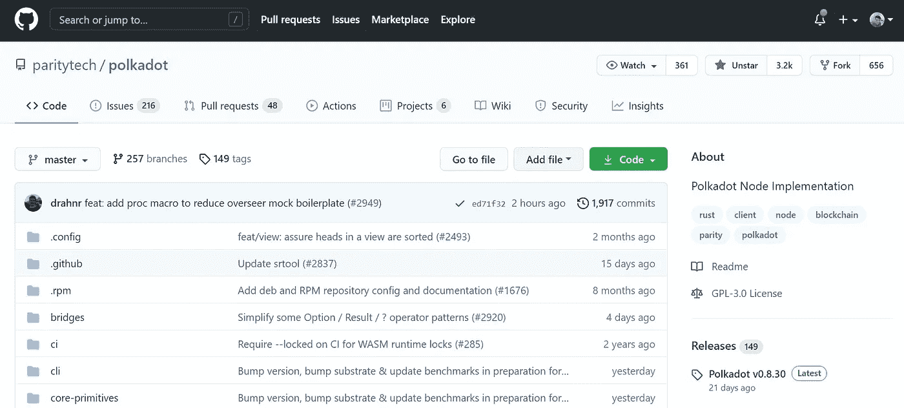
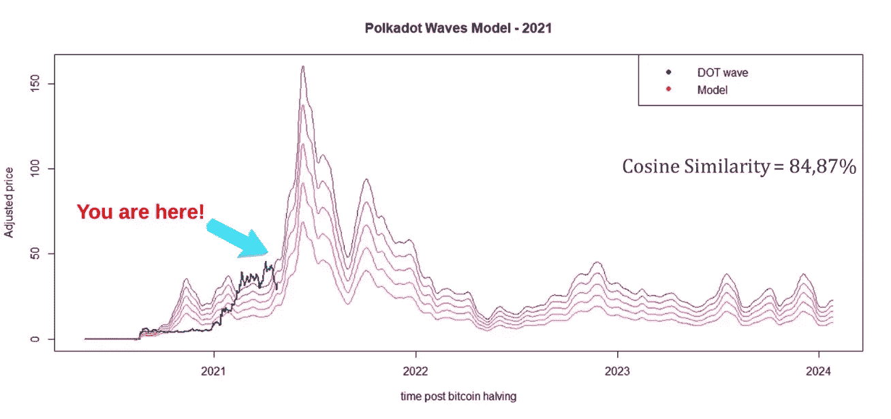

# 波尔卡多特:下一个颠覆性创新

> 原文：<https://medium.com/coinmonks/polkadot-the-next-disruptive-innovation-3b1dc3435e7e?source=collection_archive---------1----------------------->

## **简介**

自比特币数字货币实施以来，颠覆性技术在加密货币市场中表现出显著增长，由于其对市场和价值网络的潜在影响，引起了人们的极大兴趣。更好地理解一些主要的科技相关参数，如战略建议、绩效轨迹和持续技术[1]，对于提供市场管理策略和业务是相关的。

尽管颠覆性技术往往是绝佳的机会，但现有客户往往会忽略它们。

因此，这项研究调查了 Polkadot 生态系统，重点是更好地了解程序员团队、Polkadot 社区和该项目的未来。

**波尔卡多特生态系统**

Polkadot 是一种非常年轻的硬币(dot)。2016 年 11 月 14 日，程序员天才 Gavin Wood 通过发表题为“ *Polkadot:对异构多链框架的愿景*”[2]的文章，推出了第一个互操作性智能合约系统。

在我看来，是加密货币市场的第三次颠覆性创新。第一个是中本聪推出的点对点电子现金系统[3]，第二个是 Vitalik Buterin 发明的智能合约[4]。最后，所有链之间的连接，由 Gavin Wood 创建的多链框架[5]。套用尼尔·阿姆斯特朗的话，真正的互操作性是加文的一小步，是加密社区的一大步。

Github 上的 Polkadot 社区由一个有趣的忠诚的领导者和足够数量的成员组成。有活跃的在线讨论，3200 个“观星者”，包括我在内的观察程序的人，656 个 forks，存储库的副本，360 个观察者，监视所有活动的人，216 个要解决的问题，任务和 bug，48 个 pull 请求，GitHub 上的协作核心，125 个贡献者，来自希望做出贡献的项目外部的程序员，以及 51 个成员。再说一次，严肃的项目有伟大的团队。在投资之前，通过检查硬币社区来保护自己免受诈骗。

Figure 1\. Polkadot community on Github.

Polkadot 于 2020 年上市，以每点 4.80 美元的价格达到 40 亿美元的市值[6]。在撰写本文时，代币的交易价格超过了每点 36 美元(利润+750%)。

**波尔卡多特波浪模型**

基于 *Altcoin Waves* 假说【7】，构建了 *Polkadot Waves* 模型，并提供了调查 altcoins 市场可能出现的情景的机会，因为许多人购买 Altcoin，然后等待月亮，但实际上，市场是以波浪形式出现的。

利用 *Altcoin Waves* 模型预测波尔卡多特波，余弦相似度为 84.87%。通过这种方式，第一波波尔卡多特浪潮由前 3 名替代硬币市值的浪潮组合而成(图 2)。

Figure 2\. 1st Polkadot wave: DOT real data (blue) and the model (deep pink).

图 2 显示了在当前场景(2021 年)中处理和投影的*波尔卡多特波*模型。该模型没有表现出良好的相似性，在 95%的置信水平下观察到统计差异。这个简单的模型可以被视为加密货币周期研究的替代工具。

最后，根据模型，如果超级周期得到确认，预测价格指向+105%至+330%之间的可能利润。这不是财务建议。

**结论**

对波尔卡多特生态系统进行了调查，观察到波尔卡多特普遍存在一个强大的团队。但是点记号提出了其他记号要解决的同样的问题，膨胀。例如，2020 年 9 月 DOT 的流通供应量为 852，647，705 DOT，而 2021 年 4 月为 933，842，633 DOT，年通胀率约为 16%(疯狂)。

如果您喜欢这些内容，请考虑以下建议:

BTC:BC 1 qljlmuwq 9 gyvn 7 uhvwwypsj 4x 8 hcetuzhw 9 quh 0

BNB:bnb 159am 7 huy 53mg 7 sygnklrtxkahkdk 2 qxzmnk 0 GW

BUSD:bnb 159am 7 huy 53mg 7 sygnklrtxkahkdk 2 qxzmnk 0 GW

**致谢**

作者感谢、Hal Finney、Nick Szabo、赵昌鹏、Sabrina Moraes、Fernando Ulrich、André Fauth、Criptomaníacos 和 Vela Trader。

**参考文献**

1.[https://HBR . org/1995/01/颠覆性技术-抓住潮流](https://hbr.org/1995/01/disruptive-technologies-catching-the-wave)

2.[https://polkadot . network/polkadotpaper . pdf](https://polkadot.network/PolkaDotPaper.pdf)

3.[https://bitcoin.org/bitcoin.pdf](https://bitcoin.org/bitcoin.pdf)

4.[https://ethereum.org/en/whitepaper/](https://ethereum.org/en/whitepaper/)

5.[https://medium . com/on-the-origin-of-smart-contract-platforms/on-the-origin-of-polkadot-c 7750 e 2 fc 5 ff](/on-the-origin-of-smart-contract-platforms/on-the-origin-of-polkadot-c7750e2fc5ff)

6.[https://coinmarketcap.com/historical/20200906/](https://coinmarketcap.com/historical/20200906/)

7.[https://medium . com/coin monks/altcoin-waves-a-linear-combination-for-altcoin-season-modeling-7c 0 b 13 bcabed](/coinmonks/altcoin-waves-a-linear-combination-for-altcoin-season-modeling-7c0b13bcabed)