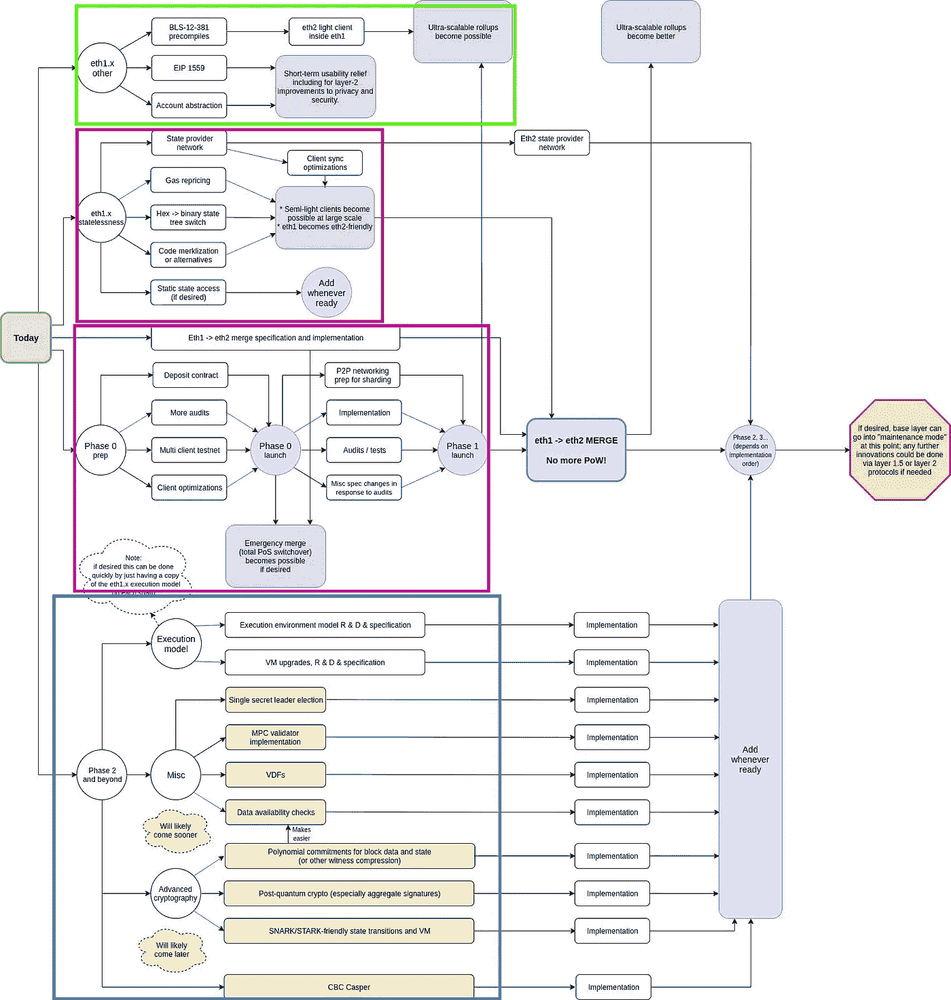

# 波尔卡多特大战宇宙大战以太坊 2.0——真正的白痴

> 原文：<https://medium.com/coinmonks/polkadot-vs-cosmos-vs-ethereum-2-0-for-real-idiots-3b6f0e0cfb2f?source=collection_archive---------0----------------------->

嘿，又是这个时候。加密货币正在变得奇怪，到处都有关于你应该买什么和什么是好东西的文章。所以我写文章也就不足为奇了。像往常一样，它是由一个白痴为白痴写的。这篇文章的想法很老了，正好 3 年前有人回复我的宇宙文章，问宇宙，方舟，永恒之塔，图标和万链之间有什么区别。我很惊讶这个问题没有包括波尔卡多特。所以我也回应说 Polkadot 应该在比较之列，因为它是唯一一个与 Cosmos 相提并论的项目。其他的似乎不是真正的竞争。当时我也认为 Dfinity 有自己有价值的想法，如果没有自己的想法，它不会跳上互操作性宣传的列车。然而，三年后的现在，除了 Cosmos 和 Polkadot，大多数提到的项目都没有太多的相关性，所以让我们来看看。当然还有以太坊。你还能从这篇文章中期待什么呢？更多地了解碎片、互操作性和最先进的利害关系证明。不错！

Here we will be enriching the text with high-information density images like this.

为什么是这三个项目？对我来说，这似乎是成为一个具有互操作性、可伸缩性和适当生态系统的平台的三个主要因素。我做了很多研究，重读了他们的白皮书和其他各种文档，试图获得一个不错的见解。然而，由于这是如此多的东西，这篇文章只会刮表面，我将永远是有偏见的。我尽量不带偏见，但我是一个人，也在我的区块链游戏项目(www.crowdcontrol.network)中使用其中一项技术，所以在文章的结尾，你可以猜到我实际使用的是哪项技术。如果你猜对了，请在评论里给我点颜色看看。

# 区块链 3.0

我们正在关注的发展通常被称为“区块链 3.0”，有几个定义，但我认为 Polkadot 白皮书已经很好地定义了它，它定义了:

1.  **可扩展性**
2.  **可隔离性**
3.  **可发展性**
4.  **治理**
5.  **适用性**

作为关键领域，区块链 3.0 需要对行业进行变革。本文将分为 3 个部分。首先，我们将试图理解所有这些意味着什么，以及目前的技术水平如何。然后，我们将着眼于这些挑战的一般解决方案及其影响。最后，我们来看看我们的三大玩家是如何做到的。最后，我将尝试给出一些如何应用于真实世界 dApps(分散应用)的见解。

## **1。可扩展性**

嗯，我最喜欢这个定义:可伸缩性是指通过提供额外的劳动力可以处理多少额外的工作量。例如，在建筑工地上有更多的挖掘机意味着更快的挖掘速度(惊喜！).然而，在某些时候，在场景中增加一台挖掘机可能没有太大帮助，因为可能没有足够的空间来操作。可扩展性是有限的，与 100 台挖掘机相比，您不能使用 1000 台挖掘机来获得 10 倍的泥土吞吐量。

Chinese construction site — Testing the scalability of excavators.

看看比特币或任何其他基于 Nakamoto 共识的系统(这意味着工作证明+最长链规则)，我们将交易的吞吐量定义为工作负载，将节点或矿工的数量定义为劳动力。那么**可伸缩性是一个令人惊讶的 0。零。**对于挖掘机来说，数量翻两番可能仍然会带来双倍或更多的吞吐量，但对于比特币矿工或节点来说，节点/矿工数量翻两番并不会带来双倍的吞吐量，而是根本没有额外的吞吐量。我在我的 [PoW vs. PoS 文章](/coinmonks/proof-of-work-vs-proof-of-stake-for-real-idiots-a23ac4565649)中解释了这一点，但是这里我们只需要知道，所有额外的节点或矿工完全有助于系统的安全性。这意味着，要提高比特币每秒 7 tx(交易数)的处理能力，已经没什么可做的了。嗯，实际上是有点多，因为一些可怕的改进，如 SegWit，但没有从根本上改变这种情况。本质上，这意味着比特币不适合作为支付网络。什么？当 BITCOIN.ORG 的 I GO 说它是一个创新的支付网络？你在说什么？等一下。运营这个网站的人可能更了解它，但是营销不是说 100%正确的事情，而是说 100%吸引人的事情。但是比特币的市值最高，你在说什么？这其中的原因并不是用比特币支付有多美好。当你购买火车或公共汽车票时，你有多经常想到“我现在想用比特币支付这笔费用”,如果你这样做了，你有多经常考虑比特币的交易费，并得出你真的想这样做的结论？我希望永远不会。因为用 10 美元的 tx 费买 2 美元的票是没有意义的。

A “funny” meme summing up what we just learned.

记住所有这些，比特币仍然非常擅长一件事，那就是成为一个创新的储值网络。对于储值来说，你不需要非常擅长做很多交易，你需要非常擅长安全。这里通常提到 Visa/Mastercard，以其大约 2000 tx/s 作为参考，在区块链应该可以到达。好吧，好吧。现在我们理解了为什么可伸缩性可能是一件事。一旦我们想到以太坊，它就变得更加令人望而生畏，在以太坊中不仅进行货币交易，而且还进行计算，这导致了更多的工作量。

Monks training for day trading with Uniswap.

## **2。可隔离性**

也许，我更愿意称之为**兼容性**。它基本上意味着满足了不同应用程序和/或用户的多少需求。嗯，比特币只允许交易，但即使有不同的需求。除了提到的 2 美元门票，还有托管和多方支付(比特币提供了功能，耶)。但这不仅仅是支付。因为以太坊是图灵完备的，你可以用它来编码任何你想要的东西。然而，这只是真实的，只要你能支付计算费用。如果你想在以太坊上建造《我的世界》，那可能行不通，因为计算需求太大了。这里的限制仍然是吞吐量，但也有其他东西，如随机性、零知识和互操作性，其中平台可能不提供必要的功能。因此，这一点可以归结为一个愿望，即一个平台应该是兼容的，并完全适合一切。

If this concept is not yet clear, that is ok. We will have more examples.

## **3。可显影性**

不仅有用户体验(UX)，还有开发者体验(DX)。这一点解决了这个问题，这对于您在哪个平台上开发有很大的影响。以太坊是启动它的网络，有一个很大的好处是你不需要托管任何基础设施。您编写智能合同并部署它。就是这样。区块链掌管你的东西。这非常好。没有服务器管理，没有 Kubernetes 集群。另一方面，智能合约可能不会完全如你所愿。他们可能不安全。以太坊曾经发生过一次真正的大事件。嗯，实际上有几次。但首先想到的是**刀叉**。在网络需要分叉来修复一个黑客的地方，否则将会窃取数百万以太网。网络确实分裂成以太坊和以太坊经典(在那里黑客成功了)。这种事情可能会发生。再比如平价钱包，被黑了，我们后面还会再提到。所以这一点主要归结为
a)生态系统有多好？有好的项目可以用吗？代码是分层的，各部分可以很容易地交换吗？还是一团混乱？基础设施有多好？你会用吗？
c)平台的基础有多强。它是否支持您想要做的事情，如果不支持，它是否允许您修复它并插入修复程序？
这三点可以相差很大。这来自于这样一个事实，有些东西是互相排斥的。也就是说，如果你有一个可以使用的强大的基础设施(以太坊智能合约)，你不能改变任何基础。即使你已经编写了一个很好的解决方案，如何滚动随机数或进行零知识交易，这可能需要几年时间才能包含在以太坊中并对你有用。这也适用于第二点。可隔离性。

This meme works even better for developer experience…

## **4。治理**

区块链或平台的可治理性如何？作为一个被高度低估的点，难怪老项目缺少它，现在每个重要的项目都明白为什么它非常重要。在分布式应用程序中，没有一个单独的实体负责，并且必须独自面对后果。如果事情朝着错误的方向发展，每个人都会受到影响，但是没有人能够单枪匹马地改变这些事情。例如，Tezos 甚至认为这是他们产品的要点，其他一切都可以升级到 Tezos。因此，如果我们看看比特币，乍看起来问题可能并不明显。但实际上有三方，矿商、开发商和用户。并且没有办法强迫这些当事人之间达成协议。希望他们的目标是一致的，但事实并非如此。例如，矿商可能乐于接受非常高的费用，但用户想要的恰恰相反。说到升级(BIP ),用户在决定升级什么或者什么时候升级方面没有真正的发言权。

When it comes to protocol upgrades reducing the fees in a blockchain, miners love democracy.

用户基本上只能威胁矿工离船，用别的。开发人员也必须希望矿工喜欢他们的工作，但基本上应该做改善用户体验的事情。可能有几个原因可以解释为什么会有这么多比特币，但我认为这是主要原因。以太坊有一点小麻烦，主要原因可能是像以太坊基金会这样的实体的存在，它在相当大程度上操纵着这艘船。权力下放的铁杆粉丝可能不喜欢这样，但这可能是一种理性的声音，倡导必要的升级。只要看看当前的过程 **EIP-1559** ，这是一个老故事，在比特币中，我们过去经常遇到这种情况。矿商不想支持升级，升级会降低费用，让系统对用户更好。然而，以太坊的用户和开发者在面对矿商的反对时处于更有利的位置。
最终，治理归结为确定成员利益(主要是投票)的过程，决定软件升级/变更，协调这些升级，并最终选举代表网络或与网络合作的实体。

Remember how we wanted to give more insight into the concept of expectation vs. reality? Here we go.

## **5。适用性**

这一点大多说的是“平台有没有杀手级的功能？”。Polkadot 白皮书用“这项技术实际上解决了它自己的燃眉之急”来描述它。这很有趣，因为后来的白皮书认为，Polkadot 应该最小化和简单，没有不必要的功能，甚至智能合同也不应该在中继链上运行，而是在副链上运行。我认为这是正确的做法。一个平台不需要有一个杀手级的特性。如果平台建设得好，杀手级应用就会出现。以太坊没有自己的杀手锏，但是 **Cryptokitties，Uniswap** ，几个指数和很多很多 ico 有机地出现了。所以我们就直截了当了。成为一个好的平台是杀手锏，这可以归结为第 1-4 点。

# 主要部分—了解基础知识

我们设法读完了第一段，现在来看这些事情是如何被普遍处理的。但是一般是什么意思呢？问题是，没有一个项目能独自完成所有的事情。都是站在巨人的肩膀上，互相影响。以太坊是如此的成功，以至于没有一个项目不关注它。

## **1。可扩展性**

有两种缩放类型。垂直和水平缩放。这不仅适用于区块链，它也适用于一般的软件开发，它也适用于一切。可能是商业或者你想象的任何过程。让我们再次拿出我们的挖掘机。如果我们横向扩展，那么我们将越来越多的挖掘机投入使用。如果我们纵向扩展，我们会购买更快、更大、更好的挖掘机。他们的手臂移动更快，有更大的铲子，很好。对于这种挖掘机来说，很明显，水平缩放意味着更多的摩擦，它们更有可能相互干扰，因此缩放不再是线性的。垂直扩展以同样的方式没有这个问题，因为它只是被升级的同一个单元，所以没有额外的通信成本和空间限制(只要挖掘机适合:D 的建筑工地)。垂直缩放的问题在于存在技术限制的情况。在某种程度上，找到一个更大的液压系统变得复杂，它仍然能够移动铲子。一旦您将市场上最大的液压系统安装到您的挖掘机上，您就不能再对其进行纵向扩展。您可以购买更多的液压系统并并行操作这些系统，这是水平扩展，挖掘机可能仍然是一个单独的单元并进行垂直扩展，但液压系统将受到收益递减的影响，或者说是亚线性扩展(通常用于水平扩展)。所以在内部，挖掘机是水平扩展的。同样的道理也适用于每一个部件，你给挖掘机增加的越多，它就变得越贵，越重，等等。

My feeling when researching for this piece of text here.

软件有一个特殊的属性，基本上就是说复制它非常便宜。所以有人会说，水平扩展是免费的？嗯，还是有沟通的必要。你可以叉 100 次比特币，然后处理 100 次交易，但它不再是同一个网络。你可能在网络#15 上有一个 BTC，而其他人在网络#45 上有一个钱包，你们如何相互作用？你不能。这就是水平缩放的大问题。与垂直扩展相比，我们有技术限制。工作证明和最长链规则可以通过增加数据块大小和减少数据块时间来扩展。看似很容易，但实际上并不是一个选项。只有在有足够的时间来搜索下一个散列的情况下，才能保证公平竞争和块被发现的真正随机性。你减少的阻塞时间越多，网络就越集中在这些参与者身上，这些参与者可以最快地与其他参与者通信，这同样适用于块大小和带宽。悲哀。

但是一般的方法是什么呢？今天区块链的酷孩子会尝试纵向或横向扩展吗？结果是两者都有。垂直扩展的默认解决方案是标杆验证(PoS)。水平扩展的默认解决方案是让多个区块链互相操作。我不会在这里解释 PoS 的所有细节，因为我已经在上面链接的另一篇文章中解释过了。我们在这里也不需要理解这些东西，我们需要知道的是:PoS 不运行概率难题，因此下一个块可以更快地产生。不需要有很长的阻塞时间，限制基本上是网络成员处理一个阻塞的速度和他们通信的速度。一个块的处理时间只是一个 CPU 或 GPU 的问题，可以很容易地扩展。网络延迟最终会受到光速的限制，因此一个光子绕地球一周大约需要 133 毫秒。铜中的信号慢 3 倍，光纤中的光子仅损失 33%的速度，因此 200 毫秒是可能的。然而，中间也有路由器，光纤可能没有完全布置好，我们需要让数据包来回传送，所以假设 1 是合理的。

对于一个分布式应用程序来说，很难让所有的参与者都在不到 1 秒的时间内得到更新通知并同意更新。与块大小相比，它还取决于带宽，但例如比特币块是 1 MB，这在这里不是带宽问题。因此，如果我们假设比特币块大小，并通过运行真正具有 1s 时间的东西来计算吞吐量的增加，那么我们会获得 600 倍的加速。我将试着说明这是如何计算的，并希望让它足够容易理解。比特币的区块时间是 10 分钟，一分钟有 60 秒，所以如果我们乘以这个时间，我们最终会在相同的时间跨度内得到 600 倍的区块数量。加速不错。另一个复杂的计算是比特币的 7 tx/s 乘以 600 得出我们 4200 tx/s，所以本质上，每秒拥有 1MB 的块就可以达到 Visa 级别。实际上，虽然时间更多地在 4 秒和 7 秒之间，但我们也可以增加块大小，因此垂直缩放看起来不错。利害关系证明还有另一个好处，那就是它不会增加不必要的全球变暖。所以我们可以靠它致富，但不会破坏我们的星球。单子上又多了一个好东西。

但是这里有一个问题要提一下，这个问题与沟通有关。在 Nakamoto Consensus 中，一个新的块可以被广播，你不需要等待任何东西。这些节点与一个八卦网络通信，所以每个人都告诉它的邻居他们的新数据(块)。为什么不需要等任何人？因为任何人都可以不用问任何人就能验证块。这是一个非常好的特性，而对于 PoS 来说这是不可能的。没有密码难题，所以你不能只验证一个散列。你需要知道其他人是否都同意了。这意味着如果有 100 个块生产者，他们中的每一个都需要与其他 99 个进行通信。如果有 10，000 个块生产者，每个生产者需要与 9999 协调。这基本上意味着对于 N 个参与者，每个人都需要与 N-1 人交流。因此，通信缩放是 N*(N-1)，对于大的 N，1 无关紧要，所以我们最终得到 N。我们称之为**N-问题**，这意味着我们不能无限地缩放块生产者，或者更好地说是验证者。

那么 N 问题有解决方案吗？当然可以。一个非常常见的例子是验证者委托者分割。这些块由验证器产生，验证器运行节点，一个接一个地提出块，并投票决定这些块是否有效。他们的投票权由他们自己的股份加上委托人委托的股份决定。委托人不运行服务器，他们只是将他们的股份绑定到运行服务器的验证者。N-问题解决了，因为验证器之间只需要网络通信，所以数量可以很小，例如 100。我们希望拥有尽可能多的节点的原因是什么？有两个，一个是防止卡特尔形成/勾结，另一个是分割容忍。那么我们现在的表现更差了吗？事实上，卡特尔的形成或共谋仍然被授权者所阻止。由于这些可以无限扩大，要形成卡特尔，还需要贿赂授权者的股份。如果某个卡特尔正在形成，那么授权人应该从该卡特尔中收回他们的股份，并将其重新分配给其他验证人。对于分区容差，委托器没有帮助，并且分区容差也被大多数 PoS 实现的另一个属性所降低。基于[实际的拜占庭容错](http://pmg.csail.mit.edu/papers/osdi99.pdf)这种网络的活性不同于 Nakamoto 共识。当太多节点停止运行时，网络就会停止运行，无法产生新的数据块。相比之下，中本聪并不在乎。当一半的矿工下井时，下一个区块将需要更长的时间——如果一半的采矿电力受到影响，则需要 20 分钟——但如果网络保持分裂，这将放松回到目标的 10 分钟。这里有一个关键的信息: **PoS 降低分区容忍度**。

分区容忍度降低令人遗憾，但一方面，一半的块生产者离线的事件非常严重，无论如何停下来等待一会儿可能是好的，另一方面，我们为这种权衡获得了一个很好的特性，这就是终结性。这意味着块在某个时候成为最终的。所以在 Nakamoto 共识中，理论上任何区块都有可能随后被区块链的并行分叉所回复。如果实现了 pBFT 的某种变体，情况就不是这样了。

很好，所以我们很开心？嗯，PoS 也有一些其他的问题。也就是**远程攻击**和**无利害关系**，这两种力量都不存在或者没有到那个程度。为了部署功能性加密货币，需要解决这些问题。让我们简短地研究一下这些问题。如果我们天真地实现 PoS，这意味着像 Nakamoto Consensus 一样，但是与 PoS 交换能量，那么攻击者就有可能创造另一种现实。在过去的某个时候，攻击者可以脱离并创建他们自己的现实。例如，当攻击者拥有 1%的股份时，每第 100 块由攻击者生产。在这个块中，攻击者恶意地增加他们的赌注，直到这种情况发生得足够频繁，攻击者有足够的赌注来接管网络。一旦被接管，攻击者可以非常快地制造出许多方块。当然，攻击者无法欺骗其他不同意这一事实的验证者。但是想象一下，有人加入网络并想下载区块链历史。这个新来的人不能决定我们的攻击者所呈现的现实是真是假。更有甚者，如果他还从另一个验证器下载了一个竞争的现实，那么使用最长链规则将导致伪造的链更加可信。因为这种攻击越早伪造积木效果越好，所以它基本上可以从创世纪积木开始伪造一个不同的现实。这就是为什么这被称为远程攻击。为什么这在权力中不起作用？因为你需要有矿力才能锻造出很多难度很高的方块。你不可能在没有大量采矿力量情况下，仅仅制造一个难度很高、时间很长的区块链。因此，任何局外人都可以很容易地看出你的替代叉子不是最长(最重)的链条。与我刚才说的相反，远程攻击这个名字最初来自战俘，但对战俘的意义有点不同(如果你想知道，你可以在[以太坊博客](https://blog.ethereum.org/2014/05/15/long-range-attacks-the-serious-problem-with-adaptive-proof-of-work/)上阅读)。

好吧，那我们怎么解决这个问题呢？实际上我们无论如何都不能使用最长链规则，所以我们无论如何都需要改变一些部分。解决方案可以是检查点。这基本上意味着我们决定没有办法恢复一些块。不能再有替代的岔道超过这些街区了。这个街区是最终的。我们已经听说过这个特性，它叫做终结。我们还看到，对于比特币来说，很难有这样的检查点，因为没有人决定何时这样做。那么这意味着什么呢？在这些最后的程序块中，有一个固定的状态，我们可以写下来，现在对于任何局外人来说，下载这个固定的状态就足够了。这也意味着一个局外人不再需要下载整个区块链的历史。因为历史的所有影响都集中在这一点上。这也叫做修剪。例如，在以太坊中，如果不进行修剪，区块链将会有 4 TB 大，而有了修剪，它会保持很小，只有几百 GB。这听起来仍然非常多，但当谈到服务器可以轻松处理的内容时，这是一个很大的区别。

然而，我们在这里看到了另一点，为什么比特币很难做到这一点。比特币没有状态。在比特币中，区块确实收集了一些交易，这些交易导致比特币地址上的 UTXOs。要知道一个地址的平衡，需要将所有的块相加。好的，那么这些 PoS/BFT 共识系统是如何允许检查点的呢？基本上它们是在协议中定义的。因此，比特币也有可能定义这样的检查点，但这将意味着很多影响，而这是中本聪最有可能希望避免的。在 PoS/BFT，这是免费的，因为这些暗示已经被购买。最重要的一点是等待所有的参与者做出回应，或者至少大多数人做出回应。你不能说比特币的每 500 个区块都是最终的，因为这将给找到这样一个区块的幸运者太多权力。在这一点上，你需要确保每个人都同意这个检查点，因为允许竞争分叉的好理由仍然成立。在 PoS/BFT 中，我们不需要将这样的东西插入到共识机制中，因为每个块都是由投票产生的。当三分之二的人投票赞成一个街区有效时，它就成了一个街区。在 pBFT 中，它甚至成为最终块。因此，使用这种方法使 PoS 成为现实，远程攻击的解决方案是免费的。很好。

Those of of you who can’t relate, please think twice.

留给我们的是**无利害关系**的问题，它描述了在选择叉子时没有利害关系。在 PoW 中，如果有并发分叉，您必须决定遵循哪个分叉，因为您不能挖掘所有分叉。如果这些分支之间只有一个事务不同，那么散列将会不同，您只能在一个分支上挖掘。这使得叉子的选择是必要的。在 PoS 中，您的硬币在每个叉子上都是重复的，所以您可以“挖掘”或者更好地说在每个叉子上验证。这甚至不仅仅是可能的，而且是激励性的。对你来说，跟随任何一个分支并获得块奖励都是有意义的。如果很快就会有 100 个叉子，而没有人想解决这个混乱的问题，前景就不太好了。尽管这种攻击从未发生过，但对它发生的恐惧可能是早期 PoS 硬币失败的主要原因之一。还有一些其他因素，可能是这些天被讨厌的高预矿没有给予“适当的分散”或缺乏看到和实施 PoS 的优势。讨论这是一个有趣的话题，但让我们回到我们在这里看到的。我们有一个攻击媒介，应该可以解决。我们如何阻止验证器跟踪每一个可能的分支？通过惩罚他们这样做。所以为了得到想要的行为，协议定义了一种惩罚。所以叉子还是可以做的，但是你要决定。你的叉子的所有成员，斜线对方叉子成员的硬币(惩罚)，反之亦然。如果有人两个都跟着，那么两个都会发生砍杀。其他不良行为也会受到削减硬币的惩罚，那就是双倍消费和长时间离线。有了这个**【BFT+PoS+砍杀**的组合，我们就有了一个让不当行为付出高昂代价的系统。这同样适用于 PoW +最长链规则(中本聪共识)。如果你在那里走错了岔路，你就失去了你投入的工作，这意味着支付的电费，这意味着钱。万一你行为不端，攻击区块链，你也可能会毁掉你投资的硬币的价值。

在 PoS 中，这种联系甚至更紧密，因为你必须拥有硬币而不是硬件，当硬币变得一文不值时，硬件可能会失去很多价值(对 ASICs 来说比对 GPU 来说更是如此)。好极了，那么两者是一样的吗？不一样，两种方法达到的目的是一样的，但是有一个非常重要的区别。在邮政系统中，你需要锁好硬币，以防发生意外而受到惩罚；在电力系统中，你需要烧电，如果你没有行为不端，你只能得到一些东西。两者都实现了分散式网络的安全性，但其中一个不会因为浪费大量能源而毁灭地球，这是一个优势。想象一下那该有多好。

With PoS this can become a reality without the part, where the planet is destroyed.

既然我们理解了为什么 PoS 非常有意义，我们还想理解为什么它更快。在 Nakamoto Consensus 中，交易的实际处理成本并不高。昂贵的部分是解决密码难题。为了公平起见，解谜的时间必须比一个块的传播时间长许多个数量级。如果没有足够的时间，那么要么最后一个块的发现者具有高度优势(极端情况)，要么网络中最中心的节点具有优势(更现实的情况)。

嗯，这不是 100%真实的，因为例如在以太坊有**叔叔**。叔叔们是被发现并有效的街区，但不属于区块链的主线。所以就像家庭聚会上那个奇怪的叔叔一样，这些并不是真正想要的，但无论如何都属于这个家庭。对于以太坊来说，这意味着叔叔被包括在内，如果它是有效的，对于方块的发现者来说，这意味着你可以让它进入区块链，即使别人比你快 1 秒。这可以大幅减少封锁时间(以太坊为 15 秒)。但以太坊并没有明显快于比特币。所以让我们回到 PoS。在那里我们不需要运行这么长的时间来解谜，因为没有解谜，我们只需要时间让每个人从其他人那里知道该块是有效的。然后我们可以继续生产下一块。有不同的方法来选择下一个块生产者，但它并没有真正的区别。重要的是，在像地球这样的星球上，以光速，整个过程可以在一两秒钟内完成。块的大小主要受带宽的限制，因此将来可能会增加。对于比特币来说，这也是正确的，但有更多的反对力量反对更大的区块，原因主要是为了最大限度地保持去中心化。

既然我们对垂直缩放的主要方法 PoS 有了基本的了解，现在让我们看看**水平缩放**。有两个候选人，他们非常相似。一个是互操作性，另一个是分片。互操作性也属于兼容性范畴，因为它将不同的区块链连接在一起。因此，如果解决了互操作性，我们就可以让不兼容的东西兼容。但是，如果我们能做到这一点，我们也可以创建一个给定的区块链 100 叉，让每个叉互相交谈，并连接的东西。100 个分支处理 100 倍于单个分支的块数，所以为什么这个规模是显而易见的。这里的大问题是:**如何在两个区块链之间进行不信任的交易？**这是一个很好的问题，我将尝试通过一个简单的例子来回答这个问题，即如何在不发明任何新技术的情况下连接两个区块链。顺便说一下，我觉得很奇怪的是，在这个区块链世界里，你会发现 1000 篇文章解释互操作性是多么的棒和重要，但是几乎从来没有解释过它实际上是如何工作的。即使有人在一个特定的 reddit 上问，请给我解释一下，然后用户继续回答“是的，IBC 协议使两个区块链可以安全地相互交谈”，好吧，但是怎么做呢？

Somehow all different interoperability memes are about how people talk too much about it, without understanding it.

让我们假设我们有鲍勃和爱丽丝，其中鲍勃有一个比特币，并希望与爱丽丝交易他的比特币，爱丽丝有一个以太。双方都明白，像 Mt.Gox 这样的交易所确实存在，或者说确实只存在了有限的时间，可能明天就会流行，并且不想把他们有价值的硬币放在一个不可信的交易所。不是说交易所是骗局，但它能做什么？最终，它是一个中心实体，它总是会因个人失误、糟糕的架构或某个人在飞机上意外死亡而倒下，因为它是唯一拥有交易所钱包私钥的人。所以他们都非常希望以一种安全分散的方式进行交易。现在他们已经听说了一个伟大的概念，那就是 **DEX** (分散交换)。但不幸的是，这只有在他们用 shitcoin B 交换 shitcoin A 并且两者都来自同一个(以太坊)区块链的智能合约时才有效。在两个不同区块链的情况下，这是不可能的。

所以他们有了另一个想法。有很多两人的朋友，愿意帮助他们，他们中的一些人互相认识，但大多数人不认识。所以让我们取 5 个彼此不认识的。现在，他们在比特币上创建了一个多签名钱包，并在以太坊上做了同样的事情。什么是多签名钱包？这是一个钱包，所有 5 人都必须签署一项交易才能将其发送到区块链。你也可以有一个多签名钱包，其中只有 5 个中的 3 个需要签名，但是对于这个例子来说，这并不重要。所以这 5 个创造了两个多签名钱包。现在，鲍勃将他的比特币发送到比特币区块链上的多签名钱包，爱丽丝将她的以太发送到以太坊区块链上的多签名钱包。如果两者都做到了，我们进入下一步，如果没有，那么 5 创建一个事务，将比特币发送回 Bob，或者将以太发送回 Alice。请注意，在这里，没有人能够独自带着比特币或以太逃走。

现在两人都已经交易了他们的硬币，5 中的一个成员创建了一个交易，该交易将比特币从多签名钱包发送到 Alice 的比特币地址，另一个交易将以太发送到 Bob 的以太坊地址。现在，5 个成员中的其他 4 个成员看到两个事务都是按计划创建的，并在这两个事务上签名。之后，两个硬币被发送到另一个，他们成功地进行了分散交易。再说一次，没有人能独自拿走硬币。这只有在 5 个人都串通好的情况下才有可能。尽管如此，他们这样做可能还是有原因的，例如，在一笔大交易中，偷硬币并除以 5 比他们在这个过程中失去的声誉更有价值。这就是为什么我们可能想要 100 而不是 5。那么基本上我们现在已经解决了互操作性？为两个区块链用户想要进行的每笔交易找到 5 个甚至 100 个多签名钱包持有者可能有点麻烦。一种方法是建立一个 100 人的团队，为每个人做这件事。不幸的是，这更加增加了对这些设备的安全性要求。

有什么方法可以确保他们行为正常吗？好吧，惩罚又是关键。让这 5 或 100 枚硬币锁定一些硬币，如果他们行为不端，这些硬币会被砍断。这使得试图与他人勾结变得更加危险，因为这些人可能会报告这样的行为。然而，可能很难找到 100 个愿意锁大量硬币的人。但是等等，真的吗？我们实际上已经有一些候选人这样做了，这些是我们的 PoS 区块链的验证者。这里变得有趣了。无论如何，这些验证器甚至在运行服务器，处理事务时更是如此。太好了，我们只要使用验证器，问题就解决了？不幸的是，问题又出现了。一个问题可能是叉子。又来了。因此，即使这 5 个或 100 个看到两个都发送了他们的硬币，那么仍然可能发生的是，在 20 分钟内，区块链的另一个分叉接管，并且在这种情况下，爱丽丝可能没有提供他们的交易部分。但是，如果交易的另一部分已经发出，那么就没有办法阻止它。所以实际上，我们需要等待，直到不再有分叉。理论上这对于区块链来说不可能像比特币一样。我们现在需要的是终结。啊哈。所以 PoS 也为互操作性提供了一个很好的特性。+

终结越快，跨区块链交易最终结算的速度就越快。但这是否意味着，将比特币纳入我们整个可互操作的世界是完全不可能的？嗯，实际上有可能创造一种叫做**钉住区**或**桥**的东西，它接受比特币，并为此创造钉住或包装比特币。钉住的比特币现在植根于 PoS 区块链，具有终结性，真正的比特币在钉住区控制的钱包里等着。当有人想要回真实的东西时，铸造/挂钩的比特币被再次烧毁，真实的比特币被发送到一个比特币地址。在这种情况下，钉住区永远无法 100%确定，不会有一个竞争的叉子接管，但这基本上是同样的问题，交易所今天有，当他们接受区块链的硬币没有终结。因此，这意味着在非常严格的理论思维中，链的状态永远不会是最终的，但是在许多块(例如 10 块)之后，尝试成功的攻击会变得极其昂贵。这取决于许多参数，但这里的基本问题是，你需要比区块链的矿工更快来伪造一个替代现实。所以你需要投资更多已经存在的矿商，然后攻击可能会使硬币的价格崩溃，使你的攻击失去吸引力。如果你有更少的矿工，例如只有 10%的总采矿能力，那么你仍然可以试试你的统计运气，因为你仍然可以成功地找到一个竞争区块，在那里你从钉区偷硬币，但这样做 2 个区块变得不太可能。例如，如果你有 10%的机会找到下一个方块，那么你也只有 1%的机会找到之后的方块，如果你需要找到 10 个方块来进行攻击，你有 0.00000001%的成功机会。为了尝试，你仍然需要运行这些矿工，这可能会花费数十亿美元。你不太可能轻易偷到那么多钱，所以从本质上讲，出于实际原因，攻击这个盯住区而不赔钱是不可能的。

Those of you who can’t rela… wait we had this caption already.

不幸的是，这意味着我们必须等待几个街区。与双方都有 PoS 的即时**终结**相反，我们可以用 1 个 block 来做这件事。好的，很好，还有别的吗？是的。如果我们设置了这些 PoS 链，那么甚至有可能共享安全性，这意味着我们在两个区块链上共享验证器。对于我们的例子来说，这些非常有趣，因为如果他们行为不端，他们会受到双方的惩罚。使得贿赂更加复杂，从而增加了安全性。很好，这就是我需要知道的一切？不，还有更多。基本上我们不需要发币。我们也可以在不同的区块链发送交易信息。这意味着智能合约可以相互交流。这也是一个不错的功能。好吧，但是现在我们什么都有了？好吧，假设我们理解了基础知识，并且有许多细节，例如为什么每个区块链都有一个轻客户端是有意义的，允许另一个区块链的成员轻松地验证事情。但是让我们暂时就此打住。

让我们来看看**分片**，现在我们已经读了这么多，对所有这些东西如何相互作用有了更多的了解，这就更容易理解了。分片扩展与互操作性扩展的原因相同，但是我们不想让多个独立的区块链并行工作并进行通信，而是想找到一种方法将单个区块链分成多个部分，或者说分片。听起来会有同样的结果，但事实并非如此。差异的根源在于，第一种方法复制了区块链，并为每个副本提供了自己的基础架构，而第二种方法使用了相同的基础架构，试图将其工作人员分成许多部分。这就是为什么对于可互操作的区块链来说，最大的问题是如何让这些不相交的部分彼此安全地交互，而对于碎片来说，问题是如何组织所有这些工人，使得单个实体不能破坏整个事情。

在我们将这种方法视为基础架构的工作人员被划分并且没有工作人员完成所有工作之后，我们就明白了为什么分片有利于扩展。工作是生产块，工人是验证者。分片允许分割这项工作，这样只有一小部分验证器在网络的同一部分工作。Nakamoto Consensus 没有随着更多节点而扩大规模的原因是，每个节点*都有*来完成所有工作。如果我们将工作分割到许多节点上，那么拥有更多节点意味着我们可以将工作分割成更多部分，使每个部分变得更小，从而实现可伸缩性。因此，这个想法是，一个传入的事务进入一个碎片，并在那里被处理。它被包含在这个碎片的块中，其他碎片并不真正需要关心这个事务。但是等等，如果交易从一个不在这个碎片上的地址转移一些硬币，这是怎么回事？嗯，这确实行不通。有许多可能的方法来组织这些碎片，但幸运的是，这对区块链来说并不是一个全新的话题。

存在大规模并行计算，其中许多计算机一起解决繁重的计算任务，例如在来自太空的无线电噪声中寻找外星智能的信号(SETI)。另一个领域是数据库，尤其是集群文件系统和海量数据存储。大型数据库的不同部分通常被称为碎片，所以这就是这个名字的由来。在这些领域，聪明的研究人员已经绞尽脑汁解决了这些问题，解决方案也因你的系统到底擅长什么而异。如果您经常在数据库中写入数据，但很少读取数据，那么组织系统以使写入速度最大化是有意义的。这意味着从一个数据源传入的数据通常会在完全不同的碎片上结束，但这也是允许非常快的写入速度的原因。如果您有许多请求，并且这些请求代表某种类型的数据浓缩，那么将属于同一个碎片的数据放在一起可能会好得多。例如，如果您有一个数据库，其中存储了生活在这个星球上的人的所有数据，请求类似于“给我生活在所有城市的人的平均年龄”。如果人们的数据是根据他们在碎片上的居住地点分布的，那么每个碎片可以自己计算其城市的数据，然后只报告每个城市的结果。如果数据到处都是，那么每个碎片需要与其他碎片共享数据，然后才能进行计算，这需要更多的工作。

它甚至变得更加复杂，例如，如果我们想将这些信息与其他信息相关联，比如这些人有多高。那么我们就不能只是把他们的年龄相加，然后把总和连同取样的人数一起送到下一个碎片等等。那么我们可能需要先在某个地方收集所有的数据，然后计算复杂的相关性。如果我们看看大规模并行计算，情况是一样的。基本上，比特币挖掘是一个巨大的大规模并行计算操作，同步它非常容易。之所以这么容易，是因为所有的工作都无关紧要，除了一次尝试，最终找到了那个块。这有点类似于蛋白质折叠计算，这也是这种分布式计算任务的一个例子。最重要的结果是一个随机产生的参数集，它给出了最稳定的蛋白质。对于 SETI 来说，记录的噪音也可以很好地分布在不同的计算机上，但也有频率的问题。如果一个信号的波长太长，以至于信号被发送了 10 年，那么如果记录的噪声被分成 100 秒长的片段，就可能找不到它。当然有许多聪明的事情要做，但这不是本文的目的在这里:D

那么区块链的划片怎么样？很明显，这涉及到数据存储和计算，很好。所以我们有最坏的两个世界。幸运的是，除此之外还有一大堆垃圾，那就是安全计算。在其他的例子中，没有一个实体有恶意行为，甚至没有一个实体可能被激励去做这件事。所以我们有数据存储，计算和安全。所有这些一定很棒。但是我们很幸运，我们知道很多关于要存储的数据和要做的计算。例如，对于硬币交易，只需检查发送者是否有足够的硬币，接收者总是没问题的。智能合约的计算可以工作，以便所有数据都保存在智能合约中。因此，每当有人向智能合约发送交易时，所有数据都在一个地方，而不是分散在各处。不一定是所有数据，因为智能合约也可以访问其他智能合约的数据，但在大多数情况下，智能合约主要关心自己的历史记录和发送给它的交易。另外我们知道区块链并没有写繁重的任务。由于写需要一些费用，即使分片区块链的目标是处理比传统系统多 1000 倍的事务，它仍然不是一个写 GB/s 数据的数据库。这种数据存储的一个例子是欧洲粒子物理研究所的大型强子对撞机实验。

Looking deep into these eyes, you can see the reflexion of prices moving up

现在我们仍然可以看到有两个瓶颈和一个重要的约束。瓶颈是计算和数据存储，约束是一切都必须安全。考虑到这一点，我们最终得到了一种架构，这种架构不会尽可能地随机写入，而是将数据组织到属于同一智能合约的相同碎片中，并解决彼此之间以及与这些智能合约之间的交互。很好，我们有许多碎片，地址和智能合同在这些碎片上分开。对于每个碎片，我们分配一些节点来提议和验证新的块。此外，当需要跨片通信时，这些节点会四处发送数据。听起来不错，不太难？好吧，如果我们在每个碎片上有一小部分节点，那么这些节点就更容易形成一个卡特尔或者贿赂一些其他节点去做讨厌的事情。他们可以开始伪造恶意块，并将这些信息发送给其他碎片，从而腐蚀整个区块链。那就太糟糕了。

幸运的是，有一个解决方案，我们只是不断洗牌这些节点。如果每隔几秒钟就交换这些节点并提供新的合作伙伴，那么勾结或贿赂他人就变得非常困难。因为你需要一些协调和时间去做，如果不断有新的玩家出现在你的碎片上，你不得不频繁地移动到另一个碎片，这将变得非常困难。最终你不得不与所有人勾结，这意味着它就像古老的区块链一样安全。随机洗牌还解决了另一个问题，即所有这些碎片的协调者也可能通过丢弃一些跨碎片事务或伪造假的跨碎片事务来恶意操作。通过移动这些验证器，可以很容易地识别协调器节点的不当行为。现在一切都好了吗？不。洗牌有一个非常微妙的含义。这基本上意味着我们必须把我们要离开的碎片的所有数据发送给其他人，并且我们需要接收我们新碎片的所有数据。这意味着大量的带宽。

或者，我们可以存储大量数据，例如所有分片的数据，但是分片没有任何优势。如果每个节点都必须存储所有内容，那么可能只有计算能力的提升，而没有数据存储的提升。今天，单个区块链已经有数百 GB 大，因此存储 64 个或更多碎片可能不那么容易，并且会淘汰许多节点，导致集中化，这是我们不希望看到的。如果我们放弃权力下放，我们不需要运行一个区块链。然后我们可以坚持使用好的旧数据库。因此，我们要么需要大量的数据存储，要么需要大量的数据带宽，要么需要让节点坚持使用相同的碎片，这导致安全性较差。这被称为**数据可用性问题**。值得注意的是，这是一个三难问题，所以不是一个普通的两难问题，即有两个选择，但都是坏的，我们现在有三个选择，而且都是坏的。不幸的是，这个问题有一个天才的解决方案。

解决方法是什么？我们可以拆分节点，这些节点包含数据和验证数据块的节点。但是这怎么解决问题呢？因为节点已经被分割，所以需要更多的数据传输？好吧，诀窍是数据节点坚持它们的碎片，而验证节点被随机打乱。这意味着数据节点保存其碎片的所有数据，而不必一直重新加载其他碎片的新数据。这些节点提供事务以形成块或者甚至提议块，这取决于特定的实现。但是不管是哪种情况，验证器只是接受这些事务并伪造一个块，或者只是检查建议的块。如果验证者同意，就发布这个块。使用这种方法，验证器可以经常被调换，所以很难串通。但是没有必要一直传输大量的数据。太好了，我们解决了碎片问题？嗯，还有很多要处理，但本质上是可能的。当我们看到它是如何实现的时候，我们将会看到其他一些更好的问题。

## **2。兼容性(可隔离性)**

当我们考虑兼容性时，让我们区分一下
T5 a)安全
b)存储
c)计算
d)硬件特性
e)令牌经济

If you read this you are trying to be less like Ricky, very good!

第一部分 **a)安全性**是指一个平台提供什么级别的安全性(谁会想到？).让我们看一个服务的例子，用户可以购买股票并持有，基本上是一个**密码组合**。用户投入了价值 1 亿美元的资金，但该平台的矿工只值 100 万美元，那么一次攻击可能非常便宜，以至于价值 1 亿美元的股票将被窃取。在这种情况下，平台不能提供足够的安全性。这个产品组合的设计者最好使用另一个平台或者构建他们自己的基础设施。这就是以太坊伟大的原因。如果你在以太坊上建立一个智能合约，通过这个媒介的攻击是非常昂贵的，即使你没有努力去建立自己的基础设施。这非常好。原因是，基础设施已经存在，我们可以使用它。

如果我们看一下 **b)存储**，我们会回到上一部分刚刚讨论的内容。平台可能能够也可能不能存储您的应用程序需要的任何数据。分片或互操作性提供了一个巨大的飞跃，因为数据可以放在额外的分片或新生成的区域中。也可以使用**第二层**技术，将数据从区块链移走。一些应用程序有大量的数据需求，而其他应用程序并不需要很多。目前区块链的数据非常稀缺，因为获取数据的通常方式是通过块事务。块也很少，所以区块链 3.0 还有改进的空间。

下一点 **c)计算**已经提过几次了。它与存储非常相似，都描述了“虚拟机有多强大”之类的东西。计算也是相当昂贵的事情，并且在第 2 层上也有许多可能的改进。例如，可以将智能合约的计算移出链外，只保存结果。同样，当涉及到计算需求时，有不同的应用程序，并且经常与存储重叠。区块链上的游戏可能比投资组合的例子需要更多的计算。但是对安全感的需求会少很多。因此，我们在这里看到，需求可以非常不同。

**d)硬特性**是指以后不能插入的功能。例如，你不能让智能合约只适用于比特币。你可以考虑一些第二层的概念，但比特币矿工无法验证智能合约的计算。区块链 2.0 包含了智能合约，因为你可以用这些来编码任何东西，任何事情都应该是可能的，对吗？不。一个例子可能是**零知识**计算。它主要用于匿名，如 Monero 或 Z-Cash，但可能还有其他原因导致有人想要这样做。例如，如果您有治理，但您不希望用户能够在区块链上看到初步结果。当然，匿名可能也是一个问题，但让我们假设给每个人一个化名已经奏效了，所以没人知道谁在投票。如果有人看到其他投票到来，等到最后才投票，这样他就知道他的投票可能会改变什么，这可能还是不好的。其他例子可能是**(伪)随机数生成**或使用高级签名算法，如 **BLS** 。允许使用不同的方法意味着更快更有效地解决各种问题。有时候需要随机数生成，有一些特定的约束。例如，如果你出售一些 Cryptokitties，希望用户不能预测伪随机算法的结果。另一个例子可能是**协议内升级**。这一点也属于 4。治理，但也是这么硬的特性。其想法是，一旦区块链的参与者决定升级到新版本，这不是通过关闭所有节点，通过 git 下载新版本然后重新开始来完成的，而是通过实时更新来完成的，其中软件的版本由投票决定，因此是强制性的，并且无缝部署。因此，可能会有更多的硬功能，这不是本节的重要部分。重要的是，一个平台可能具有这些特性中的一部分，但不是全部。根据平台的功能，使用新功能或部署自己的硬功能是非常容易的，但几乎是不可能的。它再次与基础设施紧密相连。如果您部署自己的基础设施，当然可以轻松部署自己的硬功能，如果您使用由许多其他人运营的大型基础设施，则可能很难部署新功能。所以我们再次看到，有些点是互相排斥的。

Sometimes not all features are shipped on release.

这就把我们带到了最后一点:代币经济。这描述了一个平台与一个项目运行它自己的代币经济的愿望的兼容性。因此，以太坊上的智能合约能够铸造自己的硬币，这开启了广阔的设计空间，但也有局限性。你不能改变费用的收取方式，也不能决定费用的流向。因此，你不能通过收费来抑制某些行为，或者通过降低费用来激励其他行为。可能最重要的是，智能合约的创建者不赚取费用。这样做的结果是，对于许多解决方案来说，除了区块链费用之外还有一笔费用。如果您使用 Uniswap，您需要支付以太坊区块链的交易费用，但您也需要向智能合约的所有者支付一笔费用，形式为汇率不佳或根据交易量收取费用。这一部分是必要的，因为智能合约的所有者没有从区块链的低收费中获利，因为他们不是以太坊的矿工。这里的原因还是基础设施。 **Uniswap** 能够以极快的速度部署，因为以太坊提供了基础设施。但未来可能会有竞争对手，提供同样的服务(提供良好的用户体验)，但摩擦更少，因为它运行在自己的区块链解决方案上。例如 PoS 链，其中创建者拥有他们的赌注硬币并因此赚取费用。也有可能微调不同演员的费用，但这可能对其他 dApps 更重要，例如游戏。

我们从这一章中学到了什么？嗯，不太可能有一个单一的解决方案，完全适合每个人。由于并非所有的 dapp 都有相同的偏好，区块链平台也不可能在所有这些方面都做得很好，所以现在我们很清楚为什么没有一个单一的最佳解决方案适合所有的 dapp。

## **3。可显影性**

这里与前一点有相当多的重叠，但仍有一些差异。尤其是 **d)硬特征**与可开发性有很大关系。但是还有更多。以比特币代码库为例，它只是一大块代码。每当一个项目决定分叉比特币并创建他们自己的区块链时，他们分叉整个代码库并改变任何必要的东西。这导致了一个生态系统，其中许多项目开始一次又一次地解决相同的问题。更好的方法是**模块化**和不同层次的分离。最突出的是网络、共识和应用层的分离。但它可以走得更远。基本上所有的特性都可以模块化，因此治理、不可替代的令牌以及任何想到的东西都是可以添加的。这个想法对于区块链 3.0 来说并不新鲜，但在 web 开发中已经取得了很多成功，并且可能是 Javascript 如此成功的主要原因。尽管 Javascript 经常会导致脏代码，但是能够在自己的代码中使用另一种解决方案的可能性很高，这使得 Javascript 成为最重要的语言之一。这个概念甚至不是 Javascript 生态系统中的原创，因为它在 Ruby 中已经很突出了。但这不是本文的主题。我们只想在这里指出，区块链 3.0 旨在实现这种改进。对开发者体验的另一个重大影响是现有的基础设施，它不同于我们已经解释过的生态系统部分。我们现在经常提到这个基础设施方面，与生态系统中的可用软件相比，它提供了一个动态的基础设施来构建，无需做任何事情。以太坊是一个主要的例子，区块链在这里运行，你只需要部署智能合约。这是巨大的，因为对于一些项目来说，建立基础设施可能是一个真正的杀手。在自己托管一切和拥有成熟的基础设施之间存在着某种东西，这就是**共享/集中安全性**。在这种情况下，有一个现有的基础设施，您将区块链作为另一个链部署到现有的基础设施中。通过这样做，您可以帮助保护现有的基础设施，而现有的基础设施可以保护您的链。您仍然需要运行服务器，但是有一种自动的方式来连接到其余的服务器并让它们全部运行起来。

这里要提到的最后一件重要的事情是标准化。在过去的几年里，加密已经变得非常庞大，出现了许多不同的方法，但它们并不兼容。这适用于许多不同的层，从顶部的智能合约开始，无论区块链如何实现它们，智能合约都有自己的特定语言，一直到共识和网络层，在共识和网络层，不同的网络拓扑、不同的网络范例、不同的哈希函数和不同的共识机制导致了不同的不兼容方法的非常破碎的景观。解决这个问题的一个方法是标准化。然而，加密生态系统在这种状态下并没有失败。如果是新事物，没人知道哪条路是正确的。当殖民者到达美国时，我打赌他们中的许多人走上了非常糟糕的道路，但当然我们只是从今天的成功故事中得知，比如克朗代克。但是为了找到好的路径，必须尝试许多路径。这就是为什么我们现在处于这种情况。

After WWII Germany was split up to try out 2 different approaches to car production. One part of the country explored all possible paths of car production and the other standardized everything and build a single type of car, which you can see on the picture. With standardization a lot of friction was prevented. The other part ended up producing many different cars with many companies like VW, Audi, BMW and Mercedes, what a waste.

问题是，如果真的有必要把什么都标准化？我认为答案是否定的。如果我们将区块链之间的通信标准化，并允许开放的互操作性，那么所有这些智能合同完全不同，哈希算法不同都没有关系(嗯，这可能会导致跨区块链通信的成本更高)。在一个所有区块链都可以互连的世界中，开发人员可以选择他们喜欢的方法，而不会被局限在这种特定的技术中。唯一需要标准化的是区块链之间的通信。这就是互操作性也触及这一部分的原因，我们现在看到了这一部分的重要性。

## **4。治理**

最后，我们到达了最后一部分，这就是治理。在 crypto 诞生之初，没有人会想到它如此重要。这就是为什么中本聪在白皮书中没有考虑这个问题。我敢肯定，Satoshi 想了很多关于拥有所有机制，以便比特币保持分散，而不是集中在一些节点上。但是还有更多。比特币有三个群体，用户、矿工和开发者。到目前为止一切顺利。问题是这三组人的目标并不总是一致的。最好的例子就是费用。**用户**希望它们为**低**而**矿工**希望它们为**高**。介于两者之间的是开发人员，他们可以编写代码来改进这一点，让用户满意，但这必须是矿工们可以接受的。我非常肯定，有比特币的最大化主义者会说，这是完美的，符合预期的。对此，我通常会问一个问题，为什么比特币如此频繁地被分叉？因为所有团体都同意并结盟了？还是因为没有合适的方法来治理比特币。这种错位是一个非常老的问题，现在也可以在以太坊上用 **EIP-1559** 体验到。

有些用户可以威胁矿工离开系统并使用其他东西，有些矿工可以决定不升级某项改进或转向另一个分支，因为这个分支做了他们更喜欢的事情。以太坊在这方面也有类似的技术，但有一点不同，因为有以太坊基金会。这就像聪明的老人给社区提建议。此外还有维塔利克·布特林，他扮演着类似的角色，尽管他可能不像一个老人。在其他社区中，有一些领导者经常离开他们的项目，继续创建一个新的项目，做另一个大的 ICO，即使旧的项目本可以改进。我不想在这里指出这些项目或领导者，但有些 3 个字母的项目没有出现在这个列表中是有原因的。像 Vitalik Buterin 这样的领导者很有价值，因为他们有助于指导这样一个项目取得长期成功。当然，权力下放意味着没有这样的领导人，这就是为什么我们希望有议定书所描述的适当治理。

股权证明提供了一点帮助，因为硬币的所有者(对于比特币的用户)和区块的生产者是同一个实体。所以权力关系从一开始就更加一致，但这里真正的创新和改进是投票。通过链上投票，这些社区能够正式衡量用户想要什么。这通常会导致只有在用户批准的情况下才进行升级，而且升级是强制性的。另一个改进是**协议内升级**，这意味着一旦投票结束，软件升级会自动进行。这意味着不可能有一个唐纳德·特朗普真的不想接受自己的失败。这又是一大进步。在前面的章节中，提出了一些很好的改进，结果总是以许多需要解决的问题告终。在这种情况下不会。好消息来了:投票已经在许多区块链运行，甚至协议内升级也只是时间问题，直到它们在许多现代区块链可用。

如果你读到这里，那么我的计划成功了。这篇文章的想法是通过揭示哪个项目将在未来给 **$$$** 吸引所有的读者，但是一旦读者被困在这里，教他们关于区块链的基本知识。

I know this meme is very old and you know it already, but I had to make a decision. This is basically a triangle, where you can only have 2 properties. The corners are “quality, quantity and novelty”. I hope you appreciate, that I wanted the best memes but then sacrifice the novelty while still having many.

但现在我们将讨论标题中的 3 个项目，宇宙，波尔卡多特和以太坊 2.0。还有更好的消息:在阅读完所有之前的内容后，你会更容易看到这些项目的细节和差异。我们将从 Cosmos 开始，然后看看 Polkadot，最后看看以太坊 2.0。从宇宙号开始有很好的理由，一是它将最早发射。在这一部分之后，我们将通过一些漂亮的主表和图表总结我们所学的内容，并查看一些示例 dApps，看看哪些平台为每种平台提供了最佳性能。

# 宇宙

Cosmos 白皮书于 2016 年发布，其影响力显而易见，因为许多互操作性项目后来在其白皮书中提出了非常相似的想法。我们先来看看 Cosmos 的设计目标:
**多代币** — Cosmos 在其区块链上支持任意数量的代币/硬币。从最基本的设计来看，一个地址上可以有任意数量的货币单位。
**自下而上** —整个系统遵循自下而上的设计原则。这意味着顶部不应该有系统来指导底部更小的部分。目标是让小部分以一种紧急的方式交互。这在这里可能有点难以理解，但我们会经常回到这个话题。
**积木** —用它建造的宇宙和区块链，应该是由积木组成的。这方面的一个例子是网络层、共识层和应用层的分离。我们已经在开发者体验部分提到了这一点，这是构建模块概念的一种具体化。另一个是应用层由构建块组成。因此，如果你想进行治理，那么可以将该模块添加到你的应用程序中，如果你需要智能合约，添加一个以太坊虚拟机或一个 WASM 智能合约虚拟机。构建模块也意味着您可以更改部件，因此如果您不想使用 PoS 以外的东西，可以通过更改共识层中的构建模块来实现。

**互操作性作为协议**——有更多的方法来剥一只猫的皮，也有更多的方法来实现互操作性。Cosmos 的目标是实现作为协议的互操作性。这意味着你不一定需要宇宙区块链来实现互操作性。您可以使用 Cosmos 指定的协议来连接两个区块链。这是一种非常开放的互操作性方法，符合已经提到的自底向上的观点。通过给予每个人连接到其他区块链的能力，一个**区块链互联网**出现了，而不是被设计出来。
**区块链互联网** —宇宙希望开启一个时代，在这个时代里，所有的区块链相互连接，孤立的技术不再普遍。这个互联网不应由单一实体组织。
**克服“一枚硬币统治一切”**——这种心态尤其在宇宙的早期受到了严厉的批评。一枚硬币统治所有人基本上意味着区块链试图将所有 dApps 和所有用户聚集在其主链下，从而迫使他们购买他们的硬币。这种心态被认为是不切实际的，因为不会有一个单一的区块链解决方案来解决所有问题，就像没有一个单一的操作系统适用于所有计算机一样。但是这些不同的操作系统仍然可以通过单一协议进行通信，例如以太网。

This is just a funny meme, not investment advice.

对于宇宙来说，一个非常重要的东西就是薄荷。这是在 Cosmos 被同一批人攻克之前编写的软件。Tendermint 基本上是一种实用的拜占庭容错的实现，因此它允许在参与者的分散网络中复制状态，其中少数人可能是恶意的。等等，薄荷糖已经流行了？别忘了，pBFT 本身并不是没有权限的。要使它没有权限，需要一种引入新参与者的方式，那就是利害关系证明。所以从时间的角度来看，Cosmos 通过实现 PoS 来继续 Tendermint 的发展。这允许发射一个公共区块链，即宇宙(原子)，自 2019 年 3 月起启用。由于我们已经在前一节中了解了这些细节，现在我们可以往后靠，只陈述事实。Cosmos 使用验证者/委托者分离，具有即时终结性，并使用斜杠来解决常见的 PoS 问题。

Cosmos 团队在 Tendermint 时代发明了所有这些东西吗？不，但是他们中的一些。通过委托来减少验证器数量的想法来自丹尼尔·拉里默的 BitShares，术语 slashing 是由 Vitalik Buterin 创造的。但是使用利斯科夫的 pBFT 论文中的观点是 Jae Kwon 的优点。由此而来的是即时终结和束缚令牌的概念，当不当行为被展示时，惩罚适用于此。这个概念已经被证明是非常可靠的，所以现在它被用在大多数的 PoS 系统中。Cosmos 的方法非常实际，因为他们首先构建了一个有用的软件，并被其他公司使用，然后找到了一种方法来构建区块链。相比之下，其他玩家继续发布新的区块链，这在这一点上并不真正起作用，也不真正重要，因为他们在不得不打扰之前就转移到下一个项目。

此外，Cosmos 要求 ICO 提供 1700 万美元的资金。实际上他们要求的更少，但是需求很高。同一领域的其他 ico 要求并获得了 10 倍或更多的回报，但 Cosmos 是少数几家能够实现这一目标的公司之一。ICO Cosmos 于 2019 年 3 月开发并推出，有 100 个验证器，并已将数量增加到 125 个，计划多达 300 个。阻塞时间是 7 秒，Cosmos 能够处理超过 1000 tx/s。我们不知道确切的数字，因为 Cosmos Hub 从未在这样的负载下显示其最大容量。已经有测试网/仿真，达到了 4000 tx/s，但是真正的网络达到这个数字的可能性非常小。尽管如此，它还是传递了 PoS 带给人们的希望。这是一个应该记住的事情，通常这些数字是理论数字，一些新的令人敬畏的区块链声称 10k tx/s 或 TPS，在实验模拟中这样做。费用和延误也是如此。有时，区块链以很低的费用为自己做广告，这通常也很低，因为该网络的估值确实比以太坊低得多。对于 Cosmos 来说，交易费用目前是 0.0075 美元，假设一个原子的价格是 10 美元(写这一行时的价格…)。这是一笔很低的费用，将来可能会上涨。我不想在这里基于这样的数字为任何硬币做一个大胆的推托，所以我希望我不会错过那个目标。

为什么我们还想看这些数字？因为它们表明是否有真正的技术进步或者只是某种重置。应用于以太坊的重置也会将费用重置到一个较低的水平。因此，当以太坊的估值与宇宙公司(2B)相当时，典型的费用是 0.02 美元。所以这意味着这里的差异不是很大，比如 2 或 3 倍。这是否意味着宇宙的效率只提高了 2 倍？不，不完全是，原因是水桶有多满。以太坊的收费在达到 0.02 美元后，仅仅几个月后就涨到了 1 美元。原因是已经有相当多的交易在进行，而且一旦 2017 年夏天 ICO 热潮开始，费用就增加了很多。如果以太坊能够处理 1000 tx/s 而不是 15 tx/s，就不会发生这种情况。好吧，但如果 Cosmos 中的区块有这么多剩余空间，为什么费用不会低很多？原因是这个下限的费用并不代表桶有多满，而是选择了什么样的费用作为垃圾邮件保护。你可以用 Cosmos 建立一个不收费的区块链，但是任何人都可以用许多无意义的交易来破坏你的区块链。少量的费用可以避免这种情况。因此，区块链也可能在这里选择一个非常低的值，以给人系统非常高效的印象。

CAP-Theorem with examples

上图显示了一个由字母 C、A 和 p 组成的三角形。它代表了 CAP 定理，即在分布式系统中，一致性、可用性和分区容差不可能都达到最大。我已经在其他文章中讨论过这一点，但在这里，理解这一点还是很有帮助的。Cosmos 的设计选择与比特币或 IOTA 有很大不同。我喜欢在这里挑一点，因为这是最极端的例子之一。在这方面看一下 Avalanche 可能更好，因为这可能实际上是可行的，但那是另一篇文章的内容。高**可用性(A)** 意味着许多交易通过并被处理，系统是实时可用的。高**一致性(C)** 意味着有一个大家都同意的单一状态，所以对于区块链中有什么和没有什么没有太多的混淆。高**分区容忍度(P)** 意味着节点是否离线或做了令人讨厌的事情并不重要。在这方面，比特币是王者，这是因为任何节点都可以在没有其他节点的情况下验证区块，如果其他节点在地震中破产，任何一部分矿工都可以继续生产新的区块。

乍一看，在设计区块链时选择高一致性似乎不太明智，但我相信这是一个非常明智的选择，我将解释为什么。同样，第一个想法可能是，如果要多花 10 分钟才能完成某件事，如果你为此牺牲了其他东西，那又有什么关系呢？如果有一半的验证器像比特币一样离线，而 Cosmos 还活着，那肯定会很酷。然而，这并不是世界末日，如果它发生了。即使一半的网络保持离线，剩下的验证者仍然有可能做出决定并继续前进，这取决于发生了什么。一场自然灾难带走那么多节点是不太可能的，如果真的发生了，那就像一颗流星蒸发了地球上的所有生命。这是一个悲剧，但在这种情况下最大的担忧不是，为什么宇宙网络已经下线。如果是其他事情，例如这个星球上的许多国家已经形成了一个联盟，并禁止区块链，那么验证器可能会提前知道，并将其服务器移动到尼斯国家。此外，我认为这样的事件(禁止)更有可能发生在比特币身上，因为与 PoS 区块链相比，它浪费了大量的能源。在 Cosmos 现在运行的 2 年中，没有发生任何使链停止的事件。好的，但是现在让我们理解为什么一致性是如此好的选择，它与**块间链通信**有很大的关系，我们已经一般性地讨论过了，但是与 Cosmos 没有直接关系。

CZ Shilling Cosmos and our reaction.

那么 Cosmos 想如何实现 Interblockchain 通信呢？我想有些人可能已经猜到了，因为从 Cosmos 的设计目标和我们对它的介绍来看，可能很清楚:

**IBC 协议标准化通信
无预定义网络拓扑
通过验证器的双向 Peg
非 IBC 链的 Peg-Zones
集线器和区域
共享安全性(稍后)**

因此，Cosmos 的想法是，有一种方法可以将所有区块链连接在一起，不一定要用 Cosmos 的技术来建造，只要他们执行 IBC 协议就足够了。实施《IBC 议定书》可能不是每个人都能做到的，存在一些限制，但这些限制很小。你需要的是一个类似于**全局状态**和**终结性**的东西。终结不能是瞬间的，但它必须在某个时间点发生。我们已经讨论过这个问题，我们知道区块链邮政拥有它是多么容易。战俘区块链不可能拥有它吗？好吧，如果这只是纯粹的 Nakamoto 共识，那么是的，但一些有 PoS 机制，包括检查点。这是否意味着，这些硬币将永远无法在宇宙区块链，例如像比特币？不。这只是意味着他们不能实现 IBC，使这个过程非常容易。仍然可以通过**钉住区域**包含它们(或桥)。

钉住区基本上是一个区块链，它实现 IBC，其验证器也管理比特币区块链(或任何钉住的东西)上的钱包。在比特币方面，这可以归结为我们的 multisig 钱包的例子，在钉住区，有一些验证器，它们惩罚彼此的不当行为，并将硬币转移到宇宙生态系统中。好吧，全球状态怎么样？嗯，这基本上意味着区块链有某种状态，假设所有账户及其余额，以及在给定的时间点，地球上的所有节点都同意这种状态。等等……怎么会不是这样呢？好吧，让我们再次拔出 IOTA。这个网络不同意特定的全局状态，而是每个单独的事务指向其他事务的历史。情况可能总是这样，有一个巨大的纠结臂(他们的“区块链”类型)还没有接触到你关于纠结的知识。所有这些解释都是指 IOTA 应该如何工作，而不是指它在协调器运行时如何工作。协调器解决了这个问题，但是也使得区块链没有被分散化并且运行缓慢。只要在运行，IOTA 基本就是一个开销很大的数据库。但是也可以通过 Peg-Zone 连接。唯一的问题是，如果这样一个区域有足够多的验证者，谁愿意承担路由交易的风险，而这种风险可能在以后被还原。如果这些验证器连接到 IOTA 网络中的许多节点，它们仍然能够减轻这种风险。

Reading this article reduces the amount of time to 3 years.

酷，下一个“无拓扑的东西”。IBC 只定义了两个区块链如何相互交流。剩下的就看那些建立网络的人了。Cosmos 提到了一个**中心和区域**模型，其中一些区块链应该是中心，将不同的区域连接在一起。但这定义了网络拓扑，就像以太网集线器或交换机定义互联网拓扑一样。以太网也是如此。它没有预先定义必须使用的拓扑。这表现在这种网络的最基本的连接单元，集线器和交换机，已经部署了不同的拓扑。因此，集线器具有总线拓扑结构，将所有数据包发送到所有连接的设备。相比之下，交换机采用星型拓扑结构，只将每个数据包发送到它所属的地方。这种从集线器到星型的升级很有意义，因为两种设备都有电缆以星型拓扑结构输出。问题是，在过去，使用芯片进行封装路由要昂贵得多。但是，我们又开始偏离了。

因此，这些 IBC 集线器可以以他们希望的任何方式相互连接，这完全取决于他们想要连接到哪些集线器，从而认为这些集线器是安全的。在我看来，这是一件非常好的事情，因为最好的解决方案可以被设计出来，而不是说，好吧，我们有这个方法，我们希望最好的。当然，缺点是它必须是工程化的，不能像拥有 1000 个碎片一样立即获得巨大的加速。但由于如何设置这些碎片的工程工作要多得多，这可能是有争议的。

This is a visualization of the Cosmos Hub. It is represented by the Atom on the top. But in reality it consists also of its validators being on the bottom of it, producing blocks through the Tendermint Consensus Engine. The validators again are backed by the delegators on the very bottom. On the top the Hub also connects to other blockchains directly via IBC or via Peg Zones (BTC and ETH).

现在让我们最终回到为什么一致性如此重要。我们已经理解了为什么牺牲分区容差并不是什么大不了的事情。我们已经看到，一些网络(IOTA)为了可用性而牺牲一致性，却无法发挥其优势，因为低一致性使得协调器成为必要。

我们什么时候需要一致性？如果我们希望区块链上发生的任何事情都有非常短的结算时间。块可以非常快地生成，但是只有当块是最终的，我们才能根据最终的结果继续操作。因此，让我们假设我们有一些东西正在一些区块链之间进行，例如在 Cryptokittie 区是一个非常珍贵的 Cryptokittie，它应该被转移到 DeFi 区，在那里它可能以某种奇怪的方式赌注这只 kittie(对我们正常人来说很奇怪，对 DeFi 人来说一切都可以有它的衍生物并被赌注，被赌注的东西可以再次被赌注，等等)。但在这之前，Cryptokittie 应该和另一个区域的 Cryptodragon 发生性关系，以丰富它的价值或什么的。因此，隐龙首先被转移到隐龙区，这可能发生得很快，但必须是最终的，因为隐龙的主人不会放弃珍贵的隐龙果汁，只要隐龙不是真的在那里。之后，Cryptokittie 被转移到连接到 Defi 区域的集线器(我们假设 Cryptokitties 和龙是直接连接的区域)。中枢只会将小猫转移到 Defi 区域，如果它真的在那里的话，所以等待最终结果。最后小猫被钉死了。这需要 7+7+7，直到小猫到达中心，然后 7+7，直到它到达 DeFi 区域并被锁定。所以 35 秒。

让我们看看区块链的另一个网络，它有 4 秒而不是 7 秒的阻塞时间和 900 次阻塞终结。由于放松了终结限制，该区块链能够处理更多的事务，但是它的终结时间为 60 分钟。所以整个过程需要 5 个小时。可能会有更多的隐猫被平行转移，但每一只都需要相当长的时间才能在不同的区块链之间传递。现在，有人可能会说，区块链网络只要不拥堵，就会变得更好。一旦拥堵，7 就帮不了你了。接下来是高一致性好的另一个原因:
如果区块链网络中的区块链出现拥堵，你会怎么办？你复制它并把两者连接在一起。如果你不能在一个 DEX 链上处理所有的交易，那么就产生更多的链。将贸易对分割到不同的区域。如果 2 个不够，就生 100 个。将 100 连接到集线器，让集线器进行路由。如果 100 个太多，集线器无法处理这么多子域，那么只需将 10 个连接到一个集线器，这样做 10 次，然后将 10 个集线器连接成网状网络或任何最有意义的网络。如果事情真的变得疯狂，你需要 1000 个区域，然后再去 10 层。这意味着将所有东西乘以 10，并在顶部放置另一个 10 的网状网络。

Guess what happens if you have something like these wrapped Bitcoin on something like Cosmos or Polkadot? Yes, no longer $20 fees and fast transactions.

这种方法的缺点是什么？现在一切都发生在不同的区域。比方说，你想把金币换成五分硬币。你可能很幸运，交易对 Fupa/DO5 在同一个区域，你可以直接交易，但也许你需要交易 Fupa/USD，然后再交易 USD/DO5，这些交易对在完全不同的区域，这些区域连接到不同的集线器，这些集线器只在 10 个主集线器的最顶层网状网络上聚集。在这种情况下，来自 Fupa/USD 交易的 USD 需要上升 2 跳，7+7，然后下降到另一个最终区域 7+7，并可能到达其他地方，例如离开 DEX 网络，再次 7+7+7，这意味着需要 49 来完成这种事情。如果我们将其与另一个网络进行比较，我们不需要 1000 个分区，每个分区 1000 TPS，但我们只需要 10 个分区，每个分区 100k TPS。但是这些区域有 60 分钟终结(放弃即时终结只能达到 100k TPS)，所以你更有可能在同一条链上有 Fupa/DO5，可以直接交易。在这种情况下，交易后你需要 60 分钟离开网络。如果运气不好，需要转一次，之后离网，就是 60+60 分钟。所以这两种情况都比另一个例子中的 49 差得多。49 已经是最坏的情况了。这就是为什么选择即时终结很有意义，并且在区块链的互联网中非常棒的原因。它使这种自下而上的设计得以延续。

# P 奥卡多

我们到达下一个区块链，那就是波尔卡多特。我们从区块链 2.0 和 1.0 的哪些地方出了问题，哪些地方需要修复开始了这篇文章。开篇大部分摘自 Polkadot 白皮书。Polkadot 白皮书很好地描述了将区块链带到下一个水平需要做的事情。难怪加文·伍德决定离开以太坊创办波尔卡多特时，能够直接获得一大笔奖学金。这就把我们带到了 Polkadot 的第一个设计目标，但是让我们把它们都列出来:

**比以太坊 2.0 更快解决可伸缩性问题
副链应比碎片提供更多自由
可伸缩异构多链
Tendermint+HoneyBadgerBFT
最小、简单、通用、健壮**

第一点，也是已经提到的一点，很大程度上概括了加文·伍德对以太坊生态系统现状的不满。这并不是说他认为方向是完全错误的，或者人们是不称职的，更像是整个事情已经变成了一个官僚怪物，操纵它是缓慢和低效的。尤其是转 PoS 的时候。他知道直接建立一个新 PoS 区块链要比将权力移交给 PoS 容易得多。他是对，因为 Polkadot 和 Cosmos 今天都在线，并发布了共识，而以太坊仍在运行。但是这个想法不仅仅是做以太坊所计划的事情，还提供了更多的自由。波尔卡多特的目标不是碎片，而是副链，这些是羽翼丰满的区块链。这意味着他们可以有自己的一套功能，他们甚至可能没有智能合约，或者有不同的解释器来运行这些合约。不幸的是，我们现在还没有讨论以太坊 2.0，所以对照以太坊来解释波尔卡多特可能会有点奇怪。是的，但实际上我们想解释波尔卡多特与宇宙的对比，在我们理解了宇宙的所有细节后，宇宙就能很好地工作。一旦我们理解了波尔卡多特，过渡到以太坊 2.0 将会很容易。

Don’t fall for pump and dumps. If something has outdated technology it is either Bitcoin and has the first mover advantage or it is a shitcoin. Not that hard to understand.

下一点是**可扩展的异构多链**。这种异源性正好代表了我们刚才所说的，不同的副链可以有不同的功能。我希望到目前为止，所有读者都清楚可伸缩性。如果你不知道这意味着什么，那么，也许这篇文章写得不够白痴:d .多链意味着 Polkadot 不仅仅是一个简单的链，可能会或可能不会连接到其他链，而是许多链一起工作的强大团队。我避免在这里说网络，因为这个连接比宇宙区块链的网络更强。

The honey badger seen from different perspectives.

下一点是**Tendermint+HoneyBadgerBFT**，第一部分我们已经知道了，Polkadot 承认 tender mint 在这里取得了巨大的成功，实际上是说我们也想成为 BFT 的区块链。 [HoneyBadgerBFT](https://eprint.iacr.org/2016/199.pdf) 不同于我们见过的宇宙 pBFT 协议。阅读它的白皮书可能会像观看蜜獾的[视频](https://www.youtube.com/watch?v=4r7wHMg5Yjg)一样有用。基本的想法是蜜獾不在乎。相比之下，如果出现太多眼镜蛇，pBFT 会关心并离线。因此，用更具体的术语来说，HoneyBadgerBFT 主要改变了对同步性的限制，因此是异步的。这意味着它不会那么快停止，即使更多节点出现故障，它也可以继续运行。对于我们钟爱的三角形，这意味着我们牺牲一致性来换取更高的可用性和分区容差:

Now we have added Polkadot and its ability to go on under less strict constraints represents a loss of Consistency in comparison to Cosmos but means advantages in Availabilty and Partition Tolerance.

波尔卡多特这样做是有充分理由的，我们以后会明白的。为了完成这一部分，让我们检查最后一点**最小、简单、通用、健壮**。 **Minimal** 表示 Polkadot 不应该过载与其主要用途无关的功能。波尔卡多特的想法是将这些副链用中继链连接起来。最小化原则尤其适用于中继链，除了连接副链之外，中继链没有任何功能。在中继链上，不会有智能合约。智能合约很好，但不能达到连接副链的目的。

**Simple** 的目标与此非常相似，即所有特性都应该以简单的方式实现，即使有更复杂的方法，只要它们不是最终需要的，就不会被采用。一个含义是，接力链也没有气体的概念。等等没油了？嗯，有交易费和天然气只需要如果你需要计算一个交易的动态价格，这叫智能合同。根据智能合同的复杂程度，会有或多或少的天然气成本。如果你没有智能合约，你就不需要天然气。这并不意味着你不能把它戴在你的副链上。一条副链可以有任何疯狂的复杂性，只要有人想把它嵌入其中。因此，Jae Kwon(宇宙公司的创始人)在宇宙中心倡导同样的原则也就不足为奇了。出于同样的原因，它没有智能合约。解决方案是将区域与您需要的功能连接起来。

**一般**是指一切都应该是可能的。对于在由中继链建立的副链上构建什么，应该没有限制。这是 Gavin Wood 可能会想到以太坊 2.0 的地方，以及它如何只允许具有可靠性的智能合约，而没有其他。在这里，他想提供比以太坊更多的自由。

**健壮**相当容易。这只是意味着多链应该是安全的，攻击应该是不可能的。这是已知的。如果一个区块链没有它，它是没有价值的。一些可能被很好地包括在这个列表中的东西将会被分配或分散，这意味着可能发生的集中应该被控制。

我们现在理解了 Polkadot 的设计目标，但还没有真正理解它的共识机制。我们可能会落入这样的陷阱，即我们已经知道这是一个具有更多异步性的新手，但是还有更多。Polkadot 非常有趣，因为对于用户来说，进入其他副链的事务与内部事务没有太大的不同。为了实现这一点，必须有一个巧妙的方法来连接所有这些副链。Polkadot 被设计为直接部署共享/池化安全性，Cosmos 计划稍后实现这一特性。我们已经提到过这个特性，它说你不要单独部署你的副链，而是连接到中继链，增加所有其他副链的安全性，以及所有其他副链增加你的安全性。这怎么可能呢？为了理解它，我们必须把副链看得更像碎片，并应用我们从本文开始就已经掌握的所有知识。副链的验证器不与它们的链呆在一起，而是四处旋转。这为**数据可用性问题**打开了大门，这个问题正如我们所描述的那样得到了解决。在 Polkadot 中有排序器，这些是数据节点。他们向验证器提出块，验证器检查块的有效性。除了整理器和验证器之外，还有命名器，它们和委托器一样，只是名称不同。但是在达成共识的过程中有一个新的参与者群体，他们是渔民。他们的工作是发现不当行为，我们很快就会回来。

If you are looking for patterns in candle stick charts, maybe counseling is cheaper on the long run.

首先让我们来看看砌块生产过程是如何进行的。原则上它类似于 Cosmos，所以验证者投票决定他们是否同意一个程序块，如果大多数人同意，这个程序块通过。但是这个块不是由验证器提出的，而是由排序器提出的。验证器还需要必要的数据来检查块的有效性。所以一个验证器不仅告诉每个人它对一个块的有效性的看法，还告诉每个人它自己的可用性。说明一个验证器是可用的意味着来自排序器的必要数据已经被提供，因此可以对有效性做出合理的决定。这意味着为了接受一个块，2/3 的验证者必须投票有效，没有人必须投票无效，以及 1/3 必须声明他们自己的可用性是肯定的。如果没有发生这种情况，因为任何人投票无效或可用性没有给出一个异常条件抛出，这意味着案件必须进行调查。在宇宙共识中，抛出这样一个条件是没有意义的。因为所有的验证器都有所有的信息，所以没有什么需要调查的。调查意味着必须收集更多信息才能做出明智的决定。这个决定主要是关于如何进行，尤其是惩罚谁。在 Cosmos 或 pBFT+PoS 的情况下，没有必要进行调查，即使可能会因为行为不端而受到惩罚。将活跃的参与者分成不同的角色和不同的部分，结果是没有人拥有所有的信息。这就是为什么渔民作为第四个角色是有意义的。他们不直接参与生成块的过程，而是监视它，并试图发现不一致或不当行为并报告它。这种情况可能非常罕见，但回报是丰厚的。这就是为什么他们被称为渔民。

This is what it looks like when you are trying to explain why the price will move to a certain direction.

为了更好地理解这一点，我们来看一些例子。排序器的不当行为可能是什么？排序器可能会提出一个无效的块，并提供错误的信息使这个块看起来有效。这只有在同一副链的许多校准器都这样做的情况下才有可能，但如果渔民掌握了真实数据和错误数据，他们就能发现。在大多数情况下，这是行不通的，因为有太多的排序器，但在共谋的情况下，这可能会变得更有趣。尽管如此，校对者仍不能轻易伪造区块，因为签名必须正确，然而审查数据可能有利可图。除了验证器签署无效块这种常见的事情之外，验证器还可以发出它的可用性信号，但实际上并不收集任何数据。之后，验证器也将该块签名为有效。起初这似乎不是很理性，但我们都从学校知道这种行为。当老师问谁做了作业，而我们知道是如何选出提交作业的人时，这可能有助于表明已经做了作业，随后也同意其他人的说法，但实际上我们面前只有一页空白。为什么会这样？因为如果可用性被发信号通知并且块是有效的，则给出奖励。验证器已经参与了主动共识过程，但是不必费心下载数据。当太多人开始这样做时，整个验证过程可能会变得毫无意义。这基本就是前排两个勤奋的女生每天早上举手提交作业而班里其他人什么都没做的情况。然后，老师经常切换到 fisherman 协议，他们随机指出个人，并检查他们是否真的有给定的数据可用性。有时还有另一个协议，老师会挨个检查所有的作业。有时这被模仿法所欺骗，学生只是呈现任何种类的书面文本。这只有在老师只是表面检查的情况下才有用。但是如果老师彻底检查，这个过程就会变得非常低效，在每节课开始时浪费几分钟。在学校里，这是可能的，因为只有 30 名学生，但有成千上万的参与者，并且了解数据可用性问题，我们知道为什么这不是一个选项。

还有更多的细节，我们不能在这里涵盖所有，但非常重要的当然是所有这些副链如何通过在中继链上相遇而一起工作。到目前为止，我们已经很好地理解了每个副链中发生的事情，但是如果您想向另一个副链发送一个事务，会发生什么呢？Polkadot 的承诺是，对于用户来说，事务是在链内还是在链外都没有区别。存在所谓的出口事务信息，它是想要离开副链到达另一个副链的信息。这个出口必须被验证，因为如果例如一些副链的硬币离开它，但实际上并不在那里，整个系统可能会受到损害。这就是为什么验证器必须声明他们是否有足够的信息来对这些出口事务做出决定。一旦副链块被密封，就可以在中继链上对其进行处理，在中继链上，密封的块将这些事务分配到其所属的副链的入口。因此，中继链负责将所有这些事务路由到正确的副链。中继链还负责验证器在副链之间适当地轮换，当然也会惩罚不良行为。

This almost overseeable image shows how all these actors in Polkadot relate to each other. Transactions come in from the top left in green and are proposed by the Collators. The validators of this parachain then validate these transactions and they are processed on the Relay chain (white) to the ingress of other Parachains attached to it. On the bottom we see a Parachain bridge to Ethereum.

好了，现在我们理解了这一部分，但是如果在一个副链上抛出了一个异常条件并且对这个案例进行了调查，会发生什么呢？副链在解决之前会停止吗？事实上，由于一个副链可以破坏整个多链，那么一切都必须停止，对不对？嗯，是的。但是波尔卡多特和宇宙之间有很大的不同。请记住，即时终结被放弃，所以块不会立即成为最终，这意味着有更多的时间来恢复。波尔卡多特选择了 900 个街区直到结束。这意味着有很多时间来调查一个案件。因此，如果在一个副链上发生了不好的事情，该事务可以通过网络传播，同时仍然检查该情况，并可以产生新的块。此外，密封块的过程不像来自 Cosmos 的 Tendermint+pBFT 那样严格。我们有一个回合，提出一个区块，然后每个人投票，一旦每个人都投了票，下一个区块就产生了。在 Polkadot 中，我们不需要等待每个人，如果我们有足够的票数，该块可以变得有效，但是稍后仍然可以有一个验证器投票该块为无效，即使已经给出了 2/3 的多数。这是因为 HoneyBadgerBFT 允许异步。这允许更健壮和更可用，即使不当行为可能发生，这需要时间，直到足够多的参与者掌握它。我们已经讨论过这个的价格，那就是一致性。

这就是为什么 Polkadot 在他们的白皮书中把目标定为 4 秒。然而，他们现在以 6 结束，所以他们说将来可能会减少。Cosmos 目前运行的是 7s。Polkadot 在白皮书中的目标是 144 个验证器，但现在是 297 个，所以它比计划的有更多的验证器，这可能是为什么阻塞时间是 6 秒而不是 4 秒的主要原因。这里再次牺牲了即时终结性，允许有更多的验证器，而不会减慢过程。Cosmos 已经将其验证器集从 100 增加到 125，并希望长期增加到 300。Polkadot 希望将来有 1000 个验证器。现在我们只需要理解这个 Interblockchain 的不同之处。让我们从局外人开始吧，因为无论是 Cosmos 还是 Polkadot 都不能假设每个人都会实现 IBC，也不能假设每个人都会为成为 Parachain 而购买一个插槽。买槽？我们将很快解释这一点。那么局外人呢？在 Cosmos 中，这些可以与 Peg-Zones 整合到网络中，对于 Polkadot 也是一样。除了钉住区(T1)或者用波尔卡多的话说，T2 桥(T3)自动成为共享安全的区块链之外，没有真正的区别。在 Cosmos 中，这些钉住区域在实现共享安全方面很有意义，但是在这个特性完成之前，它们将作为普通区域包含在内。包括外来者是非常相似的，这也是一个很好的观点来说明将有一个**有限数量的副链**。由于这个数量有限，插槽被拍卖。

Be skeptical if a project throws around a lot of buzzwords and solves goat herding.

等等，什么？成为 Parachain 需要付费？是的。但是你不仅仅得到了这个位置，你还成为了一个验证者，并从参与共享安全模型中获得奖励。不可能连接任意高数量的副链，这就是为什么必须限制这个数量的原因。仍然有可能存在连接的副链，这些副链又是它下面的其他链的中继链，所以这就是我们看到的 Polkadot 网络的星形拓扑。这就是波尔卡多特和宇宙的巨大区别。在这两种情况下，您都可以开发自己的区块链，拥有自己的令牌组学和功能。因此，如果您需要一个其他副链不支持的功能，您可以创建自己的功能。但是你不能想什么时候连接到中继链就什么时候连接。你需要赢得一场**拍卖**或者从另一个赢家那里购买一个**位置**。如果我们看看智能合约和数据集成，那么 Cosmos 和 Polkadot 也非常相似。Parachain 可以有自己的智能合约，甚至可以有不同的引擎来处理它们，就像 Cosmos zones 一样，但是一个 Parachain 不能读取另一个 para chain 上的智能合约的数据。宇宙也是如此，但以太坊不同。智能合约当然可以通过向这些链发送事务来跨链调用。

# E 宁静的宁静

就像其他人一样，我们从以太坊 2.0 的设计目标开始。以太坊 2.0 的这一部分将比其他部分要短得多，这并不是因为以太坊从他们那里窃取了他们的想法，而是因为我们按照这个顺序来解释它。事实上，以太坊已经引入了智能合约，并创造了大部分的切分理念。但是让我们来看看目标:

**从 PoW 到 PoS 的平稳过渡
通过 PoS 的垂直扩展
通过分片的水平扩展
智能合约的无缝处理**

使以太坊 2.0 成为现实的过程是一个漫长的多次升级的过程，而不仅仅是一个工程过程，其中像 Cosmos 或 Polkadot 那样实现了一个特定的白皮书。事实上，以太坊 2.0 没有单一的白皮书来描述所有重要的部分，这已经反映了这一点。我们不能深入所有这些不同的路径，这些路径最终对整个过程贡献很大或很小。这篇文章已经很长了，我们主要想关注最终的结果是什么，以及这对最终用户和开发者意味着什么。我们已经了解了很多，因为关于如何使分片变得可伸缩和安全的最初陈述来自于对以太坊的研究。所以让我们开始思考设计目标。

从 PoW 到 PoS 的平稳过渡是另外两个项目不需要解决的问题。但对以太坊来说是个现实问题。已经有一个运行中的区块链，在我看来以太坊是最能展示比特币的功能可以改进多少的区块链。今天谁认为比特币具备了所有需要的功能，谁就是不懂以太坊或者无知。因此，有一个很好的理由来保持这个网络的活力，但向 PoS 的过渡非常具有破坏性。不仅以太坊生态系统中一个非常重要的群体被淘汰了，矿工，而且事实上这个群体对以太坊的发展有着最大的影响力。所以只要说，好吧，伙计们，派对结束了，我们继续下一件事，你现在过时了，矿工们可能不会支持这一步。这就是为什么需要平稳过渡的原因。还有其他项目，领导者没有决定改进已经存在的项目，而是离开这条船，开始一些新的东西，以便使这个过程更简单，或者只是收集新的 ICO 资金。具有讽刺意味的是，这些项目中的一个也和波尔卡多特一起出现在这里。然而，有更糟糕的例子，加文伍德的原因是可以理解的，而且波尔卡多特不仅扔掉了 PoW，但有更多的差异。在我看来，这是一个非常好的迹象，维塔利克·布特林留在船上，试图解决这些问题。

下一点**通过 PoS** 进行垂直缩放很容易，我们在阅读文章后已经理解了这一点。所以我们回过头来了解一下以太坊想怎么去 PoS。事情是这样的，以太坊不只是想切换那部分，还想通过分片做**水平缩放。这意味着以太坊 2.0 的设计目标是有一个巧妙修补的路线图，通过逐步实现几个新功能来实现这一目标。这样，就不会出现电源从无所不在切换到完全切断的单一时间点。此外，在智能合约在碎片上运行之前，碎片会在真实环境中进行测试。这是怎么做到的？首先启动一个**信标链**，它是一个 PoS 区块链，但是完全独立于原来的以太坊主网，仍然照常运行。这是第 0 阶段。下一步是发射碎片，由信标链协调，这非常类似于 Polkadot 的中继链。一旦实现了这一点，mainnet 就变成了一个碎片，从而集成到 PoS 网络中。在此之后，第二阶段开始，并最终实施跨分片转移和智能合同以及 100% PoS。**

This graphic visualizes how the different Eth chains interact.

最后但同样重要的是，还有另一个设计目标，那就是**智能合同的无缝处理**。这意味着用户和开发人员都不必担心碎片。运行智能合约应该和在原始以太坊中一样。在幕后，碎片和类似的东西之间会有数据传递，但所有这些都应该由基础设施自动完成。这里的门槛很高，这也是以太坊 2.0 区别于其他两个项目 Cosmos 和 Polkadot 的地方。

既然我们已经了解了设计目标，那么我们就来试着了解一下以太坊 2.0 的共识机制。它与 Polkadot 非常相似，这并不奇怪，因为 Polkadot 试图成为类似以太坊 2.0 的东西，但更快，更自由。因此，我们有一个基于 PoS 的 BFT 算法，它牺牲了即时终结性，以获得更少的开销和更高的吞吐量。猜猜看，还有另一个三角形，分布式软件的研究人员喜欢这些三角形。所以我把它放在这里，用代表区块链的圆点填充。这始终只是一个抽象模型，现实更复杂，但它有助于我们理解基本概念:

This triangle represents other corners and edges than the previous one, but still there is quite some overlap. Consistency is closely related to Low Latency Finality, Partition Tolerance to Large Number of Nodes, but Availability is not the same as High Overhead. Keep in mind the former are also not the same, there is just overlap. This triangle is from the Ethereum Foundation and I have added the dots. The dots for each tech can only be an approximation and are relative to the others. If you put in something else, the relative position of some dots might move together or apart…

为了理解终结性被放弃的原因，我们需要理解一个重要的概念，这在[的论文](https://arxiv.org/pdf/2003.03052.pdf)中有描述，它解释了 Casper 和 GHOST 是如何结合的。不幸的是，我们还没有真正解释什么是 [Capser FFG](https://arxiv.org/pdf/1710.09437.pdf) ，我们也没有解释什么是幽灵。此外，这只是故事的一部分，因为还有 CBC-Casper 和以太坊 2.0 已经随着时间的推移发生了很大的变化，现在正在发生变化，因为 zk-Rollups 的重要性在最近几周增加了很多。因此，该计划在未来可能会进一步改变，因为以太坊 2.0 不仅仅是一个实现规范的问题。Buterin 在 Twitter 上也发布了一个巨大的路线图，它显示了正在进行的事情有多少:

Ethereum 2.0 roadmap as posted by Vitalik Buterin. The green rectangle on the left is “Today”. From there are depicted the many paths that lead to the Goal of Ethereum 2.0\. I have marked 4 different segments and we will have a closer look at these.

面向更广泛公众的第一个事件是 0 阶段发布，这已于最近发生(2020 年 12 月)。这个过程可以在路线图的紫色部分看到:

The purple rectangle depicts the process of launching the Beacon chain and reviewing its performance for the Phase 1 launch.

好吧，那么卡斯帕·FFG 是什么？FFG 代表友好终结小工具，它被称为小工具是因为它不是一个完全的共识机制，它甚至不是这样一个机制的必要部分，它是一个可以引入终结的插件——即使对于基于中本聪共识的区块链。在以太坊的情况下，这是伟大的，因为 Eth 目前是基于这个 Nakamomo 共识，我们已经知道，这是非常好的结局。在某种程度上，以太坊当前的主网不仅仅会成为信标链的一部分，还会实现 IBC，成为宇宙网络的一部分。卡斯帕·FFG 本质上通过 PoS 引入了检查点，它的设计类似于我们已经看到的其他 BFT 方法。同样也有一些来自 Tendermint 的灵感，但是叉子的选择规则是不同的，叫做 GHOST。这不是卡斯帕 FFG 的一部分，但加斯珀是两者的结合，这一点我们已经提到过。在 Cosmos 中，选择叉子的规则是显而易见的，因为在即时终结中没有真正的叉子。谁开叉就直接罚谁。但是通过放弃即时终结，叉子选择规则再次成为一个有趣的话题。

那么鬼是什么意思呢？观察到的最贪婪最重的子树，听起来很复杂，但本质上它非常接近最长链规则。实际上，它应该被称为最重链规则，所以这里的 heavy 是相同的，唯一的区别是 heavy 代表了为该块的有效性担保的多少个木桩，而不是在该块中放置了多少工作。子树是两个检查点之间的区块链的一部分，然而 Observerd SubTree 只是以 GHOST 这个缩写结尾，这给了一些书呆子的幽默点，因为 Casper 是一个幽灵。它也可以被称为最贪婪的链式法则，但没关系。实际上，它被称为 LMD 幽灵，LMD 代表最新的消息驱动，这基本上意味着最新的验证是计数。证明是对块的有效性的担保。

This is taken from the Gasper paper and it already has a caption. This caption will self-destruct whenever Medium supports this feature. (Nerd humor points for me…)

LMD·幽灵和卡斯珀·FFG 一起形成了我们称之为共识机制或者用其他术语来说区块链协议的东西。既然我们理解了 fork choice 是如何工作的，我们也理解了延迟终结在这里是如何工作的。为什么延迟终结现在对事务吞吐量来说是一件好事？因为我们不必等待每个人都给出证明，即使一些验证器落后了，我们也可以继续生成更多的块。也可能出现冲突的情况(异常情况),协议的一些参与者需要获得更多的数据来做出决定。在瞬间终结的情况下，网络必须停止，现在我们明白了为什么停止对蜜獾和加斯帕来说不是问题。

The red rectangle of Vitalik’s roadmap depicts the part of the roadmap that is making the PoW part of Ethereum (the current mainnet) compatible with the PoS part (the current Beacon Chain)

以下是为了使以太坊的轻客户端成为可能而必须采取的步骤。在过去的某个时候，Jae Kwon(Cosmos 的创始人)说过，轻客户端是互操作性的圣杯，所以它一定很重要。那么什么是轻客户端呢？与完整节点相比，轻型客户端不需要下载整个区块链，也不需要一直在线。与完整的节点相比，计算机运行它所需的资源非常少。尽管如此，轻客户端不同于仅仅从完整节点请求一些区块链数据，通过 API 提供这些数据。我们姑且称后者为幼稚客户。天真的客户端相信它获得的任何信息，它可能会向完整节点发送一些事务，希望这些事务能够到达区块链。天真的客户端不知道这是真的发生了，还是完整的节点构成了不同的现实，唯一的出路是连接到另一个完整的节点，检查两个现实是否匹配，并希望两者没有串通。相比之下，轻客户端有一些信息(验证器和块的头)，允许它验证大多数事情，当与轻客户端交谈时，很难伪造事情。如果轻客户端连接到其他完整节点，就变得不可能。显然，这是我们想要的，尤其是因为大多数区块链的读操作多于写操作。无状态与它有关，它也有助于汇总，我们将在接下来讨论。

The green rectangle depicts the part of the Ethereum roadmap, which will enable rollups.

汇总是非常有趣的，但我们在这里有一个大问题。这篇文章已经很长了，我们不能通过解释所有类型的第 2 层解决方案来增加它的长度。如果你知道什么是第二层协议，这很好，如果你不知道，我尽量使它简短。所有第 2 层解决方案的基本思想是将原本发生在区块链上的事情转移到链外完成。这不是区块链的内在扩展，但由于可以处理更多数据甚至事务，这是一种外在扩展方法。实现第 2 层解决方案有许多不同的方法，通道提供了一种在不同方之间进行许多交易的方法，只有当通道关闭时，他们才需要在区块链上进行真正的交易。为了确保安全，他们不得不把在通道中使用的硬币锁起来。

随着时间的推移，这些第 2 层技术已经发展成多方渠道、委托链(例如等离子)、侧链或所述汇总。如果一个人研究这些概念及其随时间的演变，可以看到这些侧链或离层解决方案变得越来越像附属于大的小区块链。新版本也有对不良行为和类似概念的惩罚。这里我想说的一点是，IBC 允许以非常类似的方式将其他区块链连接到侧链，但不同之处在于，它是一个完整的区块链，并且是双向连接，而不是单向连接。在某种抽象意义上，可以说 IBC 是侧链最具可扩展性和可调节性的方法。构建一个通过 IBC 连接的区块链网络是第 2 层解决方案，其中连接的每个区块链都是彼此的第二层。

但是为什么我们要在以太坊 2.0 部分讨论这个呢？因为 zk-Rollups 是一个有趣的概念，在过去的日子里，Vitalik Buterin 似乎增加了他们的优先权很多。他们能为以太坊做些什么？它们允许将智能合约的计算转移到链外，只在链上结算结果。这大大减少了区块链上的数据，并且在一个街区上可以发生更多的事情。但是如果某个演员是恶意的呢？嗯，质疑这种计算的结果是可能的，如果有人这样做，案件将被检查，如果发现一些不法行为，将受到处罚。

Rollmops — not to confuse with Rollups.

另一件很棒的事情是，这些改进不需要以太坊的 PoS 部分就可以发挥作用。这可以通过绿色矩形中显示的改进来实现，从而允许以太坊主网在不久的将来加速运行。但是现在让我们开始真正高级的东西:

The blue rectangle depicts the part of the Ethereum 2.0 roadmap, which is the most advanced technology. Here sharding becomes possible and some more modern things like post-quantum cryptography and SNARKs/STARKs become available as well as CBC Casper.

这里的事情是，CBC Casper 还不是一个完整的规范，而是一个开放的研究。但它定义了以太坊 2.0 中分片的工作方向。基本上，它扩展了 LMD GHOST +卡斯帕·FFG，使碎片协同工作并解决数据可用性问题。[报](https://github.com/cbc-casper/cbc-casper-paper/blob/master/cbc-casper-paper-draft.pdf)本身并没有完成，未来可能会有很多事情发生变化。理解了这一点，我们就知道为什么以太坊 2.0 可能需要 2 年甚至更长的时间才能具备所有的主要特性。还有一些额外的功能，这些是**后量子密码**和 **zk-SNARKs/STARKs** 。后量子密码术基本上意味着改变哈希算法，使之能够抵御量子计算机的攻击。现在这并不重要，因为量子计算机目前只有很少的量子位。但是有一天它们会变得更大，会出现一些问题，这些问题可以通过量子计算机非常高效地解决。这些问题是整数因式分解，离散对数问题和椭圆曲线。不幸的是，这些是非对称加密的构造块，非对称加密在区块链技术中被广泛使用。但既然有相当好的替代方案，我们就不必害怕量子计算机会摧毁加密货币。或者至少不是那些能够适应未来的(我在看你比特币)。

zk(零知识)的东西是关于匿名的，这意味着交易可以被处理，但各方可以保持匿名。等等，我们不是已经在不久的将来有 zk-Rollups 了吗？为什么现在又是遥远的未来？无论是基于零知识方案(zk)还是以太坊的状态转换支持零知识方案(后者更复杂)，都有所不同。有人认为比特币和以太坊已经是匿名了。这是不对的。**化名**不等同于**匿名**。如果你有一个比特币或以太坊的地址，就有可能将其与你的身份联系起来，一旦有人做到了这一点，他或她就可以跟踪你在区块链上的所有行动。有了 zk-SNARKs，就有可能进行无法追踪的真正匿名交易。如果有一天选举和投票发生在区块链上，这是特别有用的，因为投票应该是匿名的。不幸的是，这不会阻止一些以自我为中心的政客声称投票被操纵。

# 总结和比较

难以置信，我们成功了。我们到达了本文的最后一部分。在这里，我们将看看所有这一切对现实世界的应用意味着什么。首先，我们比较这些区块链的特点，以及这些有什么好处。然后，我们将浏览一些示例应用程序，最后，我将介绍加密社区对每个项目最大的关注点，以及我对此的看法。

This table gives an overview by describing how each technology tackles each category.

看着这张表，我们可以很容易地看到:所有宇宙发光的地方，以太坊是弱的，反之亦然。波尔卡多特在中间。这并不奇怪，因为 Cosmos 和 Ethereum 的方法有很大不同，但是 Polkadot 试图给予项目比 Ethereum 更多的自主权，但也提供了比 Cosmos 更多的已经建立的共享安全的基础设施。这里的三件重要的事情是基础设施、自治和数据访问。为什么？因为根据您的应用，您需要这些字段的某些方面。我们已经在这里讨论了所有这些方面，但我将给出一个简短的回顾:基础设施意味着多少区块链已经在那里，你可以在其上建立你的 dApp。“已经存在”并不意味着已经实现了多少，而是指技术本身在多大程度上允许你使用现有的网络。自主在于你的自由被限制到什么程度。从某种意义上说，这是硬币的另一面。一个强大的基础设施会强制执行许多事情，这会限制您的自主权。我们在兼容性部分讨论了自治最重要的部分。通过下面的例子，我们会更加理解它的重要性。数据访问是指读取其他应用程序或智能合同的数据的能力。这对于金融衍生品或者维塔利克·布特林最喜欢的例子来说很有趣:隐龙吃隐猫。因此，每当一个应用程序与许多其他应用程序互连时，如果集成度高就好了。这在某种程度上也与自治相反，因为当一切都标准化时，集成要容易得多。既然我们已经了解了三角形的爱情，那么接下来就是:

This triangle shows 3 different aspects of Blockchain 3.0 and where each technology shines. The more a circle covers the more of this aspect is available with the given technology.

这张图片进一步向我们展示了波尔卡多特和以太坊 2.0 是如何相互重叠而不是与宇宙重叠的。所以波尔卡多特有时称自己为“以太坊-黑仔”可能是一个正确的分类。如果它真的能杀死以太坊是我们在这里将要讨论的一个有趣的问题。

现在让我们来讨论一些例子:

DEX
这是十进制交换的缩写，是许多密码学家熟知的概念。今天所有有用的代币都是用以太坊制造的，你只能在上面交易以太坊代币。这极大地限制了它的实用性，而且以太坊的费用很高，所以它不比中央交易所便宜。但至少它有真正的优势，即交易所不会破产，你不会失去所有的钱。因此，在这里我们看到，只有两个因素限制了 dex 的发展并成为主要因素，即扩展和跨链令牌传输。所有区块链 3.0 方法都解决了这两个问题。很好。这两种技术有什么优势吗？嗯，因为数据访问不是必需的，这都归结到自治与基础设施。基础设施意味着一家初创公司可以非常快速地构建这样一个东西，鉴于许多 DEXes 已经存在，只需要升级就可以允许非 Eth 令牌，看起来以太坊 2.0 在这里将是一个主要优势。但是 autonomy 允许自己收取费用，所以如果一个项目决定构建一个 DEX，那么它可能希望自己收取费用，而不是让这些收入流向以太坊验证器。因此，一个独立的解决方案(宇宙方法)会有更少的摩擦，可能会赢得时间。但也有时间来考虑，这是一个大问题。以太坊 2.0 没有先发优势，如果它需要两年时间才能上线，宇宙 IBC 将于 2 月 18 日上市。所以过几天？不太可能有项目能够在 2 年内构建 interblockchain DEX。尤其是因为在宇宙号上建造这样的东西已经有可能好几年了，而且很快就可以投入使用。波尔卡多特介于两者之间，因为它的推出没有以太坊那么远，而且它提供了更多的自主权，但它也不像以太坊那样是一个生态系统，那里已经有许多令牌了。

# 挑战

这代表着分散金融，是现在的大炒作。这当然是一件大事，因为传统金融领域及其所有的衍生品和期权都是巨大的。我认为这里有两个不同的重要类别，一个是合成资产，另一个是衍生品。合成资产是真实世界的资产，例如苹果股票，反映在区块链上。以太网(Synthetix Network)和 Terra (Mirror protocol)已经有了这种协议。Terra 是基于宇宙的，所以我们可以说，未来已经在这里了。衍生品也确实存在了很长一段时间，这些金融产品具有潜在的和一些有趣的机制。典型的例子是股票期权、多头或空头。例如，如果你认为一家公司在未来会贬值，你可能想买入卖出期权(看跌期权)来对冲投资股票的资金损失风险。或者你可以在没有股票的情况下买入这些看跌期权，然后押注价格下跌。你也可以全押卖空一只股票，比如一家在零售店卖游戏的公司。做空意味着你借出股票并卖出。价格下跌时，可以回购，通过返还和套现差价获利。问题可能是，股票的价格也会上涨，然后你不得不以更高的价格买回，因为你欠某人这种类型的股票。Gamestop stocks (GME)就发生过这种情况，在媒体上也很受欢迎。衍生品也可以在加密硬币上，所以也可以做空以太币或者其他代币的东西。像 dex 一样，这仅适用于基于以太坊的令牌，因为所有东西都需要在同一个网络上。因此，如果没有区块链间的沟通，以分散的方式购买比特币的看涨期权是不可能的。随着区块链 3.0 的出现，这个领域将在未来开放，它可能会成为一件大事。讨论这一点与 dex 非常相似，所以在某种意义上，Cosmos 会赢，但特别是对于衍生品来说，拥有数据访问是非常好的。所以如果很多想要衍生的产品都是用以太坊搭建的，那么这可以用以太坊 2.0 非常高效快速的搭建。Polkadot 遗憾的是缺乏这个特性，所以它无法将两个世界的优势结合在其中进行衍生。然而，Polkadot 共享安全性，这对于 DeFi 产品来说很有趣，但是如果有人构建一个 DeFi 平台，范围是如此之大，以至于自托管基础架构的投资是可管理的。然后还有瞬间终结，这在很多情况下对 DeFi 来说是好事，Cosmos 拥有它。如果你尝试镜像协议，并将其与 Synthetix 网络进行比较，用户体验在 7s 后确认并快速进行会好得多。特别是因为这些东西经常被购买，放入流动性对中，然后最后被下注或激活，所以每一步都只能在前一步完成后开始，这种快速确认感觉更好。

**游戏** 这是一个非常广阔的领域。游戏差别很大。玩扑克除了玩魔兽世界还有其他需求。尤其是在考虑支持它所需的基础设施时。对于扑克来说，让它完全在今天的以太坊上运行是可能的。一笔交易大约花费 10 美元，这是一笔不小的数目，但如果你玩扑克时有 10.000 美元或更多的底池，这可能不是一个大问题。不幸的是，大多数玩家玩的都是小底池，所以费用就成了问题。而扑克是一个每局交易次数真的很低的游戏，所以其他游戏就复杂多了。通常这些游戏在区块链上只有相同的物品和游戏结果。我正在开发一款[分散交易卡游戏](https://crowdcontrol.network)，用户可以创建自己的卡，并对其他人的卡进行投票，以平衡游戏。万智牌是这种类型的起源，卡片通常价值 0.01 美元到几百美元，有些甚至更贵，但大多数卡片价值不到 1 美元。因此，这里不可能有 10 美元的交易费，即使一个人将游戏移出链外，只在区块链上报告游戏结果和游戏物品的所有权。

这就是为什么 CryptoKitties 如此昂贵的原因，所有其他游戏项目，在它之后。让它成为互相战斗的机器人或其他收藏品。拥有估值低于交易费的收藏品是没有意义的。所以在这里，我们明白了，为什么游戏区块链 3.0 将是一个完全的游戏改变者。游戏通常是独立项目，或者从小项目开始，一旦找到大合作伙伴，就会变得相当大。这意味着对于许多项目来说，有足够的钱在 Polkadot 网络中购买一个时隙是不可行的。这意味着游戏不得不求助于在另一个副链上使用智能合约，但费用会流向其他验证者，而不是实际为游戏编程或为项目本身提供资金的人。以太坊 2.0 也是如此。因此，如果有人建立了类似 CryptoKitties 的东西，这更多的是收集稀有资产，而不是成为一个真正的游戏，那么它是好的。但是如果一个游戏更像魔兽世界或者交易卡牌游戏的话，Polkadot 和以太坊 2.0 相比 Cosmos 有很大的劣势。

在这里，自主权非常重要。让**应用特定区块链**的想法对游戏来说很有意义。此外，共享安全模型并不是真正必要的，因为对于游戏来说，当它们发布时，游戏资产并没有数百万美元。对于 DEXes 或 DeFi 来说，这是不同的，任何主持这样一个项目的人都希望从一开始就尽可能多地获得价值。那你需要安全感。相比之下，游戏的区块链的赌注标记的估价可以与由玩家收集的游戏资产一起增长，从而建立安全性。另一个很好的补充是建立基础设施的自由。如果有人想建造一个像 WoW 这样疯狂的东西，那么就有可能在不同的区域划分出不同的区域，将其扩展到无限。这是可以做到的，这样交互的用户就可以在同一个区域结束。

**道斯** 这代表分散自治组织。2016 年的 **TheDAO** 是一个很大很有名的刀，它最终崩溃了，因为它的智能合约设计得不好。这个想法是收集资金，然后投资于初创企业，并将回报回馈给 DAO 的成员。所以本质上这是一个分散的投资基金。Dao 可以是各种各样的东西，这个例子同样适用于以太坊，因为如果你以分散的方式投资 10 万美元或数百万美元，高额交易费并不是一件大事。但你也可以创建一个体育俱乐部作为一个道，一个工人工会或一个政党。这些例子有很大的不同，因为如果每张选票花费选民 10 美元，这是不可能的。当一个体育俱乐部选举了一个新的财务主管，每个人都必须支付 10 美元来发表他们的意见，这可能会有问题。之后，选举总统，如此等等。因此，一年一度的会员会议很快就要花掉每位参与者 100 美元。

对于以太坊 2.0，这些费用可能会变得非常少，但成员仍然必须获得一些以太参与，这可能会很烦人。因此，对于较小的 Dao，Cosmos 可能是真正的赢家。尤其是因为一旦 DAOs 发展到有意义的规模，它可以很容易地连接到其他集线器，成为网络的一部分。由于可能的 Dao 范围相当广泛，当然还有其他的例子，以太坊 2.0 将会大放异彩。这些可能是一些概念，其中 DAO 与其他以太坊 dApps 有很多交互。不幸的是，大多数 Dao 比其他事物更加孤立，Polkadot 和 Eth2.0 相对于 Cosmos 的优势与拥有最大的自主性形成鲜明对比。

**互动智能合约** 很难为这个找到一个合适的名字。但它的意思是与其他 dapp 紧密集成或相互作用的 dapp。一个例子已经给出，那就是隐龙吃和消化隐猫。你可以有一个带赌场的虚拟酒店，在底层有许多老虎机，任何人都可以购买这样的机器，并在这台机器上托管他们的智能合同。在较高的楼层有会议室，Dao 在那里聚集等等。这在以太坊 2.0 上很有意义，但在 Cosmos 上并不适用。对于 Polkadot，这可能也能很好地工作。这很大程度上取决于你需要阅读其他智能合约的数据。这是 Polkadot 和以太坊 2.0 的主要区别。如果你的互联 dApp 并不真正需要这个特性，那么 Polkadot 的额外自由就是一个优势。如果你需要最大化的集成，那么以太坊 2.0 就是赢家。

每当许多不同的参与者通过各种智能合约一起构建某个东西时，我们就处于这个领域中。想到的绝大多数 dApps 并不真的需要这个特性。在大多数情况下，有一个单一的产品，这是由一个小组，如果它能够转移和接收外国硬币，这是好的。甚至向其他区块链发送数据的功能对许多 dApps 来说也不是必需的。但是我们必须记住一件事:这是因为我们来自这样一种思想，在那里这样的事情是不可能的。也许全新的事物将由此产生，然后像以太坊 2.0 这样的数据集成将是一个杀手级的特性。这个我们还不知道。也许这将是令人失望的，有一些例子，如这家酒店与虚拟房间等。，但这是一些有趣的东西，就像 CryptoKitties 一样，而不是一种全新的交互方式。

An overview of different types of dApps and how each technology performs.

我们现在已经到了最后一部分，这是最后的糖果。这里回答了“月亮什么时候出现”的问题。让我们首先讨论一下 crypto 社区中对每个项目的典型批评是什么:

宇宙是狗屎，因为它没有价值！
这个评论非常有趣，主要观点是宇宙或者更好地说宇宙中枢的原生表征，原子，不能够变得有价值。对于 Polkadot，你需要购买点来成为副链，对于以太坊，你需要购买以太来运行智能合约，或者让我们更好地说，你的用户需要为智能合约购买以太。但是对于 Cosmos 来说，任何人都可以基于区块链开始并建立自己的 Cosmos，Atom 不会从中获得任何价值。这其实是对的。这是试图克服“一枚硬币决定一切”的结果。但这种批评也是短视的。一方面，它降低了代币的价值，迫使其他人购买代币来使用这项技术。这是不正确的。例如，如果你在一个平台上有一个 DEX，那么用户将通过网络转移一些硬币以使用该 DEX。所有验证者通过收费从这些转移中获利，即使在 DEX 上，交易是在两个不同的项目之间进行的，并且这两个项目都不可能用与 DEX 相同的技术建造。因此，如果一枚基于波尔卡多特的硬币在 Cosmos DEX 上交易为一枚基于以太坊的代币，并且 Cosmos Hub 连接这些链，那么 Cosmos 验证器就从中获利。所以还有另一个原因，为什么原子可能有价值，那就是使用集线器将令牌路由到其他区域会给原子赌注者带来费用。另一方面，如果你说 Polkadot 和 Ethereum 将从强迫建立在它们之上的项目购买它们的硬币中获得巨大的利润，那么你基本上是说你理解这种机制，但是建立在 Polkadot 之上的项目或者在 Ethereum 上使用智能合约的用户不理解。因为基于宇宙的解决方案可能会与其他方案竞争。如果你能在 Cosmos 上以比以太坊更低的费用获得同样的服务，你可能只需要使用 Cosmos 版本。如果你能够用 Cosmos technology 来建造你的项目，而不用支付 Polkadot 插槽的拍卖价格，那么你可能会选择 Cosmos。如果你认为这些项目将被迫成功地支付一些他们用 Cosmos 不必支付的费用，那么你基本上是在打赌这些项目的开发者比你理解得少。我不想在这上面打赌——因为我知道我是一个真正的白痴。此外，如果对于许多项目来说，用 Cosmos 构建更便宜、更容易，那么哪个网络最有可能拥有最高的交易数量，产生最多的费用？嗯，一开始就不强迫别人的那个。

编辑:我和 Cosmos 社区经理有过一次令人沮丧的个人经历。当我在这里写这篇文章的时候，这种经历已经发生了，我觉得在这里写这样的东西是不公平的，因为有时候事情就是这样发生的。然而现在我有了第二次令人沮丧的经历，我可以排除这只是一个误会。所以当 Hackatom 5 发生的时候，宇宙黑客马拉松，有一个社区赢家叫做“卡牌之王”。这个项目从我们的宇宙为基础的交易卡游戏复制前端，并提交它。嗯，不知何故没人注意到 github 项目没有运行任何区块链(不知何故他们懒得复制宇宙区块链),也没人怀疑一个提交就放入一个完整的网站和连接到另一个域名(我们的)的区块链的网站，但是很好。这是常有的事。没什么大不了的。我告诉组织者，这是一个社区奖，所以社区投票支持这个项目，它没有被评审团选中。所以我说，他们应该宣布我们是获胜者，但我完全理解他们没有。但至少我要求他们至少要提到我们是被剽窃的项目。他们没有。这对我们的团队来说是令人沮丧的。我试图向社区管理人员解释，大多数剽窃的危害在于将真正的想法公之于众，而不注明原创者。只有一小部分剽窃实际上是在低工资国家被复制的产品以更便宜的价格出售。他们真的不在乎，我不明白，因为支持你自己的社区是有意义的，但也许这只是我的观点。然后他们提议写一些关于我们项目的东西，或者在一些文章中说聚焦我们，我说，是的，这很好。12 月我被告知这将需要更长的时间，1 月我问了几次才得到答复，被告知宇宙升级花费了他们很多时间，这是完全可以理解的。我在二月、三月和四月问他们关于我们的文章进展如何，每个月一次，我试着不让人讨厌，但在所有这些情况下我都没有得到答案。所以第二次作为一个真正试图为 Cosmos 构建令人敬畏的东西的社区成员，我被社区管理人员留在了雨中。由于几个月后我无法相信这只是一些随机的误解，我认为在这篇文章中写一些类似这样的经历是公平的。这是个人经历，其他人可能会有其他更好的经历。此外，我高度赞赏为宇宙推出的营销任务(见[https://www.mintscan.io/cosmos/proposals/34](https://www.mintscan.io/cosmos/proposals/34))。我和这个基金的一些管理者有过接触，他们总是乐于助人，考虑周到。这笔基金给了我希望，宇宙可以实现比我迄今为止所经历的更好的营销和社区方法。

**Polkadot 就是屎，因为平价钱包被黑了！** 创办 Polkadot 的公司也是一些广泛使用的以太坊基础设施的提供商。平价钱包就是他们的，被黑了两次。第一次是在 2017 年年中，黑客窃取了 15 万以太网(当时约为 3000 万美元)，第二次“黑客”没有窃取任何东西，但抹去了平价钱包上的 50 万以太网(当时约为 1.52 亿美元)。“黑客”声称，这是在 2017 年 11 月意外发生的。这里的问题是，它本来就不应该是可能的，这是奇偶校验的错。该攻击是所述钱包的智能合约的不完全初始化和添加不需要的函数来杀死它的结果。Polkadot 在其 ICO 中收集了 48 万以太，其中 2/3 在这两次黑客攻击的最后一次发生时丢失。对于 Polkadot 来说，这真是一个令人悲伤的消息，但幸运的是，它能够进行第二次 ICO 或象征性销售，募集了 6000 万美元，因此该项目最终没有受到这些事件的伤害。然而，除了资金损失造成的直接损失，这些事件还提出了一些大问题，即奇偶校验团队是否会在未来犯更多错误，从而导致更严重的黑客攻击发生。这也可能意味着他们已经吸取了教训，尽职调查现在将处于非常高的水平。

这样的事情总是有一些指指点点的，但我仍然决定把它放在这里，因为它与技术专长有很大关系，这是我认为重要的。对于 Cosmos 来说，我也可以选择一个事件，那就是创始人 Jae Kwon 变得有点疯狂。这发生在 Cosmos 推出 mainnet 之后，当时 IBC 还在大力开发中。不知何故，他认为自己是宇宙币币币币币币币币币币币币币币币币币币币币币币币币币币币币币币币币币币币币币币币币币币币币币币币币币币币币币币币币币币币币币币币币币币币币币币币币币币币币币币币币币币币币币币币币币币币币币币币币币币币币币币币币币币币币币币币币币币币币币币币币币币币币币币币币币币币。但这些事件发生时都很疯狂，然而 Cosmos 的团队能够继续前进，并在 2021 年 2 月 18 日实现他们的愿景，因此这位创始人有点抓狂的事件并不意味着技术专长受到了损害。类似的事情也发生在 Tezos 身上，它也能够在与创始人分手后继续前进。此外，我试图在这里提出对每个项目最流行的批评，宇宙不能从加入网络的项目中获得价值，这是你经常听到的，与在权的故事相反。对于 Polkadot，你也经常听到这个项目是狗屎，因为你必须购买点才能进入，而被忽略的重要事实是，这些点没有被烧毁，但也给了你赌注奖励。

**以太坊 2.0 就是屎，因为永远也完不了。**
是啊，好吧，我能说什么。永远可能不对，但这需要很多时间。这个批评没有错。经常会有批评，因为以太坊 2.0 的计划经常改变，将来也可能改变。有些人甚至预测碎片永远不会出现，一切都将通过卷来完成，因为这些碎片太复杂了。好吧，如果这是真的，那么 Polkadot 肯定有同样的问题，因为 Parachains 和 shards 并没有那么不同，以太坊也可以将它们的智能合约的无缝性降低到与 Polkadot 匹配的水平。但我认为这个预测是不正确的。碎片不是没有人真正理解的疯狂魔法，但它是大量的工程工作，即使在基本方法已经最终确定之后。另一个需要这么长时间的原因当然是以太坊已经有了一个生态系统，而区块链已经在运行，建立在更老的技术之上。但这有一个很大的优势:以太坊已经存在于所有交易所，每个人都知道它，在转型之后，没有重新安置的生态系统，而是有一个很大的社区等待升级。因此，即使这个批评是正确的，问题是宇宙或波尔卡多特是否能在 2 年或 1 年内超越以太坊 2.0。

**遗言** 感谢您的阅读，祝贺您坚持到最后。它比我预期的要长一点。还会有一些东西不对，一些东西过时。这对我来说很难避免，特别是因为有些事情我很久以前就知道了，而且最近可能已经改变了。我可能在很多事情上有偏见，那是因为我是人，我试图最小化它，但完全克服它是不可能的。如果你发现错误或过时的东西，请在评论中告诉我。我很乐意纠正它。

> 加入 Coinmonks [电报频道](https://t.me/coincodecap)和 [Youtube 频道](https://www.youtube.com/c/coinmonks/videos)获取每日[加密新闻](http://coincodecap.com/)

## 另外，阅读

*   [密码电报信号](http://Top 4 Telegram Channels for Crypto Traders) | [密码交易机器人](/coinmonks/crypto-trading-bot-c2ffce8acb2a)
*   [复制交易](/coinmonks/top-10-crypto-copy-trading-platforms-for-beginners-d0c37c7d698c) | [加密税务软件](/coinmonks/crypto-tax-software-ed4b4810e338)
*   [电网交易](https://coincodecap.com/grid-trading) | [加密硬件钱包](/coinmonks/the-best-cryptocurrency-hardware-wallets-of-2020-e28b1c124069)
*   [加密交易所](/coinmonks/crypto-exchange-dd2f9d6f3769) | [印度的加密应用](/coinmonks/buy-bitcoin-in-india-feb50ddfef94)
*   [面向开发人员的最佳加密 API](/coinmonks/best-crypto-apis-for-developers-5efe3a597a9f)
*   最佳[加密借贷平台](/coinmonks/top-5-crypto-lending-platforms-in-2020-that-you-need-to-know-a1b675cec3fa)
*   杠杆代币的终极指南
*   [ko only Review](https://coincodecap.com/koinly-review)|[Binaryx Review](https://coincodecap.com/binaryx-review)|[Hodlnaut vs CakeDefi](https://coincodecap.com/hodlnaut-vs-cakedefi-vs-celsius)
*   [40 个最佳电报频道](https://coincodecap.com/best-telegram-channels) | [1xBit 评论](https://coincodecap.com/1xbit-review) | [Keevo 钱包评论](https://coincodecap.com/keevo-wallet-review)
*   [如何在印度购买以太坊？](https://coincodecap.com/buy-ethereum-in-india) | [如何在币安购买比特币](https://coincodecap.com/buy-bitcoin-binance)
*   [在美国如何使用 BitMEX？](https://coincodecap.com/use-bitmex-in-usa) | [BitMEX 评论](https://coincodecap.com/bitmex-review) | [买入索拉纳](https://coincodecap.com/buy-solana)