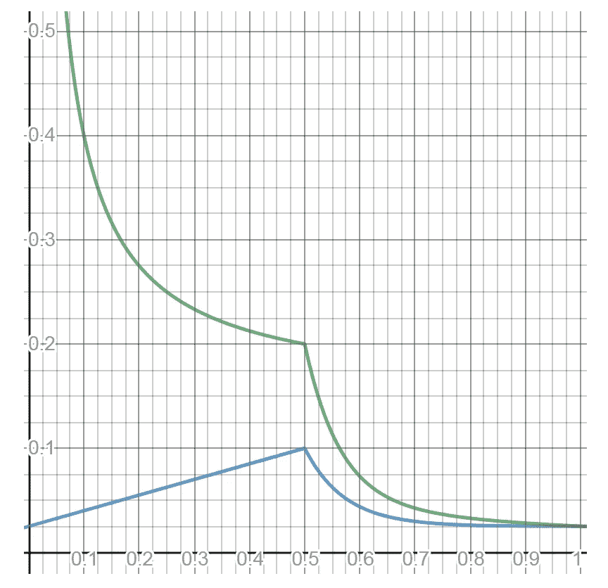
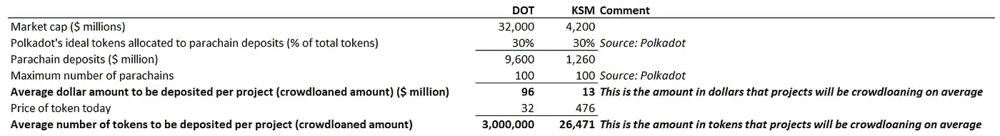
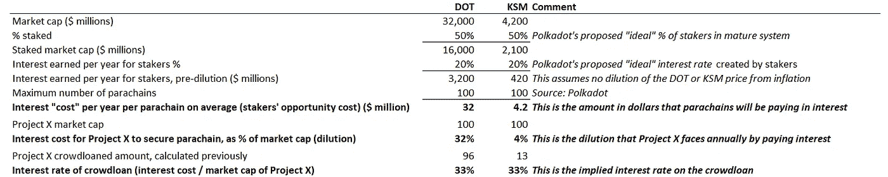
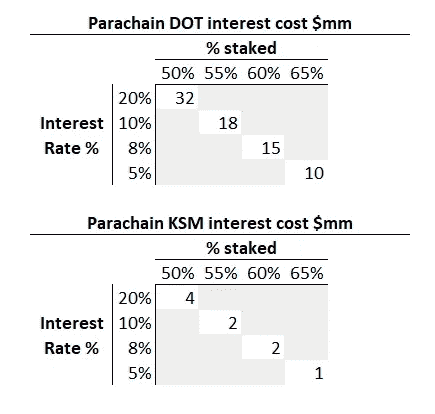

# 波尔卡多特 vs 草间弥生拍卖分析

> 原文：<https://medium.com/coinmonks/polkadot-vs-kusama-auction-analysis-ce9f491f831d?source=collection_archive---------0----------------------->

## 关于什么的噪音？

密码中的一切都是一种现象。对我来说，这意味着当某样东西脱颖而出时，我最好集中注意力。在这个社区里，你不可能不经常听到波尔卡多特。

Polkadot 是一项有数千次媒体提及、不可估量的预期和 320 亿美元估价的工作(它甚至还没有完全推出！).与这个项目相关的每个人也恰好是一个严肃的一线知识分子。首先让我对波尔卡多特感到好奇的是，它还有一个“野生表亲”，名叫草间弥生，价值 40 亿美元。草间弥生是作为波尔卡多特的迷你拷贝/测试版上市的。我的脑海里响起了噪音:“差距太大了……为什么？"

我想我会试着更深入地了解为什么相对价格标签是这样的。如果波尔卡多特和草间弥生真的像所有人说的那样，将成为新数字经济不可或缺的一部分，我也想获得一些投资机会。但是两者之间我选哪个呢？

## **为什么关心？我不能两样都投资吗？**

当然，我可以两个都买，省下时间。然而，Polkadot 是一个由天才构建的独特项目，我认为尝试真正理解它所基于的逻辑和经济学是有用的。这样，在评估 Polkadot 生态系统的其他项目时，我可能会有正确的基础。我也可能会发现波尔卡多特作为投资品比草间弥生更有吸引力的特征，反之亦然。

加密之所以如此吸引人，是因为每个令牌的价值都与*独特设计的*原理和机制相关联。如果我们能分解这些，我们就能找出主要的压力点和杠杆，我们就能理解价值创造必须发生什么。然后，我们可以了解我们是在打一场硬仗，还是在享受预先设计好的成功(当然，任何事情都有风险！)，最重要的是，尝试量化数量级和主要障碍。相比之下，股票是一列单程列车:如果利润上升，股票就会上涨(长期而言)。顺便提一句，我之前也和任一起尝试过这样做( [part 1](/coinmonks/ch-3-ren-pt-1-qualitative-d742c6c9947f) 和 [part 2](/coinmonks/ch-3-ren-pt-2-quantitative-23868751647d) )。

# 首先，我们需要了解它是如何工作的

在其他区块链，如以太坊，项目可以简单地在以太坊区块链上创建他们想要的东西。波尔卡多特和草间弥生是不同的。它们都有一个主链，将生态系统中的所有项目连接在一起。项目需要为连接到主链的权利付费。我用一个比喻来解释商业模式:

我认为 Polkadot 的商业模式类似于机场。机场向希望成为机场经济一部分的航空公司出租航站楼空间。机场带来了一个枢纽，客户可以在那里中转，高效的运作和安全。航空公司带来了多种选择，以提高机场的利用率。如果机场运行良好，它会吸引更多的航空公司，给机场带来更多的价值，给航空公司带来更多的价值，直到所有人都在夏威夷退休。

现在假设我们正在为一个巨大的岛屿建造一个机场，这个岛屿是我用我的加密奖金购买的。我决定建造主要机场和较小的机场。较小的机场将吸引本地游客，而主要机场将吸引国际游客。更小的也将是我们的试验场，当我们想与航空公司试验不同的定价策略，在新推出的航空公司上，尝试新的安全设备等。通过这种方式，我们可以在低风险环境中尝试新事物，然后再将其推广到主机场。也许我们推出了一个新的定价策略，结果却不是最理想的。嗯，唷，只有小机场的生意受到了伤害。

至于航空公司，他们必须支付租金。一旦他们的租约到期，他们需要与其他航空公司竞争，以重新获得他们的位置。

把这个翻译成波尔卡多特语，主要机场=波尔卡多特，较小的机场=草间弥生，航空公司= Parachains(试图连接到主链的加密项目的花哨词)。副链越忙，波尔卡多特和草间弥生赚的费用就越多。

这个过程的一个非常重要的部分将是拍卖，以决定哪些副链将连接到网络，以及他们支付多少租金。这些拍卖很重要，因为 1)它们将提高波尔卡多特和草间弥生的经济价值 2)我们作为投资者可以参与进来赚取 3)它们将帮助我们理解副链和生态系统行为。当我在 2021 年 3 月发表这篇文章时，草间弥生即将启动其 parachain 拍卖程序。

## 拍卖过程

要成为 DOT 或 KSM 上的副链，加密项目必须以相应 DOT 或 KSM 令牌的形式存放租金。租期由项目本身在拍卖期间决定，可以是 6 个月到 2 年。每 1-2 周将有持续的拍卖。如果项目在一个拍卖过程中没有获得一个位置，他们可能会在下一个过程中再次尝试。

现在让我们讨论一下这些拍卖在经济上可能如何进行。

# 理论拍卖行为与经济学

## 一个有抱负的项目的前景

为了了解理论行为，假设我们有一个名为 Project X 的出色项目。我们决定加入 Polkadot 和 Kusama 生态系统，因为主链提供了我们支持项目所需的治理、安全性和效率。还有一个强大的网络效应，我们认为其他好的项目也将连接到网络，给我们的用户更多的效用，因为我们可以在自己的项目中利用这些项目的功能。假设我们的市值约为 1 亿美元，波尔卡多特为 300 亿美元，草间弥生为 40 亿美元。为了简单起见，假设我们想要获得一个为期 1 年的 parachain 插槽。

**那就这么办吧！我们需要决定 1)我们如何支付它？2)我们众筹了多少贷款，需要支付多少利息？**

## **1。我们如何支付它？**

项目 X 可以 1)在公开市场上购买 DOT/KSM 代币，或者 2)从今天已经拥有 DOT/KSM 的人群中租用代币。

**方案一:**我们在公开市场买入 DOT 或者 KSM。请记住，我们是一家初创公司，手头没有多少现金，所以我们需要去风投或公开市场筹集资金。这两者都涉及销售更多 Project X 的代币。不用做任何数学计算，我们就知道这里将会发生什么，即当前代币持有者的所有权将被稀释，使每枚代币的当前价格下降，其他条件不变。我们实际上是在出售我们项目的所有权来购买 DOT 和/或 KSM，这不是我们想要参与的理想的风险互换，因为我们是自己项目的固有信仰者，并没有尽一切努力来将其交换为我们几乎无法控制的外部资产。此外，当我们与竞争对手一起从公开市场购买代币时，DOT 或 KSM 的价格会上涨，我们实际上是在与自己做交易。不理想。

**选项 2:** 我们在公开市场上从当前代币所有者处借入 DOT 或 KSM，并使用这些代币参与拍卖。这被称为众筹贷款。要做到这一点，我们需要从经济上激励人们借给我们代币，并锁定一年。可以认为这类似于债务，因为我们需要为所借的点/KSM 令牌支付“利息”。虽然我们会通过出售项目 X 代币来支付利息，但是方案 2 和方案 1 的区别在于，方案 2 中的成本会比方案 1 少得多。同样，这是因为我们不需要购买 DOT 或 KSM 代币，而是需要向让我们借用代币的人群支付“利息”。选择 2 对我们来说更经济有效。

**因此，在真正的拍卖中，我会假设 100%的项目会使用选项 2，除非他们运气好，在几年前买了一些 DOT 或 KSM。**

## **2。我们众筹了多少贷款，需要支付多少利息？**

关键问题！要回答这个问题，首先我们需要简要了解 DOT 的令牌经济学是如何工作的。我会尽量简短地说:

**代币经济学:**

波尔卡多特的令牌经济学表明，在他们的**‘理想’**状态下，以下将是真实的:

1.  **50%的点标记使用我们在区块链赌注证明中看到的正常赌注系统下注**。DOT 已经决定，如果 50%的代币被下注，下注者赚取的利率将是 20%。请记住，在区块链的股权证明中，利息是用代币支付的，因此它也是通货膨胀率。
2.  **25-30%的点代币通过副链**存放(这些代币不会从点/KSM 网络获得利息)
3.  **20-25%的 DOT 可以自由交易**(这些不从 DOT/KSM 网络中赚取利息)

他们是怎么得出这些数字的？一般来说，区块链股份有限公司希望持有 60-75%的股份。这是因为，虽然更多的赌注代币意味着更高的安全性，但更少的自由交易代币意味着更高的流动性。DOT/KSM 的特别之处在于他们创建了副链结构，因此他们需要在传统桩和副链之间分配 60–65%的桩。按照下面的逻辑，我们可以看到为什么相对于理想状态中的桩**而言，分配给副链的百分比较少:**

**如果分配给副链的%过高:**分配给副链的%越多→副链存放的点令牌越多→副链的成本越大→连接到点网络的副链需求越少，它们转而连接到其他区块链。这就像说机场租金太贵，所以 JFK 的航空公司转而连接另一个机场。不理想。

注意这里的天才。设计具有副链沉积物的系统意味着:

1.  副链在游戏中有真实的皮肤
2.  网络的安全性得到了副链的帮助，而不仅仅是普通的桩
3.  波尔卡多特可以向普通利益攸关者支付更多利息，以吸引利益攸关者加入波尔卡多特生态系统，因为链旁存款没有利息。因此，他们可以吸引赌注者，而不会导致太多的通货膨胀。在其他没有链状设计的区块链，增加赌注者的利率会产生 1 比 1 的通货膨胀，而在这里不会，因为链状存款从 DOT/KSM 获得零利息！Polkadot 的创造者基本上已经将一些通胀负担转嫁给了需要支付众筹贷款的副链。

他们将如何激励系统达到 50%利益相关者的平衡，以达到这个'**理想'**状态？他们的做法是，如果赌注超过 50%,就以指数方式降低利率，如果赌注低于 50%,就提高利率。

这里是利率(绿线，y 轴)vs 赌注(蓝线，x 轴)图表。要点:如果赌注者的百分比超过 50%，利率就会呈指数下降，以激励人们取消赌注，并为 DOT / KSM 令牌创造流动性。

我为什么要为此烦恼呢？ **因为链上贷款的成本需要覆盖传统赌注者在网络上下注的机会成本。标桩点/KSM 的百分比驱动利率，因此也驱动副链的成本。我将在下面详细解释这一点。**

Source: [https://research.web3.foundation/en/latest/polkadot/economics/1-token-economics.html](https://research.web3.foundation/en/latest/polkadot/economics/1-token-economics.html)

**既然代币经济学已经过时了，让我们最终来回答这个问题:我们能获得多少贷款，需要支付多少利息？**

1.  我们能获得多少贷款？

基于**理想状态，**我们知道大约 30%的代币将来自链旁存款。然后我们可以反过来计算这对渴望成为副链的人来说意味着什么:

Source: ThePeachTree

在我看来，希望在 DOT 上进行的项目将借用大约 300 万个令牌，而在 KSM 上进行的项目将借用大约 26，000 个令牌。这相当于高达 9600 万美元的 DOT 和 1300 万美元的 KSM。呀……..好像有点高！DOT/KSM 可能很难达到 30% **“理想”**的状态，至少目前是这样，因为项目刚刚起步，借贷 9600 万美元成本非常高。

**2。我们需要支付多少利息？**

让我们从 DOT 或 KSM 令牌持有者的角度来看这个问题。

如果我拥有 DOT 或 KSM 令牌，我的选择是:

1.  在理想状态下，以 DOT 或 KSM 代币支付的股份每年可获得大约 20%的利息
2.  **将我的代币借给项目 X 一年，并获得项目 X 代币的已付利息**
3.  **把我的 DOT 或 KSM 代币放在钱包里，不赚任何钱，期待交易。**

**选项 3 在短期内对于 DOT / KSM 持有者来说是不合理的，因为它的收益率为 0%，所以我们将把它划掉。因此，选项 2 需要至少击败选项 1，以激励令牌持有者选择选项 2。**

****这就是我们的答案:我们支付给众筹贷款人的“利息”(以 X 项目代币支付)需要至少超过他们每年从赌注中获得的 20%的利息(以 DOT 或 KSM 代币支付)。****

**这就是我展示上图的原因。需要注意的是，20%的利率非常依赖于处于 50%的“理想”状态的赌注%。如果有超过 50%的人在下注，利率就会大幅下降，因此副链的借贷成本也会大幅下降。**

**要问的有效问题变成:**

**如今，一条副链的借贷成本的美元价值是多少？假设项目 X 会导致什么样的稀释？众筹贷款的隐含利率是多少？**

**这在下面的理想状态的**中说明****

****

**ThePeachtree**

****如果 staking %不在理想状态会怎么样？以下是敏感性:****

****

**Source: ThePeachTree**

****我们学到了什么？****

**我计算了一下，在理想状态下，DOT 和 KSM **为赌注者赚取的总利息分别约为 30 亿美元和 400 万美元。这是他们作为一个群体选择将 DOT/KSM 代币借给 parachains 而不是股份的机会成本。假设将有 100 个副链，我们将总利息除以 100，看看每个项目平均必须向赌注者支付多少:DOT 为 3200 万美元，KSM 为 400 万美元。****

**想想看，对于一家初创公司来说，每年支付这笔费用是多么昂贵！对于一个目前市值为 1 亿美元的项目，比如我们的 awesome Project X，这将导致我们的价格每年稀释 32%*加入 DOT 上的 parachain，或 4%加入 KSM。我的结论是**‘理想状态’**在现实生活中不太可能，因为它会抑制副链需求，至少目前是这样，直到加密变得更加成熟。***

***如果理想状态被打破，超过 50%的赌注者在网络上下注，利息成本呈指数下降，如灵敏度表所示。我的直觉告诉我，实现的平衡状态将略高于 50%，在 50%-60%之间。这是因为今天总供应量的 65%押在了 DOT 上，我不认为总供应量的 15%会放弃他们的股份，将他们的 DOT 收入用于风险更高的 parachain 项目。KSM 现在有 55%的股份。此外，目前的赌注利率是 13%,赌注者似乎对此更满意，所以我想在副链连接后，他们也会对 13%感到满意。在 13%的利率下，一个项目连接到 DOT 将花费大约 2000 万美元，连接到 KSM 将花费 200 万美元。如果你问我的话，我觉得还是很贵的。***

***尽管根据逻辑我们已经知道，作为副链加入将意味着我们需要支付租金成本，这给项目 X 的令牌价格带来了下行压力，并且 DOT 上的项目将比 KSM 更昂贵，**我们通过经历所有这些获得的是，现在我们已经量化了这场艰难的通货膨胀斗争将会是什么样的**。在这种情况下，市值为 1 亿美元的项目将支付 2000 万美元的利息成本，这意味着他们每年将在 DOT 上有 20%的价格稀释。一个 5000 万美元的项目必须抵消 40%的负面稀释影响。巨大的！***

***还有什么突出的？对我来说，是连接草间弥生便宜多少。这让我非常震惊——这是否意味着草间弥生被“低估”了？***

# ***将所有这些整合在一起— DOT vs KSM***

***为什么 DOT 和 KSM 代币会升值或贬值？让我们看看会发生什么:

人们从外部购买 DOT/KSM 代币→副链租金成本上升→有抱负的项目需求减少，因为他们中的少数人买得起它→作为 DOT 或 KSM 持有者没有什么可兴奋的→DOT/KSM 价格下降→随着租金成本下降，项目需求增加，如此反复。***

*****DOT 和 KSM 上的副链槽供应在每个网络上固定为 100 个。因此，需求是区分变量。保持 DOT/KSM 价格不变的真正驱动力是连接网络的*项目需求*。那么哪个项目需求更多呢？*****

***KSM 机场比交通部的主要机场小。现在让我们把机场的比喻换成夜总会。在我听来，KSM 会是更便宜、更热闹的夜总会，而 DOT 会是更豪华、更昂贵的夜总会。但是，嘿，如果更便宜的夜总会总是更满，为什么俱乐部不提高饮料的价格来配给需求呢？如果不是满员的话，豪华俱乐部不能把价格提高到比小俱乐部更高的水平。***

***让我们思考一下我们刚刚学到的内容:***

1.  ***上面的量化练习告诉我，与波尔卡多特相比，连接草间弥生的项目的经济成本是微不足道的。连接草间弥生便宜 7 倍。是的，我们可以很容易地从市值差异中确定这一点，但现在我们知道每条副链的成本是多少，我们已经将它放入实际环境中，对于一个 1 亿美元的项目来说，这大约是 20%的稀释。除非一个有抱负的 parachain 一开始就有很高的估值，否则他们通过连接到 Polkadot 而不是草间弥生来牺牲真正的物质稀释。**这种机制让我想到，增量(更小)的项目需求会涌向草间弥生，先试用，或许永远不会上 Polkadot。*****
2.  ***这是否意味着只有规模较小、质量较低的项目连接到草间弥生，而较好的项目只连接到波尔卡多特？不**大联盟的波尔卡多特项目无论如何都会连接草间弥生项目**，因为这对于高价值的项目来说是非常便宜的。将草间弥生作为一个试验场的经济价值，尤其是在一个新的和实验性的数字经济中，可能会超过草间弥生的租金成本。***

***因此，与 Polkadot 相比，草间弥生的优势在于，在功能相同但成本较低的情况下，有更多的项目需求。但是还有多少需求呢？更多的数字，请！***

***我在 Coingecko 上看到，在 Polkadot 生态系统中，大约只有 20 个[公开的 Polkadot 项目](https://www.coingecko.com/en/categories/dot-ecosystem)市值超过 1 亿美元。大约有 30 个项目价值不到 1 亿美元。因此，按照今天的价格，30/50 或 60%将面临超过 20%的年度稀释。又来了。这不包括私人项目，但我们假设它是有代表性的，因为它可能是一个钟形曲线。***

***因此，草间弥生生态系统实际上可能比波尔卡多特有更不对称的需求与供给不匹配，特别是在短期内。***

*****好吧，那么，如果我认为他们之间的 7 倍差距太高，我认为草间弥生的价值应该与波尔卡多特相比多少？*****

***按照预测的 55%以上的赌注率和 10-13%的通货膨胀率，目前每年连接草间弥生的项目成本为 250 万美元。如果草间弥生的市场价格翻倍，他们将损失 500 万美元。如果 20%的年稀释率是可接受的，这意味着截止市值为 500 万美元/0.2 = 2500 万美元。在 coingecko 上，我看到只有 14/50 或 28%的项目没有通过。草间弥生价格的三倍，你只会排除 18/50 或 36%的项目。有意思。***

***因此，我认为草间弥生*和波尔卡多特*还有很大的空间，直到供需达到平衡(双关语)，鉴于草间弥生今天的价格意味着项目可以将它抬高 2-3 倍，以承受 20%的稀释。如果我资金紧张，我显然没有在我的加密岛上建造两个机场，我会赌草间弥生价格升值对波尔卡多特。***

*****我哪里会错:*****

1.  ***希望我得到了以上所有的数学正确***
2.  ***我不是技术专家，所以我不认为草间弥生拥有 Polkadot 的所有等效功能。这对我们评估草间弥生的需求至关重要。我所理解的 Polkadot 的营销并没有提到任何其他的暗示。***
3.  ***草间弥生上可能会有一些项目“流失”,这些项目决定在他们毕业于波尔卡多特后不再需要它，或者已经习惯了波尔卡多特。我的反驳是，他们仍然会长期与草间弥生保持联系，因为他们想在 Polkadot 上推出之前测试新产品功能和草间弥生的更新。***
4.  ***的确，对区块链来说，市值越大，安全性越高。因此，有人可能会说，波尔卡多特将在更高的安全性基础上创造出比草间弥生更多的需求。当然，我同意 Polkadot 在这个基础上更安全，但 Polkadot 并不是所有人都能负担得起的。我不明白仅仅因为你想把你的飞机停在主机场就意味着你弹指一挥间就能付得起主机场的租金。***
5.  ***如果雄心勃勃的 parachains 的整个市值向上调整，使 Polkadot 对他们来说更实惠，我的论点就站不住脚了。到今天为止，情况并非如此，但在未来的某个时候会是这样，这将使波尔卡多特和草间弥生的基础都向上。***

***希望这些都有帮助！如果你想讨论[**@ the _ peach _ tree**](https://twitter.com/the_peach_tree)，请在 twitter 上联系我***

*****我不是财务顾问*****

> ***加入 Coinmonks [Telegram group](https://t.me/joinchat/EPmjKpNYwRMsBI4p) 并了解加密交易和投资***

## ***另外，阅读***

*   ***[什么是融资融券交易](https://blog.coincodecap.com/margin-trading)***
*   ***最好的[密码交易机器人](/coinmonks/crypto-trading-bot-c2ffce8acb2a) | [网格交易](https://blog.coincodecap.com/grid-trading)***
*   ***[3 商业评论](/coinmonks/3commas-review-an-excellent-crypto-trading-bot-2020-1313a58bec92) | [Pionex 评论](/coinmonks/pionex-review-exchange-with-crypto-trading-bot-1e459d0191ea) | [Coinrule 评论](/coinmonks/coinrule-review-2021-a-beginner-friendly-crypto-trading-bot-daf0504848ba)***
*   ***[AAX 交易所评论](/coinmonks/aax-exchange-review-2021-67c5ea09330c) | [德里比特评论](/coinmonks/deribit-review-options-fees-apis-and-testnet-2ca16c4bbdb2) | [FTX 交易所评论](/coinmonks/ftx-crypto-exchange-review-53664ac1198f)***
*   ***[n 零复习](/coinmonks/ngrave-zero-review-c465cf8307fc) | [Phemex 复习](/coinmonks/phemex-review-4cfba0b49e28) | [PrimeXBT 复习](/coinmonks/primexbt-review-88e0815be858)***
*   ***[Bybit Exchange 审查](/coinmonks/bybit-exchange-review-dbd570019b71) | [Bityard 审查](/coinmonks/bityard-review-7d104239be35) | [CoinSpot 审查](https://blog.coincodecap.com/coinspot-review)***
*   ***[3 commas vs crypto hopper](/coinmonks/3commas-vs-pionex-vs-cryptohopper-best-crypto-bot-6a98d2baa203)|[赚取加密利息](/coinmonks/earn-crypto-interest-b10b810fdda3)***
*   ***最好的比特币[硬件钱包](/coinmonks/the-best-cryptocurrency-hardware-wallets-of-2020-e28b1c124069?source=friends_link&sk=324dd9ff8556ab578d71e7ad7658ad7c) | [BitBox02 回顾](/coinmonks/bitbox02-review-your-swiss-bitcoin-hardware-wallet-c36c88fff29)***
*   ***[莱杰 vs n rave](/coinmonks/ledger-vs-ngrave-zero-7e40f0c1d694)|[莱杰 nano s vs x](/coinmonks/ledger-nano-s-vs-x-battery-hardware-price-storage-59a6663fe3b0)***
*   ***[加密复制交易平台](/coinmonks/top-10-crypto-copy-trading-platforms-for-beginners-d0c37c7d698c)***
*   ***[CoinLoan 审查](/coinmonks/coinloan-review-18128b9badc4) | [YouHodler 审查](/coinmonks/youhodler-4-easy-ways-to-make-money-98969b9689f2) | [BlockFi 审查](/coinmonks/blockfi-review-53096053c097)***
*   ***最好的[加密税务软件](/coinmonks/best-crypto-tax-tool-for-my-money-72d4b430816b) | [CoinTracking 评论](/coinmonks/cointracking-review-a-reliable-cryptocurrency-tax-software-5114e3eb5737)***
*   ***最佳[加密借贷平台](/coinmonks/top-5-crypto-lending-platforms-in-2020-that-you-need-to-know-a1b675cec3fa) | [杠杆代币](/coinmonks/leveraged-token-3f5257808b22)***
*   ***[block fi vs Celsius](/coinmonks/blockfi-vs-celsius-vs-hodlnaut-8a1cc8c26630)|[Hodlnaut Review](/coinmonks/hodlnaut-review-best-way-to-hodl-is-to-earn-interest-on-your-bitcoin-6658a8c19edf)***
*   ***[Bitsgap 审查](/coinmonks/bitsgap-review-a-crypto-trading-bot-that-makes-easy-money-a5d88a336df2) | [Quadency 审查](/coinmonks/quadency-review-a-crypto-trading-automation-platform-3068eaa374e1) | [Bitbns 审查](/coinmonks/bitbns-review-38256a07e161)***
*   ***[埃利帕尔泰坦评论](/coinmonks/ellipal-titan-review-85e9071dd029) | [赛克斯斯通评论](/coinmonks/secux-stone-hardware-wallet-review-15-discount-coupon-2020-7577032faa6e)***
*   ***[本地比特币审核](/coinmonks/localbitcoins-review-6cc001c6ed56) | [加密货币储蓄账户](https://blog.coincodecap.com/cryptocurrency-savings-accounts)***
*   ***最佳[区块链分析](https://bitquery.io/blog/best-blockchain-analysis-tools-and-software)工具| [赚比特币](/coinmonks/earn-bitcoin-6e8bd3c592d9)***
*   ***[加密套利](/coinmonks/crypto-arbitrage-guide-how-to-make-money-as-a-beginner-62bfe5c868f6)指南| [如何做空比特币](/coinmonks/how-to-short-bitcoin-568a2d0b4ae5)***
*   ***最佳[加密制图工具](/coinmonks/what-are-the-best-charting-platforms-for-cryptocurrency-trading-85aade584d80) | [最佳加密交易所](/coinmonks/crypto-exchange-dd2f9d6f3769)***
*   ***[如何在印度购买比特币？](/coinmonks/buy-bitcoin-in-india-feb50ddfef94) | [WazirX 审查](/coinmonks/wazirx-review-5c811b074f5b)***
*   ***[印度比特币交易所](/coinmonks/bitcoin-exchange-in-india-7f1fe79715c9) | [比特币储蓄账户](/coinmonks/bitcoin-savings-account-e65b13f92451)***
*   ***[CoinDCX 评论](/coinmonks/coindcx-review-8444db3621a2) | [加密保证金交易交易所](https://blog.coincodecap.com/crypto-margin-trading-exchanges)***

> ***[直接在您的收件箱中获得最佳软件交易](/coinmonks/newsletters/coinmonks)***

******