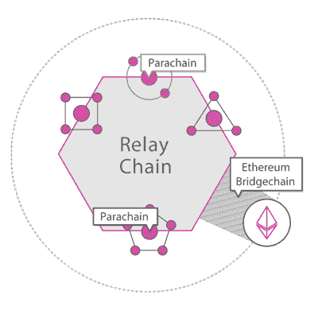

# 波尔卡多特与符号(第一部分)

> 原文：<https://medium.com/coinmonks/polkadot-vs-symbol-part-1-fe264e024f4?source=collection_archive---------3----------------------->

## 基本面

象征在许多方面与波尔卡多特有相似之处。

通常，Polkadot 被描述为异构多链协议，即使非区块链系统或数据结构也可以成为副链，如果它们满足一组标准的话。

让我们看看波尔卡多特和 Symbol 之间的一些明显的相同点和不同点。

## 中继链与 Mainnet

> Polkadot 使用中继链在生态系统中的区块链之间传递任意信息。中继链足够通用，允许相邻的链(我们称之为副链)拥有自己的应用程序逻辑。—https://medium.com/polkadot-network/

波尔卡多特的接力链于 2020 年 5 月启动。它就像象征的主网，然而，在许多方面是不同的。Polkadot 中继链和 Symbol mainnet 都是以“链中链”或“网络中的网络”的形式建造的，并且都运行在桩的证明变量上。

至于差异，通过谈论“副链”会更容易解释。

## 副链与私有链

[Parachain and bridge.](/polkadot-network/a-brief-summary-of-everything-substrate-and-polkadot-f1f21071499d)

Parachain 就像 Symbol 中的私有 chan(Symbol 的“私有链”可能是一个没有权限的链。)虽然 Symbol 的私有链被认为是 Symbol 技术的分支，具有自己的共识、令牌组学并独立于 Symbol，但 Polkadot 的副链共享中继链的基础设施和安全性。副链产生自己的模块，但没有自己的共识机制。如果你想用自己的共识机制建立一个区块链，并连接到重放链，可以使用 parachain 作为桥梁。

与同质的碎片相比，副链是异质的，每个副链彼此不同，具有不同的逻辑，并且服务于不同的功能。虽然它提供了强大的安全性，但可伸缩性必须让步。据估计"[中继链将能够容纳大约 100 个副链，但是 10 到 1000 个插槽之间的任何东西都是可以想象的](/polkadot-network/a-brief-summary-of-everything-substrate-and-polkadot-f1f21071499d)。

由于可用的位置有限，要连接到中继链，副链需要赢得拍卖。与中继链的连接不是永久的。当它到期时，parachain 未能赢得另一次拍卖，它将与中继链断开连接，成为 parathread(另一次讨论)。

parachain 和 private chain 都不需要本地货币 Polkadot (DOT)和 Symbol (XYM)。

## 衬底与 Catapult 服务器

使用底物很容易建立副链。Substrate 是构建模块化、可升级的区块链的框架。它具有预先设计的[衬底节点](https://github.com/paritytech/substrate/tree/master/bin/node)和它的起源块[配置器](https://github.com/paritytech/substrate/blob/master/bin/node/cli/src/chain_spec.rs)能力。

> Substrate 是“一套库，用来做所有写区块链时令人讨厌的事情。”—罗伯特·哈伯迈尔

按照[指令编译弹射器服务器](https://github.com/nemtech/catapult-server/blob/main/docs/README.md)或者使用[符号加速器](https://github.com/nemtech/symbol-bootstrap)可以很容易地建立私有链入符号。它们是高度可定制的，具有可配置的起源块、共识机制和功能。

## 托盘与插件

在用衬底构建副链时，包含的模块被称为托盘。对于 Symbol，可定制和可配置的功能称为插件。

## 作者与收割机

波尔卡多特的 Block producer 被称为“作者”，Symbol 的则被称为“收割机”。

## 共识协议

Polkadot 混合共识机制使用[光环](https://substrate.dev/docs/en/knowledgebase/getting-started/glossary#aura)(权威回合)进行分块产生和概率终结，使用[爷爷](/coinmonks/the-blockchain-family-members-34822216d98f)进行确定性终结。 [BABE](/coinmonks/the-blockchain-family-members-34822216d98f) (块扩展的盲分配)到位，以确保块创建。

 [## 区块链家族成员

### 父母、孩子、叔叔、侄子、爷爷和鬼魂。

medium.com](/coinmonks/the-blockchain-family-members-34822216d98f) 

符号使用 [PoS+](/coinmonks/ethereum-2-0-vs-symbol-part-2-consensus-protocols-73e0a2589242) 和它的终结性模型后祖父。

 [## 以太坊 2.0 vs 符号(第二部分):共识协议

### NEM 从风险证明(PoS)衍生产品开始，以太坊一直计划从工作证明(PoW)转移到…

medium.com](/coinmonks/ethereum-2-0-vs-symbol-part-2-consensus-protocols-73e0a2589242) 

Polkadot 的另一个有趣的特性是，它可以在没有硬分叉的情况下升级，以集成新功能或修复 bug。衬底中的一个特征用于避开分叉并更新中继链。

因为这是不可取的，你一天吃三顿饭，并保持一整天都很饱，因为你会消化不良。所以，这就是我现在要停下来的地方，下次再用我的手指蘸一下。

> "从某种意义上说，这个世界属于编码者."-加文·伍德博士。

*参考文献:*

1.  [https://polkadot . network/](https://polkadot.network/)
2.  【https://substrate.dev/ 号
3.  【https://www.parity.io/what-is-substrate/ 
4.  [https://wiki . polkadot . network/en/](https://wiki.polkadot.network/en/)
5.  [https://medium . com/polkadot-network/a-brief-summary-of-everything-substrate-and-polkadot-f1f 21071499d](/polkadot-network/a-brief-summary-of-everything-substrate-and-polkadot-f1f21071499d)
6.  [https://docs.symbolplatform.com/](https://docs.symbolplatform.com/)
7.  [https://docs . symbol platform . com/catapult-white paper/main . pdf](https://docs.symbolplatform.com/catapult-whitepaper/main.pdf)