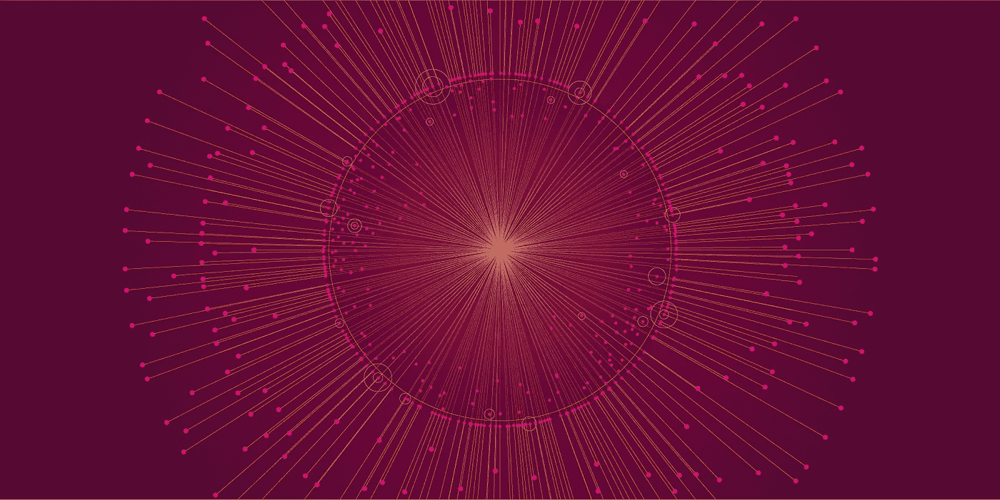

# 波尔卡多特:以太坊还做不到的

> 原文：<https://medium.com/coinmonks/polkadot-what-ethereum-cannot-yet-do-the-new-star-of-the-crypto-world-should-be-able-to-do-6a1b3fd934f2?source=collection_archive---------3----------------------->

## 密码世界的新星应该能做到

无论是谁，只要定期查看全球最大加密货币的图表，就可能已经观察到今年的一些新星。Chainlink、Crypto.com 或 Tezos 都(暂时)进入了今年市值最高的十大加密货币之列。现在有一颗新星…