# Polygon 以 2.5 亿美元收购 Hermez 收回 6 亿美元

> 原文：<https://medium.com/coinmonks/polygon-acquired-hermez-for-250-million-600-million-recovered-ea7ba4d9a889?source=collection_archive---------2----------------------->

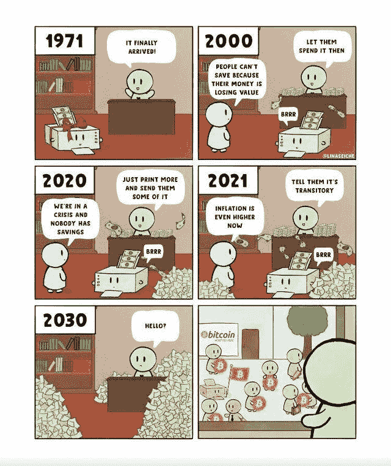

[Short the Banks](https://www.reddit.com/r/cryptocurrencymemes/comments/p5dq42/short_the_banks/)

## Coinmonks 时事通讯

## 梅西球迷币|道众筹|摇滚明星对 Crypto 的热爱

同为修道士，

加密技术发展迅速；我们每天都看到一堆无用的新闻试图抓住你的注意力。为了跟上这个快速发展的空间，这可能会非常累人。

因此，今天，我们非常激动地宣布我们的 [***加密新闻 Youtube 频道*** 📹](https://www.youtube.com/channel/UCbyDhTbOiKh2iUMKBi4-4Zg)，不到 5 分钟即可获得每日加密新闻。节省时间，跟上时代。只有新闻，没有废话。

> 今天就订阅我们的 [Youtube 频道](https://www.youtube.com/channel/UCbyDhTbOiKh2iUMKBi4-4Zg)；这将对我们有很大帮助🙌

> *比特币再次上涨，因此不要错过机会，加入我们的密码信号频道* [***上电报***](https://t.me/coincodecap) *获取交易分析和买入机会。*

现在，让我们看看上周 Crypto 发生了什么。📰

## 1.摇滚明星吉恩·西蒙斯大举投资比特币

In the picture : Gene Simmons; Source : Wiki

在美国消费者新闻与商业频道的一次新采访中，摇滚明星吉恩·西蒙斯表示，在新冠肺炎疫情爆发之初，他在与著名的比特币牛市和双子座加密交易所联合创始人泰勒·文克莱沃斯交谈后，进入了加密货币领域。

*“我进去大了。当比特币价格在 1 万美元左右时，我投了几百万进去。”*

西蒙斯称自己为“霍德勒”，他认为比特币的价格将在明年年初达到 6 万美元。西蒙斯进一步声称，当比特币在 5 月份跌破 3 万美元时，他买入了更多。

“我是‘霍德勒’，就像他们说的那样……到明年年初，我们将达到 55，000 美元到 60，000 美元。结果，我全押了。我会更加努力。当价格大幅下跌，跌至 3 万美元左右时，我会追加投资。”

这位《吻》主唱还声称他的作品集里有以太坊(Ethereum)，这是他花了大约 900 美元购买的。他声称有 14 个 ETH。

你可以点击这里观看他的完整采访

## 2.保利网络黑客退还了全部 6 亿美元

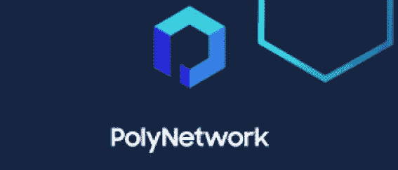

Image: Poly network

据报道，这是历史上最大的加密货币抢劫案之一，一名黑客归还了他们从去中心化金融(DeFi)平台 Poly Network 窃取的全部超过 6 亿美元的加密货币。

2021 年 8 月 11 日星期二，保利提醒其 16，400 名推特粉丝，其系统遭到黑客攻击。

抢劫/黑客的规模不亚于 2018 年 1 月黑客从东京 Coincheck exchange 窃取的价值 5.3 亿美元的加密货币，这是有史以来最大的数字抢劫之一。

保利网络随后发布官方声明，

*亲爱的黑客，*

*我们是聚网团队。*

*我们希望与您建立沟通，并敦促您归还被黑的资产。*

你黑掉的钱是 defi 历史上最大的一笔。任何国家的执法部门都会把这当成重大经济犯罪，你会被追捕。你再做任何交易都是非常不明智的。你偷的钱来自成千上万的密码社区成员，因此是人民。

你应该和我们谈谈，想出一个解决方案。

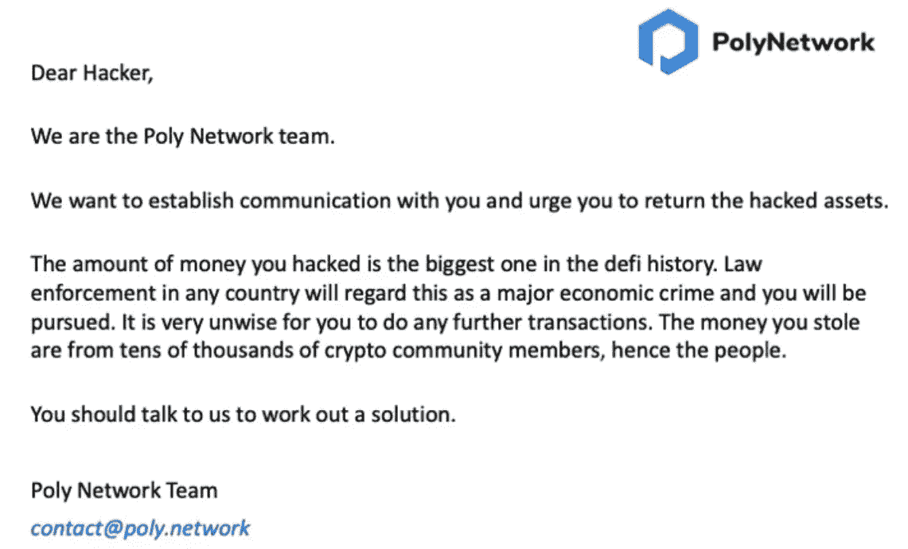

Source [Click here](https://twitter.com/polynetwork2/status/1425123153009803267)

作为回应，黑客发布了一系列嵌入加密货币交易的帖子，其中他们表示将归还资金，并准备这样做。据消息人士称，保利通过指示黑客将资金交付到三个加密地址进行了回复。据路透社 报道，黑客已经归还了几乎所有被窃取的 6.1 亿美元。

黑客反过来进行了 AMA，如下所示:

黑客提到，他们利用 Poly 缺陷是“为了好玩”，因为跨链黑客在问答线程中是“热门”的，其中有一些生活乐趣和自省。尽管如此，黑客承认对实施攻击有“复杂的感情”。“考虑一下面对这样的好运你应该做些什么。所以你恭敬地要求项目组纠正它？…我接受在任何内部人员隐藏和利用漏洞之前揭露漏洞的责任！”

黑客声明他们没有暴露自己。“永远不会，永远不会。我意识到暴露自己的危险，即使我并不邪恶。所以我利用短暂的电子邮件、IP 地址，或者所谓的无法追踪的指纹。”我宁愿待在黑暗里拯救世界。"

黑客对 Poly 最初的帖子感到不安。“我还没来得及反应，他们就鼓动别人指责和鄙视我！”他们表示，黑客总是想要退还资金。“我对钱不是特别感兴趣。我意识到当个人受到攻击时会受到伤害，但是黑客们不应该教他们一些东西吗？我宣布我决定在午夜前返回，这样那些对我有信心的人就可以睡个好觉；)"

## 在一次 6 亿美元的黑客攻击后，保利网络将提供 50 万美元的漏洞奖金

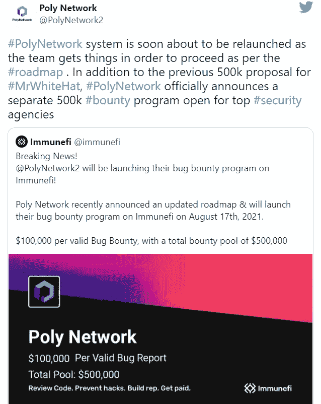

上周被黑客攻击超过 6 亿美元的分散金融(DeFi)互操作协议 Poly Network 宣布了一项 50 万美元的漏洞奖金计划，以防止未来发生类似的攻击。

“除了早些时候为 MrWhiteHat 提出的 50 万英镑的提议，PolyNetwork 正式宣布了一项针对顶级安全机构的单独的 50 万英镑奖金计划，”该协议的开发者今天在推特上写道。

在攻击者和 Poly Network 的多次对话之后，该团队将他称为“MrWhiteHat”

Image Source: Shutterstock

莱昂内尔·梅西从巴塞罗那俱乐部转会到巴黎圣日耳曼队，成为本周全世界的头条新闻。

据路透社报道，这位足球巨星的转会包括支付一笔加密货币球迷代币，作为球员“欢迎礼包”的一部分

这笔款项的货币价值没有披露，但它被视为数字资产和体育发展的分水岭时刻。

PSG 的 fan token 交易代码为$PSG，于 2020 年 1 月与 Socios 合作推出。该令牌允许球迷与俱乐部交流，并参与交互式在线投票。

## 4.Chainlink 推出基于 Arbitrum One 以太坊扩展解决方案的数据 Oracles

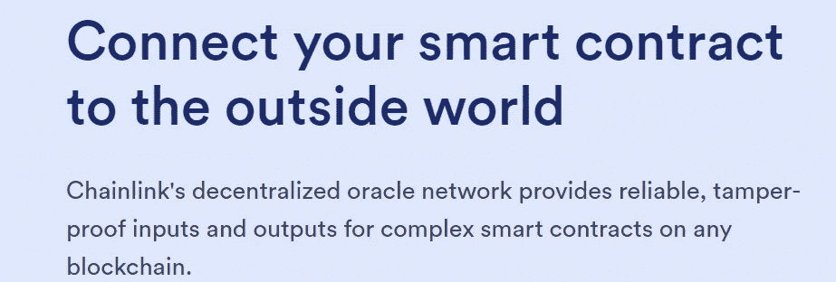

Image Source: Chainlink

领先的数据 oracle 供应商 Chainlink 宣布成功推出 Arbitrum One，这是 Arbitrum 的 beta mainnet 部署，是第二层以太坊扩展解决方案。

周四宣布的发布将使 Arbitrum One 开发者能够直接在线访问金融市场数据，在 Arbitrum One 网络上实现分散式交易所、算法稳定积分和其他高级分散式金融(DeFi)产品的扩展功能。

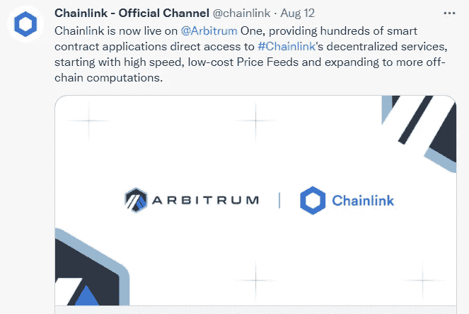

Chain-link Official Twitter

## 5.恒星网络现在支持智利比索稳定币

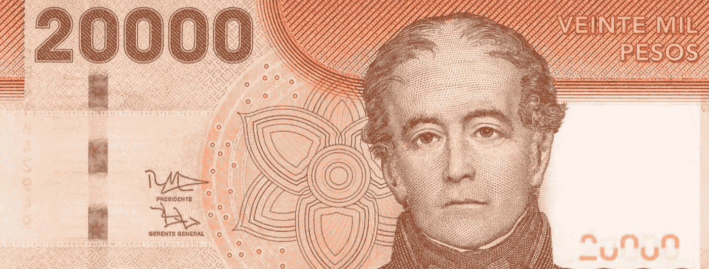

Image Source: Left over currency

一种新的与智利比索价值挂钩的稳定硬币现在可以在开源的恒星支付网络上使用，但它尚未获得用户的青睐。

总部设在智利的 CLPX 公司创造了“CLPX”代币，它宣称这是智利第一枚与比索挂钩的稳定硬币。

根据 Stellar Expert 的公共分类账，自 2021 年 8 月 16 日周一推出以来，stable coin 在总共 12，902 次交易中见证了 12，689 美元的适度活动。

新的 CLPX 令牌旨在简化汇款，让世界各地的投资者可以轻松地使用与铜挂钩的智利比索作为对冲工具。

自 2018 年以来，智利央行一直在探索区块链和央行数字货币(CBDC)，作为其“2018 年至 2022 年战略计划”的一部分

智利中央银行行长马里奥·马塞尔(Mario Marcel)在 2019 年发表了一份研究报告，称央行正在考虑大规模采用和跨境支付智利 CBDC，但当时也提出了对基础设施成本、网络安全和匿名的担忧。

> “人们不应该害怕他们的政府。政府应该害怕他们的人民。”
> ― **阿兰·穆尔，五世仇杀**

## 6.Polygon 以 2.5 亿美元收购了 Hermez，包括有史以来第一次象征性的“合并”

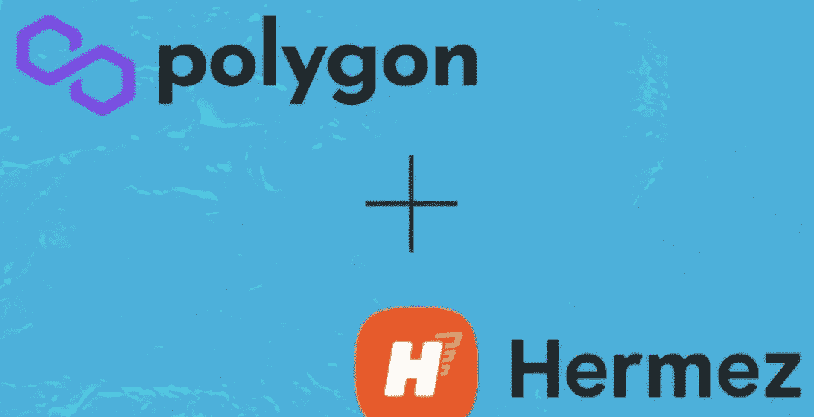

Image: Polygon Aquired Hermez

以太坊扩展项目 Polygon(以前称为 Matic Network)已经为基于 ZK rolups 的以太坊扩展解决方案 Hermez Network 支付了 2.5 亿美元。此外，区块链的两个项目正在整合他们的本地硬币——MATIC 和 HEZ——这是加密行业的首次此类交易。

今年早些时候，Keep 和 NuCypher 这两个以太坊项目也集成了它们的协议，但它们保持了各自的品牌和令牌。换句话说，尽管他们的协议是集成的，但他们的令牌并没有合并。

Polygon 和 Hermez 上周在 8 月 4 日签署了初步协议，当时 Hermez [透露](https://twitter.com/hermez_network/status/1422907047952138246)它正在“讨论”未来与一家公共网络的合并。当时，这两个项目商定了一个象征性的挂钩或互换比例。

据报道，汇率为 3.5 马克:1 HEZ，这意味着 HEZ 代币持有者可以用他们的代币兑换各种多边形的马克。这将通过项目计划“很快”发布的交易合同来实现

## 7.英国法院命令币安追踪涉嫌加密货币黑客

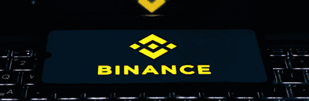

Image : Binance

伦敦高等法院命令全球最大的加密货币交易所币安确认并冻结涉嫌在其平台上实施 260 万美元盗窃的黑客账户。

该禁令是为了回应加密货币初创公司 Fetch.ai 的请求而发布的，该公司声称其币安账户在 6 月份受到了威胁。根据高等法院诉讼的一份[文字记录](https://www.rahmanravelli.co.uk/assets/Uploads/df4e7e4f35/Fetch.ai-Limited-Anor-v-Persons-Unknown-Category-A-Anor-15-07-21JUD-1.pdf)，Fetch.ai 声称黑客窃取了几种加密货币，包括 Tether、币安币、比特币以及 Fetch.ai 自己的令牌 FET。

币安是一个中央交易所，这意味着它控制着自己账户的私钥，可以冻结或停止交易。隐私纯粹主义者更喜欢分散交易和无主机钱包，这两种方式允许交易者保留自己的钥匙。

英国高等法院在 2019 年裁定，比特币可能是合法构成的“财产”，为 Fetch.ai 这样的需求扫清了道路。即便如此，英国法院下令进行这种有目的的追踪也是不常见的。

此外，尽管币安可能会冻结特定账户，但 Fetch.ai 必须证明自己是欺诈案的受害者，才能向法院申请退款。

## 8.费内巴切的以太坊令牌一经推出就飙升了 433 %,导致加密交换崩溃

Image Source: Shutterstock

在土耳其体育队费内巴切今天发布其基于以太坊的粉丝令牌后，该令牌一小时内上涨了 433%，尽管崩溃了唯一一个列出该令牌的中央交易所 Paribu。

根据 token 的[白皮书](https://www.paribu.com/files/Fenerbahce_Token_Whitepaper.pdf)，费内巴切 Token 持有者将能够就命名设施等次要的俱乐部事务进行投票，并获得比赛销售的优先权。因为 FB 是一种 ERC-20 令牌，它的价格受市场波动的影响，就像任何其他加密货币一样。

硬币今天在 Paribu 上线，然而巨大的需求导致网站多次崩溃。投资者周一以 30 里拉购买的解锁代币现在价值 160 里拉(18.70 美元)，上涨了 433%。到目前为止，该交易所已经交易了 1.5 亿美元的 FB 代币。

## 9.由于最近的变化，比特币挖掘的难度增加了 7.3%

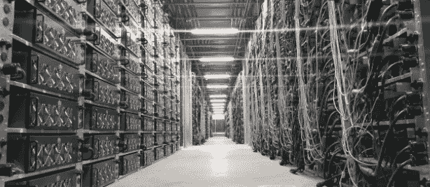

Image Source: News Akmi

根据 BTC(dot)com 的数据，由于该网络最近每两周更新一次，比特币挖掘今天变得更加困难了 7.3%。这是自中国打击矿业以来第二次积极调整，将比特币的 T2 杂凑率降低了 55%，难度减半。

比特币的挖掘难度是衡量挖掘比特币需要多大的处理能力。为了适应网络背后可变的处理能力，区块链在每 2016 个区块被开采后调整难度，大约每两周一次。

今天的难度调整是连续第二次有利的调整。在 7 月 31 日的上次变化之后，比特币的开采难度[增加了 6%](https://decrypt.co/77388/bitcoin-mining-gets-6-more-difficult-in-first-positive-adjustment-since-may)。这种上升趋势不像 5 月中旬那么强劲，当时比特币的开采难度增加了 21.53%，创下历史新高。

## 10.美国 FTX 总统希望加密货币衍生品交易在一年内开始。

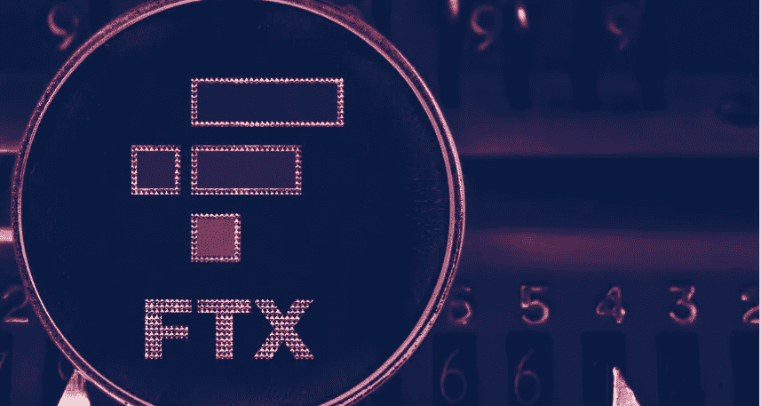

Image Source: FTX

加密货币交易所 FTX 已经迅速成为美国加密意识的前沿。看看它命名迈阿密热火体育场的长期协议和它的创始人萨姆·班克曼-弗里德无处不在的媒体露面就知道了。

但美国客户无法获得 FTX 的许多金融产品，包括它赖以成名的广受欢迎的衍生品，他们必须使用其附属公司 FTX.US

如果 CFTC 同意，FTX。要让衍生品交易成为现实，美国有两种选择:申请自己的牌照，或者收购另一家已经拥有牌照的公司。“我们采取哪种路线的计划……仍在进行中，”他说。

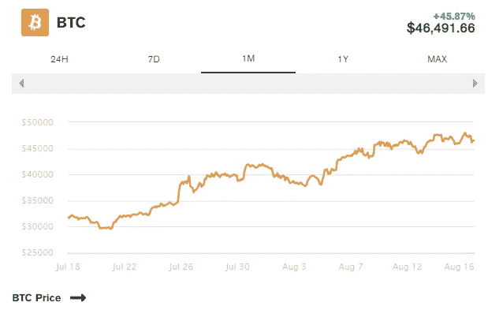

Image source: Glass Node

## 11.阿根廷总统阿尔贝托·费尔南德斯表示，该国对采用比特币持开放态度

Image Source : Shutter stock

尽管有自己的疑虑，阿根廷总统阿尔贝托·费尔南德斯表示，他对加密在国家经济中发挥更大作用的可能性持开放态度。

在昨天在 Filo.news 上播出的 Caja Negra 采访中，费尔南德斯被问及他是否会考虑使用央行数字货币，或者他是否会模仿萨尔瓦多，使用比特币作为合法贷款人。

> “我不想太冒险[……]，但没有理由说‘不’。”

费尔南德斯解释道。"也许这是一个可行的选择。"

## 12.加密货币众筹平台 DAO Maker 被黑了 700 万美元。

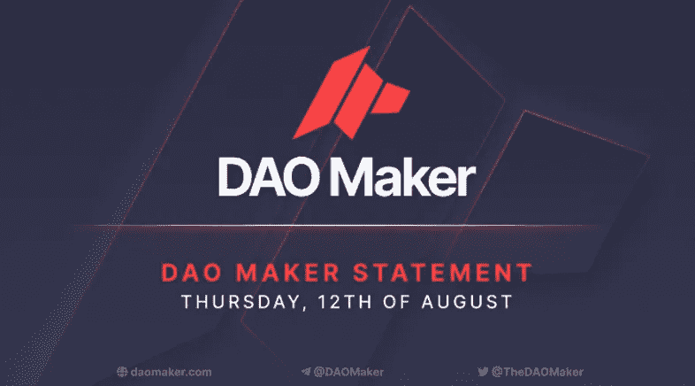

Image Source: Dao Maker

DAO Maker 是一个加密货币众筹网站，为新项目提供公共代币销售，一夜之间被黑客攻击并清空了约 700 万美元的资金。

据该公司称，该事件最初由吴区块链报告，涉及一名黑客利用该公司一个具有管理员访问权限的加密钱包的漏洞。在成功窃取了 10，000 USDC 元挂钩的稳定硬币后，攻击者继续进行了 15 次交易。

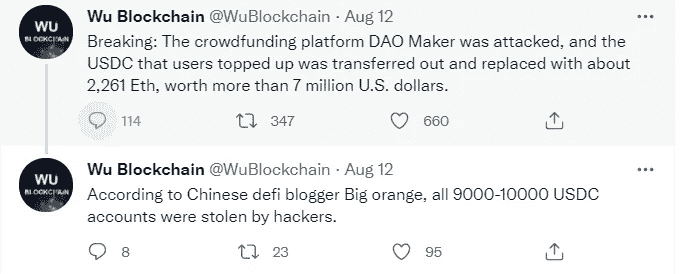

Source: Wu Blockchain Twitter

最后，DAO Maker 声称，在安全团队解决问题之前，有 5，251 名客户的资产被从平台上取走，平均每个用户损失 1，250 美元。据该公司称，黑客瞄准高价值账户，因为账户中有 900 美元或更少的用户“完全不受影响”

在 DAO Maker 调查期间，该平台的所有存款都已被停用，该公司将在未来五天内“制定一套解决方案”，以“减轻造成的损失”，并将肇事者绳之以法。

道创客标榜自己是“社交挖掘和社区孵化”工具，然而，它只是一个令牌化的创业众筹平台。

## 13.在筹集了 1.3 亿美元后，TaxBit 现在价值 13 亿美元

TaxBit，一个[比特币税务软件](/coinmonks/best-crypto-tax-tool-for-my-money-72d4b430816b)和会计服务今天透露，它已经以 13.3 亿美元的估值筹集了 1.3 亿美元的 B 轮资金。TaxBit 是最新一家获得“独角兽”地位或估值达到 10 亿美元或以上的加密货币公司。

自 3 月以来，这家总部位于犹他州的公司也成为了国税局的软件合作伙伴，并在西雅图设立了第二个办事处。TaxBit 最近招募了新的金融机构作为合作伙伴，包括加密货币交易所 FTX 美国公司，该公司现在使用该公司的税务中心套件。

B 轮融资由 IVP 和 Insight Partners 领投，Tiger Global、Paradigm、Sapphire Ventures、9Yards Capital、Madrona Venture Group 和 Anthony Pompliano 参与。作为筹资的一部分，IVP 的普通合伙人汤姆·洛韦罗(Tom Loverro)已经加入 TaxBit 的董事会，而 Insight 的管理合伙人 Nikhil Sachdev 将担任董事会观察员。

TaxBit 是市场上几个以加密为中心的税务软件包之一，其竞争对手包括 ZenLedger、CoinTracker 和 Accointing。ZenLedger 刚刚在由亿万富翁投资者马克·库班领导的首轮投资中筹集了 600 万美元。随着越来越多的人参与加密货币并意识到他们的税务要求，加密税务软件和服务的市场预计将大幅增长。

***作者* : Eth！c@l 又名库马尔**

> 加入 [Coinmonks 电报频道](https://t.me/coincodecap)，了解加密交易和投资

## 另外，阅读

*   [尤霍德勒 vs 科恩洛 vs 霍德诺特](/coinmonks/youhodler-vs-coinloan-vs-hodlnaut-b1050acde55a) | [Cryptohopper vs 哈斯博特](https://blog.coincodecap.com/cryptohopper-vs-haasbot)
*   [币安 vs 北海巨妖](https://blog.coincodecap.com/binance-vs-kraken) | [美元成本平均交易机器人](https://blog.coincodecap.com/pionex-dca-bot)
*   [如何在印度购买比特币？](/coinmonks/buy-bitcoin-in-india-feb50ddfef94) | [WazirX 审核](/coinmonks/wazirx-review-5c811b074f5b) | [BitMEX 审核](https://blog.coincodecap.com/bitmex-review)
*   [比特币主根](https://blog.coincodecap.com/bitcoin-taproot) | [Bitso 评论](https://blog.coincodecap.com/bitso-review) | [排名前 6 的比特币信用卡](/coinmonks/bitcoin-credit-card-bc8ab6f377c6)
*   [双子座 vs 比特币基地](https://blog.coincodecap.com/gemini-vs-coinbase) | [比特币基地 vs 北海巨妖](https://blog.coincodecap.com/kraken-vs-coinbase) | [硬币罐 vs 硬币点](https://blog.coincodecap.com/coinspot-vs-coinjar)
*   [印度加密交易所](/coinmonks/bitcoin-exchange-in-india-7f1fe79715c9) | [比特币储蓄账户](/coinmonks/bitcoin-savings-account-e65b13f92451) | [Paxful 审核](/coinmonks/paxful-review-4daf2354ab70)
*   [杠杆令牌](/coinmonks/leveraged-token-3f5257808b22) | [最佳加密交易所](/coinmonks/crypto-exchange-dd2f9d6f3769) | [AscendEX 评论](/coinmonks/ascendex-review-53e829cf75fa)
*   [Godex.io 审核](/coinmonks/godex-io-review-7366086519fb) | [邀请审核](/coinmonks/invity-review-70f3030c0502) | [BitForex 审核](https://blog.coincodecap.com/bitforex-review) | [HitBTC 审核](/coinmonks/hitbtc-review-c5143c5d53c2)
*   [Crypto.com 费用](/coinmonks/binance-fees-8588ec17965) | [僵尸密码审查](/coinmonks/botcrypto-review-2021-build-your-own-trading-bot-coincodecap-6b8332d736c7) | [替代品](https://blog.coincodecap.com/crypto-com-alternatives)
*   [MXC 交易所评论](/coinmonks/mxc-exchange-review-3af0ec1cba8c) | [Pionex vs 币安](https://blog.coincodecap.com/pionex-vs-binance) | [Pionex 套利机器人](https://blog.coincodecap.com/pionex-arbitrage-bot)
*   [我的密码交易经验](/coinmonks/my-experience-with-crypto-copy-trading-d6feb2ce3ac5) | [比特币基地评论](/coinmonks/coinbase-review-6ef4e0f56064)
*   [CoinFLEX 评论](https://blog.coincodecap.com/coinflex-review) | [AEX 交易所评论](https://blog.coincodecap.com/aex-exchange-review) | [UPbit 评论](https://blog.coincodecap.com/upbit-review)
*   [AscendEx 保证金交易](https://blog.coincodecap.com/ascendex-margin-trading) | [Bitfinex 赌注](https://blog.coincodecap.com/bitfinex-staking) | [bitFlyer 点评](https://blog.coincodecap.com/bitflyer-review)
*   [麻雀交易所评论](https://blog.coincodecap.com/sparrow-exchange-review) | [纳什交易所评论](https://blog.coincodecap.com/nash-exchange-review) | [菜鸟评论](https://blog.coincodecap.com/probit-review)
*   [加密货币储蓄账户](/coinmonks/cryptocurrency-savings-accounts-be3bc0feffbf) | [赌注加密](https://blog.coincodecap.com/staking-crypto) | [窃取 x 评论](/coinmonks/stealthex-review-396c67309988)
*   [BigONE 交易所评论](/coinmonks/bigone-exchange-review-64705d85a1d4) | [CEX。IO 审查](https://blog.coincodecap.com/cex-io-review) | [Swapzone 审查](/coinmonks/swapzone-review-crypto-exchange-data-aggregator-e0ad78e55ed7)
*   [最佳比特币保证金交易](/coinmonks/bitcoin-margin-trading-exchange-bcbfcbf7b8e3) | [Bityard 保证金交易](https://blog.coincodecap.com/bityard-margin-trading) | [Prokey 点评](/coinmonks/prokey-review-26611173c13c)
*   [加密保证金交易交易所](/coinmonks/crypto-margin-trading-exchanges-428b1f7ad108) | [赚取比特币](/coinmonks/earn-bitcoin-6e8bd3c592d9) | [Mudrex 投资](https://blog.coincodecap.com/mudrex-invest-review-the-best-way-to-invest-in-crypto)
*   [WazirX vs CoinDCX vs bit bns](/coinmonks/wazirx-vs-coindcx-vs-bitbns-149f4f19a2f1)|[block fi vs coin loan vs Nexo](/coinmonks/blockfi-vs-coinloan-vs-nexo-cb624635230d)
*   [BlockFi 信用卡](https://blog.coincodecap.com/blockfi-credit-card) | [如何在币安购买比特币](https://blog.coincodecap.com/buy-bitcoin-binance)
*   [火币交易机器人](https://blog.coincodecap.com/huobi-trading-bot) | [如何购买 ADA](https://blog.coincodecap.com/buy-ada-cardano) | [Geco。一次复习](https://blog.coincodecap.com/geco-one-review)
*   [加密复制交易平台](/coinmonks/top-10-crypto-copy-trading-platforms-for-beginners-d0c37c7d698c) | [五大 BlockFi 替代方案](https://blog.coincodecap.com/blockfi-alternatives)
*   [CoinLoan 点评](https://blog.coincodecap.com/coinloan-review)|[Crypto.com 点评](/coinmonks/crypto-com-review-f143dca1f74c) | [火币保证金交易](/coinmonks/huobi-margin-trading-b3b06cdc1519)
*   [顶级付费加密货币和区块链课程](https://blog.coincodecap.com/blockchain-courses) | [币安评论](/coinmonks/binance-review-ee10d3bf3b6e)
*   [在美国如何使用 BitMEX？](https://blog.coincodecap.com/use-bitmex-in-usa) | [BitMEX 评论](https://blog.coincodecap.com/bitmex-review)
*   [最佳免费加密信号](https://blog.coincodecap.com/free-crypto-signals) | [YoBit 评论](/coinmonks/yobit-review-175464162c62) | [Bitbns 评论](/coinmonks/bitbns-review-38256a07e161)
*   [OKEx 评论](/coinmonks/okex-review-6b369304110f) | [Kucoin 交易机器人](/coinmonks/kucoin-trading-bot-automate-your-trades-8cf0ca2138e0) | [期货交易机器人](/coinmonks/futures-trading-bots-5a282ccee3f5)
*   [AscendEx Staking](https://blog.coincodecap.com/ascendex-staking)|[Bot Ocean Review](https://blog.coincodecap.com/bot-ocean-review)|[最佳比特币钱包](https://blog.coincodecap.com/bitcoin-wallets-india)
*   [霍比评论](https://blog.coincodecap.com/huobi-review) | [OKEx 保证金交易](https://blog.coincodecap.com/okex-margin-trading) | [期货交易](https://blog.coincodecap.com/futures-trading)
*   [比特币基地赌注](https://blog.coincodecap.com/coinbase-staking) | [热点评论](/coinmonks/hotbit-review-cd5bec41dafb) | [库币评论](https://blog.coincodecap.com/kucoin-review)
*   [最佳加密交易信号电报](/coinmonks/best-crypto-signals-telegram-5785cdbc4b2b) | [MoonXBT 评论](/coinmonks/moonxbt-review-6e4ab26d037)
*   [Coinswitch 俱吠罗评论](/coinmonks/coinswitch-kuber-review-1a8dc5c7a739) | [电网交易机器人](https://blog.coincodecap.com/grid-trading) | [比特币基地费用](/coinmonks/coinbase-fees-831e77d4f2c5)
*   [Bitget 回顾](https://blog.coincodecap.com/bitget-review)|[Gemini vs block fi](https://blog.coincodecap.com/gemini-vs-blockfi)|[OKEx 期货交易](https://blog.coincodecap.com/okex-futures-trading)
*   [OKEx vs KuCoin](https://blog.coincodecap.com/okex-kucoin) | [摄氏替代品](https://blog.coincodecap.com/celsius-alternatives) | [如何购买 VeChain](https://blog.coincodecap.com/buy-vechain)
*   [币安期货交易](https://blog.coincodecap.com/binance-futures-trading)|[3 commas vs Mudrex vs eToro](https://blog.coincodecap.com/mudrex-3commas-etoro)
*   [如何购买 Monero](https://blog.coincodecap.com/buy-monero) | [IDEX 评论](https://blog.coincodecap.com/idex-review) | [BitKan 交易机器人](https://blog.coincodecap.com/bitkan-trading-bot)
*   [币安 vs Bitstamp](https://blog.coincodecap.com/binance-vs-bitstamp) | [Bitpanda vs 比特币基地 vs Coinsbit](https://blog.coincodecap.com/bitpanda-coinbase-coinsbit)
*   [如何购买瑞波(XRP)](https://blog.coincodecap.com/buy-ripple-india) | [非洲最好的加密交易所](https://blog.coincodecap.com/crypto-exchange-africa)
*   [非洲最佳加密交易所](https://blog.coincodecap.com/crypto-exchange-africa) | [Hoo 交易所评论](https://blog.coincodecap.com/hoo-exchange-review)
*   [eToro vs robin hood](https://blog.coincodecap.com/etoro-robinhood)|[MoonXBT vs by bit vs Bityard](https://blog.coincodecap.com/bybit-bityard-moonxbt)
*   [Stormgain 回顾](https://blog.coincodecap.com/stormgain-review) | [Bexplus 回顾](https://blog.coincodecap.com/bexplus-review) | [币安 vs Bittrex](https://blog.coincodecap.com/binance-vs-bittrex)