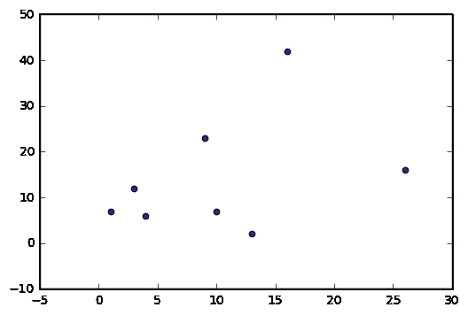
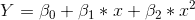
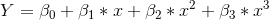
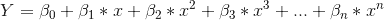
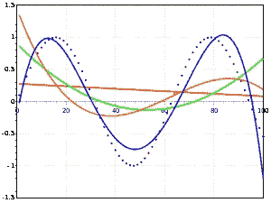
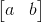
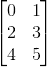
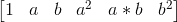
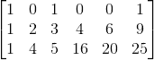
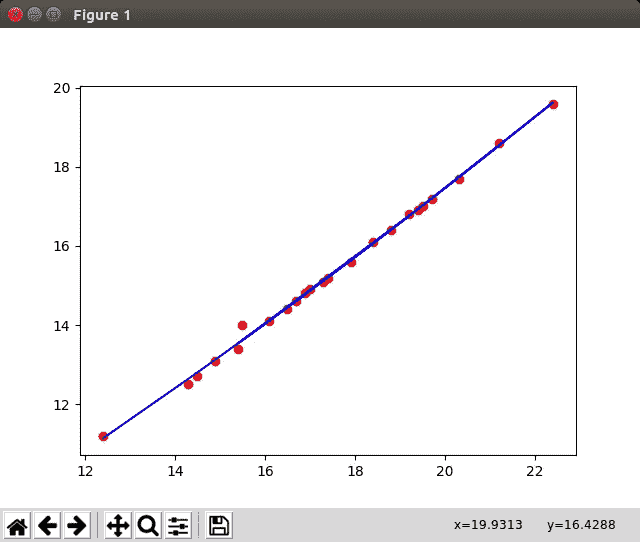

# 多项式回归

> 原文：<https://medium.com/coinmonks/polynomial-regression-11bec9262d64?source=collection_archive---------1----------------------->

如前所述，多项式回归是线性回归的特例。正如我们在线性回归中看到的，我们有两个轴 X 轴表示数据值，Y 轴表示目标值。

***为什么要用多项式回归？***

> 在前面的例子中，数据是线性的。所以我们对数据有很好的拟合。但是考虑到真实世界的例子，数据可能不是线性的，而是更加分散的。在这种情况下，线性回归可能不是描述数据的最佳方式。曲线或非线性线可能更适合这种数据。举个例子:

An Example of Scatter Plot

> 看这个例子，点是分散的/多样化的。因此，简单的直线可能不是这种数据集的最佳选择。

现在我们知道为什么要多项式回归了。让我们深入探究我们应该如何使用它。

二次方程或二次多项式的方程为:

**Polynomial of degree 2**

类似地，三次方程:

**Polynomial degree 3**

多项式次数 n 如下所示:

**Where n is the degree of the polynomial**

> 现在我们已经完成了数学，让我们把注意力集中在如何将数据拟合到多项式方程上。

Example of polynomial Curve

同样，我们将使用 [sklearn 库](https://pypi.org/project/scikit-learn/)中的 ***多项式 Feature()*** 函数和 [python](https://www.python.org/) 。

> **来自 sklearn .预处理导入多项式特性**

# ***那么，多项式 Feature()函数到底是怎么工作的呢？***

它的工作其实很简单。它采用特征矩阵并将其转换成二次性质特征矩阵(在二次的情况下)。

假设我们有两个特征的矩阵

X=[[0，1]、[2，3]、[4，5]]

或者，

Matrix

现在在我们申请之后

> **poly=sklearn。多项式特征(次数=2)**
> 
> **poly _ X = poly . fit _ transform(X)**

我们实际得到的是一个**【1，a，b，a，a*b，b】**形式的矩阵

**[1, a, b, a², a*b, b²]**

下面是简单的[多项式回归](https://github.com/neelindresh/NeelBlog/blob/master/Polynomial%20Regression.py)的示例代码

下载代码:

 [## neelindresh/NeelBlog

### NeelBlog——包含我博客中的代码和 csv

github.com](https://github.com/neelindresh/NeelBlog/blob/master/Polynomial%20Regression.py) 

> 所以我的数据集很简单。它基本上有两列。卡车皮卡公司的价目表和最佳价格。让我们看看。

> ***代号:***
> 
> 导入熊猫为 PD
> df = PD . read _ CSV("/home/indresh/PycharmProjects/MLCoursera/DataSet/test . CSV ")
> x = df . iloc[:，0:1]。值
> y=df.iloc[:，1]。值
> 来自 sklearn .预处理导入多项式 features
> poly = polynomial features(degree = 3)
> poly _ x = poly . fit _ transform(x)
> 来自 sklearn.linear_model 导入线性回归
> regressor = linear regression()
> regressor . fit(poly _ x，y)
> 导入 matplotlib.pyplot 作为 plt
> plt.scatter(x，y，color='red')
> plt.plot(x，regressor

***加载 CSV 文件***

从以下位置获取 csv:

 [## neelindresh/NeelBlog

### NeelBlog——包含我博客中的代码和 csv

github.com](https://github.com/neelindresh/NeelBlog/blob/master/test.csv) 

> 将熊猫导入为 PD
> df = PD . read _ CSV("/home/indresh/PycharmProjects/MLCoursera/DataSet/test . CSV ")

***取 X _ 轴和 Y _ 轴***

> x=df.iloc[:，0:1]。值
> y=df.iloc[:，1]。价值观念

> **注意:为什么使用** df.iloc **[:，0:1]而不是简单的** df.iloc **[:，0】的原因是当我们使用** df.iloc **[:，0]时会产生一个 1D 数组，它不能被拟合到像[1，2，3，4，…n]这样的多项式模型中。我们需要一个 2D 数组来*拟合 X 轴数据，因此使用*** df.iloc **[:，0:1]创建一个 2D 矩阵[[1，2，3，4，…n]]。**

**现在什么都做不了。 *iloc[]* do？或者更好它是如何工作的？**

Ans: ***。iloc[]*** *基本上是从一个数据帧中选择一行。如果我们说****df . iloc[4]****，我们将获得第四行的值。大概是这样:*

> 标价 16.1
> 最佳价格 14.1
> 名称:4，型号:float64

所以当我们说**的时候。iloc[:，0:1]** 是手段。**iloc[第 0 列的所有行]**

***从 sklearn .预处理库*** 导入多项式特征

> 从 sklearn .预处理导入多项式特征

现在是激动人心的部分

> poly =多项式 features(degree = 3)
> poly _ x = poly . fit _ transform(x)

> ***所以通过多项式特征(次数=3)我们说多项式曲线的次数将为 me 3(尝试高值)***

> 聚 x =聚拟合变换(x)
> 
> **将数组转换成多项式形式，正如我之前提到的，输出将是**
> 
> [ [1，x，x ] ]
> 
> [[ 1.，12.39999962，153.75999058]
> 【1。，14.30000019，204.49000543]
> 【1 .，14.5，210.25]
> 【1。，14.89999962，222.00998868]
> **注意:数组只有一个值，因此[1，x，x ]如果它有两个值 x，x1，那么矩阵将类似于[[1，x，x1，x，xx1，x1 ]]**

***这和我之前帖子描述的线性模型是一样的:***

 [## 线性回归第一部分

### 线性回归是最简单的监督学习类型。回归分析的目的是探索…

dataneel.wordpress.com](https://dataneel.wordpress.com/2018/06/09/linear-regression-part-1/) 

> from sklearn.linear_model 导入 linear regression
> regressor = linear regression()
> regressor . fit(poly _ x，y)
> 导入 matplotlib.pyplot 作为 plt
> plt.scatter(x，y，color='red')
> plt.plot(x，regressor . predict(poly . fit _ transform(x))，color='blue')
> plt.show()

Output of degree 2 polynomial

 [## 尼尔·巴塔查里亚

### 编程爱情

www.youtube.com](https://www.youtube.com/channel/UCTJE1mGfe5qgO5OfWE6surg?view_as=subscriber)  [## 面向所有人的数据科学

### 正如我们在前面的后线性回归第一部分线性回归第一部分中所讨论的，当…

dataneel.wordpress.com](https://dataneel.wordpress.com/) 

> 加入 Coinmonks [电报频道](https://t.me/coincodecap)和 [Youtube 频道](https://www.youtube.com/c/coinmonks/videos)获取每日[加密新闻](http://coincodecap.com/)

## 另外，阅读

*   [复制交易](/coinmonks/top-10-crypto-copy-trading-platforms-for-beginners-d0c37c7d698c) | [加密税务软件](/coinmonks/crypto-tax-software-ed4b4810e338)
*   [网格交易](https://coincodecap.com/grid-trading) | [加密硬件钱包](/coinmonks/the-best-cryptocurrency-hardware-wallets-of-2020-e28b1c124069)
*   [密码电报信号](http://Top 4 Telegram Channels for Crypto Traders) | [密码交易机器人](/coinmonks/crypto-trading-bot-c2ffce8acb2a)
*   [最佳加密交易所](/coinmonks/crypto-exchange-dd2f9d6f3769) | [印度最佳加密交易所](/coinmonks/bitcoin-exchange-in-india-7f1fe79715c9)
*   开发人员的最佳加密 API
*   [NFT 十大市场造币集锦](https://coincodecap.com/nft-marketplaces)
*   [AscendEx Staking](https://coincodecap.com/ascendex-staking)|[Bot Ocean Review](https://coincodecap.com/bot-ocean-review)|[最佳比特币钱包](https://coincodecap.com/bitcoin-wallets-india)
*   [Bitget 回顾](https://coincodecap.com/bitget-review) | [双子 vs 区块链](https://coincodecap.com/gemini-vs-blockfi) | [OKEx 期货交易](https://coincodecap.com/okex-futures-trading)
*   [美国最佳加密交易机器人](https://coincodecap.com/crypto-trading-bots-in-the-us) | [经常性回顾](https://coincodecap.com/changelly-review)
*   [在印度利用加密套利赚取被动收入](https://coincodecap.com/crypto-arbitrage-in-india)
*   最佳[密码借贷平台](/coinmonks/top-5-crypto-lending-platforms-in-2020-that-you-need-to-know-a1b675cec3fa)
*   [免费加密信号](/coinmonks/free-crypto-signals-48b25e61a8da) | [加密交易机器人](/coinmonks/crypto-trading-bot-c2ffce8acb2a)
*   杠杆代币的终极指南