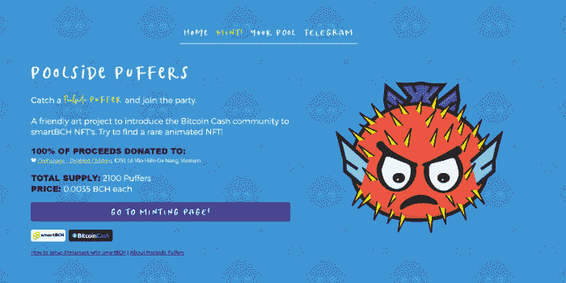
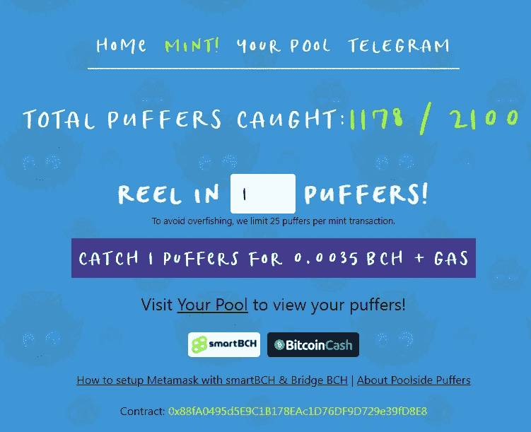
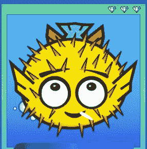

# 泳池边的河豚！—一个明智的 NFT 艺术项目，目的很好！

> 原文：<https://medium.com/coinmonks/poolside-puffers-a-smartbch-nft-art-project-with-a-good-purpose-77c2e57d01c7?source=collection_archive---------11----------------------->

[***Puffers.cash***](https://puffers.cash/)

我已经爱上 SmartBCH 了！我们进入得太早了，这让我觉得很有趣，昨天我不得不写道，加密新闻媒体根本没有报道任何关于 SmartBCH 或比特币现金的消息。

你知道，你不能对公众隐瞒这么好的事情。

[*SmartBCH.org*](https://smartbch.org/)

一开始，我们有创建令牌的社区项目，并为 SmartBCH 的启动阶段提供了宝贵的支持。

**比特币现金阿根廷(ARG)** 、**克努特(KTH)** 、 **UaT (UatX)、**以及更多的代币由备受尊敬的社区成员发布。BCH 用户将他们的 Metamask 钱包连接到 SmartBCH，并通过空投或通过 SmartBCH 上的第一个 DEX 购买这些代币。现金。

我们还遇到了像**cash cats(**EBEN**)这样的 meme tokens，它是第一个提供 DeFi yield farming 以及 BenSwap 平台的原生 token(**EBEN**)的。**

我们还看到 SLP 代币增加了对基于比特币现金运行的令人兴奋的新 SmartBCH 网络的支持。**嘎** by @YoshiLivo 是第一批，接下来是 **ORB** 的令牌**进入球体**NFT 游戏，还有更多接踵而至。

***Source:*** [***Enter The Sphere Website***](https://enter-the-sphere.com/)

**AxieBCH** 是另一个特别有趣的项目，我关注并发现它带来的概念和支持它的社区成员都非常有趣。它应该被提及，因为它有潜力达到 **Axie Infinity** 的广泛粉丝群。

几天前我们在 SmartBCH 也有了第一批 NFT，叫做**法律朋克**。不过，它似乎受到了 NFT 圈子里非常流行的加密朋克的严重影响，这可能会对此产生误判。

与此同时，新的 Defi 平台将增加竞争，创造更多的流动性，并产生农业选择。新发布的 **Mistswap** Defi exchange 和即将发布的 **MuesliSoup** DEX。

然而，今天我们在 SmartBCH 上有一个令人兴奋的新 NFT 系列，叫做**池畔河豚**！它背后有一个严肃的目的，NFT 造币厂的全部收益将捐赠给孤儿院。

# 泳池边的河豚——精致聪明

来自 Bitcoin.com 的 Corbin Fraser 刚刚宣布了这一消息，第一批造币厂正在生产中！

除了这一切都是非盈利性的，所有的 BCH 都在进行捐赠，还有更重要的因素让我立即参与进来并赚了一些钱。

这个项目是来自 Bitcoin.com 的科尔宾·弗雷泽的作品，所以我们不是和一个匿名的创作者打交道，而是和一个隐文专家打交道。

此外，这也是一个专业项目，细节质量高，是一个最大 2100 NFTs 的稀缺模型。

**关于河豚的大部分信息已经是科尔宾·弗雷泽(** [@maplesyrupsuckr](https://read.cash/@maplesyrupsuckr) **)在这上面读到的。现金过账:**

*   [**宣布池畔河豚！帮助造币厂 2100 NFTs 并支持当地的越南孤儿院**](https://read.cash/@maplesyrupsuckr/announcing-poolside-puffers-help-mint-2100-nfts-and-support-a-local-vietnamese-orphanage-0557fc83)

对于那些对作为 NFTs 投资的 NFT 项目感兴趣的人，我将引用其中的重要部分:

> [*NFTs 的转售*](https://read.cash/@maplesyrupsuckr/announcing-poolside-puffers-help-mint-2100-nfts-and-support-a-local-vietnamese-orphanage-0557fc83#resale-of-nfts)
> 
> smartBCH 还早。几个新的 NFT 市场正在涌现。随着时间的推移，你将能够在不同的市场上销售你的非专利技术。以后，甚至可以将你的河豚 NFT 从 smartBCH 连接到其他连锁店，如以太坊，在那里出售。
> 
> [*-来源*](https://read.cash/@maplesyrupsuckr/announcing-poolside-puffers-help-mint-2100-nfts-and-support-a-local-vietnamese-orphanage-0557fc83)

现在 SmartBCH 处于早期阶段，我们直到几天前才拥有 NFT。没有活跃的市场，但很快就会有。

以上原因我都加入了。我会把 BCH 直接捐给基金会，但是我觉得这些非功能性食物也是一项不错的投资。所以我参加了，通过 Coinflex 在 SmartBCH 中转移了一些资金，并购买了一些，只需支付几便士的网络费用。

该项目刚刚启动，仅一天之内，超过一半的河豚被 SmartBCH 用户捕获和制造！

# 铸造了我的第一个泡芙！

我总共做了 20 只河豚。我从 2018 年开始在 NFTs，买了几个，交易了几个，但是随着以太坊费用达到 200 美元用于合同执行，我留了下来，没有参与炒作。自从 Axies 发布以来，我就一直拥有它，几个月前，随着炒作的增加，我卖掉了它，获得了丰厚的利润。我持有这些 Axie 两年了，尽管最近炒作和 Axie 热潮，我忍不住卖掉它们获得了不错的利润。

加密朋克是在 2017 年以太坊费用较低的时候创造的，今天持有它们的人已经从中赚了一大笔钱。

我们的 NFT 右上角的钻石是稀有的指标。

## 顶级河豚！

Rare 3-Diamond Puffer!

这是一只罕见的三钻河豚！不知道有没有钻石多的河豚，还没见过，可能有一些钻石甚至更多。

买一只的价格太低了，我不再买了，因为我不想主宰“Puffyverse”。我不打算卖掉它们，我支付的金额，我认为这是对一个好的事业的捐赠，所以这些是额外的资产。

我明天会再检查一下，如果还有河豚的话，我会再买几个。经过一年多对 NFT 市场的研究，我不得不告诉你，薄荷的数量对价格也很重要。低号、圆号，也许还有最后一种，被收藏者认为更有价值。

# 最后

如果这个项目在以太坊启动，费用可能需要价值数百美元的以太网，还需要与 whales 预先安排在社交媒体上的销售和推广。

这就是为什么 SmartBCH 很重要，这是我们必须发出的明确信息。

**SmartBCH 中的 NFT 是真实的**,**的交易非常便宜**而且像 OpenSea 这样的一些 NFT 顶级市场将不得不与 smart BCH 进行沟通，因为对 SmartBCH NFTs 的兴趣只会持续上升。

我们还将为 SmartBCH NFTs 开放独立的市场，因为我们已经有 2 个不同系列的 NFT，还有更多即将推出。我已经注意到许多艺术家在关注 SmartBCH 侧链的扩展，他们会尝试在 SmartBCH NFTs 上发布他们的作品。

祝贺 Corbin Fraser[@ maplesyrupsuckr](https://read.cash/@maplesyrupsuckr)推出这个令人难以置信的 NFT 系列，为了这个目的，资金将会到位，这使得每个人都参与进来变得更加重要。

制造一只池畔河豚的成本仅为 0.0035BCH(今天不到 2 美元)，我发现这是一个极好的机会，因为这是 SmartBCH 网络中推出的一个独特的高质量 NFT 项目。

**池畔河豚链接:**

*   [网站](https://puffers.cash/)
*   [电报](https://t.me/poolsidepuffers)
*   [科尔宾·弗雷泽的推特](https://twitter.com/maplesyrupsuckr)
*   [Readcash](https://read.cash/@maplesyrupsuckr)
*   [池畔河豚公告](https://read.cash/@maplesyrupsuckr/announcing-poolside-puffers-help-mint-2100-nfts-and-support-a-local-vietnamese-orphanage-0557fc83)
*   合同号:0x 88 fa 0495d 5 e 9 C1 b 178 ea C1 d 76 df 9d 729 e 39 FD 8 e 8

Follow me on: ● [ReadCash](https://read.cash/@Pantera) ● [NoiseCash](https://noise.cash/u/Pantera99) ● [Medium](/@panterabch) ● [Hive](https://hive.blog/@pantera1) ● [Steemit](https://steemit.com/@pantera1) ●[Vocal](https://vocal.media/authors/pantera) ● [Minds](https://www.minds.com/pantera99/) ● [Twitter](https://twitter.com/Panterabch) ● [LinkedIn](https://www.linkedin.com/in/panterabch/) ●[Reddit](https://www.reddit.com/user/PanteraBCH) ● [email](https://read.cash/@Pantera/localcryptos-p2p-exchange-is-now-offering-bitcoin-cash-trading-06637230#bad-link)

***支持内容创作者——订阅和点赞！***

*原载于*[*https://read . cash*](https://read.cash/@Pantera/poolside-puffers-a-smartbch-nft-art-project-with-a-good-purpose-93fc2ee5)*。*

> 加入 Coinmonks [电报频道](https://t.me/coincodecap)和 [Youtube 频道](https://www.youtube.com/c/coinmonks/videos)了解加密交易和投资

## 另外，阅读

*   [尤霍德勒 vs 科恩洛 vs 霍德诺特](/coinmonks/youhodler-vs-coinloan-vs-hodlnaut-b1050acde55a) | [Cryptohopper vs 哈斯博特](https://blog.coincodecap.com/cryptohopper-vs-haasbot)
*   [如何匿名购买比特币](https://blog.coincodecap.com/buy-bitcoin-anonymously) | [比特币现金钱包](https://blog.coincodecap.com/bitcoin-cash-wallets)
*   [币安 vs FTX](https://blog.coincodecap.com/binance-vs-ftx) | [最佳(索尔)索拉纳钱包](https://blog.coincodecap.com/solana-wallets)
*   [如何在 Uniswap 上交换加密？](https://blog.coincodecap.com/swap-crypto-on-uniswap)
*   [币安 vs 北海巨妖](https://blog.coincodecap.com/binance-vs-kraken) | [美元成本平均交易机器人](https://blog.coincodecap.com/pionex-dca-bot)
*   [新加坡十大最佳加密交易所](https://blog.coincodecap.com/crypto-exchange-in-singapore) | [购买 AXS](https://blog.coincodecap.com/buy-axs-token)
*   [投资印度的最佳加密软件](https://blog.coincodecap.com/best-crypto-to-invest-in-india-in-2021) | [HitBTC 评论](/coinmonks/hitbtc-review-c5143c5d53c2)
*   [加拿大最好的加密交易机器人](https://blog.coincodecap.com/5-best-crypto-trading-bots-in-canada) | [赌注加密](https://blog.coincodecap.com/staking-crypto)
*   [如何在印度购买比特币？](/coinmonks/buy-bitcoin-in-india-feb50ddfef94) | [WazirX 评论](/coinmonks/wazirx-review-5c811b074f5b)
*   [比特币主根](https://blog.coincodecap.com/bitcoin-taproot) | [Bitso 回顾](https://blog.coincodecap.com/bitso-review) | [排名前 6 的比特币信用卡](/coinmonks/bitcoin-credit-card-bc8ab6f377c6)
*   [最佳免费加密信号](https://blog.coincodecap.com/free-crypto-signals) | [YoBit 评论](/coinmonks/yobit-review-175464162c62) | [Bitbns 评论](/coinmonks/bitbns-review-38256a07e161)
*   [huo bi 的加密交易信号](https://blog.coincodecap.com/huobi-crypto-trading-signals) | [BitMEX 评论](https://blog.coincodecap.com/bitmex-review)
*   [7 个最佳零费用加密交易平台](https://blog.coincodecap.com/zero-fee-crypto-exchanges) | [硬件钱包](/coinmonks/hardware-wallets-dfa1211730c6)
*   [分散交易所](https://blog.coincodecap.com/what-are-decentralized-exchanges) | [比特恩斯 FIP](https://blog.coincodecap.com/bitbns-fip) | [皮奥克斯评论](https://blog.coincodecap.com/pionex-review-exchange-with-crypto-trading-bot)
*   [用信用卡购买密码的 10 个最佳地点](https://blog.coincodecap.com/buy-crypto-with-credit-card)
*   [OKEx 评论](/coinmonks/okex-review-6b369304110f) | [Kucoin 交易机器人](/coinmonks/kucoin-trading-bot-automate-your-trades-8cf0ca2138e0) | [期货交易机器人](/coinmonks/futures-trading-bots-5a282ccee3f5)
*   [AscendEx Staking](https://blog.coincodecap.com/ascendex-staking)|[Bot Ocean Review](https://blog.coincodecap.com/bot-ocean-review)|[最佳比特币钱包](https://blog.coincodecap.com/bitcoin-wallets-india)
*   [霍比评论](https://blog.coincodecap.com/huobi-review) | [OKEx 保证金交易](https://blog.coincodecap.com/okex-margin-trading) | [期货交易](https://blog.coincodecap.com/futures-trading)
*   [Godex.io 审核](/coinmonks/godex-io-review-7366086519fb) | [邀请审核](/coinmonks/invity-review-70f3030c0502) | [BitForex 审核](https://blog.coincodecap.com/bitforex-review)
*   [Crypto.com 费用](/coinmonks/binance-fees-8588ec17965) | [僵尸加密审查](/coinmonks/botcrypto-review-2021-build-your-own-trading-bot-coincodecap-6b8332d736c7) | [替代品](https://blog.coincodecap.com/crypto-com-alternatives)
*   [有哪些交易信号？](https://blog.coincodecap.com/trading-signal) | [Bitstamp vs 比特币基地](https://blog.coincodecap.com/bitstamp-coinbase) | [买索拉纳](https://blog.coincodecap.com/buy-solana)
*   [ProfitFarmers 回顾](https://blog.coincodecap.com/profitfarmers-review) | [如何使用 Cornix Trading Bot](https://blog.coincodecap.com/cornix-trading-bot)
*   [MXC 交易所评论](/coinmonks/mxc-exchange-review-3af0ec1cba8c) | [Pionex vs 币安](https://blog.coincodecap.com/pionex-vs-binance) | [Pionex 套利机器人](https://blog.coincodecap.com/pionex-arbitrage-bot)
*   [我的加密副本交易经历](/coinmonks/my-experience-with-crypto-copy-trading-d6feb2ce3ac5) | [比特币基地评论](/coinmonks/coinbase-review-6ef4e0f56064)
*   [CoinFLEX 评论](https://blog.coincodecap.com/coinflex-review) | [AEX 交易所评论](https://blog.coincodecap.com/aex-exchange-review) | [UPbit 评论](https://blog.coincodecap.com/upbit-review)