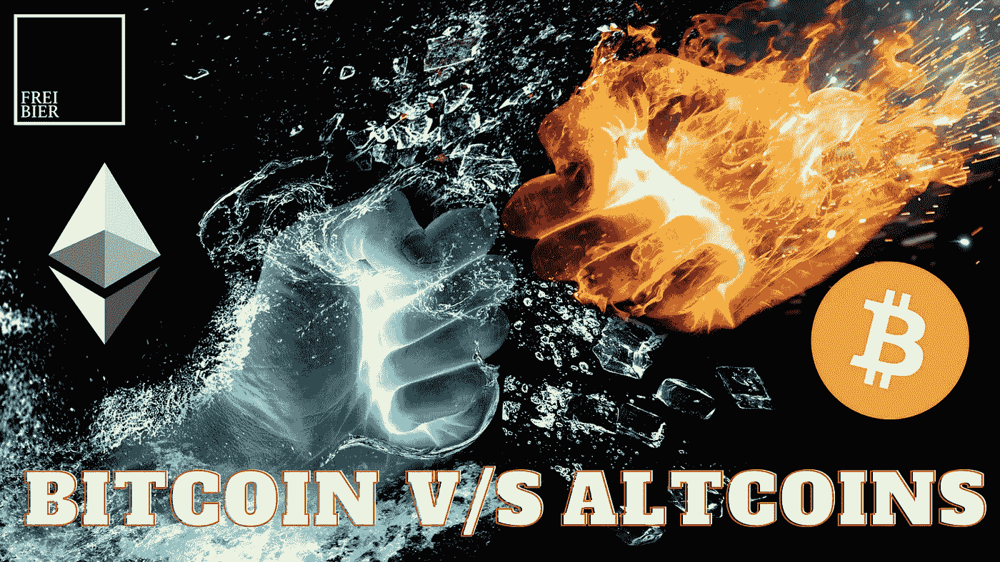
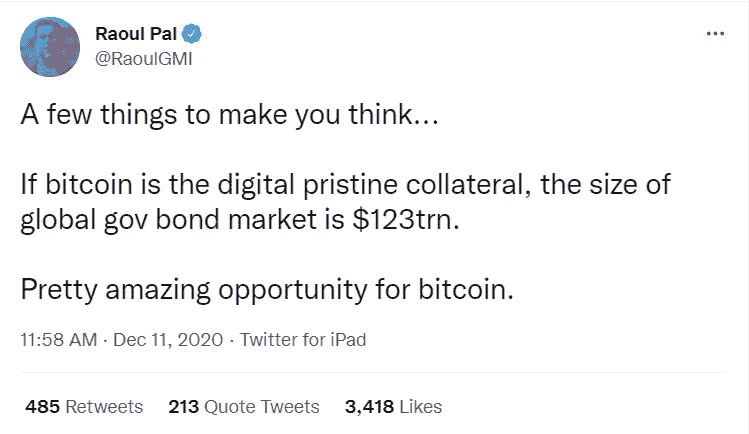
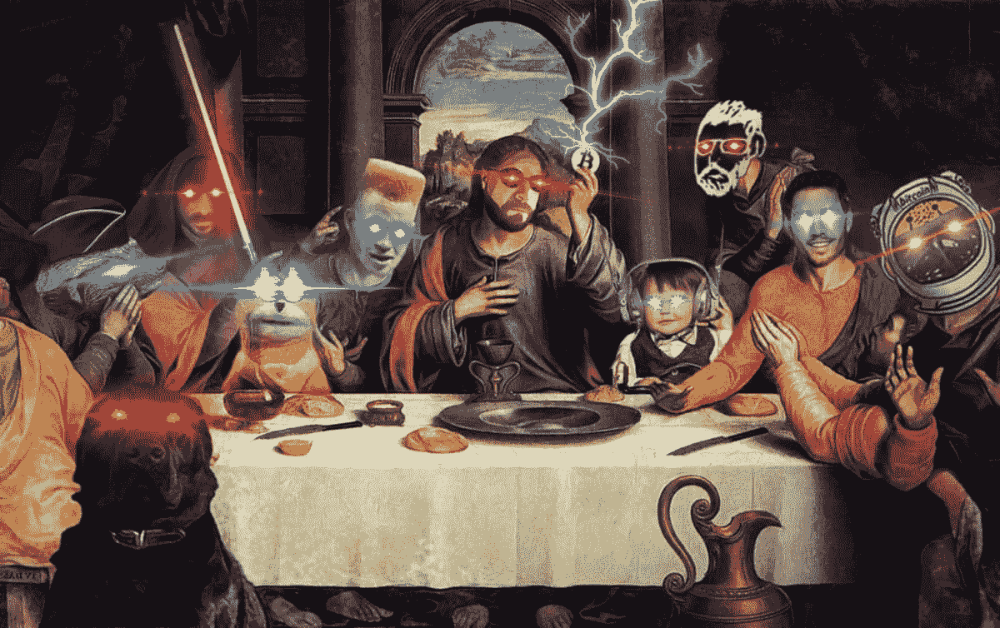
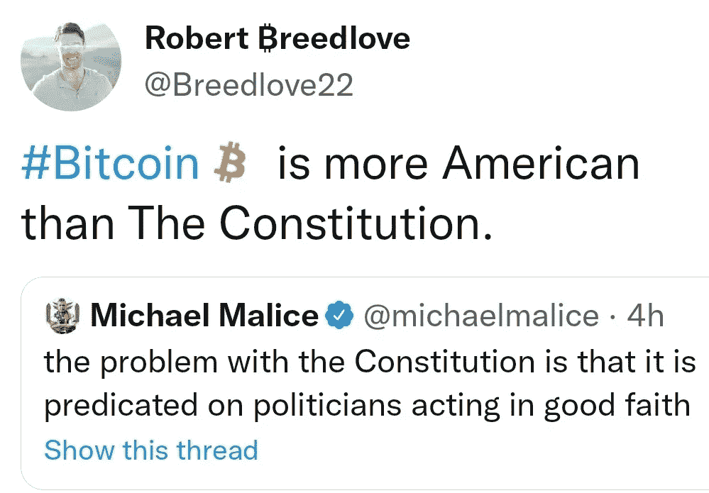
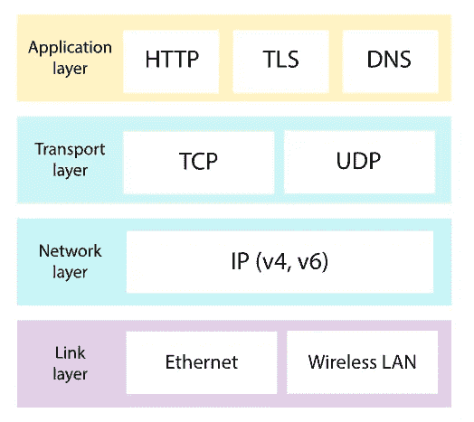

# 投资组合构建:比特币与替代币

> 原文：<https://medium.com/coinmonks/portfolio-construction-bitcoin-versus-altcoins-64c61123e069?source=collection_archive---------5----------------------->

**比特币是硬通货，你不能用**去骗它。不要相信我的话，问问**杰森·a·威廉姆斯**，他写了一本关于这个的虚构的书。不应该有争论。没有人控制它。没有政府，没有公司，没有中央银行，没有印钞机。这是一场和互联网一样大的革命。它像玻璃一样透明，像破碎球一样微妙。一旦世界上有 2100 万个比特币，就再也不会有比特币被创造出来。这就是比特币成为一种比黄金更纯粹的硬通货的原因。

Real Vision 的首席执行官拉乌尔·帕尔(Raoul Pal)表示赞同，他说**比特币是有史以来创造的最好的储备和抵押资产**。作为一种储备资产，由于其分散性和可证明的交易历史，它在每个指标上都优于黄金。

还不服气？只要看看拉乌尔·帕尔的**对指数时代的介绍**。这个是纯宝石。我亲自看了很多遍。关键在于 **Raoul 将价值向数字世界的转移视为一种指数趋势，这种趋势提供了传统资本市场不再可能提供的投资回报机会。**

说够了！**比特币为王，如果你不同意，那么 HFSP(H**ave**f**un**s**ta ying**p**oor**)！**本着这种想法，我想探讨比特币 maxis 和其他任何不把比特币作为唯一福音的人之间的拉锯战这个非常相关的话题。我在 nasium 的第一篇博文中探讨了比特币最大化，所以一定要去看看。

Source: Bitcoin Magazine

至于我自己，我绝对不是一个比特币狂热分子。然而，我确实理解比特币(提醒你，比特币总有改进的空间)。其优雅的设计，其创建的神话和原则，社会的顽强追求一个健全的货币制度。太棒了。然而，我不理解比特币最大化主义，以及它对比特币是过去、现在或未来唯一的加密货币项目的坚定不移的坚持。这是卢达克里斯的所有意图和目的。很久以前，在我妻子和我离婚并带走了我一半的财产后，我已经失去了对“唯一”这个概念的信念。开个玩笑，我婚姻幸福，但你明白了！

我的方法是跟踪参与这个领域的宏观人员。当谈到投资和赚钱时，劳尔·帕尔、马克·w·尤斯科、吉姆·比安科、迈克·诺沃格拉茨等人无一例外都是关键人物。这些都是拥有数十年投资经验的专业人士。为什么要听罗伯特·布里德洛夫·布拉伯林讲述货币和比特币的哲学呢？对不起，我很忙，我有事情要做。跟着国王们走。依我拙见，这很简单！

对于国王的会议，一定要检查从加密戏谑这一集。多么令人高兴啊！

Morgan Creek Capital 的 Mark Yusko 对加密货币有一个有趣的概念化，我们可以用它来描述加密空间。特别是，**他将加密诗比作互联网的进化，互联网正处于从 Web 2.0 向 Web 3.0 进化的过程中。**

随着 Web 3.0 的发展，它将会有一个协议栈，就像我们有一个 Web 2.0 的协议栈一样。比如今天有 TCP/IP，是用来通信的。然后是电子邮件的 SMTP，网站的 http，文件的 FTP，还有那种把一切都联系在一起的 www。Web 2.0 的互联网协议层通常以如下图表显示:

Source: Khan Academy

未来，Mark W. Yusko 认为比特币是基础层。在那之上，我们有 Filecoin 来做文件的事情，在中间我们有应用层:Solana，Polkadot，Cosmos 有点争夺那些中间点。他认为以太坊是顶部的 www，它作为一个工具包将一切联系在一起。

请务必在 Cointelegraph 上查看他的采访，了解更多详情:

许多观察者会注意到上面缩略图中的互联网发展图。如果不是，这就是我要说的:

我假设比特币麦克斯会认为 Web 3.0 可以完全建立在比特币的基础上。然而，比特币将主导 Web 3.0 的想法在我的愚见中听起来并不现实。相对较早的以太坊开发者 Vitalik Buterin 相当完美地描述了 maximalists 的观点。

> 多种竞争性加密货币的环境是不可取的，推出“另一种货币”是错误的，比特币货币在加密货币领域占据垄断地位是正义和不可避免的。

全无意义。**认为比特币是唯一的是徒劳的。好了，我大声说出来了！比特币是硬通货，你不能乱用。它是一种价值储存手段。让我们同意这一点，但它绝对不是唯一的加密货币。因此，我认为**比特币会有巨大的机会，但以太坊会有更大的机会，因为它是一个工具包，更多的东西将建立在它的基础上，例如 play to earn、游戏、元宇宙、NFTs 等。****

说够了。是时候结束了。看看这篇关于劳尔·帕尔为以太坊做辩护的无银行采访。如果你遵循提出的论点，自然会得出这样的结论:除了证明在另类硬币中，尤其是在 Enthereum 中，有大量的机会，别无他法。我就说到这里。

综上所述，橘眼见橘信橘。重点是比特币马克西讨厌除了比特币以外的任何东西。他们正试图让每个人都来购买和使用他们的包。

如果你想要黄金，买黄金，菲亚特，Dogecoin，随便什么。**保持开放的心态，做好你的研究，跟随那些拥王者。有些山寨币真的有价值！**

祝你们好运。

Frei Bier /推特:@FreiBIER13

> 加入 Coinmonks [电报频道](https://t.me/coincodecap)和 [Youtube 频道](https://www.youtube.com/c/coinmonks/videos)了解加密交易和投资

## 也阅读

 [## 最佳加密交易所| 2021 年十大加密货币交易所

### ICON _ PLACEHOLDEREstimated 预计阅读时间:28 分钟加密货币交易所的加密交易需要知识…

blog.coincodecap.com](https://blog.coincodecap.com/crypto-exchange)  [## 2021 年 10 大最佳加密贷款平台| CoinCodeCap

### 当谈到加密货币贷款时，大量因素等同于良好的收入状况。此外，借款的一部分…

blog.coincodecap.com](https://blog.coincodecap.com/crypto-lending)  [## 2021 年最佳免费加密交易机器人

### 2021 年币安、比特币基地、库币和其他密码交易所的最佳密码交易机器人。四进制，位间隙…

medium.com](/coinmonks/crypto-trading-bot-c2ffce8acb2a)  [## 最佳 4 个加密交易信号电报通道

### 这是乏味的找到正确的加密交易信号提供商。因此，在本文中，我们将讨论最好的…

medium.com](/coinmonks/best-crypto-signals-telegram-5785cdbc4b2b)  [## BlockFi 评论 2021:利弊和利率| CoinCodeCap

### 今天，我们提出了一个全面的 BlockFi 评论，这是一个成立于 2017 年的加密贷款平台，拥有其…

blog.coincodecap.com](https://blog.coincodecap.com/blockfi-review)  [## 如何在印度购买比特币？2021 年购买比特币的 7 款最佳应用[手机版]

### 如何使用移动应用程序购买比特币印度

medium.com](/coinmonks/buy-bitcoin-in-india-feb50ddfef94)  [## 加密税务软件——五大最佳比特币税务计算器[2021]

### 不管你是刚接触加密还是已经在这个领域呆了一段时间，你都需要交税。

medium.com](/coinmonks/best-crypto-tax-tool-for-my-money-72d4b430816b)  [## 存储比特币的最佳加密硬件钱包[2021] | CoinCodeCap

### 保管您的数字资产很容易，但找到正确的存储方式却是一项繁琐的任务。在线钱包有一个风险…

blog.coincodecap.com](https://blog.coincodecap.com/best-hardware-wallet-bitcoin)