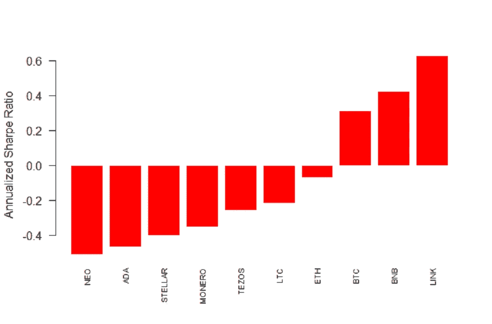
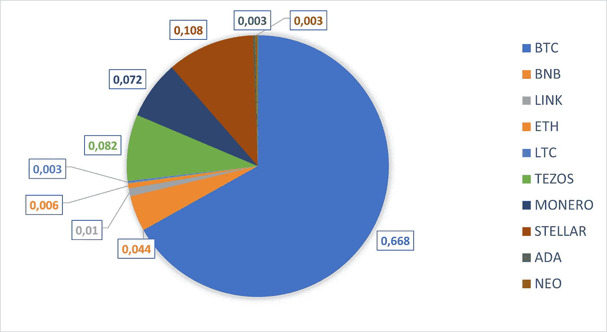

# 加密货币的直接投资组合优化

> 原文：<https://medium.com/coinmonks/portfolio-optimization-for-cryptocurrencies-ede22b2fdf1b?source=collection_archive---------4----------------------->

## 你有没有想过投资组合中每个密码的最优资本分配应该是多少？

在本文中，我将解释 10 种不同加密资产的一些有趣发现:比特币、以太坊、币安币、Cardano、莱特币、Chainlink、Tezos、Stellar、Neo 和 Monero。

你可能会问为什么是这 10 个？

首先，因为我计算了从 2018 年 1 月 1 日到 2021 年 1 月 1 日的三年时间窗内的每日对数回报及其相应的标准差，所以我想确保选择在寿命方面具有可比性的硬币。

其次，这些都是高度资本化的加密货币，具有长期的价格历史和良好的基本面，如果你想建立一个长期获胜的投资组合，这可能是很好的先决条件。

## **夏普比率**

然而，在开始投资组合优化之前，我将简要讨论一个重要的关键概念，它涉及到评估我们的投资业绩。

[夏普比率](https://www.investopedia.com/terms/s/sharperatio.asp)是金融中最常见的在风险调整基础上评估回报的方法，事实上，这不足以计算我们投资的回报，相反，我们还需要考虑我们接受承担的风险程度。

在这种情况下，为了找到每种加密货币的夏普比率，我使用了每种硬币的平均回报，并简单地将它们除以相应的标准差，我没有考虑无风险率，因为我假设没有必要为我们的头寸融资。

```
#log returns
dfr <- diff(log(df))
#sharpe ratio
sr <- apply(dfr,2,mean,na.rm=TRUE)/apply(dfr,2,sd,na.rm=TRUE)
sr <- sr[order(sr)]
barplot(sr*sqrt(365),las=2,border="white",col="red",cex.names=0.7,
        ylab="Annualized Sharpe Ratio")
```



Annualized Sharpe Ratios

这些都是每种加密货币的年化夏普比率，令人惊讶的是，只有比特币、币安币和 Chainlink 的年化风险调整回报率为正。

Chainlink 的夏普比率令人难以置信，超过了比特币和币安币，而 Neo 和 Cardano 的表现都比其他人差。

## **假设和主要约束**

*   假设我们坚信过去预测未来，因此考虑到它们的夏普比率，我们应该将大部分资本分配到比特币、币安币和 Chainlink。
*   我们希望完全投资，我们不想错过夏普比率为负的加密货币的未来上涨机会，因此我们希望也在这些表现不佳的货币中分配一些资本。
*   我们只做多(不卖空)，执行买入并持有策略(假设我们持有硬币至少 1 年)。
*   我们想最小化我们的风险(回报的标准差)。
*   假设我们在交易时支付做市商费用，交易成本约为 0.30%。

## **优化和结果**

为此，我将所有这些约束添加到我想要优化的投资组合中，因此我将这 10 枚硬币分成两组:

*   表现最好的:比特币、币安币和 Chainlink
*   表现最差的:以太坊、Litecoin、Tezos、Monero、Stellar、Cardano 和 Neo

我增加了以下资本约束:在第一组投资总资本的至少 10%且不超过 90%，在第二组投资至少 10%且不超过 30%。

然后，我针对风险优化了投资组合(最小化标准差),并考虑了之前所有的约束和假设。

```
#capitalconstraint
ps <- add.constraint(portfolio=ps,type="weight_sum",min_sum=0.99, max_sum=1.01)
#no zero holdings
ps <- add.constraint(portfolio=ps,type="box",min=0.1,max=0.9)
#groups
best.performers <- c(1, 3, 6)
worst.performers <- c(1:length(crypto.names))[!(1:length(crypto.names)%in%best.performers)]
group_list=list(groupA=best.performers,groupB=worst.performers)
ps <- add.constraint(portfolio=ps,type="group",
                        groups=group_list, 
                        group_min=c(0.1,0.1),
                        group_max=c(0.9,0.3))#transaction cost constrain
ps <- add.constraint(portfolio=ps,type="transaction_cost", ptc=0.003)
#no short selling
ps <- add.constraint(portfolio=ps,type="long_only")
#minimize risk
ps <- add.objective(portfolio=ps,
                       type='risk',
                       name='StdDev',
                       arguments=list(p=0.95))#optimization
optimization <- optimize.portfolio(R=r, portfolio=ps,optimize_method="random",trace=TRUE)
```

这是我发现的最优资本配置:



Optimal Portfolio

我们可以注意到，投资比特币的金额应该保持一致，我可支配资本的近 70%，Stellar 的 10.8%，Tezos 的 8.2%，Monero 的 7.2%，币安币的 4.4%，Chainlink 的 1%，以太坊的 0.6%，Litecoin、Cardano 和 Neo 的 0.3%。

通过这种方式，我能够遵守所有之前的约束条件，从而最小化投资组合的标准差，在这种特殊情况下，标准差为 0.04024 (4.02%)。

## **结论**

在这篇简短的文章中，我解释了我们如何混合我们的假设和约束来构建一个满足它们的投资组合，然而，这只是一个例子，你可以提出许多不同的投资组合配置。

要记住的唯一重要的事情是，当你做投资决策和把钱投入工作时，你总是需要清楚你的目标、约束和假设是什么。

所有的计算都是用 R 软件完成的，如果需要进一步的说明，请评论，我也很乐意与你分享代码！

*本文无意成为投资建议。寻求一个有正式执照的专业人士的投资建议。*

> 加入 Coinmonks [电报集团](https://t.me/joinchat/EPmjKpNYwRMsBI4p)，了解加密交易和投资

## 另外，阅读

*   最好的[密码交易机器人](/coinmonks/crypto-trading-bot-c2ffce8acb2a) | [网格交易](https://blog.coincodecap.com/grid-trading)
*   [加密复制交易平台](/coinmonks/top-10-crypto-copy-trading-platforms-for-beginners-d0c37c7d698c) | [如何在 WazirX 上购买比特币](/coinmonks/buy-bitcoin-on-wazirx-2d12b7989af1)
*   [CoinLoan 审核](/coinmonks/coinloan-review-18128b9badc4)|[Crypto.com 审核](/coinmonks/crypto-com-review-f143dca1f74c) | [火币保证金交易](/coinmonks/huobi-margin-trading-b3b06cdc1519)
*   [尤霍德勒 vs 考尼洛 vs 霍德诺特](/coinmonks/youhodler-vs-coinloan-vs-hodlnaut-b1050acde55a) | [Cryptohopper vs 哈斯博特](https://blog.coincodecap.com/cryptohopper-vs-haasbot)
*   [杠杆代币](/coinmonks/leveraged-token-3f5257808b22) | [最佳密码交易所](/coinmonks/crypto-exchange-dd2f9d6f3769) | [Paxful 点评](/coinmonks/paxful-review-4daf2354ab70)
*   [加密套利](/coinmonks/crypto-arbitrage-guide-how-to-make-money-as-a-beginner-62bfe5c868f6)指南| [如何做空比特币](/coinmonks/how-to-short-bitcoin-568a2d0b4ae5)
*   [如何在印度购买比特币？](/coinmonks/buy-bitcoin-in-india-feb50ddfef94) | [WazirX 审查](/coinmonks/wazirx-review-5c811b074f5b)
*   [印度比特币交易所](/coinmonks/bitcoin-exchange-in-india-7f1fe79715c9) | [比特币储蓄账户](/coinmonks/bitcoin-savings-account-e65b13f92451)
*   [币安收费](/coinmonks/binance-fees-8588ec17965) | [僵尸加密审查](/coinmonks/botcrypto-review-2021-build-your-own-trading-bot-coincodecap-6b8332d736c7) | [热点审查](/coinmonks/hotbit-review-cd5bec41dafb)
*   [我的密码交易经验](/coinmonks/my-experience-with-crypto-copy-trading-d6feb2ce3ac5) | [购买硬币评论](https://blog.coincodecap.com/buycoins-review)
*   [逐位融资融券交易](/coinmonks/bybit-margin-trading-e5071676244e) | [币安融资融券交易](/coinmonks/binance-margin-trading-c9eb5e9d2116) | [超位审核](/coinmonks/overbit-review-9446ed4f2188)
*   [加密货币储蓄账户](/coinmonks/cryptocurrency-savings-accounts-be3bc0feffbf) | [YoBit 审核](/coinmonks/yobit-review-175464162c62) | [Bitbns 审核](/coinmonks/bitbns-review-38256a07e161)
*   [Botsfolio vs nap bots vs Mudrex](/coinmonks/botsfolio-vs-napbots-vs-mudrex-c81344970c02)|[gate . io 交流回顾](/coinmonks/gate-io-exchange-review-61bf87b7078f)
*   [最佳比特币保证金交易](/coinmonks/bitcoin-margin-trading-exchange-bcbfcbf7b8e3) | [萝莉点评](/coinmonks/lolli-review-e6ddc7895ad8) | [比特币保证金交易](https://blog.coincodecap.com/bityard-margin-trading)
*   [创造并出售你的第一个 NFT](https://blog.coincodecap.com/create-nft) | [本地比特币评论](/coinmonks/localbitcoins-review-6cc001c6ed56)
*   [加密保证金交易交易所](/coinmonks/crypto-margin-trading-exchanges-428b1f7ad108) | [赚取比特币](/coinmonks/earn-bitcoin-6e8bd3c592d9) | [Mudrex 投资](https://blog.coincodecap.com/mudrex-invest-review-the-best-way-to-invest-in-crypto)
*   [如何在印度购买以太坊？](https://blog.coincodecap.com/buy-ethereum-in-india) | [如何在币安购买比特币](https://blog.coincodecap.com/buy-bitcoin-binance)
*   [顶级付费加密货币和区块链课程](https://blog.coincodecap.com/blockchain-courses) | [Pionex vs 币安](https://blog.coincodecap.com/pionex-vs-binance)
*   [MXC 交易所评论](/coinmonks/mxc-exchange-review-3af0ec1cba8c)

> [直接在您的收件箱中获得最佳软件交易](/coinmonks/newsletters/coinmonks)

[](https://medium.com/coinmonks/newsletters/coinmonks)