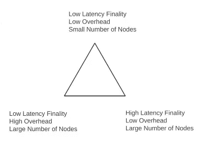

# PoS 中的区块链扩展

> 原文：<https://medium.com/coinmonks/pos-blockchain-scaling-8f9c0c485c0d?source=collection_archive---------0----------------------->

## 作为终结函数的缩放

> 只要每个节点独立地验证网络中所有事务的完整性，网络就只能处理一个节点所能处理的事务。

在本系列的第 1 部分中，我们讨论了 PoW 终结性和共识机制的结果，该机制允许该链总是有可能被另一个竞争链超越，从而恢复事务。所以交易的终结从来不是一种保证。因此，网络中的所有节点验证所有块和所有事务。因此，网络只能处理一个节点能够独立处理的事务。

在[第 2 部分](/coinmonks/blockchain-scaling-30c9e1b7db1b)中，我们研究了通过增加数据块大小和降低数据块频率来改善这种情况的方法，但最终这些变化会受到事务和数据块传播网络速度的限制。因此，尽管通过这些方法可以增加吞吐量(稍微，仍然低于 100 TPS)，但它不会改变单节点瓶颈的约束。全局扩展将需要在节点之间划分网络状态验证责任。这现在成了一个决定性的问题。

如果超过某个年龄的事务不可能被恢复，我们就不需要存储或验证事务的整个历史，只需要存储或验证当前状态所依赖的历史。

## 证据背后的历史

PoS 的起源来自对复制状态机中分布式协议的长期研究。追溯到 20 世纪 70 年代，许多人都在研究如何利用商业航空公司不可靠的部件进行可靠的通信。在 30，000 英尺高空与 150 名乘客进行通信时出现故障会产生严重后果，因此能否确定数据的有效性是一个生死攸关的问题。从这个工作领域产生了经典的拜占庭将军的问题，这产生了拜占庭容错(BFT)。直到 1999 年(实用 BFT 发明之时)，拜占庭将军的问题主要是一个学术问题，至今无人解决。由于银行、股票、通信和互联网都是集中托管和控制的，世界各地的主要计算系统对它没有实际用途。

直到 2008 年，中本聪将拜占庭将军问题的实际解决方案引入全球范围的分布式网络。这很快被证明是一个稳定和安全的系统，以实现容错共识，导致将这些以前的学术思想应用到现实世界应用的研究爆炸。

简而言之，工作证明实际上只是一种方法，用来验证块创建者所编译的自上一个块以来所发生的历史是有效的和允许的。该共识协议的关键是在不信任块创建者的诚实的情况下做到这一点，并使该过程对所有人开放和可用(尽管网络中的整体计算能力发生变化，也动态地保持 10 分钟的块频率，*细节…细节)*。这里的惩罚是，如果你操作不当，这个程序块是可证明无效的，并且你所花费的计算努力不会得到奖励。这种计算工作已经被证明与资产的价值直接相关。在过去的几年里，这引起了一些关注。目前，比特币价格为 4013 美元，每笔交易使用 511 千瓦时的能源，足以为 17.27 个美国家庭供电，产生 242.73 千克二氧化碳。

因此，如果可以通过其他方式实现这一点，同时保持战俘营网络的安全性、缺乏信任和分布式特性，而不需要消耗物理资源，这将是实现 BFT 共识的更有效方法，无疑对所有人都更好。

利害关系证明的概念诞生于 2011 年 Bitcointalk 论坛上的用户*quantum mechanic*[相当出色的](https://bitcointalk.org/index.php?topic=27787.0)。在这次讨论中，他们提出了一个想法，即分布式计算不是对有效历史进行“投票”,而是分布式所有权对被接受的有效历史进行投票。这场讨论开始了 7 年的战斗，以实现与比特币相同的安全性和规模。

这项技术的最初实现并不完整，因为 PoW 的比特币实现所解决的大量问题还没有被完全理解。有些人会说，即使在今天，许多更微妙的问题仍有待解决。

## 分解位置

有几种方法可以在 PoS 中选择块生产者，无论是通过投票(委托 PoS，例如 EOS)或股份(PoS)，随机选择(例如 Nxt)或通过硬币年龄(例如 Peercoin)，但核心概念保持不变，网络不是像在 PoW 中那样由计算能力的物理稀缺资源保护，而是由网络货币/资产的数字稀缺资源保护。

在下注 PoS 中，希望参与区块创建过程的用户必须通过将硬币锁在钱包中来“下注”。就像 PoW 一样，用户创建区块的概率与他们拥有的与网络相关的计算能力的量成比例，PoS 网络中的赌注用户将被选择以与他们拥有的与网络中的赌注硬币总量相关的赌注量成比例的概率来创建区块。

这就要求用户的钱包和赌注资金保持在线并可用于该过程，这一要求导致参与度低于预期。事实证明，这种架构与 PoW 实现一样高效，但吞吐量的限制因素取决于数据块传播和最终的单节点吞吐量。一旦网络*中 2/3 的节点批准提议的区块，该区块就成为区块链的最终补充。您可以看到，这些网络中的最终结果在很大程度上取决于当前参与主动选择过程的赌注钱包(即节点)的数量。从本系列的第 1 部分中得出结论，假设我们有一个 5 秒阻塞时间(快速)的 PoS 网络，所以 *ω = 1/5，*和 10，000 个验证器(高度分散)。这给了我们 10，000/(1/5)或 10，000 x 5 或 50，000 秒(约 14 小时)的最终结果。对于任何需要验证有效性的交易来说，这是不切实际的。

From Part 1 on finality. In PoS networks, time to finality, *f*, is defined as the above where *n*is the number of validator nodes in the network needed for consensus and ω is the protocol overhead.

## PoS 的问题

纯 PoS 实现的主要问题是所谓的**无关紧要问题**。在这些网络中，对竞争对手的投票没有惩罚。因此，用户可以选择性地对创建不包括特定不需要的历史的竞争分叉的块进行投票。因为这些区块链运行在相同的最长链原则上，超越主链比在战俘营网络中进行类似的攻击要便宜得多。对此的解决方案是创建一个框架来确定恶意行为并对其进行惩罚。说起来容易做起来难。

这个问题与**远程攻击**密切相关，即使对竞争对手的投票有处罚，也没有什么可以阻止攻击者在不怕处罚的情况下从远程建立分叉。如果做到了这一点，用户可以自由地立即取消堆叠，那么不在某个街区高度之前对远程分叉进行投票的动机就消失了。如果 2/3 的验证者这样做并投票给比主链更长的有争议的分支，历史将被覆盖。这个问题的一个解决方案是让未堆叠的硬币在能够重新铸造之前有一个冷却期。这使得主链有时间增长，超过验证器同时出现在两条链上的时间，从而消除了风险。唯一的问题是有效工作的冷却时间可能是几个星期到几个月。另一个解决方案是实现显式终结。如果你认为某个高度的块，*(当前高度)-X，*是最终的并且不能被覆盖，那么这将使任何远程分叉无效。在 dpo 中，这也可以通过将具有 2/3 代表签名的块视为最终块来解决。

投票和代表由用户拥有的代币数量决定，这带来了固有的集中化风险，如**卡特尔创建或“鲸鱼”操纵**。现在，这个问题并不是公共事务处的共识，因为采矿权同样面临着集中化的风险，公共事务处只是将这个问题变成了一个社会问题，并为另一个更广泛的主题打开了大门:分布式治理。目前还没有协议内的解决方案来防止富人越来越富或抵制审查。这里的希望是，社会空间将不可避免地注意到卡特尔的形成，围绕卡特尔展开对话，并为了保护群体利益，投票重组区块链。

## PoS 网络的扩展

通过不使共识过程成为创建块的计算竞争，而是概率选举之一，消除了在 PoW 共识中由加速块频率引起的孤儿块问题。这使得网络速度比以前更快，从而带来了立竿见影的吞吐量提升。但是您仍然受限于块传播到网络所需的时间以及 2/3 的节点池对块进行签名所需的时间。

通过限制网络中产生块的节点的数量，确实可以解决最终性、保护网络的低实际参与度以及将解决方案应用于无关紧要问题的难度等问题。终结性随着节点数量的增加而线性减少，跟踪和惩罚实时拜占庭行为在 100 个甚至 10 个节点上比在 10，000 个节点上容易得多。

这是 PoS 版本的功率上限，定义为:*“网络只能处理一个节点所能处理的事务”*。在传统的单链 PoS 中，您的上限被定义为:*“网络只能处理节点池能够处理的交易数量”*。但是，如何才能做到这一点，而不使它成为一个富人越来越富的生态系统，对网络中的用户不负责任，同时保持“去中心化”？这就是委托 PoS(或 dpo)被证明是一种更加稳定的实现方式，与大多数公认的 PoW 网络相比具有巨大的技术优势。

在 DPoS 中，不是让一个有利害关系的用户成为概率块生产者，而是将候选池减少到一个静态数目，并且节点的块产生状态是基于利益相关者的投票。虽然这减少了网络内财富的分散分配，但砌块生产商通常需要(或受到社会压力)以利润分享或其他技术/社会增值(如第三方软件或社会行动)的形式将价值回馈给投票人或整个网络。

Fig. 1 From Vlad Zamfir’s paper on Ethereum Casper Protocol

通过减少节点数量，架构师可以将数据块大小和数据块频率推到网络带宽和延迟的极限。网络的不同变量，例如块频率、大小和节点数量，是基于最终延迟、分散和开销的可接受的折衷方案[图 1]。对于 DPoS 机制，由于每个节点必须在可以进行下一个块之前发送签名该块的消息，所以每个块的消息数量是每个块时间一个去往(块提议)和一个来自(块签名)每个节点， *B* 或: *ω = 2n/B.* 例如，假设我们有一个具有 0.5 秒块时间和 21 个验证器(EO)的 DPoS 网络，我们有一个 *ω = 42/0.5 或 84 个*。这给了我们 21/84 或 0.25 秒的最终结果。也就是说，从您发送交易并被接收到一个块中开始，到 100%完成最多需要 1.25 秒(*取决于您的本地延迟)*。

作为具有显式终结性的 PoS 变体的一个重要结果，我们可以从不同的角度处理缩放问题。因为不可能恢复更早的事务，所以不需要携带事务的整个历史或区块链，只需要在最后一个完成的块之前的某个时间的快照。然后，我们可以自由地探索每个验证节点在网络中为了安全性和可证明的有效性而必须做的事情有多少。传统的扩展解决方案将其视为通过节点或节点池获得更多事务的问题(垂直扩展)，但这允许我们将扩展视为将网络分割为处理网络单元的多个节点池的问题，从而将能够处理的事务数量乘以可用池的数量(水平扩展)。

## 最终启用水平缩放

水平缩放已经在数据库中使用了很多年。在公共数据表中，这通过分割数据行并将它们存储在单独的表中来表示，例如，存储在一个服务器上的一个表中的姓氏以 A-M 开始的人的地址，以及存储在第二服务器上的第二个表中的姓氏以 N-Z 开始的人的地址。这有效地分担了两个服务器之间的数据负载，使网络容量加倍，并要求网络在服务器之间进行通信，以便编译网络范围的查询。这就是**数据库分片**。

区块链的核心只是一个基于一套规则记录时间事件的数据库，因此我们可以将这一理论应用于区块链网络。这可以通过将验证器节点分成维护地址子集的组来完成，例如，一个组中的 0x0 地址，另一个组中的 0x1 地址，等等。这些节点仅维护这些地址的区块链，并通过与其他节点组交互来协调与其他地址组的事务。简单来说，这正是以太坊的分片实现所要做的。这将吞吐量从一个节点可以处理的数量增加到一个节点可以处理的数量，乘以网络中的碎片数量。

这些碎片不仅仅是彼此的副本，并有相同的规则集来管理它们。它们可以有不同的资产、块大小、频率、共识机制、匿名、合同、费用等。对于所有的意图和目的，每个碎片都是一个独立的区块链。管理该碎片的节点在内部保持一致，同时也将它们的碎片状态滚动到网络的全局状态中。这将每个碎片状态彼此联系起来，将所有碎片的状态和安全性结合起来。这种架构的一个结果是，发生在碎片中的一切都是可用的，而发生在其他碎片中的一切都是难以处理的。在单资产分片网络中，您可以将令牌从 0x0 地址发送到 0x1 地址，而网络的运行与单链区块链几乎没有区别。但是在一个碎片化的网络中，碎片具有不同的规则和功能，这为无限复杂的互操作性打开了大门。

这就是第二大加密货币以太坊的发展方向。而且还不止这些。扩展分片网络就像添加节点来支持额外的分片一样简单。假设您有一个 10 分片的网络，每个分片可以处理 200 TPS，总网络吞吐量为 2，000 TPS。如果您开始耗尽容量，事务开始堆积，您可以重新定义分片边界，添加一个分片并向其分配节点，以将吞吐量提高到 2，200 TPS。本质上，这种架构允许无限的可伸缩性(理论上)。

## 笔记

* *2/3 的节点为容错共识来源于拜占庭的一般问题。假设我们有一个卖国的将军 A，和两个指挥官 B 和 C。当 A 告诉 B 撤退，C 进攻，B 和 C 比较他们的信息，B 和 C 都不知道谁是叛徒，因为不一定是 A 产生了卖国的信息。一般可以证明，如果 n 是总将领数，t 是叛徒数，那么只有当 n > 3t 时才能有可验证的共识。*

*不尽然。但是为了讨论的方便，让我们假设所有的细节都是正确的假设，都是基线。*

[https://www . semantic scholar . org/paper/The-Quest-for-Scalable-block chain-Fabric % 3A-vs .-BFT-武科利奇/efb 1a 85 cf 540 FD 4 f 901 a 78100 a2 e 450d 484 aebac](https://www.semanticscholar.org/paper/The-Quest-for-Scalable-Blockchain-Fabric%3A-vs.-BFT-Vukolic/efb1a85cf540fd4f901a78100a2e450d484aebac)

[http://www . GSD . inesc-id . pt/~ ler/doc encia/RCS 1314/papers/P2P 2013 _ 041 . pdf](http://www.gsd.inesc-id.pt/~ler/docencia/rcs1314/papers/P2P2013_041.pdf)

[https://bit coin . stack exchange . com/questions/32628/redempting-a-raw-transaction-step-by-step-example-required](https://bitcoin.stackexchange.com/questions/32628/redeeming-a-raw-transaction-step-by-step-example-required)

[https://medium . com/@ Jon choi/ether eum-Casper-101-7a 851 a4 f1 EB 0](/@jonchoi/ethereum-casper-101-7a851a4f1eb0)

[https://github.com/ethereum/wiki/wiki/Sharding-FAQ](https://github.com/ethereum/wiki/wiki/Sharding-FAQ)

 [## [比特币-开发]tx 替换的反 DoS

### 或者你说的是某种新的分散式高频交易系统，它是自动匹配的…

lists.linuxfoundation.org](https://lists.linuxfoundation.org/pipermail/bitcoin-dev/2013-April/002417.html) 

> [直接在您的收件箱中获得最佳软件交易](https://coincodecap.com/?utm_source=coinmonks)

