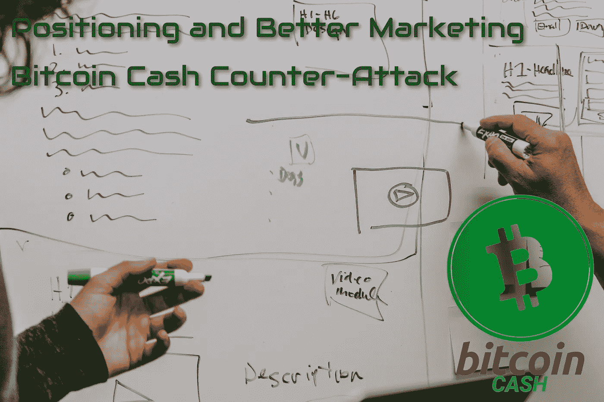
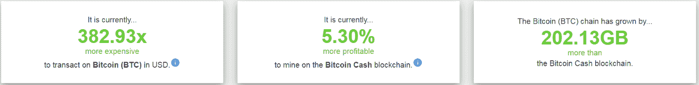

# 定位和更好的营销——比特币现金逆袭

> 原文：<https://medium.com/coinmonks/positioning-and-better-marketing-bitcoin-cash-counter-attacks-5bafa4dfc0bb?source=collection_archive---------12----------------------->

*Source:* [*Unsplash*](https://unsplash.com/photos/26MJGnCM0Wc)*, by Kaleidico(modified)*

营销在每个行业都是一个重要的元素。考虑到加密货币，这通常是一个项目唯一擅长的功能。

虽然市场营销经常被激烈地批评为侵略性的方法，并经常被指责为误导消费者，但它是增加可见性、曝光率和品牌知名度的必要“手段”。

在加密货币行业，这是(短期)成功的决定性因素。

比特币现金缺乏广泛的营销。更糟糕的是，比特币现金还缺乏公关，在加密货币市场形象负面。BTC 最大主义者的“数字”是压倒性的，并在灌输新来者相当有效。

BCH 不喜欢不必要的炒作，尽管如此，BTC 方面在各方面反对比特币现金的观点对绝大多数投资者产生了巨大影响。

新人需要更多的时间来处理和克服误导性的 BTC 叙事，并形成自己的观点。加密货币媒体淡化、排除、忽略和审查投资者感兴趣的重要比特币现金信息。

比特币现金在开发、链上采用和机构注意方面占据主导地位，尽管它也受到加密新闻和更大程度上主流媒体(美国消费者新闻与商业频道、彭博等)有限报道的影响。

# 虚假叙述和公众操纵

我们看到绝大多数秘密影响者(也就是公众舆论的操纵者)利用任何机会抨击比特币现金，因为这有利于他们取悦观众。这些年来，他们让投资者相信，BTC 应该是他们投资组合中的主要部分，任何提及比特币现金的说法都是负面的。

最近，由于 BCH 用户群的增长和 SmartBCH 的发展，同样的“影响者”只是避免任何 BCH 的讨论，而不是以负面的方式进行评论。

BTC 作为交换手段已经完全失败，而比特币现金已经证明了比特币的规模化能力。

对于密码领域之外的人来说，理解发生了什么以及为什么 BTC 和 BCH 社区之间仍然存在仇恨需要一些时间，但 BTC 方面的叙述总是一些愚蠢的流行语，如:

"*市场已经决定了*"，

或者

*好好玩穷呆*。

事实摆在面前，无可争辩。

[**Source**](https://cash.coin.dance/blocks)

对 BTC 方面来说，最重要的是“人数上升”。所有的讨论都是关于价格以及 BTC 将如何让今天投资的人变得富有。当然，这对任何认真的投资者来说都是一个危险信号，最近，我们看到 BTC 在努力寻找新的现金流入，也许除了萨尔瓦多纳税人的钱。

甚至连主要的受欢迎人物都不能恰当地讨论比特币现金，担心它们会失去对 BTC 投资者的吸引力。

比特币现金找到了一些志愿者倡议，如 Satoshi Angels，它们发送消息并帮助比特币现金提高采用水平。

比特币现金必须被定位为廉价、快速、可靠和去中心化的加密货币。

虽然，数百万人一直在追随“数字上升”的叙事，对这方面不感兴趣。

投机者不会长期投资，对技术方面也不感兴趣。没有理由试图让投机者相信一个网络的长期潜力和优点。

一个受欢迎的发言人所做的任何虚假指控都必须得到正确的人的准确回应，并且不留任何进一步争论的余地。

## noise.cash 30 万会员& read . cash:7.8 万

Noise.cash 和 read.cash 正在为比特币现金提供模范服务，将新用户带入生态系统，并为新人的教育做出贡献。

一个社区要想成功，需要的不仅仅是代码。BCH 网络在当前市场中的定位很差，需要弥补这一差距。

Noise.cash 成功扩大了用户群，因为成千上万的新用户正在探索比特币现金和 SmartBCH。

Noise.cash 是未来元宇宙的一部分。而且比特币现金已经通过了一个很少有人理解的测试。

没有其他平台为微交易提供这样的测试。我希望所有主要的支付网络、虚拟平台和网站都注意到这一点。

noise.cash 今天创造的东西将会是互联网的未来。

## 比特币现金网络讨论(12 月 1 日)——Satoshi 天使

一场新的比特币现金讨论将于 12 月 1 日由 YouTube 上的[比特币现金网络讨论](https://bitcoincashnetworkdiscussions.org/)([链接](https://www.youtube.com/watch?v=hKoRquG3XsA))进行直播。

讨论的主要话题将是围绕比特币现金生态系统的营销策略。

约翰·莫里亚蒂和廉价闪电将介绍主题和嘉宾，并管理讨论。

来宾:

*   **茜横尾**，聪的天使联合创始人
*   辛迪·王(Cindy Wang)，Satoshi's Angels 的联合创始人
*   **Saqib Noor** ，一个。外科创始人
*   **约翰·尼瑞**(突发 _ 原因)，总礼宾总裁

[*阅读更多*](https://bitcoincashnetworkdiscussions.org/)

Satoshi 天使和世界各地更多的 BCH 倡议为推广比特币现金的采用和增加商户的采用做了很多工作。

这是一场与来自更广泛的比特币现金社区的顶级参与者的讨论。

任何人都不应错过的对话。在 YouTube 上订阅 [BCH 网络讨论](https://www.youtube.com/watch?v=hKoRquG3XsA)并在 12 月 1 日收听观看直播。

# 最后

目前比特币现金在加密货币市场的市值比以往任何时候都低。看到缺乏比特币现金品质的随机新网络吸引新投资者的注意力和资金流入，是一件很糟糕的事情。

实现更高的价格不是强制性的目的。随着采用率的增加，价格将会上涨。

需要广告和大众支持来实现大规模采用。

虽然 BTC 最大化主义者在主流媒体上有理由对比特币现金进行打击，但比特币现金社区几乎没有平台来帮助扩大用户群和吸引投资者([加密新闻网站:大规模操纵，宣传&比特币现金审查](https://read.cash/@Pantera/crypto-news-websites-massive-manipulation-propaganda-censorship-of-bitcoin-cash-071010ae))。

比特币现金在加密介质中几乎看不见。加密新闻网站正在从头条新闻中删除比特币现金，并试图忽略它，同时急于推广对比特币现金持负面态度的文章。

我们可以在此基础上进行建设，但也许一些与 Coindesk、Cointelegraph 和其他类似媒体有联系的人可以推动并要求他们承认比特币现金的发展，因为该网络的表现令人钦佩。

不知道索拉纳，卡尔达诺，露娜，波尔卡多特，阿瓦朗斯等怎么样？，得到所有这些关注和比特币现金或智能无处可寻。

营销是多维度的，不仅关注某些特征，而且扩展到寻找新的机会领域。

SmartBCH 本身就是一场针对比特币现金的营销活动，因为它运行在比特币之上，没有原生硬币，而是使用比特币现金。通过 SmartBCH，比特币现金进入了处理 DeFi 和 NFT 应用的智能合约市场。提供无限可能性的市场。

这一发展为生态系统带来了成千上万的新用户，也许会吸引 DeFi 和 NFT 的投资者，因为基础设施已经就绪，任何人都可以免费测试。

还应该向全世界宣传、解释和公布。投资者，还不知道什么是聪明。

Writing at the following websites: ● [ReadCash](https://read.cash/@Pantera) ● [NoiseCash](https://noise.cash/u/Pantera99) ● [Medium](/@panterabch) ● [Hive](https://hive.blog/@pantera1) ● [Steemit](https://steemit.com/@pantera1) ●[Vocal](https://vocal.media/authors/pantera) ● [Minds](https://www.minds.com/pantera99/) ● [Twitter](https://twitter.com/Panterabch) ● [LinkedIn](https://www.linkedin.com/in/panterabch/) ● [email](https://read.cash/@Pantera/localcryptos-p2p-exchange-is-now-offering-bitcoin-cash-trading-06637230#bad-link)

**备注:**

> **免责声明**:本内容发布的所有材料均用于娱乐和教育目的，并符合合理使用准则。无意侵犯版权。如果您是或代表本文所用材料的版权所有者，并且对所述材料的使用有疑问，请发送[电子邮件](https://read.cash/@Pantera/cryptouknowns-battlegrounds-the-crypto-battle-royal-part-i-0ca762da#bad-link)。这篇文章或我发表的任何文章都不是金融建议，但包含与投资研究相关的信息。

***支持内容创作者。***

如果你喜欢这个故事，就订阅吧！

*原载于*[*https://read . cash*](https://read.cash/@Pantera/positioning-and-better-marketing-bitcoin-cash-counter-attack-feb5fa80)*。*

> 加入 Coinmonks [电报频道](https://t.me/coincodecap)和 [Youtube 频道](https://www.youtube.com/c/coinmonks/videos)了解加密交易和投资

## 另外，阅读

*   [加拿大最好的加密交易机器人](https://blog.coincodecap.com/5-best-crypto-trading-bots-in-canada) | [赌注加密](https://blog.coincodecap.com/staking-crypto)
*   [如何在印度购买比特币？](/coinmonks/buy-bitcoin-in-india-feb50ddfef94) | [瓦济克斯评论](/coinmonks/wazirx-review-5c811b074f5b)
*   [最佳网上赌场](https://blog.coincodecap.com/best-online-casinos) | [硬件钱包](/coinmonks/hardware-wallets-dfa1211730c6)
*   如何在 WazirX 上购买柴犬(SHIB)硬币？
*   [比特币主根](https://blog.coincodecap.com/bitcoin-taproot) | [排名前 6 的比特币信用卡](/coinmonks/bitcoin-credit-card-bc8ab6f377c6)
*   [最佳免费加密信号](https://blog.coincodecap.com/free-crypto-signals) | [YoBit 评论](/coinmonks/yobit-review-175464162c62) | [Bitbns 评论](/coinmonks/bitbns-review-38256a07e161)
*   [huo bi 的加密交易信号](https://blog.coincodecap.com/huobi-crypto-trading-signals) | [BitMEX 评论](https://blog.coincodecap.com/bitmex-review)
*   [7 个最佳零费用加密交易平台](https://blog.coincodecap.com/zero-fee-crypto-exchanges)
*   [去中心化交易所](https://blog.coincodecap.com/what-are-decentralized-exchanges) | [比特恩斯 FIP](https://blog.coincodecap.com/bitbns-fip) | [Pionex 评论](https://blog.coincodecap.com/pionex-review-exchange-with-crypto-trading-bot)
*   [用信用卡购买密码的 10 个最佳地点](https://blog.coincodecap.com/buy-crypto-with-credit-card)
*   [OKEx 回顾](/coinmonks/okex-review-6b369304110f) | [Kucoin 交易机器人](/coinmonks/kucoin-trading-bot-automate-your-trades-8cf0ca2138e0) | [期货交易机器人](/coinmonks/futures-trading-bots-5a282ccee3f5)
*   [AscendEx Staking](https://blog.coincodecap.com/ascendex-staking)|[Bot Ocean Review](https://blog.coincodecap.com/bot-ocean-review)|[最佳比特币钱包](https://blog.coincodecap.com/bitcoin-wallets-india)
*   [霍比评论](https://blog.coincodecap.com/huobi-review) | [OKEx 保证金交易](https://blog.coincodecap.com/okex-margin-trading) | [期货交易](https://blog.coincodecap.com/futures-trading)
*   [Godex.io 审核](/coinmonks/godex-io-review-7366086519fb) | [邀请审核](/coinmonks/invity-review-70f3030c0502) | [BitForex 审核](https://blog.coincodecap.com/bitforex-review)
*   [Crypto.com 费用](/coinmonks/binance-fees-8588ec17965) | [僵尸加密审查](/coinmonks/botcrypto-review-2021-build-your-own-trading-bot-coincodecap-6b8332d736c7) | [替代品](https://blog.coincodecap.com/crypto-com-alternatives)
*   [有哪些交易信号？](https://blog.coincodecap.com/trading-signal) | [Bitstamp vs 比特币基地](https://blog.coincodecap.com/bitstamp-coinbase) | [买索拉纳](https://blog.coincodecap.com/buy-solana)
*   [ProfitFarmers 回顾](https://blog.coincodecap.com/profitfarmers-review) | [如何使用 Cornix 交易机器人](https://blog.coincodecap.com/cornix-trading-bot)
*   [MXC 交易所评论](/coinmonks/mxc-exchange-review-3af0ec1cba8c) | [Pionex vs 币安](https://blog.coincodecap.com/pionex-vs-binance) | [Pionex 套利机器人](https://blog.coincodecap.com/pionex-arbitrage-bot)
*   [我的加密副本交易经历](/coinmonks/my-experience-with-crypto-copy-trading-d6feb2ce3ac5) | [比特币基地评论](/coinmonks/coinbase-review-6ef4e0f56064)
*   [CoinFLEX 评论](https://blog.coincodecap.com/coinflex-review) | [AEX 交易所评论](https://blog.coincodecap.com/aex-exchange-review) | [UPbit 评论](https://blog.coincodecap.com/upbit-review)
*   [AscendEx 保证金交易](https://blog.coincodecap.com/ascendex-margin-trading) | [Bitfinex 赌注](https://blog.coincodecap.com/bitfinex-staking) | [bitFlyer 点评](https://blog.coincodecap.com/bitflyer-review)