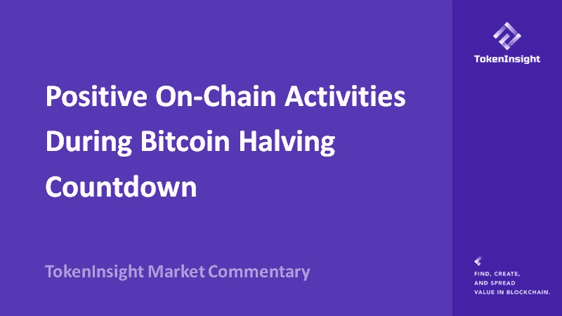
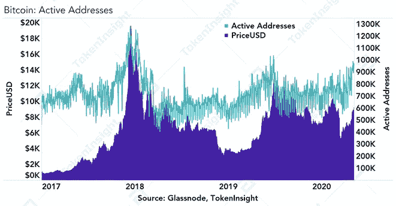
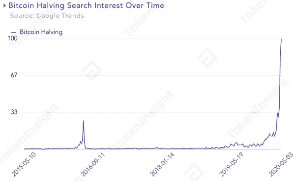
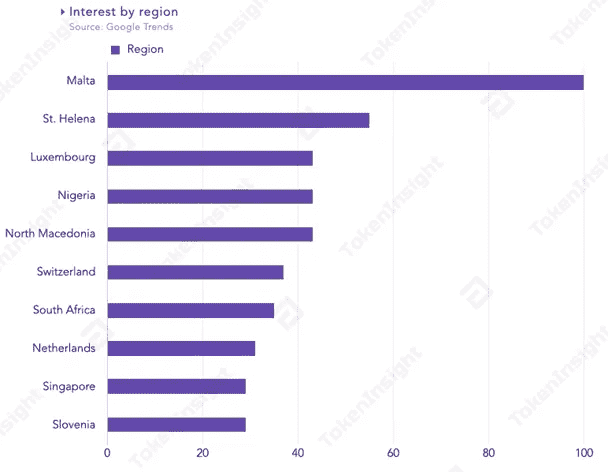
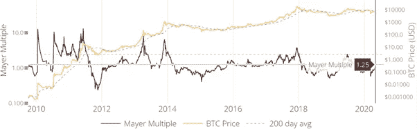
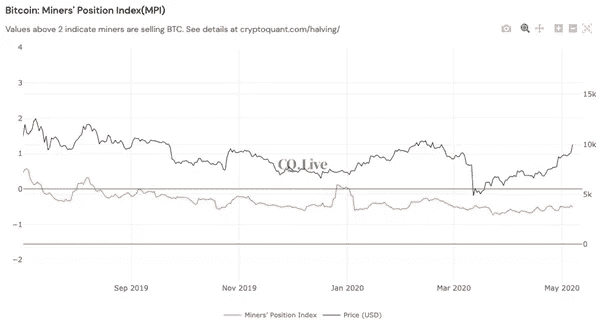
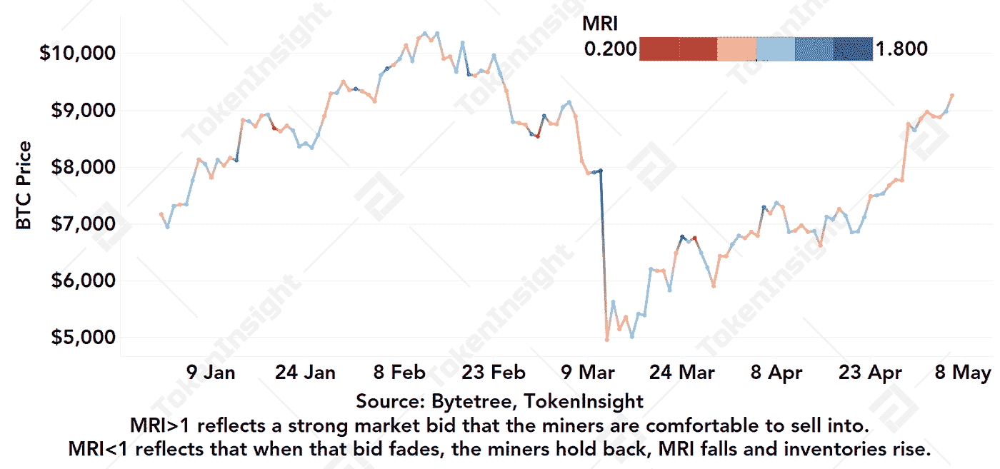

# 比特币减半倒计时期间的积极连锁活动

> 原文：<https://medium.com/coinmonks/positive-on-chain-activities-during-bitcoin-halving-countdown-c416161e7245?source=collection_archive---------2----------------------->

查看比特币 Mayer 倍数、矿工头寸指数、矿工滚动库存，以提供关于市场现状的新观点。

**—2020 年 5 月 11 日由**[**token insight Research**](http://www.tokeninsight.com/)

**作者:周、徐强森**

**电子邮件:johnson@tokeninsight.com**

# **概述**

我们几乎达到了比特币第三减半的点，网络将块奖励从 12.5 比特币减半到 6.25 比特币。这一事件最近引发了强烈的市场兴趣，比特币在 2020 年 5 月 8 日突破 10，000 美元，从黑色星期四的崩溃中完全恢复。与此同时，加密货币的总市值也超过了 2700 亿美元。

我们仔细研究了利用比特币链上数据的几个比率，包括比特币迈尔倍数、矿工头寸指数、矿工滚动库存，以提供关于市场现状的新观点。

# 在黑色星期四之后，连锁市场活动已经转为积极，并出现了 180 度大转弯

截至 2020 年 5 月 8 日，比特币网络散列率已创历史新高，难度级别升至 16.10T，新增和活跃地址较七日均值分别上涨 22.52%和 13.03%，其中活跃地址数量达到近百万地址。

*Bitcoin: Active Addresses, Source: Glassnode, TokenInsight*

[比特币网络](https://blog.coincodecap.com/a-candid-explanation-of-bitcoin/)目前的活跃地址数量已达到当地高点，仅次于 2017 年底至 2018 年初牛市结束时的活跃地址数量，并在 2019 年年中价格为 13，000 美元时快速接近相同水平。

# **谷歌趋势反映比特币减半的高人气**

当前对关键词“比特币减半”的搜索兴趣在 2020 年 5 月的第一周达到了 100 的峰值，超过了比特币第二次减半(2016 年 7 月 3 日至 6 日)的 4 倍多，市场参与者很想知道减半后市场动态会如何变化。

Bitcoin Halving Search Interest Over Time, Source: Google Trends, TokenInsight

另一方面，欧洲是最热衷于比特币减半的地区。在过去 30 天的 10 大搜索地区中，马耳他的搜索兴趣最高，其次是圣赫勒拿岛和卢森堡。这些地区拥有支持加密货币的积极监管框架。其中，马耳他对加密货币持最积极的监管态度，承认加密货币在其所在地区的合法地位。此外，斯洛文尼亚第四大城市克拉尼也在 2018 年建造了世界上第一座公共比特币纪念碑。

Interest by Region, Source: Google Trends, TokenInsight

令人惊讶的是，在过去的一个月里，非洲对比特币减半的态度不同寻常，尼日利亚的搜索兴趣排名第四，南非排名第七。

# **比特币迈尔倍数反映积极情绪**

比特币迈尔倍数(Bitcoin Mayer Multiple)是 Trace Mayer 创造的价格分析指标，作为衡量比特币当前价格和长期历史价格走势的方法。

Mayer 倍数低于 1 意味着当前比特币价格低于 200 日均线，市场情绪消极，有下跌趋势。相反，当 Mayer 倍数大于 1 时，意味着当前市场情绪普遍乐观，并支持其价格上涨趋势。

比特币迈尔倍数

*Bitcoin Mayer Multiple, Source: charts.woobull.com*

梅耶尔倍数在黑色星期四市场暴跌后跌至 0.574，处于极度恐慌阶段。它已经恢复并继续上升到 1 以上。市场对比特币减半的预期开始成为现实，FOMO 情绪开始在市场中蔓延。

# 矿工的立场指数和矿工的滚动库存表明，矿工正期待积极的市场动态后减半

矿工地位指数(MPI)是一种了解当前矿工行为的测量方法。高于 2 的 MPI 值本质上是一个长期的(宏观结构分析)，在短期内，高于 0 的值可能表明当地的卖出机会，当值进入极端负值时意味着当地的买入机会(矿工正在#Hodling 比特币)

Bitcoin Miners’ Position Index (MPI), Source: CryptoQuant

有趣的是，当从宏观角度分析时，MPI 值在 2017 年牛市后一直低于 2。从微观趋势来看，MPI 值通常低于 0，表明矿工更倾向于持有比特币。只有在 2019 年底和 2020 年初的短暂时期，MPI 值达到 0 以上，可能是由于一些矿工投降。

矿工滚动库存(MRI)主要用于衡量矿工所持比特币库存水平的变化。

Miner’s Rolling Inventory (MRI), Source: Bytetree, TokenInsight

该比率显示，矿工在 1 月份已经开采了 53955 个比特币，交易了 42451 个比特币，MRI 为 0.79。截至 5 月 8 日，1 天、1 周、5 周、12 周的 MRI 普遍恢复到 1 左右。

2020 年 1 月至 3 月，矿工普遍持有比特币。就在黑色星期四之前，矿商很乐意在 2020 年 3 月 11 日以 1.63 为代表的强劲市场出价中抛售，这一价格明显高于 1。然而，市场崩盘后的矿商一直倾向于退缩。

MPI 和 MRI 提供了矿工使用不同方法的独特视角。虽然这两个指标的解释不同，但它们都指向矿工的相同行为，他们通常倾向于持有比特币的一半。

# **机遇面临全球市场不确定性**

从长远来看，比特币为世界带来了重大创新，产生了颠覆性的想法、市场兴趣和许多可以利用的机会。我们预计，从长远来看，随着该行业的逐渐成熟，这一比例减半的趋势将继续在全球范围内得到推动。

然而，加密货币市场的方向也很容易受到许多市场因素的影响。随着我们迈向 2020 年年中，新冠肺炎疫情的影响和传统金融市场的市场方向仍不明朗。这些不确定性可能会转化为加密货币市场，产生连锁反应，在短期内产生巨大的波动。

# 关于 TokenInsight

**成立于 2017 年的**[**token insight**](https://www.tokeninsight.com/)**是一家领先的数据&技术驱动的区块链金融机构。** TokenInsight 首创了完整的区块链行业分类体系，覆盖了超过**1600 个项目，**发布了超过 **300 份评级报告，**并对 **10 个主要行业进行了深入研究。**

TokenInsight 的数据、评级和研究报告可以访问全球 70 多个数据平台，包括 **Messari、Delta、币安信息、AICoin、火币信息、**等。，月 PV 超过 3000 万。TokenInsight 已正式加入由加密货币排名网站 CoinMarketCap 发起的数据问责与透明联盟(Data)。

# 如果您喜欢我们的评论，请关注我们:

💡官方网站:[https://www.tokeninsight.com](https://www.tokeninsight.com/)

📌领英官方页面:[https://www.linkedin.com/company/tokeninsight/](https://www.linkedin.com/company/tokeninsight/)

🔎电报:[https://t.me/TokenInsightOfficial](https://t.me/TokenInsightOfficial)

🗺推特:[https://www.twitter.com/tokenInsight](https://www.twitter.com/tokenInsight)

📕https://www.reddit.com/r/TokenInsight/

> [直接在您的收件箱中获得最佳软件交易](https://coincodecap.com/?utm_source=coinmonks)

