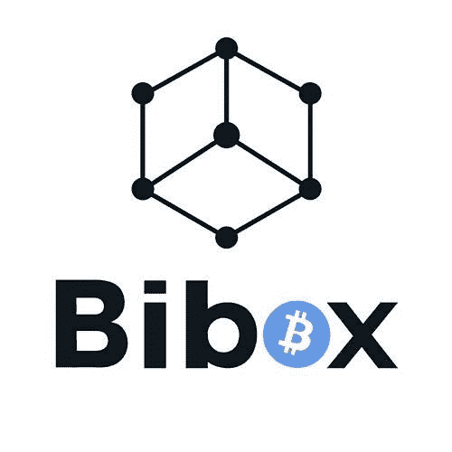

# 可能被标记为价格操纵的加密货币

> 原文：<https://medium.com/coinmonks/possible-cryptocurrencies-flagged-for-price-manipulation-6c4e3c274440?source=collection_archive---------4----------------------->

## 买家当心

顶级加密市场聚合网站 [Coinmarketcap](http://Coinmarketcap.com) 上总共有 **1899** 枚硬币。作为一个寻求 10 倍、100 倍甚至 1000 倍回报的投资者，你会关注哪些硬币？对于这些类型的 ROI，许多人认为他们需要进一步降低排名，并查看被视为低价的硬币。小盘股低价绝对是价格操纵的主要目标，投资者应该谨慎选择他们辛苦赚来的钱的投资方向。

我将概述我认为有很大机会操纵价格的硬币。没有实际的证据，虽然我不会把这些硬币贴上彻头彻尾的骗局的标签，但就我个人而言，我不会去碰它们。我在这里的目的是只强调根据我的方法脱颖而出的硬币。对硬币是否是骗局做出自己的结论。

为了我的分析，我查看了由 [coinmarketcap](http://coinmarketcap.com) 排名的**500 强**硬币。

在我标记可疑硬币的框架中，我考虑了以下因素。我想出了一个评分系统来对每个因素进行排名，然后统计结果，得出一个高风险硬币的列表。每个因素的权重从 4 到 1 不等。

**1。与上市交易所有关联的硬币(4 分)**

因为交易费，交易一枚硬币会很贵。如果你想操纵一枚硬币的价格，你可以交易任何你想要的硬币，但这并不符合你的最佳利益。大多数交易所的费用大约是 0.1%，所以你会很快减少你的筹码。然而，如果一枚硬币与交易所有联系，它的交易费用将为零。如果你是交易所的拥有者，在巨大的交易量中没有惩罚！

**有趣的提示:**如果我在几个月前进行这项分析，币安·柯恩(BNB)很可能会被列为我的首选。它们过去只在自己的交易所上市，但后来在多家交易所上市。特别要感谢财务团队在这方面的积极主动。

**2。交易量相对较高的硬币(3 分)**

交易量较高的硬币给人流动性强的印象。交易更频繁的硬币向投资者发出信号，表明对这种硬币有健康的需求，而且它更广为人知。如果硬币的流动性更高，投资者的风险就更低。如果坏消息传出，你不想被留下来背黑锅。在这种情况下，你需要流动性来寻找硬币的买家和卖家。

**3。在 1 个或 2 个交易所交易的硬币(1 个交易所 2 分)**

一枚不在许多交易所交易的硬币更容易被操纵，因为该硬币在市场上缺乏流动性。一个大的交易订单会引起价格的大幅波动。如果没有其他交易所来平均价格，那么 coinmarketcap 将只报告该交易所的一个价格。这些类型的硬币最有可能让你在泵和转储后拿着一个袋子。

在我列出的 500 枚硬币中，总共有 67 枚在一两个交易所交易。我只给一个交易所的每枚硬币交易 2 分。

**4。高市值硬币(1 分)**

排名前 20 的硬币自然比排名靠后的硬币更受媒体关注。coinmarketcap 首页上的任何内容都会进入前 100 名。这些硬币被认为是更建立或上升和未来的项目。排名低得多的硬币不会引起新投资者的注意，因此被利用的可能性较低。

如果硬币进入前 100 名，我给 1 分。

# 调查的结果

本周的某一天，我拍了一张按市值排名的前 500 名硬币的快照。

这 500 枚硬币当天的平均交易量为**25693573.96 美元。**

我决定根据硬币的点数将它们分成不同的等级。

## 1 级——操纵价格的可能性最大

这两枚幸运硬币得到 7 分，成为操纵价格可能性最高的顶级硬币。

*   **Bibox-Token****【BIX】**——这种代币的交易量惊人，达到 6000 万美元，大约相当于 Cardano 和 Stellar 的交易量。你在开玩笑吗？这怎么可能是合法的？谁听说过 Bibox？这也是我名单上唯一一枚交易量高于平均水平的硬币。洗盘交易的完美例子。
*   库币股份(KCS)——不得不承认，库币上榜让我有点吃惊。库币交易所是众所周知的，并被广泛使用。仍然是在他们自己的平台上独家交易的硬币。他们真的应该向币安学习，让他们的硬币在更多的交易所上市。

## 第 2 层—中等风险硬币

接下来，我发现了 3 枚也很突出的硬币。

*   **LoyalCoin (LYL)** -交易量接近 100 万美元，但未在任何知名交易所上市。
*   **bitUSD(bitUSD)——**与看似有关联的交易所挂钩。这意味着有可能进行不收费的清洗交易。
*   **奥罗拉(AOA)——**值得注意的是，这枚硬币在 coinmarketcap 的首页排名中位列前 100。

## 其余的——荣誉或我应该说不名誉的提及

接下来的 28 个硬币也在我的框架方法论上得分。

*   **必和必拓卡什(BHPC)**
*   **OneRoot-Network(RNT)**
*   当地硬币交换(LCS)
*   **ugChain(UGC)**
*   **触发器(TRIG)**
*   普里兹姆(PZM)
*   **林基**
*   **布里奇科恩(BCO)**
*   **花蜜(NEC)**
*   **博斯科恩(BOS)**
*   **动态交易权(DTR)**
*   **全球货币储备(GCR)**
*   **FairCoin(公平)**
*   **Soarcoin(翱翔)**
*   **熔渣-硬币(SCR)**
*   **大麻酚**
*   **极光-道(AURA)**
*   **FNKOS(FNKOS)**
*   **套利(ARB)**
*   **铋(双)**
*   **月亮币(月亮)**
*   **布尔贝里(BBR)**
*   **OptiToken(OPTI)**
*   **布拉莫斯(BRM)**
*   **ether oll(DICE)——**这已经存在了一段时间，实际上已经有了一个工作产品。很遗憾看到它没有被其他交易所收购和上市。
*   **国际奥委会**
*   **莫阿克(MOAC)**
*   **米辛(XIN)**

# 最后的想法

我的模型只依赖于少数几个因素，但它的准确性可以通过观察许多其他因素来进一步建立。像网上社区这样的东西可以包括在研究中。硬币的 twitter 和 reddit 追随者。一个很少在网上被提及的硬币比已经发布实际产品的硬币有更多的追随者，这有意义吗？这些很容易操作。其他事情可能包括团队的 github 活动。

加密货币行业仍然年轻，在一个不受监管的市场中充满了牛仔。如果我们想让这个行业繁荣发展，我们需要团结起来，让坏人出来。SEC 已经表示，拒绝比特币 ETF 的原因之一是市场操纵价格。这是一件确实正在发生的事情。

如果我从社区得到更多的兴趣和反馈，我会在这上面花更多的时间。让我知道。

> [直接在您的收件箱中获得最佳软件交易](https://coincodecap.com/?utm_source=coinmonks)

