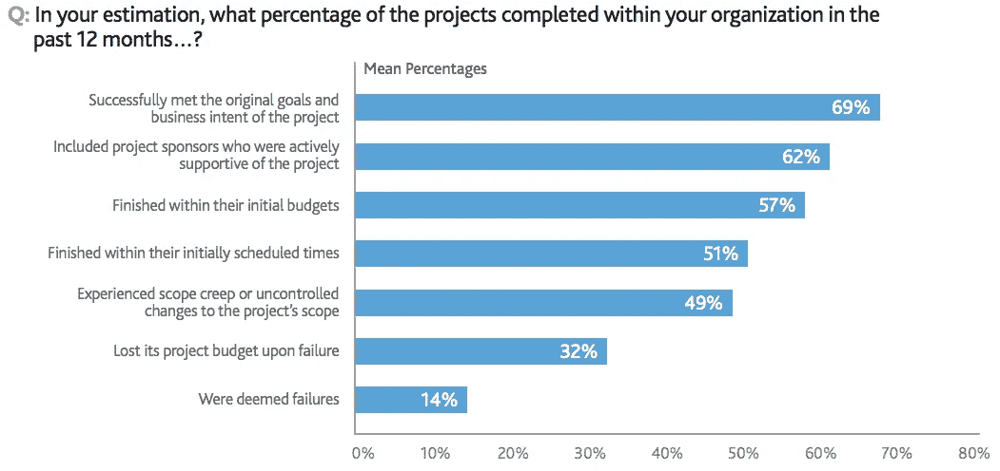

# 现代软件开发中的交付后维护

> 原文：<https://medium.com/coinmonks/post-delivery-maintenance-in-modern-software-development-b97d568252e1?source=collection_archive---------1----------------------->

> **交付后的维护花费了多少时间和金钱？**

IEEE 将软件维护定义为“交付后对软件产品的修改，以纠正错误，提高性能或其他属性，或使产品适应修改后的环境。”

软件产品是现实生活情况的反映，自从软件开发的概念首次出现以来，技术已经发展了这么多。现代软件开发中的维护不仅仅是修复代码中的错误或缺陷，它还需要满足用户的期望并适应与软件产品相关的新平台、设备和技术。

有几个因素影响交付后维护的实施及其成本。一个主要因素是用于开发软件产品的软件开发生命周期(SDLC)模型的类型。具体如下:

[瀑布模型](http://www.umsl.edu/~hugheyd/is6840/waterfall.html)

v 形模型

进化原型模型

螺旋法

迭代增量法

[敏捷开发](https://www.infoworld.com/article/3237508/agile-development/what-is-agile-methodology-modern-software-development-explained.html)

[DevOps](/@yannmjl/what-is-devops-in-simple-english-6550fbb129bd)

所有这些不同的方法都是为了找到开发软件的最有效的方法而开发的。敏捷和 DevOps 是现代软件开发方法。敏捷基于迭代方法。它提供了某种程度的协作(计划、编码、构建),并关注客户反馈和小规模快速发布。持续集成和交付提供了从计划、编码、构建、测试和发布软件的软件开发生命周期中的下一级协作。DevOps 哲学包括敏捷、持续集成和持续交付的所有概念。DevOps 概念的基础是通过自动化基础架构、工作流和持续测量应用性能来整合开发人员和运营团队，从而提高协作和生产力。

一个已经成功实施 DevOps 方法的 IT 组织，该方法包括敏捷开发、持续集成、持续交付、持续部署(软件以自动化的方式部署到生产环境中，同时通过完整的自动化测试)。开发运维的优势包括:

更快上市

代码质量更高，错误更少

降低交付成本。

现代软件开发方法试图确保只有质量最好的软件才能交付给生产环境和最终用户。维护被集成到软件开发生命周期中，以减少交付后维护所花费的时间，平均减少 60%到 70%。

然而，软件开发中使用的无服务器托管系统和其他第三方服务增加了软件产品的复杂性和依赖性。因此，增加了确定交付后维护的时间和成本的复杂性。对于交付后软件维护的预期花费，没有直接的答案。影响和推动软件维护成本的因素和变量很多。

# **现代软件项目耐久性概述**

> **当今世界，准时、延期或取消的项目占多大比例？**

在现代 IT 行业中，软件项目的持久性一直在积极改善。由项目管理研究所(PMI) 进行的一项关于 IT 项目成功率和失败率的新研究[报告显示，成功率有所上升。](http://www.pmi.org/-/media/pmi/documents/public/pdf/learning/thought-leadership/pulse/pulse-of-the-profession-2017.pdf?sc_lang_temp=en)

Innotas 进行了一项项目和投资组合管理调查，结果显示，在调查的 12 个月内，企业 IT 项目的失败率为 50%。Innotas 在 2016 年提供的最新报告表明，126 名 IT 专业人员中有 55%的人报告他们在 2015 年 1 月至 3 月期间有一个失败的项目。与 2014 年的报告相比增长了 32%。

[**2017 PMI 的报告**](http://www.pmi.org/-/media/pmi/documents/public/pdf/learning/thought-leadership/pulse/pulse-of-the-profession-2017.pdf?sc_lang_temp=en) 对 3234 名项目管理专业人士、510 名 PMO 总监、200 名高管进行了调查。该报告显示，80%的 IT 项目按时、按预算完成，并达到了最初的目标和业务意图。这一比率出现在被归类为冠军的 IT 组织中。而按时完成 60%或更少项目的组织被归类为表现不佳

该报告还显示，冠军类别的 IT 组织只有 6%的项目被视为失败，而表现不佳类别的 IT 组织有 24%的项目被视为失败。然而，与前一年相比，这两个类别中的所有 IT 组织都将平均成本(浪费在项目和计划上的资金)降低了 20%。

如上图所示，2017 年 PMI 研究认为失败的项目平均比例为 14%。

成功的增加是现代 It 组织和软件开发方法中许多变化的结果，包括:

项目管理的成熟度(关注收益成熟度，而不仅仅是成本、资源和时间)

强调优先顺序和计划。举例来说，一些 IT 组织将“将预算和资源缩减到最重要的 3 或 5 个项目”，而不是在 10 个项目之间划分预算和资源这种实践帮助组织提高他们在“真正重要”的项目中取得成功的机会

发展项目经理的技术和领导技能

更好地理解项目如何适应市场、客户和业务需求，以及这些项目带来的限制。

采用现代软件开发方法，如敏捷、持续集成和交付，以及 DevOps。采用敏捷或开发运维实践和方法的 IT 组织“更有可能成功”研究表明，71%的 IT 组织报告使用了敏捷方法。

另一方面，每个 IT 项目的树状约束:时间、范围和预算；在项目失败或被取消的比率中也扮演着重要的角色。以下是项目失败或取消的一些原因:

不良要求

项目发起人在开发过程中没有参与

不现实和不准确的估计

意外和不可预测的风险

依赖延迟和资源不足

管理不善

> 如果你喜欢这篇文章，你可能也会喜欢: [**什么是区块链？**](/@yannmjl/what-is-blockchain-in-simple-english-25e684c1cea3) 用简单的英语说
> 
> 请给它几个掌声支持！

> 干杯！！
> 
> [在您的收件箱中直接获得最佳软件交易](https://coincodecap.com/?utm_source=coinmonks)

